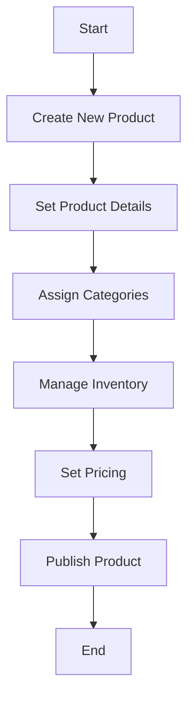

This document will cover the process of adding a new product to the Broadleaf Commerce platform. We'll cover:

1. Creating a new product
2. Setting product details
3. Assigning categories
4. Managing inventory
5. Setting pricing
6. Publishing the product.

Technical document: <SwmLink doc-title="" repo-id="Z2l0aHViJTNBJTNBQnJvYWRsZWFmQ29tbWVyY2UtZGVtby1uZXclM0ElM0FTd2ltbS1EZW1v" path="/.swm/.staan33c.sw.md"></SwmLink>

# [Creating a new product](https://app.swimm.io/repos/Z2l0aHViJTNBJTNBQnJvYWRsZWFmQ29tbWVyY2UtZGVtby1uZXclM0ElM0FTd2ltbS1EZW1v/docs/staan33c#creating-a-new-product)

The process begins with creating a new product entry in the system. This involves initializing a new product record that will hold all the relevant information about the product. This step is crucial as it sets up the framework for all subsequent details and configurations.

# [Setting product details](https://app.swimm.io/repos/Z2l0aHViJTNBJTNBQnJvYWRsZWFmQ29tbWVyY2UtZGVtby1uZXclM0ElM0FTd2ltbS1EZW1v/docs/staan33c#setting-product-details)

Once the product is created, the next step is to set the product details. This includes providing a name, description, SKU (Stock Keeping Unit), and other essential attributes. These details are important as they define the product and make it identifiable and searchable within the platform.

# [Assigning categories](https://app.swimm.io/repos/Z2l0aHViJTNBJTNBQnJvYWRsZWFmQ29tbWVyY2UtZGVtby1uZXclM0ElM0FTd2ltbS1EZW1v/docs/staan33c#assigning-categories)

After setting the product details, the product needs to be assigned to one or more categories. Categories help in organizing products and making them easier for customers to find. For example, a new smartphone would be assigned to the 'Electronics' category.

# [Managing inventory](https://app.swimm.io/repos/Z2l0aHViJTNBJTNBQnJvYWRsZWFmQ29tbWVyY2UtZGVtby1uZXclM0ElM0FTd2ltbS1EZW1v/docs/staan33c#managing-inventory)

Managing inventory involves setting the stock levels for the product. This step ensures that the system knows how many units of the product are available for sale. Proper inventory management helps in preventing overselling and stockouts.

# [Setting pricing](https://app.swimm.io/repos/Z2l0aHViJTNBJTNBQnJvYWRsZWFmQ29tbWVyY2UtZGVtby1uZXclM0ElM0FTd2ltbS1EZW1v/docs/staan33c#setting-pricing)

Setting the pricing for the product is a critical step. This involves defining the base price, any discounts, and special pricing rules. Accurate pricing ensures that the product is sold at the right price point, which can affect sales and profitability.

# [Publishing the product](https://app.swimm.io/repos/Z2l0aHViJTNBJTNBQnJvYWRsZWFmQ29tbWVyY2UtZGVtby1uZXclM0ElM0FTd2ltbS1EZW1v/docs/staan33c#publishing-the-product)

The final step is to publish the product, making it available for customers to purchase. This involves activating the product in the system so that it appears on the website and can be added to the shopping cart. Publishing the product is the culmination of all previous steps and makes the product live on the platform.

&nbsp;

*This is an auto-generated document by Swimm AI 🌊 and has not yet been verified by a human*

<SwmMeta version="3.0.0" repo-id="Z2l0aHViJTNBJTNBQnJvYWRsZWFmQ29tbWVyY2UtZGVtby1uZXclM0ElM0FTd2ltbS1EZW1v" repo-name="BroadleafCommerce-demo-new" doc-type="product-flows">Powered by [Swimm](/)</SwmMeta>
