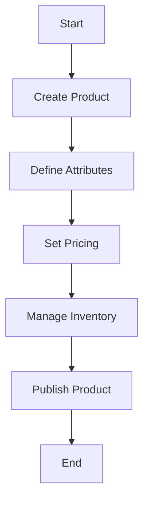

This document will cover the process of adding a new product to the Broadleaf Commerce platform. We'll cover:

1. Creating the product
2. Defining product attributes
3. Setting pricing
4. Managing inventory
5. Publishing the product.

Technical document: <SwmLink doc-title="" repo-id="Z2l0aHViJTNBJTNBQnJvYWRsZWFmQ29tbWVyY2UtZGVtby1uZXclM0ElM0FTd2ltbS1EZW1v" path="/.swm/.p9jndux6.sw.md"></SwmLink>

# [Creating the product](https://app.swimm.io/repos/Z2l0aHViJTNBJTNBQnJvYWRsZWFmQ29tbWVyY2UtZGVtby1uZXclM0ElM0FTd2ltbS1EZW1v/docs/p9jndux6#creating-the-product)

The first step in adding a new product is to create the product entity within the system. This involves specifying the basic details such as the product name, description, and category. These details are essential as they form the foundation of the product's identity and help in organizing the product within the catalog.

# [Defining product attributes](https://app.swimm.io/repos/Z2l0aHViJTNBJTNBQnJvYWRsZWFmQ29tbWVyY2UtZGVtby1uZXclM0ElM0FTd2ltbS1EZW1v/docs/p9jndux6#defining-product-attributes)

Once the product is created, the next step is to define its attributes. Attributes include various characteristics such as size, color, material, and any other specific details that describe the product. These attributes help customers to filter and search for products based on their preferences, enhancing the shopping experience.

# [Setting pricing](https://app.swimm.io/repos/Z2l0aHViJTNBJTNBQnJvYWRsZWFmQ29tbWVyY2UtZGVtby1uZXclM0ElM0FTd2ltbS1EZW1v/docs/p9jndux6#setting-pricing)

After defining the attributes, the pricing for the product needs to be set. This involves specifying the base price, any discounts, and promotional pricing. Accurate pricing is crucial as it directly impacts the purchasing decision of the customer. The pricing strategy should be competitive and reflect the value of the product.

# [Managing inventory](https://app.swimm.io/repos/Z2l0aHViJTNBJTNBQnJvYWRsZWFmQ29tbWVyY2UtZGVtby1uZXclM0ElM0FTd2ltbS1EZW1v/docs/p9jndux6#managing-inventory)

Managing inventory is a critical step to ensure that the product is available for purchase. This involves tracking the stock levels, setting reorder points, and managing backorders. Proper inventory management helps in maintaining the balance between supply and demand, preventing stockouts and overstock situations.

# [Publishing the product](https://app.swimm.io/repos/Z2l0aHViJTNBJTNBQnJvYWRsZWFmQ29tbWVyY2UtZGVtby1uZXclM0ElM0FTd2ltbS1EZW1v/docs/p9jndux6#publishing-the-product)

The final step is to publish the product, making it available for customers to view and purchase. This involves setting the product status to active and ensuring that all the necessary information is complete and accurate. Once published, the product will appear in the catalog and can be marketed to potential customers.

&nbsp;

*This is an auto-generated document by Swimm AI 🌊 and has not yet been verified by a human*

<SwmMeta version="3.0.0" repo-id="Z2l0aHViJTNBJTNBQnJvYWRsZWFmQ29tbWVyY2UtZGVtby1uZXclM0ElM0FTd2ltbS1EZW1v" repo-name="BroadleafCommerce-demo-new" doc-type="product-flows">Powered by [Swimm](/)</SwmMeta>
