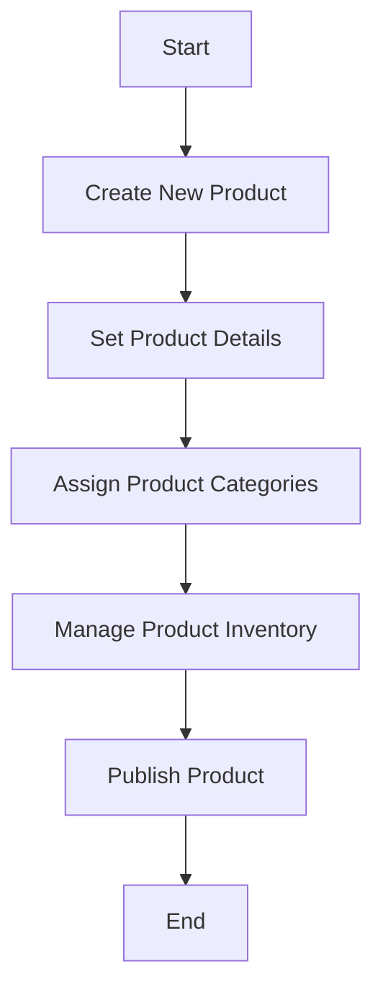

This document will cover the process of adding a new product to the Broadleaf Commerce platform. We'll cover:

1. Creating a new product
2. Setting product details
3. Assigning product categories
4. Managing product inventory
5. Publishing the product.

Technical document: <SwmLink doc-title="" repo-id="Z2l0aHViJTNBJTNBQnJvYWRsZWFmQ29tbWVyY2UtZGVtby1uZXclM0ElM0FTd2ltbS1EZW1v" path="/.swm/.ai1f2ej8.sw.md"></SwmLink>

# [Creating a New Product](https://app.swimm.io/repos/Z2l0aHViJTNBJTNBQnJvYWRsZWFmQ29tbWVyY2UtZGVtby1uZXclM0ElM0FTd2ltbS1EZW1v/docs/ai1f2ej8#creating-a-new-product)

The process begins with creating a new product entry in the system. This involves defining the basic attributes of the product such as its name, SKU (Stock Keeping Unit), and initial status (e.g., draft or active). This step is crucial as it sets up the foundational information for the product.

# [Setting Product Details](https://app.swimm.io/repos/Z2l0aHViJTNBJTNBQnJvYWRsZWFmQ29tbWVyY2UtZGVtby1uZXclM0ElM0FTd2ltbS1EZW1v/docs/ai1f2ej8#setting-product-details)

Once the product is created, the next step is to set detailed information about the product. This includes adding a description, setting the price, uploading images, and defining any product-specific attributes such as size, color, or material. These details are essential for providing customers with comprehensive information about the product.

# [Assigning Product Categories](https://app.swimm.io/repos/Z2l0aHViJTNBJTNBQnJvYWRsZWFmQ29tbWVyY2UtZGVtby1uZXclM0ElM0FTd2ltbS1EZW1v/docs/ai1f2ej8#assigning-product-categories)

After setting the product details, the product needs to be assigned to one or more categories. Categories help organize products within the store and make it easier for customers to find what they are looking for. For example, a new pair of shoes might be assigned to categories like 'Footwear', 'Men's Shoes', and 'Running Shoes'.

# [Managing Product Inventory](https://app.swimm.io/repos/Z2l0aHViJTNBJTNBQnJvYWRsZWFmQ29tbWVyY2UtZGVtby1uZXclM0ElM0FTd2ltbS1EZW1v/docs/ai1f2ej8#managing-product-inventory)

Managing inventory involves setting the initial stock levels for the product and defining how inventory will be tracked. This step ensures that the system can accurately reflect the availability of the product to customers and helps prevent overselling. Inventory management can also include setting up notifications for low stock levels and defining restocking rules.

# [Publishing the Product](https://app.swimm.io/repos/Z2l0aHViJTNBJTNBQnJvYWRsZWFmQ29tbWVyY2UtZGVtby1uZXclM0ElM0FTd2ltbS1EZW1v/docs/ai1f2ej8#publishing-the-product)

The final step in the process is to publish the product, making it available for customers to purchase. This involves changing the product status from draft to active and ensuring that all necessary information has been provided. Once published, the product will appear in the relevant categories and be searchable within the store.

&nbsp;

*This is an auto-generated document by Swimm AI 🌊 and has not yet been verified by a human*

<SwmMeta version="3.0.0" repo-id="Z2l0aHViJTNBJTNBQnJvYWRsZWFmQ29tbWVyY2UtZGVtby1uZXclM0ElM0FTd2ltbS1EZW1v" repo-name="BroadleafCommerce-demo-new" doc-type="product-flows">Powered by [Swimm](/)</SwmMeta>
