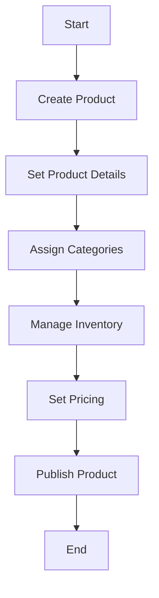

This document will cover the process of adding a new product to the Broadleaf Commerce platform. We'll cover:

1. Creating the product
2. Setting product details
3. Assigning categories
4. Managing inventory
5. Setting pricing
6. Publishing the product.

Technical document: <SwmLink doc-title="" repo-id="Z2l0aHViJTNBJTNBQnJvYWRsZWFmQ29tbWVyY2UtZGVtby1uZXclM0ElM0FTd2ltbS1EZW1v" path="/.swm/.62hf8cpj.sw.md"></SwmLink>

# [Creating the product](https://app.swimm.io/repos/Z2l0aHViJTNBJTNBQnJvYWRsZWFmQ29tbWVyY2UtZGVtby1uZXclM0ElM0FTd2ltbS1EZW1v/docs/62hf8cpj#creating-the-product)

The first step in adding a new product is to create a product entry in the system. This involves specifying the basic information such as the product name, SKU (Stock Keeping Unit), and a brief description. This step is crucial as it establishes the product's identity within the system.

# [Setting product details](https://app.swimm.io/repos/Z2l0aHViJTNBJTNBQnJvYWRsZWFmQ29tbWVyY2UtZGVtby1uZXclM0ElM0FTd2ltbS1EZW1v/docs/62hf8cpj#setting-product-details)

Once the product is created, the next step is to set detailed information about the product. This includes adding images, detailed descriptions, specifications, and any other relevant information that helps in describing the product comprehensively. This information is vital for customers to understand what the product offers.

# [Assigning categories](https://app.swimm.io/repos/Z2l0aHViJTNBJTNBQnJvYWRsZWFmQ29tbWVyY2UtZGVtby1uZXclM0ElM0FTd2ltbS1EZW1v/docs/62hf8cpj#assigning-categories)

After setting the product details, the product needs to be assigned to one or more categories. Categories help in organizing products and making it easier for customers to find them. For example, a new smartphone would be assigned to the 'Electronics' category.

# [Managing inventory](https://app.swimm.io/repos/Z2l0aHViJTNBJTNBQnJvYWRsZWFmQ29tbWVyY2UtZGVtby1uZXclM0ElM0FTd2ltbS1EZW1v/docs/62hf8cpj#managing-inventory)

Inventory management is a critical step where the stock levels for the product are set. This includes specifying the quantity available, setting reorder levels, and managing stock across different warehouses if applicable. Proper inventory management ensures that the product availability is accurately reflected on the website.

# [Setting pricing](https://app.swimm.io/repos/Z2l0aHViJTNBJTNBQnJvYWRsZWFmQ29tbWVyY2UtZGVtby1uZXclM0ElM0FTd2ltbS1EZW1v/docs/62hf8cpj#setting-pricing)

Setting the price for the product is another important step. This involves specifying the base price, any discounts, and promotional pricing if applicable. Pricing strategies can significantly impact sales, so it's important to set competitive and attractive prices.

# [Publishing the product](https://app.swimm.io/repos/Z2l0aHViJTNBJTNBQnJvYWRsZWFmQ29tbWVyY2UtZGVtby1uZXclM0ElM0FTd2ltbS1EZW1v/docs/62hf8cpj#publishing-the-product)

The final step is to publish the product, making it available for customers to purchase. This involves reviewing all the information entered, ensuring everything is accurate, and then making the product live on the website. Once published, the product can be searched, viewed, and purchased by customers.

&nbsp;

*This is an auto-generated document by Swimm AI 🌊 and has not yet been verified by a human*

<SwmMeta version="3.0.0" repo-id="Z2l0aHViJTNBJTNBQnJvYWRsZWFmQ29tbWVyY2UtZGVtby1uZXclM0ElM0FTd2ltbS1EZW1v" repo-name="BroadleafCommerce-demo-new" doc-type="product-flows">Powered by [Swimm](/)</SwmMeta>
