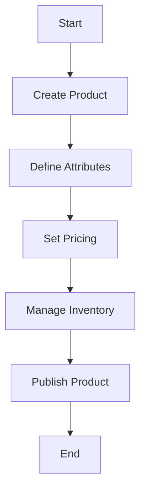

This document will cover the process of adding a new product to the Broadleaf Commerce platform. We'll cover:

1. Creating the product
2. Defining product attributes
3. Setting product pricing
4. Managing product inventory
5. Publishing the product

Technical document: <SwmLink doc-title="" repo-id="Z2l0aHViJTNBJTNBQnJvYWRsZWFmQ29tbWVyY2UtZGVtby1uZXclM0ElM0FTd2ltbS1EZW1v" path="/.swm/.cu81ykb4.sw.md"></SwmLink>

# [Creating the product](https://app.swimm.io/repos/Z2l0aHViJTNBJTNBQnJvYWRsZWFmQ29tbWVyY2UtZGVtby1uZXclM0ElM0FTd2ltbS1EZW1v/docs/cu81ykb4#creating-the-product)

The first step in adding a new product is to create the product entity within the Broadleaf Commerce platform. This involves providing basic information such as the product name, description, and category. This step is crucial as it establishes the foundational details of the product that will be used throughout the system.

# [Defining product attributes](https://app.swimm.io/repos/Z2l0aHViJTNBJTNBQnJvYWRsZWFmQ29tbWVyY2UtZGVtby1uZXclM0ElM0FTd2ltbS1EZW1v/docs/cu81ykb4#defining-product-attributes)

Once the product is created, the next step is to define its attributes. Attributes can include various characteristics such as size, color, material, and any other relevant details that describe the product. These attributes help in categorizing and filtering products, making it easier for customers to find what they are looking for.

# [Setting product pricing](https://app.swimm.io/repos/Z2l0aHViJTNBJTNBQnJvYWRsZWFmQ29tbWVyY2UtZGVtby1uZXclM0ElM0FTd2ltbS1EZW1v/docs/cu81ykb4#setting-product-pricing)

After defining the product attributes, the next step is to set the pricing. This involves determining the base price of the product and any applicable discounts or promotions. Pricing is a critical aspect as it directly affects the purchasing decision of the customers. The system should allow for flexible pricing strategies to accommodate various business needs.

# [Managing product inventory](https://app.swimm.io/repos/Z2l0aHViJTNBJTNBQnJvYWRsZWFmQ29tbWVyY2UtZGVtby1uZXclM0ElM0FTd2ltbS1EZW1v/docs/cu81ykb4#managing-product-inventory)

Managing inventory is essential to ensure that the product is available for purchase. This step involves setting the initial stock levels, defining reorder points, and managing stock across multiple locations if applicable. Proper inventory management helps in avoiding stockouts and overstock situations, ensuring a smooth customer experience.

# [Publishing the product](https://app.swimm.io/repos/Z2l0aHViJTNBJTNBQnJvYWRsZWFmQ29tbWVyY2UtZGVtby1uZXclM0ElM0FTd2ltbS1EZW1v/docs/cu81ykb4#publishing-the-product)

The final step is to publish the product, making it available for customers to view and purchase on the website. This involves reviewing all the information entered, ensuring accuracy, and then activating the product. Once published, the product will be visible in the online store and can be marketed to potential customers.

&nbsp;

*This is an auto-generated document by Swimm AI 🌊 and has not yet been verified by a human*

<SwmMeta version="3.0.0" repo-id="Z2l0aHViJTNBJTNBQnJvYWRsZWFmQ29tbWVyY2UtZGVtby1uZXclM0ElM0FTd2ltbS1EZW1v" repo-name="BroadleafCommerce-demo-new" doc-type="product-flows">Powered by [Swimm](/)</SwmMeta>
