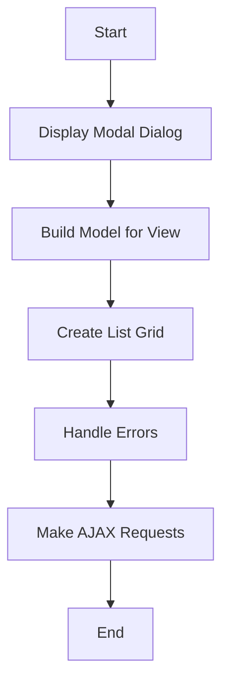

The process of adding an item to a collection involves several steps to ensure a seamless user experience. This document will cover:

1. Displaying the modal dialog
2. Building the model for the view
3. Creating the list grid
4. Handling errors
5. Making AJAX requests

Technical document: <SwmLink doc-title="Adding an Item to a Collection">[Adding an Item to a Collection](/.swm/adding-an-item-to-a-collection.xtbgo7fa.sw.md)</SwmLink>

# [Displaying the Modal Dialog](https://app.swimm.io/repos/Z2l0aHViJTNBJTNBQnJvYWRsZWFmQ29tbWVyY2UtZGVtby1uZXclM0ElM0FTd2ltbS1EZW1v/docs/xtbgo7fa#showaddcollectionitem)

The process begins with displaying a modal dialog where the user can add an item to a collection. Depending on the type of collection, the modal will show different forms or grids. For example, a basic collection might display a blank form for the user to fill out, while an adorned collection might show a list grid for the user to select an item. This step ensures that the user is presented with the appropriate interface for the type of collection they are working with.

# [Building the Model for the View](https://app.swimm.io/repos/Z2l0aHViJTNBJTNBQnJvYWRsZWFmQ29tbWVyY2UtZGVtby1uZXclM0ElM0FTd2ltbS1EZW1v/docs/xtbgo7fa#buildaddcollectionitemmodel)

Next, the system builds the model needed for the view. This involves setting up the necessary attributes and metadata to ensure that the modal dialog displays correctly. The model includes information such as the entity form, list grid, and view type. This step is crucial for ensuring that all the necessary data is available for rendering the modal dialog.

# [Creating the List Grid](https://app.swimm.io/repos/Z2l0aHViJTNBJTNBQnJvYWRsZWFmQ29tbWVyY2UtZGVtby1uZXclM0ElM0FTd2ltbS1EZW1v/docs/xtbgo7fa#buildcollectionlistgrid)

The list grid is created to allow the user to select or manage items within the collection. The grid's properties, such as editability, sortability, and visibility, are configured based on the collection type. This step ensures that the user can interact with the collection items in a user-friendly manner.

# [Handling Errors](https://app.swimm.io/repos/Z2l0aHViJTNBJTNBQnJvYWRsZWFmQ29tbWVyY2UtZGVtby1uZXclM0ElM0FTd2ltbS1EZW1v/docs/xtbgo7fa#error)

If any errors occur during the process, they are handled by a generic error handler. This handler can display error messages or perform other actions to inform the user of the issue. Proper error handling ensures that the user is aware of any problems and can take appropriate action.

# [Making AJAX Requests](https://app.swimm.io/repos/Z2l0aHViJTNBJTNBQnJvYWRsZWFmQ29tbWVyY2UtZGVtby1uZXclM0ElM0FTd2ltbS1EZW1v/docs/xtbgo7fa#ajax)

Finally, AJAX requests are used to perform asynchronous operations such as fetching data or submitting forms. These requests ensure that the necessary data is retrieved or submitted without requiring the user to reload the page. This step enhances the user experience by providing a smooth and responsive interface.

&nbsp;

*This is an auto-generated document by Swimm AI 🌊 and has not yet been verified by a human*

<SwmMeta version="3.0.0" repo-id="Z2l0aHViJTNBJTNBQnJvYWRsZWFmQ29tbWVyY2UtZGVtby1uZXclM0ElM0FTd2ltbS1EZW1v" repo-name="BroadleafCommerce-demo-new" doc-type="product-flows">Powered by [Swimm](/)</SwmMeta>
