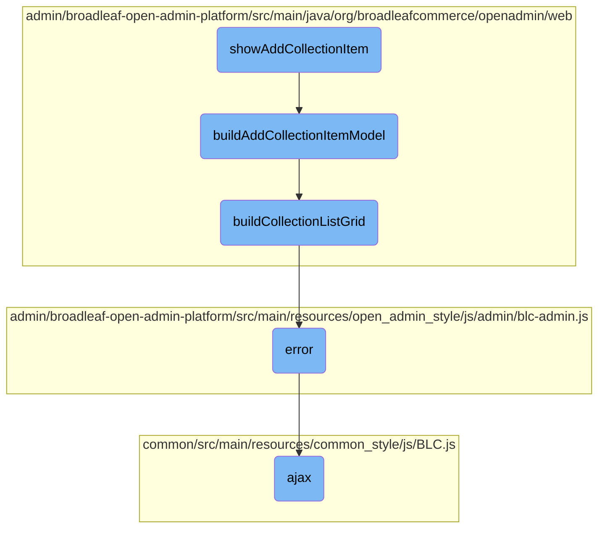

In this document, we will explain the process of adding an item to a collection. The process involves displaying a modal dialog, building the model for the view, creating a list grid, handling errors, and making AJAX requests.

The flow starts with displaying a modal dialog where you can add an item to a collection. Depending on the type of collection, it shows different forms or grids. Then, it builds the model needed for the view, which includes setting up the necessary attributes. Next, it creates a list grid that allows you to select or manage items. If any errors occur, they are handled by a generic error handler. Finally, AJAX requests are used to perform asynchronous operations like fetching data or submitting forms.

# Flow drill down



<SwmSnippet path="/admin/broadleaf-open-admin-platform/src/main/java/org/broadleafcommerce/openadmin/web/controller/entity/AdminBasicEntityController.java" line="947">

---

## <SwmToken path="admin/broadleaf-open-admin-platform/src/main/java/org/broadleafcommerce/openadmin/web/controller/entity/AdminBasicEntityController.java" pos="1302:11:11" line-data="     * @see {@link #showAddCollectionItem(HttpServletRequest, HttpServletResponse, Model, Map, String, String, MultiValueMap)}">`showAddCollectionItem`</SwmToken>

The <SwmToken path="admin/broadleaf-open-admin-platform/src/main/java/org/broadleafcommerce/openadmin/web/controller/entity/AdminBasicEntityController.java" pos="1302:11:11" line-data="     * @see {@link #showAddCollectionItem(HttpServletRequest, HttpServletResponse, Model, Map, String, String, MultiValueMap)}">`showAddCollectionItem`</SwmToken> method is responsible for displaying a modal dialog to add an item to a collection. It handles various types of collections such as Basic, Adorned, and Map collections. Depending on the collection type, it either renders a blank form, a list grid for selection, or a form with additional fields. This method sets up the necessary metadata and request parameters before delegating to <SwmToken path="admin/broadleaf-open-admin-platform/src/main/java/org/broadleafcommerce/openadmin/web/controller/entity/AdminBasicEntityController.java" pos="1305:5:5" line-data="    protected String buildAddCollectionItemModel(HttpServletRequest request, HttpServletResponse response,">`buildAddCollectionItemModel`</SwmToken> to construct the model for the view.

```java
    /**
     * Shows the modal dialog that is used to add an item to a given collection. There are several possible outcomes
     * of this call depending on the type of the specified collection field.
     *
     * <ul>
     *  <li>
     *    <b>Basic Collection (Persist)</b> - Renders a blank form for the specified target entity so that the user may
     *    enter information and associate the record with this collection. Used by fields such as ProductAttribute.
     *  </li>
     *  <li>
     *    <b>Basic Collection (Lookup)</b> - Renders a list grid that allows the user to click on an entity and select it.
     *    Used by fields such as "allParentCategories".
     *  </li>
     *  <li>
     *    <b>Adorned Collection (without form)</b> - Renders a list grid that allows the user to click on an entity and
     *    select it. The view rendered by this is identical to basic collection (lookup), but will perform the operation
     *    on an adorned field, which may carry extra meta-information about the created relationship, such as order.
     *  </li>
     *  <li>
     *    <b>Adorned Collection (with form)</b> - Renders a list grid that allows the user to click on an entity and
     *    select it. Once the user selects the entity, he will be presented with an empty form based on the specified
```

---

</SwmSnippet>

<SwmSnippet path="/admin/broadleaf-open-admin-platform/src/main/java/org/broadleafcommerce/openadmin/web/controller/entity/AdminBasicEntityController.java" line="1288">

---

## <SwmToken path="admin/broadleaf-open-admin-platform/src/main/java/org/broadleafcommerce/openadmin/web/controller/entity/AdminBasicEntityController.java" pos="1305:5:5" line-data="    protected String buildAddCollectionItemModel(HttpServletRequest request, HttpServletResponse response,">`buildAddCollectionItemModel`</SwmToken>

The <SwmToken path="admin/broadleaf-open-admin-platform/src/main/java/org/broadleafcommerce/openadmin/web/controller/entity/AdminBasicEntityController.java" pos="1305:5:5" line-data="    protected String buildAddCollectionItemModel(HttpServletRequest request, HttpServletResponse response,">`buildAddCollectionItemModel`</SwmToken> method constructs the model information required for displaying the add modal for collection items. It handles different collection metadata types and sets up the appropriate view type, such as a simple add entity form or a list grid for selection. This method ensures that the model contains all necessary attributes, including the entity form, list grid, and view type, to render the modal correctly.

```java
    /**
     * Builds out all of the model information needed for showing the add modal for collection items on both the initial GET
     * as well as after a POST with validation errors
     *
     * @param request
     * @param model
     * @param id
     * @param collectionField
     * @param sectionKey
     * @param collectionProperty
     * @param md
     * @param ppr
     * @return the appropriate view to display for the modal
     * @see {@link #addCollectionItem(HttpServletRequest, HttpServletResponse, Model, Map, String, String, EntityForm, BindingResult)}
     * @see {@link #showAddCollectionItem(HttpServletRequest, HttpServletResponse, Model, Map, String, String, MultiValueMap)}
     * @throws ServiceException
     */
    protected String buildAddCollectionItemModel(HttpServletRequest request, HttpServletResponse response,
            Model model, String id, String collectionField, String sectionKey, Property collectionProperty,
            FieldMetadata md, PersistencePackageRequest ppr, EntityForm entityForm, Entity entity) throws ServiceException {

```

---

</SwmSnippet>

<SwmSnippet path="/admin/broadleaf-open-admin-platform/src/main/java/org/broadleafcommerce/openadmin/web/service/FormBuilderServiceImpl.java" line="413">

---

## <SwmToken path="admin/broadleaf-open-admin-platform/src/main/java/org/broadleafcommerce/openadmin/web/service/FormBuilderServiceImpl.java" pos="414:5:5" line-data="    public ListGrid buildCollectionListGrid(String containingEntityId, DynamicResultSet drs, Property field, ">`buildCollectionListGrid`</SwmToken>

The <SwmToken path="admin/broadleaf-open-admin-platform/src/main/java/org/broadleafcommerce/openadmin/web/service/FormBuilderServiceImpl.java" pos="414:5:5" line-data="    public ListGrid buildCollectionListGrid(String containingEntityId, DynamicResultSet drs, Property field, ">`buildCollectionListGrid`</SwmToken> method creates a list grid for a collection field. It determines the appropriate metadata and header fields based on the collection type and configures the list grid's properties, such as editability, sortability, and visibility. This method is crucial for rendering the list grid view in the add collection item modal, allowing users to select or manage collection items.

```java
    @Override
    public ListGrid buildCollectionListGrid(String containingEntityId, DynamicResultSet drs, Property field, 
            String sectionKey, List<SectionCrumb> sectionCrumbs)
            throws ServiceException {
        FieldMetadata fmd = field.getMetadata();
        // Get the class metadata for this particular field
        PersistencePackageRequest ppr = PersistencePackageRequest.fromMetadata(fmd, sectionCrumbs);
        // TODO: 9/27/2022 remove "if (field != null)" or move up before "field.getMetadata()"
        if (field != null) {
            ppr.setSectionEntityField(field.getName());
        }
        ClassMetadata cmd = adminEntityService.getClassMetadata(ppr).getDynamicResultSet().getClassMetaData();

        List<Field> headerFields = new ArrayList<>();
        ListGrid.Type type = null;
        boolean editable = false;
        boolean sortable = false;
        boolean readOnly = false;
        boolean hideIdColumn = false;
        boolean canFilterAndSort = true;
        boolean modalSingleSelectable = false;
```

---

</SwmSnippet>

<SwmSnippet path="/admin/broadleaf-open-admin-platform/src/main/resources/open_admin_style/js/admin/blc-admin.js" line="1178">

---

## error

The <SwmToken path="admin/broadleaf-open-admin-platform/src/main/resources/open_admin_style/js/admin/blc-admin.js" pos="1180:1:1" line-data="                error: function (error) {">`error`</SwmToken> function handles errors that occur during AJAX requests. It is a generic error handler that can be customized to display error messages or perform other actions when an AJAX request fails.

```javascript
                url: BLC.servletContext + '/update-navigation',
                type: "GET",
                error: function (error) {
                }
            }, function (data) {
```

---

</SwmSnippet>

<SwmSnippet path="/common/src/main/resources/common_style/js/BLC.js" line="135">

---

## ajax

The <SwmToken path="common/src/main/resources/common_style/js/BLC.js" pos="135:3:3" line-data="    function ajax(options, callback) {">`ajax`</SwmToken> function is a utility for making AJAX requests. It sets default options, handles CSRF tokens, and processes the response data. This function is used throughout the application to perform asynchronous operations, such as fetching data or submitting forms, and ensures that the necessary security tokens are included in the requests.

```javascript
    function ajax(options, callback) {
        if (options.type == null) {
            options.type = 'GET';
        }

        var baseUrl = window.location.href;
        if (baseUrl.indexOf('isPostAdd') != -1) {
            if (options.url.indexOf('isPostAdd') < 0) {
                if (options.url.indexOf('?') > 0) {
                    options.url += "&";
                } else {
                    options.url += "?";
                }
                options.url += "isPostAdd=true";
            }
        }
        var savedCatalogElement = $('input[name ="catalogEntityCatalogDiscriminatorId"]');
        var savedCatalog=null;

        if(savedCatalogElement.length){
            //0 should be the one we need, other can be from the modal form
```

---

</SwmSnippet>

&nbsp;

*This is an auto-generated document by Swimm AI 🌊 and has not yet been verified by a human*

<SwmMeta version="3.0.0" repo-id="Z2l0aHViJTNBJTNBQnJvYWRsZWFmQ29tbWVyY2UtZGVtby1uZXclM0ElM0FTd2ltbS1EZW1v" repo-name="BroadleafCommerce-demo-new" doc-type="flows"><sup>Powered by [Swimm](/)</sup></SwmMeta>
