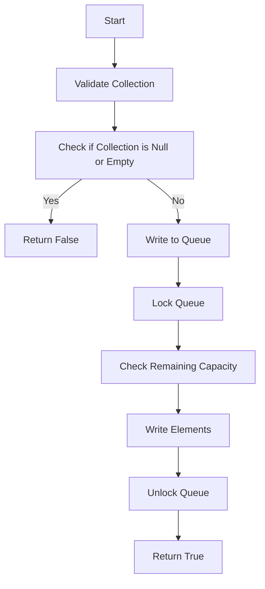

This document will cover the process of adding elements to a queue, which includes:

1. Validating the collection of elements
2. Writing elements to the queue
3. Ensuring thread safety during the process.

Technical document: <SwmLink doc-title="Adding Elements to the Queue">[Adding Elements to the Queue](/.swm/adding-elements-to-the-queue.b1yl9yk4.sw.md)</SwmLink>

# [Validating the Collection of Elements](https://app.swimm.io/repos/Z2l0aHViJTNBJTNBQnJvYWRsZWFmQ29tbWVyY2UtZGVtby1uZXclM0ElM0FTd2ltbS1EZW1v/docs/b1yl9yk4#addall-method)

The process begins with validating the collection of elements that need to be added to the queue. This step ensures that the collection is neither null nor empty. If the collection is null or empty, the process stops, and the method returns false. This validation is crucial to avoid unnecessary processing and potential errors.

# [Writing Elements to the Queue](https://app.swimm.io/repos/Z2l0aHViJTNBJTNBQnJvYWRsZWFmQ29tbWVyY2UtZGVtby1uZXclM0ElM0FTd2ltbS1EZW1v/docs/b1yl9yk4#writetoqueue-method)

Once the collection is validated, the next step is to write the elements to the queue. This involves locking the queue to ensure that no other process can modify it simultaneously. The remaining capacity of the queue is checked to determine how many elements can be added. Elements are then written to the queue until the capacity is reached or the collection is empty. This step ensures that the queue operates efficiently and prevents overloading.

# [Ensuring Thread Safety](https://app.swimm.io/repos/Z2l0aHViJTNBJTNBQnJvYWRsZWFmQ29tbWVyY2UtZGVtby1uZXclM0ElM0FTd2ltbS1EZW1v/docs/b1yl9yk4#lockinterruptibly-method)

Thread safety is a critical aspect of this process. A distributed lock is used to ensure that only one thread can write to the queue at a time. This prevents data corruption and ensures that the queue's state remains consistent. The lock can be interrupted if necessary, allowing the process to handle interruptions gracefully.

&nbsp;

*This is an auto-generated document by Swimm AI 🌊 and has not yet been verified by a human*

<SwmMeta version="3.0.0" repo-id="Z2l0aHViJTNBJTNBQnJvYWRsZWFmQ29tbWVyY2UtZGVtby1uZXclM0ElM0FTd2ltbS1EZW1v" repo-name="BroadleafCommerce-demo-new" doc-type="product-flows">Powered by [Swimm](/)</SwmMeta>
