In this document, we will explain the <SwmToken path="core/broadleaf-framework/src/main/java/org/broadleafcommerce/core/util/queue/ZookeeperDistributedQueue.java" pos="308:5:5" line-data="    public boolean addAll(Collection&lt;? extends T&gt; c) {">`addAll`</SwmToken> method, which is responsible for adding a collection of elements to a queue. The method ensures that the collection is neither null nor empty before attempting to write the elements to the queue. It uses the <SwmToken path="core/broadleaf-framework/src/main/java/org/broadleafcommerce/core/util/queue/ZookeeperDistributedQueue.java" pos="313:7:7" line-data="            int count = writeToQueue(new ArrayList&lt;&gt;(c), -1L);">`writeToQueue`</SwmToken> method to handle the actual writing process and returns true if the number of elements written matches the size of the collection.

The flow starts with the <SwmToken path="core/broadleaf-framework/src/main/java/org/broadleafcommerce/core/util/queue/ZookeeperDistributedQueue.java" pos="308:5:5" line-data="    public boolean addAll(Collection&lt;? extends T&gt; c) {">`addAll`</SwmToken> method checking if the collection is null or empty. If it is, the method returns false. If not, it tries to write the collection to the queue using the <SwmToken path="core/broadleaf-framework/src/main/java/org/broadleafcommerce/core/util/queue/ZookeeperDistributedQueue.java" pos="313:7:7" line-data="            int count = writeToQueue(new ArrayList&lt;&gt;(c), -1L);">`writeToQueue`</SwmToken> method. The <SwmToken path="core/broadleaf-framework/src/main/java/org/broadleafcommerce/core/util/queue/ZookeeperDistributedQueue.java" pos="313:7:7" line-data="            int count = writeToQueue(new ArrayList&lt;&gt;(c), -1L);">`writeToQueue`</SwmToken> method locks the queue, checks the remaining capacity, and writes elements until the capacity is reached or the collection is empty. It uses a distributed lock to ensure thread safety. The <SwmToken path="core/broadleaf-framework/src/main/java/org/broadleafcommerce/core/util/queue/ZookeeperDistributedQueue.java" pos="263:5:5" line-data="    public boolean isEmpty() {">`isEmpty`</SwmToken> method checks if the queue is empty by synchronizing on <SwmToken path="core/broadleaf-framework/src/main/java/org/broadleafcommerce/core/util/queue/ZookeeperDistributedQueue.java" pos="264:4:4" line-data="        synchronized (QUEUE_MONITOR) {">`QUEUE_MONITOR`</SwmToken> and calling the <SwmToken path="core/broadleaf-framework/src/main/java/org/broadleafcommerce/core/util/queue/ZookeeperDistributedQueue.java" pos="239:5:5" line-data="    public int size() {">`size`</SwmToken> method. The <SwmToken path="core/broadleaf-framework/src/main/java/org/broadleafcommerce/core/util/queue/ZookeeperDistributedQueue.java" pos="239:5:5" line-data="    public int size() {">`size`</SwmToken> method determines the number of elements in the queue by locking the queue and retrieving data from the Zookeeper client. The <SwmToken path="core/broadleaf-framework/src/main/java/org/broadleafcommerce/core/util/queue/ZookeeperDistributedQueue.java" pos="242:3:3" line-data="            lock.lockInterruptibly();">`lockInterruptibly`</SwmToken> method attempts to acquire a lock on the queue, allowing the thread to be interrupted while waiting for the lock. Finally, the <SwmToken path="core/broadleaf-framework/src/main/java/org/broadleafcommerce/core/util/lock/ReentrantDistributedZookeeperLock.java" pos="341:1:1" line-data="        lockInternally(-1L);">`lockInternally`</SwmToken> method performs the internal locking mechanism using the Zookeeper client.

# Flow drill down

```mermaid
graph TD;
      subgraph core/broadleaf-framework/src/main/java/org/broadleafcommerce/core/util
c122da6a7a916809e76f4e9908f55f7a5195ff3b457f93f1b241a989a20fa9ac(addAll):::mainFlowStyle --> aa8cdbe4a9d4c527322ee913c1e765a2f4378a597904b96c93633a5c88b90652(isEmpty)
end

subgraph core/broadleaf-framework/src/main/java/org/broadleafcommerce/core/util
c122da6a7a916809e76f4e9908f55f7a5195ff3b457f93f1b241a989a20fa9ac(addAll):::mainFlowStyle --> 7540c94382d60dd5b1a4eb538f949cadd5a341ac4b39ae2be8dd55ab89222880(writeToQueue)
end

subgraph core/broadleaf-framework/src/main/java/org/broadleafcommerce/core/util
c122da6a7a916809e76f4e9908f55f7a5195ff3b457f93f1b241a989a20fa9ac(addAll):::mainFlowStyle --> 119ea4bdd418642aef64f4a0f0ef8ac202542484f7b9e99f671004c0887e4e26(size):::mainFlowStyle
end

subgraph core/broadleaf-framework/src/main/java/org/broadleafcommerce/core/util
119ea4bdd418642aef64f4a0f0ef8ac202542484f7b9e99f671004c0887e4e26(size):::mainFlowStyle --> 9c2897679bf4571028570672c317850f4fcfa40ef7a885cdbbeaed6bc55fdef2(lockInterruptibly):::mainFlowStyle
end

subgraph core/broadleaf-framework/src/main/java/org/broadleafcommerce/core/util
7540c94382d60dd5b1a4eb538f949cadd5a341ac4b39ae2be8dd55ab89222880(writeToQueue) --> aa8cdbe4a9d4c527322ee913c1e765a2f4378a597904b96c93633a5c88b90652(isEmpty)
end

subgraph core/broadleaf-framework/src/main/java/org/broadleafcommerce/core/util
9c2897679bf4571028570672c317850f4fcfa40ef7a885cdbbeaed6bc55fdef2(lockInterruptibly):::mainFlowStyle --> e0f16d7ab06c38c08c2391d8d964130511910485588b7b9dab194f61445bd15a(lockInternally):::mainFlowStyle
end


      classDef mainFlowStyle color:#000000,fill:#7CB9F4
classDef rootsStyle color:#000000,fill:#00FFF4
classDef Style1 color:#000000,fill:#00FFAA
classDef Style2 color:#000000,fill:#FFFF00
classDef Style3 color:#000000,fill:#AA7CB9

%% Swimm:
%% graph TD;
%%       subgraph <SwmPath>[core/broadleaf-framework/src/main/java/org/broadleafcommerce/core/util/](core/broadleaf-framework/src/main/java/org/broadleafcommerce/core/util/)</SwmPath>
%% c122da6a7a916809e76f4e9908f55f7a5195ff3b457f93f1b241a989a20fa9ac(addAll):::mainFlowStyle --> aa8cdbe4a9d4c527322ee913c1e765a2f4378a597904b96c93633a5c88b90652(isEmpty)
%% end
%% 
%% subgraph <SwmPath>[core/broadleaf-framework/src/main/java/org/broadleafcommerce/core/util/](core/broadleaf-framework/src/main/java/org/broadleafcommerce/core/util/)</SwmPath>
%% c122da6a7a916809e76f4e9908f55f7a5195ff3b457f93f1b241a989a20fa9ac(addAll):::mainFlowStyle --> 7540c94382d60dd5b1a4eb538f949cadd5a341ac4b39ae2be8dd55ab89222880(writeToQueue)
%% end
%% 
%% subgraph <SwmPath>[core/broadleaf-framework/src/main/java/org/broadleafcommerce/core/util/](core/broadleaf-framework/src/main/java/org/broadleafcommerce/core/util/)</SwmPath>
%% c122da6a7a916809e76f4e9908f55f7a5195ff3b457f93f1b241a989a20fa9ac(addAll):::mainFlowStyle --> 119ea4bdd418642aef64f4a0f0ef8ac202542484f7b9e99f671004c0887e4e26(size):::mainFlowStyle
%% end
%% 
%% subgraph <SwmPath>[core/broadleaf-framework/src/main/java/org/broadleafcommerce/core/util/](core/broadleaf-framework/src/main/java/org/broadleafcommerce/core/util/)</SwmPath>
%% 119ea4bdd418642aef64f4a0f0ef8ac202542484f7b9e99f671004c0887e4e26(size):::mainFlowStyle --> 9c2897679bf4571028570672c317850f4fcfa40ef7a885cdbbeaed6bc55fdef2(lockInterruptibly):::mainFlowStyle
%% end
%% 
%% subgraph <SwmPath>[core/broadleaf-framework/src/main/java/org/broadleafcommerce/core/util/](core/broadleaf-framework/src/main/java/org/broadleafcommerce/core/util/)</SwmPath>
%% 7540c94382d60dd5b1a4eb538f949cadd5a341ac4b39ae2be8dd55ab89222880(writeToQueue) --> aa8cdbe4a9d4c527322ee913c1e765a2f4378a597904b96c93633a5c88b90652(isEmpty)
%% end
%% 
%% subgraph <SwmPath>[core/broadleaf-framework/src/main/java/org/broadleafcommerce/core/util/](core/broadleaf-framework/src/main/java/org/broadleafcommerce/core/util/)</SwmPath>
%% 9c2897679bf4571028570672c317850f4fcfa40ef7a885cdbbeaed6bc55fdef2(lockInterruptibly):::mainFlowStyle --> e0f16d7ab06c38c08c2391d8d964130511910485588b7b9dab194f61445bd15a(lockInternally):::mainFlowStyle
%% end
%% 
%% 
%%       classDef mainFlowStyle color:#000000,fill:#7CB9F4
%% classDef rootsStyle color:#000000,fill:#00FFF4
%% classDef Style1 color:#000000,fill:#00FFAA
%% classDef Style2 color:#000000,fill:#FFFF00
%% classDef Style3 color:#000000,fill:#AA7CB9
```



<SwmSnippet path="/core/broadleaf-framework/src/main/java/org/broadleafcommerce/core/util/queue/ZookeeperDistributedQueue.java" line="308">

---

## <SwmToken path="core/broadleaf-framework/src/main/java/org/broadleafcommerce/core/util/queue/ZookeeperDistributedQueue.java" pos="308:5:5" line-data="    public boolean addAll(Collection&lt;? extends T&gt; c) {">`addAll`</SwmToken> Method

The <SwmToken path="core/broadleaf-framework/src/main/java/org/broadleafcommerce/core/util/queue/ZookeeperDistributedQueue.java" pos="308:5:5" line-data="    public boolean addAll(Collection&lt;? extends T&gt; c) {">`addAll`</SwmToken> method is responsible for adding a collection of elements to the queue. It first checks if the collection is null or empty, returning false if so. It then attempts to write the collection to the queue using the <SwmToken path="core/broadleaf-framework/src/main/java/org/broadleafcommerce/core/util/queue/ZookeeperDistributedQueue.java" pos="313:7:7" line-data="            int count = writeToQueue(new ArrayList&lt;&gt;(c), -1L);">`writeToQueue`</SwmToken> method and returns true if the number of elements written matches the size of the collection.

```java
    public boolean addAll(Collection<? extends T> c) {
        if (c == null || c.isEmpty()) {
            return false;
        }
        try {
            int count = writeToQueue(new ArrayList<>(c), -1L);
            return count == c.size();
        } catch (InterruptedException e) {
            return false;
        }
        
    }
```

---

</SwmSnippet>

<SwmSnippet path="/core/broadleaf-framework/src/main/java/org/broadleafcommerce/core/util/queue/ZookeeperDistributedQueue.java" line="263">

---

## <SwmToken path="core/broadleaf-framework/src/main/java/org/broadleafcommerce/core/util/queue/ZookeeperDistributedQueue.java" pos="263:5:5" line-data="    public boolean isEmpty() {">`isEmpty`</SwmToken> Method

The <SwmToken path="core/broadleaf-framework/src/main/java/org/broadleafcommerce/core/util/queue/ZookeeperDistributedQueue.java" pos="263:5:5" line-data="    public boolean isEmpty() {">`isEmpty`</SwmToken> method checks if the queue is empty by synchronizing on <SwmToken path="core/broadleaf-framework/src/main/java/org/broadleafcommerce/core/util/queue/ZookeeperDistributedQueue.java" pos="264:4:4" line-data="        synchronized (QUEUE_MONITOR) {">`QUEUE_MONITOR`</SwmToken> and calling the <SwmToken path="core/broadleaf-framework/src/main/java/org/broadleafcommerce/core/util/queue/ZookeeperDistributedQueue.java" pos="265:3:3" line-data="            return size() == 0;">`size`</SwmToken> method. If the size is zero, it returns true, indicating that the queue is empty.

```java
    public boolean isEmpty() {
        synchronized (QUEUE_MONITOR) {
            return size() == 0;
        }
    }
```

---

</SwmSnippet>

<SwmSnippet path="/core/broadleaf-framework/src/main/java/org/broadleafcommerce/core/util/queue/ZookeeperDistributedQueue.java" line="503">

---

## <SwmToken path="core/broadleaf-framework/src/main/java/org/broadleafcommerce/core/util/queue/ZookeeperDistributedQueue.java" pos="503:5:5" line-data="    protected int writeToQueue(List&lt;? extends T&gt; entries, final long timeout) throws InterruptedException {">`writeToQueue`</SwmToken> Method

The <SwmToken path="core/broadleaf-framework/src/main/java/org/broadleafcommerce/core/util/queue/ZookeeperDistributedQueue.java" pos="503:5:5" line-data="    protected int writeToQueue(List&lt;? extends T&gt; entries, final long timeout) throws InterruptedException {">`writeToQueue`</SwmToken> method handles the actual writing of elements to the queue. It locks the queue, checks the remaining capacity, and writes elements until the capacity is reached or the collection is empty. It uses a distributed lock to ensure thread safety and handles interruptions appropriately.

```java
    protected int writeToQueue(List<? extends T> entries, final long timeout) throws InterruptedException {
        if (entries == null || entries.isEmpty()) {
            return 0;
        }
        
        int entryCount = 0;
        long waitTime = timeout;
        synchronized (QUEUE_MONITOR) {
            while (true) {
                boolean locked = false;
                DistributedLock lock = getQueueAccessLock();
                if (timeout < 0L) {
                    lock.lockInterruptibly();
                    locked = true;
                } else if (timeout > 0L && waitTime > 0L) {
                    long start = System.currentTimeMillis();
                    locked = lock.tryLock(waitTime, TimeUnit.MILLISECONDS);
                    long end = System.currentTimeMillis();
                    waitTime -= (end - start);
                } else {
                    locked = lock.tryLock();
```

---

</SwmSnippet>

<SwmSnippet path="/core/broadleaf-framework/src/main/java/org/broadleafcommerce/core/util/queue/ZookeeperDistributedQueue.java" line="239">

---

## size Method

The <SwmToken path="core/broadleaf-framework/src/main/java/org/broadleafcommerce/core/util/queue/ZookeeperDistributedQueue.java" pos="239:5:5" line-data="    public int size() {">`size`</SwmToken> method determines the number of elements in the queue. It locks the queue, retrieves the data from the Zookeeper client, and returns the number of children (elements) in the queue.

```java
    public int size() {
        DistributedLock lock = getQueueAccessLock();
        try {
            lock.lockInterruptibly();
            try {
                return executeOperation(new GenericOperation<Integer>() {
                    @Override
                    public Integer execute() throws Exception {
                        final Stat stat = new Stat();
                        getZookeeperClient().getData(getQueueEntryFolder(), null, stat);
                        return stat.getNumChildren();
                    }
                });
                
            } finally {
                lock.unlock();
            }
        } catch (InterruptedException e) {
            Thread.currentThread().interrupt();
            throw new DistributedQueueException("Thread was interrupted while trying to determine queue size for distributed Zookeeper queue, " + getQueueFolderPath(), e);
        }
```

---

</SwmSnippet>

<SwmSnippet path="/core/broadleaf-framework/src/main/java/org/broadleafcommerce/core/util/lock/ReentrantDistributedZookeeperLock.java" line="336">

---

## <SwmToken path="core/broadleaf-framework/src/main/java/org/broadleafcommerce/core/util/lock/ReentrantDistributedZookeeperLock.java" pos="336:5:5" line-data="    public void lockInterruptibly() throws InterruptedException {">`lockInterruptibly`</SwmToken> Method

The <SwmToken path="core/broadleaf-framework/src/main/java/org/broadleafcommerce/core/util/lock/ReentrantDistributedZookeeperLock.java" pos="336:5:5" line-data="    public void lockInterruptibly() throws InterruptedException {">`lockInterruptibly`</SwmToken> method attempts to acquire a lock on the queue, allowing the thread to be interrupted while waiting for the lock. It calls the <SwmToken path="core/broadleaf-framework/src/main/java/org/broadleafcommerce/core/util/lock/ReentrantDistributedZookeeperLock.java" pos="341:1:1" line-data="        lockInternally(-1L);">`lockInternally`</SwmToken> method to perform the actual locking.

```java
    public void lockInterruptibly() throws InterruptedException {
        if (Thread.interrupted()) {
            throw new InterruptedException("Thread was interrupted prior to trying to acquire the lock.");
        }
        
        lockInternally(-1L);
    }
```

---

</SwmSnippet>

<SwmSnippet path="/core/broadleaf-framework/src/main/java/org/broadleafcommerce/core/util/lock/ReentrantDistributedZookeeperLock.java" line="380">

---

## <SwmToken path="core/broadleaf-framework/src/main/java/org/broadleafcommerce/core/util/lock/ReentrantDistributedZookeeperLock.java" pos="380:5:5" line-data="    protected boolean lockInternally(final long waitTime) throws InterruptedException {">`lockInternally`</SwmToken> Method

The <SwmToken path="core/broadleaf-framework/src/main/java/org/broadleafcommerce/core/util/lock/ReentrantDistributedZookeeperLock.java" pos="380:5:5" line-data="    protected boolean lockInternally(final long waitTime) throws InterruptedException {">`lockInternally`</SwmToken> method performs the internal locking mechanism using the Zookeeper client. It creates an ephemeral sequential node to represent the lock and manages the lock's lifecycle, including acquiring and releasing the lock.

```java
    protected boolean lockInternally(final long waitTime) throws InterruptedException {
        if (!canParticipate()) {
            //No lock will be provided in this case, but we want to simulate the normal lock semantics.
            if (waitTime < 0L) {
                //Simulate normal lock semantics,where the lock is unavailable, but we've been asked to wait interruptably for it indefinitely.
                synchronized (NON_PARTICIPANT_LOCK_MONITOR) {
                    //This basically will cause this thread to block forever until the thread is interrupted, which is what we want.
                    NON_PARTICIPANT_LOCK_MONITOR.wait(); 
                }
            } else if (waitTime > 0L) {
                //Simulate normal lock semantics, where the lock is unavailable, but we've been asked to wait interruptably for it for a period of time.
                synchronized (NON_PARTICIPANT_LOCK_MONITOR) {
                    NON_PARTICIPANT_LOCK_MONITOR.wait(waitTime);
                }
            }
            
            return false;
        }
        
        //See if this thread already has a lock permit.  If so, just increment the count and return it.
        //No need to interact with Zookeeper.
```

---

</SwmSnippet>

# Where is this flow used?

This flow is used multiple times in the codebase as represented in the following diagram:

(Note - these are only some of the entry points of this flow)

```mermaid
graph TD;
      subgraph core/broadleaf-framework-web/src/main/java/org/broadleafcommerce/core/web/expression/RelatedProductsVariableExpression.java
7a42b0d5d539bcca849cefc619095c5b0c3b37b44daf2bfc1d95e204bf9184d0(findByProduct):::rootsStyle --> f0b33cc9b804553f04f160e08a5cc027047074b55392dbef8a05db4d912ae072(getRelatedProducts)
end

subgraph core/broadleaf-framework/src/main/java/org/broadleafcommerce/core/catalog
f0b33cc9b804553f04f160e08a5cc027047074b55392dbef8a05db4d912ae072(getRelatedProducts) --> 06a0c7abfcb58c1534f78f963f8f6cf89a31d9aed98592b50bd18582a764455f(findRelatedProducts)
end

subgraph core/broadleaf-framework/src/main/java/org/broadleafcommerce/core/catalog
06a0c7abfcb58c1534f78f963f8f6cf89a31d9aed98592b50bd18582a764455f(findRelatedProducts) --> bc5835b7d5a1ba18c91f4c0945a2ea873983d1f54f9686b09272d29cd1b8b0a1(buildFeaturedProductsList)
end

subgraph core/broadleaf-framework/src/main/java/org/broadleafcommerce/core/catalog
bc5835b7d5a1ba18c91f4c0945a2ea873983d1f54f9686b09272d29cd1b8b0a1(buildFeaturedProductsList) --> d7d78795f7d9f46f72d2742b32f73f96b517192d8043891ea88daf6cd7378ce2(getCumulativeFeaturedProducts)
end

subgraph core/broadleaf-framework/src/main/java/org/broadleafcommerce/core
d7d78795f7d9f46f72d2742b32f73f96b517192d8043891ea88daf6cd7378ce2(getCumulativeFeaturedProducts) --> c122da6a7a916809e76f4e9908f55f7a5195ff3b457f93f1b241a989a20fa9ac(addAll):::mainFlowStyle
end

subgraph core/broadleaf-framework-web/src/main/java/org/broadleafcommerce/core/web/expression/RelatedProductsVariableExpression.java
08172a641b58a09556cf22516034f737daa79c3f8c6ac23306670163f72b99b8(findByCategory):::rootsStyle --> f0b33cc9b804553f04f160e08a5cc027047074b55392dbef8a05db4d912ae072(getRelatedProducts)
end

subgraph core/broadleaf-framework/src/main/java/org/broadleafcommerce/core/offer/service/processor
a68322f7a47a5cc72bde739d34ab6c9e2957b42c8b96b4eb7dc7d6b6e332591a(filterOffers):::rootsStyle --> 6c61bdf66bdd76ebfe468be7ff2d3831c493648fb99b98802861aa373a62174a(filterItemLevelOffer)
end

subgraph core/broadleaf-framework/src/main/java/org/broadleafcommerce/core/offer/service/processor
6c61bdf66bdd76ebfe468be7ff2d3831c493648fb99b98802861aa373a62174a(filterItemLevelOffer) --> dcb39c785c0783098cb9a4c693c424d2a1bed33c9b851694f101e57618f98a02(couldOfferApplyToOrderItems)
end

subgraph core/broadleaf-framework/src/main/java/org/broadleafcommerce/core/offer/service/processor
dcb39c785c0783098cb9a4c693c424d2a1bed33c9b851694f101e57618f98a02(couldOfferApplyToOrderItems) --> 7903879d51225eac59a830dc80d495ce23a7b424dd11fee311b6a2455575ca83(meetsItemQualifierSubtotal)
end

subgraph core/broadleaf-framework/src/main/java/org/broadleafcommerce/core/offer/service/discount/CandidatePromotionItems.java
7903879d51225eac59a830dc80d495ce23a7b424dd11fee311b6a2455575ca83(meetsItemQualifierSubtotal) --> 2cde66f7201fb6609247abfd32f516ae50a8a93c7d820b75320e68b8058a711a(getAllCandidateTargets)
end

subgraph core/broadleaf-framework/src/main/java/org/broadleafcommerce/core
2cde66f7201fb6609247abfd32f516ae50a8a93c7d820b75320e68b8058a711a(getAllCandidateTargets) --> c122da6a7a916809e76f4e9908f55f7a5195ff3b457f93f1b241a989a20fa9ac(addAll):::mainFlowStyle
end

subgraph core/broadleaf-framework/src/main/java/org/broadleafcommerce/core
e8dcfda0d49396afe2825093c7324a03191846afc413810cf94d1246efab2b15(addAllItemsFromNamedOrder):::rootsStyle --> 98271203107c39e831fd77355eddd609873bba59a0662d4e46eb13f2a0452689(addItem)
end

subgraph core/broadleaf-framework/src/main/java/org/broadleafcommerce/core
98271203107c39e831fd77355eddd609873bba59a0662d4e46eb13f2a0452689(addItem) --> 5bab50bc6dd9f29c6a91232acbb44c9e1da4692315e877f8a5b1daccc17136c8(addItemWithPriceOverrides)
end

subgraph core/broadleaf-framework/src/main/java/org/broadleafcommerce/core
5bab50bc6dd9f29c6a91232acbb44c9e1da4692315e877f8a5b1daccc17136c8(addItemWithPriceOverrides) --> 7c1479f6f0023802c2fbe90974ef09316cdf44a964d35b61cf8b395dbce96131(updateItemQuantity)
end

subgraph core/broadleaf-framework/src/main/java/org/broadleafcommerce/core
7c1479f6f0023802c2fbe90974ef09316cdf44a964d35b61cf8b395dbce96131(updateItemQuantity) --> 6b14583043722a830c4f8e545861d79903192684a1aaeca2462c68e1b4b2e2a5(removeItem)
end

subgraph core/broadleaf-framework/src/main/java/org/broadleafcommerce/core
6b14583043722a830c4f8e545861d79903192684a1aaeca2462c68e1b4b2e2a5(removeItem) --> 6fb31ab0e2ffbf61574661bc2202623bfa82d26bd13c41b7c15b2dd164f7c002(removeItemInternal)
end

subgraph core/broadleaf-framework/src/main/java/org/broadleafcommerce/core
6fb31ab0e2ffbf61574661bc2202623bfa82d26bd13c41b7c15b2dd164f7c002(removeItemInternal) --> c122da6a7a916809e76f4e9908f55f7a5195ff3b457f93f1b241a989a20fa9ac(addAll):::mainFlowStyle
end

subgraph core/broadleaf-framework/src/main/java/org/broadleafcommerce/core
0ccd70216bf5d27ff0d9c989c31bc53922d971c33b04b3eb6178cee09c3a89ed(addItemFromNamedOrder):::rootsStyle --> 98271203107c39e831fd77355eddd609873bba59a0662d4e46eb13f2a0452689(addItem)
end


      classDef mainFlowStyle color:#000000,fill:#7CB9F4
classDef rootsStyle color:#000000,fill:#00FFF4
classDef Style1 color:#000000,fill:#00FFAA
classDef Style2 color:#000000,fill:#FFFF00
classDef Style3 color:#000000,fill:#AA7CB9

%% Swimm:
%% graph TD;
%%       subgraph <SwmPath>[core/broadleaf-framework-web/src/main/java/org/broadleafcommerce/core/web/expression/RelatedProductsVariableExpression.java](core/broadleaf-framework-web/src/main/java/org/broadleafcommerce/core/web/expression/RelatedProductsVariableExpression.java)</SwmPath>
%% 7a42b0d5d539bcca849cefc619095c5b0c3b37b44daf2bfc1d95e204bf9184d0(findByProduct):::rootsStyle --> f0b33cc9b804553f04f160e08a5cc027047074b55392dbef8a05db4d912ae072(getRelatedProducts)
%% end
%% 
%% subgraph <SwmPath>[core/broadleaf-framework/src/main/java/org/broadleafcommerce/core/catalog/](core/broadleaf-framework/src/main/java/org/broadleafcommerce/core/catalog/)</SwmPath>
%% f0b33cc9b804553f04f160e08a5cc027047074b55392dbef8a05db4d912ae072(getRelatedProducts) --> 06a0c7abfcb58c1534f78f963f8f6cf89a31d9aed98592b50bd18582a764455f(findRelatedProducts)
%% end
%% 
%% subgraph <SwmPath>[core/broadleaf-framework/src/main/java/org/broadleafcommerce/core/catalog/](core/broadleaf-framework/src/main/java/org/broadleafcommerce/core/catalog/)</SwmPath>
%% 06a0c7abfcb58c1534f78f963f8f6cf89a31d9aed98592b50bd18582a764455f(findRelatedProducts) --> bc5835b7d5a1ba18c91f4c0945a2ea873983d1f54f9686b09272d29cd1b8b0a1(buildFeaturedProductsList)
%% end
%% 
%% subgraph <SwmPath>[core/broadleaf-framework/src/main/java/org/broadleafcommerce/core/catalog/](core/broadleaf-framework/src/main/java/org/broadleafcommerce/core/catalog/)</SwmPath>
%% bc5835b7d5a1ba18c91f4c0945a2ea873983d1f54f9686b09272d29cd1b8b0a1(buildFeaturedProductsList) --> d7d78795f7d9f46f72d2742b32f73f96b517192d8043891ea88daf6cd7378ce2(getCumulativeFeaturedProducts)
%% end
%% 
%% subgraph <SwmPath>[core/broadleaf-framework/src/main/java/org/broadleafcommerce/core/](core/broadleaf-framework/src/main/java/org/broadleafcommerce/core/)</SwmPath>
%% d7d78795f7d9f46f72d2742b32f73f96b517192d8043891ea88daf6cd7378ce2(getCumulativeFeaturedProducts) --> c122da6a7a916809e76f4e9908f55f7a5195ff3b457f93f1b241a989a20fa9ac(addAll):::mainFlowStyle
%% end
%% 
%% subgraph <SwmPath>[core/broadleaf-framework-web/src/main/java/org/broadleafcommerce/core/web/expression/RelatedProductsVariableExpression.java](core/broadleaf-framework-web/src/main/java/org/broadleafcommerce/core/web/expression/RelatedProductsVariableExpression.java)</SwmPath>
%% 08172a641b58a09556cf22516034f737daa79c3f8c6ac23306670163f72b99b8(findByCategory):::rootsStyle --> f0b33cc9b804553f04f160e08a5cc027047074b55392dbef8a05db4d912ae072(getRelatedProducts)
%% end
%% 
%% subgraph <SwmPath>[core/broadleaf-framework/src/main/java/org/broadleafcommerce/core/offer/service/processor/](core/broadleaf-framework/src/main/java/org/broadleafcommerce/core/offer/service/processor/)</SwmPath>
%% a68322f7a47a5cc72bde739d34ab6c9e2957b42c8b96b4eb7dc7d6b6e332591a(filterOffers):::rootsStyle --> 6c61bdf66bdd76ebfe468be7ff2d3831c493648fb99b98802861aa373a62174a(filterItemLevelOffer)
%% end
%% 
%% subgraph <SwmPath>[core/broadleaf-framework/src/main/java/org/broadleafcommerce/core/offer/service/processor/](core/broadleaf-framework/src/main/java/org/broadleafcommerce/core/offer/service/processor/)</SwmPath>
%% 6c61bdf66bdd76ebfe468be7ff2d3831c493648fb99b98802861aa373a62174a(filterItemLevelOffer) --> dcb39c785c0783098cb9a4c693c424d2a1bed33c9b851694f101e57618f98a02(couldOfferApplyToOrderItems)
%% end
%% 
%% subgraph <SwmPath>[core/broadleaf-framework/src/main/java/org/broadleafcommerce/core/offer/service/processor/](core/broadleaf-framework/src/main/java/org/broadleafcommerce/core/offer/service/processor/)</SwmPath>
%% dcb39c785c0783098cb9a4c693c424d2a1bed33c9b851694f101e57618f98a02(couldOfferApplyToOrderItems) --> 7903879d51225eac59a830dc80d495ce23a7b424dd11fee311b6a2455575ca83(meetsItemQualifierSubtotal)
%% end
%% 
%% subgraph <SwmPath>[core/broadleaf-framework/src/main/java/org/broadleafcommerce/core/offer/service/discount/CandidatePromotionItems.java](core/broadleaf-framework/src/main/java/org/broadleafcommerce/core/offer/service/discount/CandidatePromotionItems.java)</SwmPath>
%% 7903879d51225eac59a830dc80d495ce23a7b424dd11fee311b6a2455575ca83(meetsItemQualifierSubtotal) --> 2cde66f7201fb6609247abfd32f516ae50a8a93c7d820b75320e68b8058a711a(getAllCandidateTargets)
%% end
%% 
%% subgraph <SwmPath>[core/broadleaf-framework/src/main/java/org/broadleafcommerce/core/](core/broadleaf-framework/src/main/java/org/broadleafcommerce/core/)</SwmPath>
%% 2cde66f7201fb6609247abfd32f516ae50a8a93c7d820b75320e68b8058a711a(getAllCandidateTargets) --> c122da6a7a916809e76f4e9908f55f7a5195ff3b457f93f1b241a989a20fa9ac(addAll):::mainFlowStyle
%% end
%% 
%% subgraph <SwmPath>[core/broadleaf-framework/src/main/java/org/broadleafcommerce/core/](core/broadleaf-framework/src/main/java/org/broadleafcommerce/core/)</SwmPath>
%% e8dcfda0d49396afe2825093c7324a03191846afc413810cf94d1246efab2b15(addAllItemsFromNamedOrder):::rootsStyle --> 98271203107c39e831fd77355eddd609873bba59a0662d4e46eb13f2a0452689(addItem)
%% end
%% 
%% subgraph <SwmPath>[core/broadleaf-framework/src/main/java/org/broadleafcommerce/core/](core/broadleaf-framework/src/main/java/org/broadleafcommerce/core/)</SwmPath>
%% 98271203107c39e831fd77355eddd609873bba59a0662d4e46eb13f2a0452689(addItem) --> 5bab50bc6dd9f29c6a91232acbb44c9e1da4692315e877f8a5b1daccc17136c8(addItemWithPriceOverrides)
%% end
%% 
%% subgraph <SwmPath>[core/broadleaf-framework/src/main/java/org/broadleafcommerce/core/](core/broadleaf-framework/src/main/java/org/broadleafcommerce/core/)</SwmPath>
%% 5bab50bc6dd9f29c6a91232acbb44c9e1da4692315e877f8a5b1daccc17136c8(addItemWithPriceOverrides) --> 7c1479f6f0023802c2fbe90974ef09316cdf44a964d35b61cf8b395dbce96131(updateItemQuantity)
%% end
%% 
%% subgraph <SwmPath>[core/broadleaf-framework/src/main/java/org/broadleafcommerce/core/](core/broadleaf-framework/src/main/java/org/broadleafcommerce/core/)</SwmPath>
%% 7c1479f6f0023802c2fbe90974ef09316cdf44a964d35b61cf8b395dbce96131(updateItemQuantity) --> 6b14583043722a830c4f8e545861d79903192684a1aaeca2462c68e1b4b2e2a5(removeItem)
%% end
%% 
%% subgraph <SwmPath>[core/broadleaf-framework/src/main/java/org/broadleafcommerce/core/](core/broadleaf-framework/src/main/java/org/broadleafcommerce/core/)</SwmPath>
%% 6b14583043722a830c4f8e545861d79903192684a1aaeca2462c68e1b4b2e2a5(removeItem) --> 6fb31ab0e2ffbf61574661bc2202623bfa82d26bd13c41b7c15b2dd164f7c002(removeItemInternal)
%% end
%% 
%% subgraph <SwmPath>[core/broadleaf-framework/src/main/java/org/broadleafcommerce/core/](core/broadleaf-framework/src/main/java/org/broadleafcommerce/core/)</SwmPath>
%% 6fb31ab0e2ffbf61574661bc2202623bfa82d26bd13c41b7c15b2dd164f7c002(removeItemInternal) --> c122da6a7a916809e76f4e9908f55f7a5195ff3b457f93f1b241a989a20fa9ac(addAll):::mainFlowStyle
%% end
%% 
%% subgraph <SwmPath>[core/broadleaf-framework/src/main/java/org/broadleafcommerce/core/](core/broadleaf-framework/src/main/java/org/broadleafcommerce/core/)</SwmPath>
%% 0ccd70216bf5d27ff0d9c989c31bc53922d971c33b04b3eb6178cee09c3a89ed(addItemFromNamedOrder):::rootsStyle --> 98271203107c39e831fd77355eddd609873bba59a0662d4e46eb13f2a0452689(addItem)
%% end
%% 
%% 
%%       classDef mainFlowStyle color:#000000,fill:#7CB9F4
%% classDef rootsStyle color:#000000,fill:#00FFF4
%% classDef Style1 color:#000000,fill:#00FFAA
%% classDef Style2 color:#000000,fill:#FFFF00
%% classDef Style3 color:#000000,fill:#AA7CB9
```



&nbsp;

*This is an auto-generated document by Swimm AI 🌊 and has not yet been verified by a human*

<SwmMeta version="3.0.0" repo-id="Z2l0aHViJTNBJTNBQnJvYWRsZWFmQ29tbWVyY2UtZGVtby1uZXclM0ElM0FTd2ltbS1EZW1v" repo-name="BroadleafCommerce-demo-new" doc-type="flows"><sup>Powered by [Swimm](/)</sup></SwmMeta>
