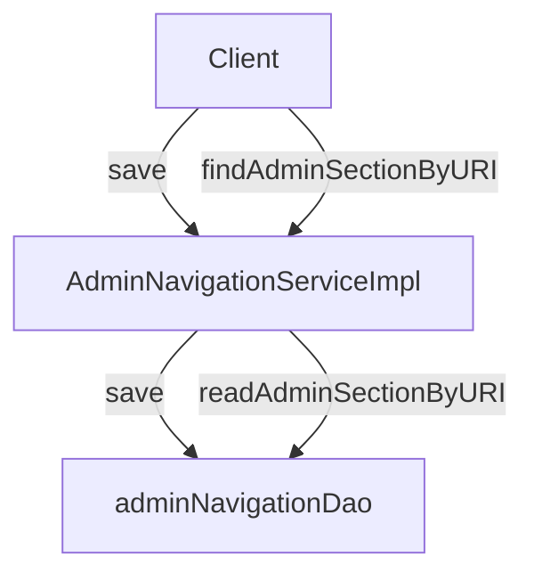

# Overview

The <SwmToken path="admin/broadleaf-open-admin-platform/src/main/java/org/broadleafcommerce/openadmin/server/security/service/AdminSecurityServiceImpl.java" pos="73:8:8" line-data="public class AdminSecurityServiceImpl implements AdminSecurityService {">`AdminSecurityService`</SwmToken> interface defines the contract for managing administrative security operations. It includes methods for reading, saving, and deleting admin users, roles, and permissions. The service also handles password management, including changing passwords and sending reset notifications.

<SwmSnippet path="/admin/broadleaf-open-admin-platform/src/main/java/org/broadleafcommerce/openadmin/server/security/service/AdminSecurityServiceImpl.java" line="18">

---

The <SwmToken path="admin/broadleaf-open-admin-platform/src/main/java/org/broadleafcommerce/openadmin/server/security/service/AdminSecurityServiceImpl.java" pos="73:4:4" line-data="public class AdminSecurityServiceImpl implements AdminSecurityService {">`AdminSecurityServiceImpl`</SwmToken> class uses various DAOs to interact with the database and manage security-related data. It also integrates with email services to send notifications for password resets and username reminders.

```java
package org.broadleafcommerce.openadmin.server.security.service;

import org.apache.commons.collections4.CollectionUtils;
import org.apache.commons.lang3.BooleanUtils;
import org.apache.commons.lang3.StringUtils;
import org.apache.commons.logging.Log;
import org.apache.commons.logging.LogFactory;
import org.broadleafcommerce.common.email.service.EmailService;
import org.broadleafcommerce.common.email.service.info.EmailInfo;
import org.broadleafcommerce.common.event.BroadleafApplicationEventPublisher;
import org.broadleafcommerce.common.extension.ExtensionResultHolder;
import org.broadleafcommerce.common.extension.ExtensionResultStatusType;
```

---

</SwmSnippet>

# Caching Mechanisms

The service includes caching mechanisms to improve performance and reduce database load. This ensures that frequently accessed data is quickly available, enhancing the overall efficiency of the system.

# Email Integration

Additionally, the service integrates with email services to send notifications for password resets and username reminders. This integration ensures that users are promptly informed about important security-related events.

# Row-Level Security

The <SwmToken path="admin/broadleaf-open-admin-platform/src/main/java/org/broadleafcommerce/openadmin/server/security/service/RowLevelSecurityServiceImpl.java" pos="43:18:18" line-data=" * @see org.broadleafcommerce.openadmin.server.security.service.RowLevelSecurityService">`RowLevelSecurityService`</SwmToken> is another example of a service that can be extended by the use of `RowLevelSecurityProviders`. This service manages row-level security operations, providing security to various CRUD operations in the admin.

<SwmSnippet path="/admin/broadleaf-open-admin-platform/src/main/java/org/broadleafcommerce/openadmin/server/security/service/RowLevelSecurityServiceImpl.java" line="18">

---

The <SwmToken path="admin/broadleaf-open-admin-platform/src/main/java/org/broadleafcommerce/openadmin/server/security/service/RowLevelSecurityServiceImpl.java" pos="48:4:4" line-data="public class RowLevelSecurityServiceImpl implements RowLevelSecurityService, ExceptionAwareRowLevelSecurityProvider {">`RowLevelSecurityServiceImpl`</SwmToken> class implements the <SwmToken path="admin/broadleaf-open-admin-platform/src/main/java/org/broadleafcommerce/openadmin/server/security/service/RowLevelSecurityServiceImpl.java" pos="43:18:18" line-data=" * @see org.broadleafcommerce.openadmin.server.security.service.RowLevelSecurityService">`RowLevelSecurityService`</SwmToken> interface and is annotated with <SwmToken path="admin/broadleaf-open-admin-platform/src/main/java/org/broadleafcommerce/openadmin/server/security/service/AdminSecurityServiceImpl.java" pos="72:0:1" line-data="@Service(&quot;blAdminSecurityService&quot;)">`@Service`</SwmToken> to indicate that it is a Spring-managed service. It provides the actual logic for row-level security operations.

```java
package org.broadleafcommerce.openadmin.server.security.service;

import org.apache.commons.collections.CollectionUtils;
import org.apache.commons.logging.Log;
import org.apache.commons.logging.LogFactory;
import org.broadleafcommerce.openadmin.dto.ClassMetadata;
import org.broadleafcommerce.openadmin.dto.Entity;
import org.broadleafcommerce.openadmin.dto.PersistencePackage;
import org.broadleafcommerce.openadmin.server.security.domain.AdminUser;
import org.broadleafcommerce.openadmin.server.service.persistence.module.criteria.FilterMapping;
import org.broadleafcommerce.openadmin.server.service.persistence.validation.GlobalValidationResult;
import org.springframework.stereotype.Service;
```

---

</SwmSnippet>

# Service Endpoints

The <SwmToken path="admin/broadleaf-open-admin-platform/src/main/java/org/broadleafcommerce/openadmin/server/security/service/AdminSecurityServiceImpl.java" pos="73:8:8" line-data="public class AdminSecurityServiceImpl implements AdminSecurityService {">`AdminSecurityService`</SwmToken> includes several service endpoints for managing admin sections.

<SwmSnippet path="/admin/broadleaf-open-admin-platform/src/main/java/org/broadleafcommerce/openadmin/server/security/service/navigation/AdminNavigationServiceImpl.java" line="97">

---

The <SwmToken path="admin/broadleaf-open-admin-platform/src/main/java/org/broadleafcommerce/openadmin/server/security/service/navigation/AdminNavigationServiceImpl.java" pos="97:5:5" line-data="    public AdminSection save(AdminSection adminSection) {">`save`</SwmToken> method is an endpoint used to save an <SwmToken path="admin/broadleaf-open-admin-platform/src/main/java/org/broadleafcommerce/openadmin/server/security/service/navigation/AdminNavigationServiceImpl.java" pos="97:3:3" line-data="    public AdminSection save(AdminSection adminSection) {">`AdminSection`</SwmToken> object. It interacts with the <SwmToken path="admin/broadleaf-open-admin-platform/src/main/java/org/broadleafcommerce/openadmin/server/security/service/navigation/AdminNavigationServiceImpl.java" pos="98:3:3" line-data="        return adminNavigationDao.save(adminSection);">`adminNavigationDao`</SwmToken> to persist the <SwmToken path="admin/broadleaf-open-admin-platform/src/main/java/org/broadleafcommerce/openadmin/server/security/service/navigation/AdminNavigationServiceImpl.java" pos="97:3:3" line-data="    public AdminSection save(AdminSection adminSection) {">`AdminSection`</SwmToken> to the database.

```java
    public AdminSection save(AdminSection adminSection) {
        return adminNavigationDao.save(adminSection);
    }
```

---

</SwmSnippet>

<SwmSnippet path="/admin/broadleaf-open-admin-platform/src/main/java/org/broadleafcommerce/openadmin/server/security/service/navigation/AdminNavigationServiceImpl.java" line="129">

---

The <SwmToken path="admin/broadleaf-open-admin-platform/src/main/java/org/broadleafcommerce/openadmin/server/security/service/navigation/AdminNavigationServiceImpl.java" pos="129:5:5" line-data="    public AdminSection findAdminSectionByURI(String uri) {">`findAdminSectionByURI`</SwmToken> method is an endpoint that retrieves an <SwmToken path="admin/broadleaf-open-admin-platform/src/main/java/org/broadleafcommerce/openadmin/server/security/service/navigation/AdminNavigationServiceImpl.java" pos="129:3:3" line-data="    public AdminSection findAdminSectionByURI(String uri) {">`AdminSection`</SwmToken> based on a given URI. It uses the <SwmToken path="admin/broadleaf-open-admin-platform/src/main/java/org/broadleafcommerce/openadmin/server/security/service/navigation/AdminNavigationServiceImpl.java" pos="130:3:3" line-data="        return adminNavigationDao.readAdminSectionByURI(uri);">`adminNavigationDao`</SwmToken> to query the database for the corresponding <SwmToken path="admin/broadleaf-open-admin-platform/src/main/java/org/broadleafcommerce/openadmin/server/security/service/navigation/AdminNavigationServiceImpl.java" pos="129:3:3" line-data="    public AdminSection findAdminSectionByURI(String uri) {">`AdminSection`</SwmToken>.

```java
    public AdminSection findAdminSectionByURI(String uri) {
        return adminNavigationDao.readAdminSectionByURI(uri);
    }
```

---

</SwmSnippet>

&nbsp;

*This is an auto-generated document by Swimm AI 🌊 and has not yet been verified by a human*

<SwmMeta version="3.0.0" repo-id="Z2l0aHViJTNBJTNBQnJvYWRsZWFmQ29tbWVyY2UtZGVtby1uZXclM0ElM0FTd2ltbS1EZW1v" repo-name="BroadleafCommerce-demo-new" doc-type="overview"><sup>Powered by [Swimm](/)</sup></SwmMeta>
