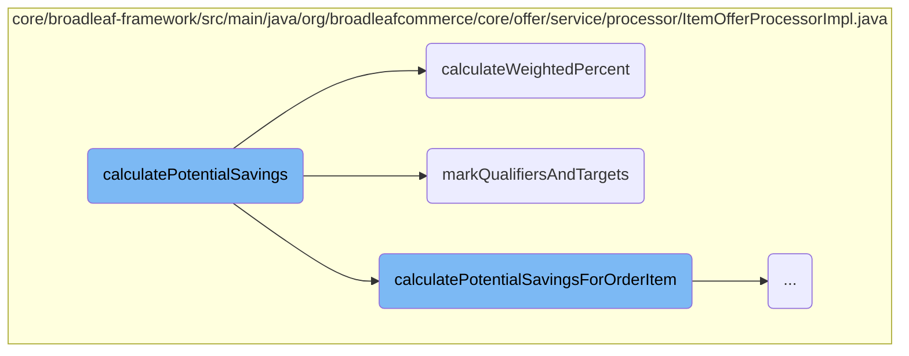

```mermaid
graph TD;
      subgraph core/broadleaf-framework/src/main/java/org/broadleafcommerce/core/offer/service
c88d0335c46fb2f5258893407d694f8956d47123d4b30ab01ea43356fa59ec3f(calculatePotentialSavingsForOrderItem):::mainFlowStyle --> 2372879dec7757afd654d49e4770ce4814dab5acd7b227804fa96635715e9278(calculateSavingsForOrderItem):::mainFlowStyle
end

subgraph core/broadleaf-framework/src/main/java/org/broadleafcommerce/core/offer/service
2372879dec7757afd654d49e4770ce4814dab5acd7b227804fa96635715e9278(calculateSavingsForOrderItem):::mainFlowStyle --> 086ccc207c32045c8e78bf216ebbbf8de00a7fc4edf176ee0680e36a8885aae8(computeAdjustmentValue)
end

subgraph core/broadleaf-framework/src/main/java/org/broadleafcommerce/core/offer/service
2372879dec7757afd654d49e4770ce4814dab5acd7b227804fa96635715e9278(calculateSavingsForOrderItem):::mainFlowStyle --> e9e191eaa01d98820fe7a07e4fd095ca23da80513e1628dd37a170c25ae48479(computeDiscountVariables):::mainFlowStyle
end

subgraph core/broadleaf-framework/src/main/java/org/broadleafcommerce/core/offer/service
e9e191eaa01d98820fe7a07e4fd095ca23da80513e1628dd37a170c25ae48479(computeDiscountVariables):::mainFlowStyle --> c3c1da55fc7215d35c103e78bd3c587d0f6c8da4d1ee212c260630aa5844ba5d(findMatchingOfferPriceData):::mainFlowStyle
end


      classDef mainFlowStyle color:#000000,fill:#7CB9F4
classDef rootsStyle color:#000000,fill:#00FFF4
classDef Style1 color:#000000,fill:#00FFAA
classDef Style2 color:#000000,fill:#FFFF00
classDef Style3 color:#000000,fill:#AA7CB9

%% Swimm:
%% graph TD;
%%       subgraph <SwmPath>[core/broadleaf-framework/src/main/java/org/broadleafcommerce/core/offer/service/](core/broadleaf-framework/src/main/java/org/broadleafcommerce/core/offer/service/)</SwmPath>
%% c88d0335c46fb2f5258893407d694f8956d47123d4b30ab01ea43356fa59ec3f(calculatePotentialSavingsForOrderItem):::mainFlowStyle --> 2372879dec7757afd654d49e4770ce4814dab5acd7b227804fa96635715e9278(calculateSavingsForOrderItem):::mainFlowStyle
%% end
%% 
%% subgraph <SwmPath>[core/broadleaf-framework/src/main/java/org/broadleafcommerce/core/offer/service/](core/broadleaf-framework/src/main/java/org/broadleafcommerce/core/offer/service/)</SwmPath>
%% 2372879dec7757afd654d49e4770ce4814dab5acd7b227804fa96635715e9278(calculateSavingsForOrderItem):::mainFlowStyle --> 086ccc207c32045c8e78bf216ebbbf8de00a7fc4edf176ee0680e36a8885aae8(computeAdjustmentValue)
%% end
%% 
%% subgraph <SwmPath>[core/broadleaf-framework/src/main/java/org/broadleafcommerce/core/offer/service/](core/broadleaf-framework/src/main/java/org/broadleafcommerce/core/offer/service/)</SwmPath>
%% 2372879dec7757afd654d49e4770ce4814dab5acd7b227804fa96635715e9278(calculateSavingsForOrderItem):::mainFlowStyle --> e9e191eaa01d98820fe7a07e4fd095ca23da80513e1628dd37a170c25ae48479(computeDiscountVariables):::mainFlowStyle
%% end
%% 
%% subgraph <SwmPath>[core/broadleaf-framework/src/main/java/org/broadleafcommerce/core/offer/service/](core/broadleaf-framework/src/main/java/org/broadleafcommerce/core/offer/service/)</SwmPath>
%% e9e191eaa01d98820fe7a07e4fd095ca23da80513e1628dd37a170c25ae48479(computeDiscountVariables):::mainFlowStyle --> c3c1da55fc7215d35c103e78bd3c587d0f6c8da4d1ee212c260630aa5844ba5d(findMatchingOfferPriceData):::mainFlowStyle
%% end
%% 
%% 
%%       classDef mainFlowStyle color:#000000,fill:#7CB9F4
%% classDef rootsStyle color:#000000,fill:#00FFF4
%% classDef Style1 color:#000000,fill:#00FFAA
%% classDef Style2 color:#000000,fill:#FFFF00
%% classDef Style3 color:#000000,fill:#AA7CB9
```

This document explains the process of applying and comparing order and item offers to determine the best possible discounts for a given order. The process involves calculating potential savings, determining the best permutation of offers, and applying the offers to the order.

The process starts by calculating the potential savings for each item offer. Then, it resets the uses of these offers and sorts them by priority and potential discount. If there are multiple item offers, it finds the best combination of these offers to maximize the discount. Finally, it applies all item offers and adjusts the order subtotal. If there are qualified order offers, it sorts and applies them as well to ensure the best discounts are applied to the order.

Here is a high level diagram of the flow, showing only the most important functions:

```mermaid
graph TD;
      subgraph core/broadleaf-framework/src/main/java/org/broadleafcommerce/core/offer/service
6ad59db79b1094f9269e5c2a12396101a030f1b7972f957e95227e832360dd59(applyAndCompareOrderAndItemOffers):::mainFlowStyle --> 188785f31de40b86ac53ad489ee12e33433f9af7840dff4a2ea103d32080dda8(determineBestPermutation)
end

subgraph core/broadleaf-framework/src/main/java/org/broadleafcommerce/core/offer/service
6ad59db79b1094f9269e5c2a12396101a030f1b7972f957e95227e832360dd59(applyAndCompareOrderAndItemOffers):::mainFlowStyle --> 3fc0806c7ce6019108ef51e4fb9511528d8e4cca1e81aa322478296c58c9b0d6(calculatePotentialSavings):::mainFlowStyle
end

subgraph core/broadleaf-framework/src/main/java/org/broadleafcommerce/core/offer/service
3fc0806c7ce6019108ef51e4fb9511528d8e4cca1e81aa322478296c58c9b0d6(calculatePotentialSavings):::mainFlowStyle --> 5982962fe4680dd4da98537e4cdbee212b25b99128e9708465deae45b3938409(calculateWeightedPercent)
end

subgraph core/broadleaf-framework/src/main/java/org/broadleafcommerce/core/offer/service
3fc0806c7ce6019108ef51e4fb9511528d8e4cca1e81aa322478296c58c9b0d6(calculatePotentialSavings):::mainFlowStyle --> 6ad929d48a3d627815b859d8ce703c41ff2d7e9649ebe351bede1e20e74eec6f(markQualifiersAndTargets)
end

subgraph core/broadleaf-framework/src/main/java/org/broadleafcommerce/core/offer/service
3fc0806c7ce6019108ef51e4fb9511528d8e4cca1e81aa322478296c58c9b0d6(calculatePotentialSavings):::mainFlowStyle --> c88d0335c46fb2f5258893407d694f8956d47123d4b30ab01ea43356fa59ec3f(calculatePotentialSavingsForOrderItem):::mainFlowStyle
end

subgraph core/broadleaf-framework/src/main/java/org/broadleafcommerce/core/offer/service
c88d0335c46fb2f5258893407d694f8956d47123d4b30ab01ea43356fa59ec3f(calculatePotentialSavingsForOrderItem):::mainFlowStyle --> 2372879dec7757afd654d49e4770ce4814dab5acd7b227804fa96635715e9278(calculateSavingsForOrderItem):::mainFlowStyle
end

subgraph core/broadleaf-framework/src/main/java/org/broadleafcommerce/core/offer/service
2372879dec7757afd654d49e4770ce4814dab5acd7b227804fa96635715e9278(calculateSavingsForOrderItem):::mainFlowStyle --> 086ccc207c32045c8e78bf216ebbbf8de00a7fc4edf176ee0680e36a8885aae8(computeAdjustmentValue)
end

subgraph core/broadleaf-framework/src/main/java/org/broadleafcommerce/core/offer/service
2372879dec7757afd654d49e4770ce4814dab5acd7b227804fa96635715e9278(calculateSavingsForOrderItem):::mainFlowStyle --> e9e191eaa01d98820fe7a07e4fd095ca23da80513e1628dd37a170c25ae48479(computeDiscountVariables):::mainFlowStyle
end

subgraph core/broadleaf-framework/src/main/java/org/broadleafcommerce/core/offer/service
e9e191eaa01d98820fe7a07e4fd095ca23da80513e1628dd37a170c25ae48479(computeDiscountVariables):::mainFlowStyle --> c3c1da55fc7215d35c103e78bd3c587d0f6c8da4d1ee212c260630aa5844ba5d(findMatchingOfferPriceData):::mainFlowStyle
end


      classDef mainFlowStyle color:#000000,fill:#7CB9F4
classDef rootsStyle color:#000000,fill:#00FFF4
classDef Style1 color:#000000,fill:#00FFAA
classDef Style2 color:#000000,fill:#FFFF00
classDef Style3 color:#000000,fill:#AA7CB9

%% Swimm:
%% graph TD;
%%       subgraph <SwmPath>[core/broadleaf-framework/src/main/java/org/broadleafcommerce/core/offer/service/](core/broadleaf-framework/src/main/java/org/broadleafcommerce/core/offer/service/)</SwmPath>
%% 6ad59db79b1094f9269e5c2a12396101a030f1b7972f957e95227e832360dd59(applyAndCompareOrderAndItemOffers):::mainFlowStyle --> 188785f31de40b86ac53ad489ee12e33433f9af7840dff4a2ea103d32080dda8(determineBestPermutation)
%% end
%% 
%% subgraph <SwmPath>[core/broadleaf-framework/src/main/java/org/broadleafcommerce/core/offer/service/](core/broadleaf-framework/src/main/java/org/broadleafcommerce/core/offer/service/)</SwmPath>
%% 6ad59db79b1094f9269e5c2a12396101a030f1b7972f957e95227e832360dd59(applyAndCompareOrderAndItemOffers):::mainFlowStyle --> 3fc0806c7ce6019108ef51e4fb9511528d8e4cca1e81aa322478296c58c9b0d6(calculatePotentialSavings):::mainFlowStyle
%% end
%% 
%% subgraph <SwmPath>[core/broadleaf-framework/src/main/java/org/broadleafcommerce/core/offer/service/](core/broadleaf-framework/src/main/java/org/broadleafcommerce/core/offer/service/)</SwmPath>
%% 3fc0806c7ce6019108ef51e4fb9511528d8e4cca1e81aa322478296c58c9b0d6(calculatePotentialSavings):::mainFlowStyle --> 5982962fe4680dd4da98537e4cdbee212b25b99128e9708465deae45b3938409(calculateWeightedPercent)
%% end
%% 
%% subgraph <SwmPath>[core/broadleaf-framework/src/main/java/org/broadleafcommerce/core/offer/service/](core/broadleaf-framework/src/main/java/org/broadleafcommerce/core/offer/service/)</SwmPath>
%% 3fc0806c7ce6019108ef51e4fb9511528d8e4cca1e81aa322478296c58c9b0d6(calculatePotentialSavings):::mainFlowStyle --> 6ad929d48a3d627815b859d8ce703c41ff2d7e9649ebe351bede1e20e74eec6f(markQualifiersAndTargets)
%% end
%% 
%% subgraph <SwmPath>[core/broadleaf-framework/src/main/java/org/broadleafcommerce/core/offer/service/](core/broadleaf-framework/src/main/java/org/broadleafcommerce/core/offer/service/)</SwmPath>
%% 3fc0806c7ce6019108ef51e4fb9511528d8e4cca1e81aa322478296c58c9b0d6(calculatePotentialSavings):::mainFlowStyle --> c88d0335c46fb2f5258893407d694f8956d47123d4b30ab01ea43356fa59ec3f(calculatePotentialSavingsForOrderItem):::mainFlowStyle
%% end
%% 
%% subgraph <SwmPath>[core/broadleaf-framework/src/main/java/org/broadleafcommerce/core/offer/service/](core/broadleaf-framework/src/main/java/org/broadleafcommerce/core/offer/service/)</SwmPath>
%% c88d0335c46fb2f5258893407d694f8956d47123d4b30ab01ea43356fa59ec3f(calculatePotentialSavingsForOrderItem):::mainFlowStyle --> 2372879dec7757afd654d49e4770ce4814dab5acd7b227804fa96635715e9278(calculateSavingsForOrderItem):::mainFlowStyle
%% end
%% 
%% subgraph <SwmPath>[core/broadleaf-framework/src/main/java/org/broadleafcommerce/core/offer/service/](core/broadleaf-framework/src/main/java/org/broadleafcommerce/core/offer/service/)</SwmPath>
%% 2372879dec7757afd654d49e4770ce4814dab5acd7b227804fa96635715e9278(calculateSavingsForOrderItem):::mainFlowStyle --> 086ccc207c32045c8e78bf216ebbbf8de00a7fc4edf176ee0680e36a8885aae8(computeAdjustmentValue)
%% end
%% 
%% subgraph <SwmPath>[core/broadleaf-framework/src/main/java/org/broadleafcommerce/core/offer/service/](core/broadleaf-framework/src/main/java/org/broadleafcommerce/core/offer/service/)</SwmPath>
%% 2372879dec7757afd654d49e4770ce4814dab5acd7b227804fa96635715e9278(calculateSavingsForOrderItem):::mainFlowStyle --> e9e191eaa01d98820fe7a07e4fd095ca23da80513e1628dd37a170c25ae48479(computeDiscountVariables):::mainFlowStyle
%% end
%% 
%% subgraph <SwmPath>[core/broadleaf-framework/src/main/java/org/broadleafcommerce/core/offer/service/](core/broadleaf-framework/src/main/java/org/broadleafcommerce/core/offer/service/)</SwmPath>
%% e9e191eaa01d98820fe7a07e4fd095ca23da80513e1628dd37a170c25ae48479(computeDiscountVariables):::mainFlowStyle --> c3c1da55fc7215d35c103e78bd3c587d0f6c8da4d1ee212c260630aa5844ba5d(findMatchingOfferPriceData):::mainFlowStyle
%% end
%% 
%% 
%%       classDef mainFlowStyle color:#000000,fill:#7CB9F4
%% classDef rootsStyle color:#000000,fill:#00FFF4
%% classDef Style1 color:#000000,fill:#00FFAA
%% classDef Style2 color:#000000,fill:#FFFF00
%% classDef Style3 color:#000000,fill:#AA7CB9
```



# Flow drill down

First, we'll zoom into this section of the flow:

```mermaid
graph TD;
      subgraph core/broadleaf-framework/src/main/java/org/broadleafcommerce/core/offer/service/processor/ItemOfferProcessorImpl.java
6ad59db79b1094f9269e5c2a12396101a030f1b7972f957e95227e832360dd59(applyAndCompareOrderAndItemOffers):::mainFlowStyle --> 188785f31de40b86ac53ad489ee12e33433f9af7840dff4a2ea103d32080dda8(determineBestPermutation)
end

subgraph core/broadleaf-framework/src/main/java/org/broadleafcommerce/core/offer/service/processor/ItemOfferProcessorImpl.java
6ad59db79b1094f9269e5c2a12396101a030f1b7972f957e95227e832360dd59(applyAndCompareOrderAndItemOffers):::mainFlowStyle --> 3fc0806c7ce6019108ef51e4fb9511528d8e4cca1e81aa322478296c58c9b0d6(calculatePotentialSavings):::mainFlowStyle
end

subgraph core/broadleaf-framework/src/main/java/org/broadleafcommerce/core/offer/service/processor/ItemOfferProcessorImpl.java
3fc0806c7ce6019108ef51e4fb9511528d8e4cca1e81aa322478296c58c9b0d6(calculatePotentialSavings):::mainFlowStyle --> t9la8(...)
end

subgraph core/broadleaf-framework/src/main/java/org/broadleafcommerce/core/offer/service/processor/ItemOfferProcessorImpl.java
188785f31de40b86ac53ad489ee12e33433f9af7840dff4a2ea103d32080dda8(determineBestPermutation) --> 1028ddec891b3f3a7a64859e85118cb934cef4b14dbf7dc91219de1cde2eb3ce(applyAllItemOffers)
end


      classDef mainFlowStyle color:#000000,fill:#7CB9F4
classDef rootsStyle color:#000000,fill:#00FFF4
classDef Style1 color:#000000,fill:#00FFAA
classDef Style2 color:#000000,fill:#FFFF00
classDef Style3 color:#000000,fill:#AA7CB9

%% Swimm:
%% graph TD;
%%       subgraph <SwmPath>[core/broadleaf-framework/src/main/java/org/broadleafcommerce/core/offer/service/processor/ItemOfferProcessorImpl.java](core/broadleaf-framework/src/main/java/org/broadleafcommerce/core/offer/service/processor/ItemOfferProcessorImpl.java)</SwmPath>
%% 6ad59db79b1094f9269e5c2a12396101a030f1b7972f957e95227e832360dd59(applyAndCompareOrderAndItemOffers):::mainFlowStyle --> 188785f31de40b86ac53ad489ee12e33433f9af7840dff4a2ea103d32080dda8(determineBestPermutation)
%% end
%% 
%% subgraph <SwmPath>[core/broadleaf-framework/src/main/java/org/broadleafcommerce/core/offer/service/processor/ItemOfferProcessorImpl.java](core/broadleaf-framework/src/main/java/org/broadleafcommerce/core/offer/service/processor/ItemOfferProcessorImpl.java)</SwmPath>
%% 6ad59db79b1094f9269e5c2a12396101a030f1b7972f957e95227e832360dd59(applyAndCompareOrderAndItemOffers):::mainFlowStyle --> 3fc0806c7ce6019108ef51e4fb9511528d8e4cca1e81aa322478296c58c9b0d6(calculatePotentialSavings):::mainFlowStyle
%% end
%% 
%% subgraph <SwmPath>[core/broadleaf-framework/src/main/java/org/broadleafcommerce/core/offer/service/processor/ItemOfferProcessorImpl.java](core/broadleaf-framework/src/main/java/org/broadleafcommerce/core/offer/service/processor/ItemOfferProcessorImpl.java)</SwmPath>
%% 3fc0806c7ce6019108ef51e4fb9511528d8e4cca1e81aa322478296c58c9b0d6(calculatePotentialSavings):::mainFlowStyle --> t9la8(...)
%% end
%% 
%% subgraph <SwmPath>[core/broadleaf-framework/src/main/java/org/broadleafcommerce/core/offer/service/processor/ItemOfferProcessorImpl.java](core/broadleaf-framework/src/main/java/org/broadleafcommerce/core/offer/service/processor/ItemOfferProcessorImpl.java)</SwmPath>
%% 188785f31de40b86ac53ad489ee12e33433f9af7840dff4a2ea103d32080dda8(determineBestPermutation) --> 1028ddec891b3f3a7a64859e85118cb934cef4b14dbf7dc91219de1cde2eb3ce(applyAllItemOffers)
%% end
%% 
%% 
%%       classDef mainFlowStyle color:#000000,fill:#7CB9F4
%% classDef rootsStyle color:#000000,fill:#00FFF4
%% classDef Style1 color:#000000,fill:#00FFAA
%% classDef Style2 color:#000000,fill:#FFFF00
%% classDef Style3 color:#000000,fill:#AA7CB9
```



<SwmSnippet path="/core/broadleaf-framework/src/main/java/org/broadleafcommerce/core/offer/service/processor/ItemOfferProcessorImpl.java" line="688">

---

## <SwmToken path="core/broadleaf-framework/src/main/java/org/broadleafcommerce/core/offer/service/processor/ItemOfferProcessorImpl.java" pos="690:5:5" line-data="    public void applyAndCompareOrderAndItemOffers(PromotableOrder order,">`applyAndCompareOrderAndItemOffers`</SwmToken>

The <SwmToken path="core/broadleaf-framework/src/main/java/org/broadleafcommerce/core/offer/service/processor/ItemOfferProcessorImpl.java" pos="690:5:5" line-data="    public void applyAndCompareOrderAndItemOffers(PromotableOrder order,">`applyAndCompareOrderAndItemOffers`</SwmToken> method is responsible for applying and comparing both order and item offers to determine the best possible discounts for a given order. It first calculates potential savings for item offers and resets their uses. Then, it sorts the item offers by priority and potential discount. If there are multiple item offers, it determines the best permutation of these offers using the <SwmToken path="core/broadleaf-framework/src/main/java/org/broadleafcommerce/core/offer/service/processor/ItemOfferProcessorImpl.java" pos="706:5:5" line-data="                qualifiedItemOffers = determineBestPermutation(qualifiedItemOffers, order);">`determineBestPermutation`</SwmToken> method. Finally, it applies all item offers and adjusts the order subtotal accordingly. If there are qualified order offers, it sorts and applies them as well, ensuring the best possible discounts are applied to the order.

```java
    @Override
    @SuppressWarnings("unchecked")
    public void applyAndCompareOrderAndItemOffers(PromotableOrder order,
            List<PromotableCandidateOrderOffer> qualifiedOrderOffers,
            List<PromotableCandidateItemOffer> qualifiedItemOffers) {
        if (!qualifiedItemOffers.isEmpty()) {
            calculatePotentialSavings(qualifiedItemOffers, order);
            
            //after savings have been calculated, uses will have been marked on offers which can effect
            //the actual application of those offers. Thus the uses for each item offer needs to be reset
            for (PromotableCandidateItemOffer itemOffer : qualifiedItemOffers) {
                itemOffer.resetUses();
            }
            
            // Sort order item offers by priority and potential total discount
            Collections.sort(qualifiedItemOffers, ItemOfferComparator.INSTANCE);
            
            if (qualifiedItemOffers.size() > 1) {
                qualifiedItemOffers = determineBestPermutation(qualifiedItemOffers, order);
            }

```

---

</SwmSnippet>

<SwmSnippet path="/core/broadleaf-framework/src/main/java/org/broadleafcommerce/core/offer/service/processor/ItemOfferProcessorImpl.java" line="628">

---

### <SwmToken path="core/broadleaf-framework/src/main/java/org/broadleafcommerce/core/offer/service/processor/ItemOfferProcessorImpl.java" pos="628:8:8" line-data="    protected List&lt;PromotableCandidateItemOffer&gt; determineBestPermutation(List&lt;PromotableCandidateItemOffer&gt; itemOffers, PromotableOrder order) {">`determineBestPermutation`</SwmToken>

The <SwmToken path="core/broadleaf-framework/src/main/java/org/broadleafcommerce/core/offer/service/processor/ItemOfferProcessorImpl.java" pos="628:8:8" line-data="    protected List&lt;PromotableCandidateItemOffer&gt; determineBestPermutation(List&lt;PromotableCandidateItemOffer&gt; itemOffers, PromotableOrder order) {">`determineBestPermutation`</SwmToken> method generates all possible permutations of item offers and removes duplicates. It then applies each permutation to the order to find the one that results in the lowest subtotal. This method ensures that the combination of item offers providing the maximum discount is selected.

```java
    protected List<PromotableCandidateItemOffer> determineBestPermutation(List<PromotableCandidateItemOffer> itemOffers, PromotableOrder order) {
        List<List<PromotableCandidateItemOffer>> permutations = buildItemOfferPermutations(itemOffers);
        removeDuplicatePermutations(permutations);
        List<PromotableCandidateItemOffer> bestOfferList = null;
        Money lowestSubtotal = null;
        if (permutations.size() > 1) {
            for (List<PromotableCandidateItemOffer> offerList : permutations) {
                for (PromotableCandidateItemOffer offer : offerList) {
                    offer.resetUses();
                }
                
                applyAllItemOffers(offerList, order);
                chooseSaleOrRetailAdjustments(order);
                Money testSubtotal = order.calculateSubtotalWithAdjustments();

                if (lowestSubtotal == null || testSubtotal.lessThan(lowestSubtotal)) {
                    lowestSubtotal = testSubtotal;
                    bestOfferList = offerList;
                }

                // clear price details
```

---

</SwmSnippet>

<SwmSnippet path="/core/broadleaf-framework/src/main/java/org/broadleafcommerce/core/offer/service/processor/ItemOfferProcessorImpl.java" line="157">

---

### <SwmToken path="core/broadleaf-framework/src/main/java/org/broadleafcommerce/core/offer/service/processor/ItemOfferProcessorImpl.java" pos="158:20:20" line-data="     * @see org.broadleafcommerce.core.offer.service.processor.ItemOfferProcessor#applyAllItemOffers(java.util.List, java.util.List)">`applyAllItemOffers`</SwmToken>

The <SwmToken path="core/broadleaf-framework/src/main/java/org/broadleafcommerce/core/offer/service/processor/ItemOfferProcessorImpl.java" pos="158:20:20" line-data="     * @see org.broadleafcommerce.core.offer.service.processor.ItemOfferProcessor#applyAllItemOffers(java.util.List, java.util.List)">`applyAllItemOffers`</SwmToken> method iterates through the list of candidate item offers and applies each one to the order if it meets the qualifying, target, and subtotal requirements. This method ensures that all applicable item offers are applied to the order, contributing to the overall discount.

```java
    /* (non-Javadoc)
     * @see org.broadleafcommerce.core.offer.service.processor.ItemOfferProcessor#applyAllItemOffers(java.util.List, java.util.List)
     */
    @Override
    public void applyAllItemOffers(List<PromotableCandidateItemOffer> itemOffers, PromotableOrder order) {
        // Iterate through the collection of CandidateItemOffers. Remember that each one is an offer that may apply to a
        // particular OrderItem.  Multiple CandidateItemOffers may contain a reference to the same OrderItem object.
        // The same offer may be applied to different Order Items
        
        for (PromotableCandidateItemOffer itemOffer : itemOffers) {
            if (orderMeetsQualifyingSubtotalRequirements(order, itemOffer)
                    && orderMeetsTargetSubtotalRequirements(order, itemOffer)
                    && orderMeetsSubtotalRequirements(order, itemOffer)) {
                applyItemOffer(order, itemOffer);
            }
        }
    }
```

---

</SwmSnippet>

Now, lets zoom into this section of the flow:



<SwmSnippet path="/core/broadleaf-framework/src/main/java/org/broadleafcommerce/core/offer/service/processor/ItemOfferProcessorImpl.java" line="457">

---

## <SwmToken path="core/broadleaf-framework/src/main/java/org/broadleafcommerce/core/offer/service/processor/ItemOfferProcessorImpl.java" pos="457:5:5" line-data="    protected void calculatePotentialSavings(List&lt;PromotableCandidateItemOffer&gt; itemOffers, PromotableOrder order) {">`calculatePotentialSavings`</SwmToken>

The <SwmToken path="core/broadleaf-framework/src/main/java/org/broadleafcommerce/core/offer/service/processor/ItemOfferProcessorImpl.java" pos="457:5:5" line-data="    protected void calculatePotentialSavings(List&lt;PromotableCandidateItemOffer&gt; itemOffers, PromotableOrder order) {">`calculatePotentialSavings`</SwmToken> method determines the potential savings for each item offer as if it was the only item offer being applied. It iterates through each item offer, calculates the potential savings, and sets the weighted percent saved based on the offer type.

```java
    protected void calculatePotentialSavings(List<PromotableCandidateItemOffer> itemOffers, PromotableOrder order) {
        if (itemOffers.size() > 1) {
            for (PromotableCandidateItemOffer itemOffer : itemOffers) {
                Money potentialSavings = new Money(order.getOrderCurrency());
                Offer offer = itemOffer.getOffer();
                BigDecimal calculatedWeightedPercent = new BigDecimal(0);
                markQualifiersAndTargets(order, itemOffer);
                for (PromotableOrderItemPriceDetail detail : order.getAllPromotableOrderItemPriceDetails()) {
                    PromotableOrderItem item = detail.getPromotableOrderItem();
                    for (PromotionDiscount discount : detail.getPromotionDiscounts()) {
                        Money itemSavings = calculatePotentialSavingsForOrderItem(itemOffer, item, discount.getQuantity());
                        potentialSavings = potentialSavings.add(itemSavings);
                        if (useCalculatePercent(offer)) {
                            BigDecimal discountPercent = calculatePercent(item.calculateTotalWithoutAdjustments(), itemSavings);
                            calculatedWeightedPercent = calculatedWeightedPercent.add(discountPercent);
                        } else if (hasQualifierAndQualifierRestricted(offer)) {
                            BigDecimal discountPercent = calculateWeightedPercent(discount, item, itemSavings);
                            calculatedWeightedPercent = calculatedWeightedPercent.add(discountPercent);
                        }
                    }
                    // Reset state back for next offer
```

---

</SwmSnippet>

<SwmSnippet path="/core/broadleaf-framework/src/main/java/org/broadleafcommerce/core/offer/service/processor/ItemOfferProcessorImpl.java" line="503">

---

### <SwmToken path="core/broadleaf-framework/src/main/java/org/broadleafcommerce/core/offer/service/processor/ItemOfferProcessorImpl.java" pos="503:5:5" line-data="    protected BigDecimal calculateWeightedPercent(PromotionDiscount discount, PromotableOrderItem item, Money itemSavings) {">`calculateWeightedPercent`</SwmToken>

The <SwmToken path="core/broadleaf-framework/src/main/java/org/broadleafcommerce/core/offer/service/processor/ItemOfferProcessorImpl.java" pos="503:5:5" line-data="    protected BigDecimal calculateWeightedPercent(PromotionDiscount discount, PromotableOrderItem item, Money itemSavings) {">`calculateWeightedPercent`</SwmToken> method computes the weighted percentage of savings for a given discount. It takes into account the subtotal of the affected items and any qualifiers, then calculates the percentage based on the item savings.

```java
    protected BigDecimal calculateWeightedPercent(PromotionDiscount discount, PromotableOrderItem item, Money itemSavings) {
        Money effectedItemsSubtotal = item.getPriceBeforeAdjustments(discount.getPromotion().getApplyDiscountToSalePrice());
        for (PromotableOrderItemPriceDetail itemPriceDetail : item.getPromotableOrderItemPriceDetails()) {
            for (PromotionQualifier qualifierDetail : itemPriceDetail.getPromotionQualifiers()) {
                Integer qualifierQuantity = qualifierDetail.getFinalizedQuantity();
                effectedItemsSubtotal = effectedItemsSubtotal.add(qualifierDetail.getPrice().multiply(qualifierQuantity));
            }
        }

        return calculatePercent(effectedItemsSubtotal, itemSavings);
    }
```

---

</SwmSnippet>

<SwmSnippet path="/core/broadleaf-framework/src/main/java/org/broadleafcommerce/core/offer/service/processor/ItemOfferProcessorImpl.java" line="532">

---

### <SwmToken path="core/broadleaf-framework/src/main/java/org/broadleafcommerce/core/offer/service/processor/ItemOfferProcessorImpl.java" pos="532:5:5" line-data="    protected void markQualifiersAndTargets(PromotableOrder order, PromotableCandidateItemOffer itemOffer) {">`markQualifiersAndTargets`</SwmToken>

The <SwmToken path="core/broadleaf-framework/src/main/java/org/broadleafcommerce/core/offer/service/processor/ItemOfferProcessorImpl.java" pos="532:5:5" line-data="    protected void markQualifiersAndTargets(PromotableOrder order, PromotableCandidateItemOffer itemOffer) {">`markQualifiersAndTargets`</SwmToken> method identifies and marks the qualifiers and targets for a given item offer within an order. It ensures that the necessary conditions for the offer are met and finalizes the quantities if a match is found.

```java
    protected void markQualifiersAndTargets(PromotableOrder order, PromotableCandidateItemOffer itemOffer) {
        boolean matchFound = true;

        int count = 1;
        do {
            boolean qualifiersFound = false;
            boolean targetsFound = false;

            if (itemOffer.getOffer().getRequiresRelatedTargetAndQualifiers()) {
                boolean qualifiersAndTargetsFound = markRelatedQualifiersAndTargets(itemOffer, order);
                qualifiersFound = qualifiersAndTargetsFound;
                targetsFound = qualifiersAndTargetsFound;
            } else {
                qualifiersFound = markQualifiers(itemOffer, order);
                targetsFound = markTargets(itemOffer, order, null);
            }

            if (qualifiersFound && targetsFound) {
                finalizeQuantities(order.getAllPromotableOrderItemPriceDetails());
            } else {
                clearAllNonFinalizedQuantities(order.getAllPromotableOrderItemPriceDetails());
```

---

</SwmSnippet>

Now, lets zoom into this section of the flow:



<SwmSnippet path="/core/broadleaf-framework/src/main/java/org/broadleafcommerce/core/offer/service/processor/ItemOfferProcessorImpl.java" line="418">

---

## <SwmToken path="core/broadleaf-framework/src/main/java/org/broadleafcommerce/core/offer/service/processor/ItemOfferProcessorImpl.java" pos="425:5:5" line-data="    protected Money calculatePotentialSavingsForOrderItem(PromotableCandidateItemOffer itemOffer,">`calculatePotentialSavingsForOrderItem`</SwmToken>

The <SwmToken path="core/broadleaf-framework/src/main/java/org/broadleafcommerce/core/offer/service/processor/ItemOfferProcessorImpl.java" pos="425:5:5" line-data="    protected Money calculatePotentialSavingsForOrderItem(PromotableCandidateItemOffer itemOffer,">`calculatePotentialSavingsForOrderItem`</SwmToken> method is responsible for determining the potential savings for a given order item based on the applicable offers. It first checks if there is an extension manager to handle custom savings calculations. If so, it uses the extension manager to calculate potential savings and updates the context map accordingly. If no custom savings are provided, it checks if the item is an add-on and whether the offer can apply to child items. If the offer cannot apply to child items, it returns zero savings. Otherwise, it delegates the calculation to the <SwmToken path="core/broadleaf-framework/src/main/java/org/broadleafcommerce/core/offer/service/discount/domain/PromotableOfferUtilityImpl.java" pos="113:5:5" line-data="    public Money calculateSavingsForOrderItem(PromotableCandidateItemOffer promotableCandidateItemOffer, PromotableOrderItem promotableOrderItem, int qtyToReceiveSavings) {">`calculateSavingsForOrderItem`</SwmToken> method.

```java
    /**
     * Provide an opportunity to for modules to override the potentialSavingsCalculation 
     * @param itemOffer
     * @param item
     * @param quantity
     * @return
     */
    protected Money calculatePotentialSavingsForOrderItem(PromotableCandidateItemOffer itemOffer,
            PromotableOrderItem item, int quantity) {
        if (extensionManager != null) {
            Map<String,Object> contextMap = new HashMap<String,Object>();
            extensionManager.calculatePotentialSavings(itemOffer, item, quantity, contextMap);

            // If the extensionHandler added a savings element to the map, then return it 
            Object o = contextMap.get("savings");
            if (o != null && o instanceof Money) {
                return (Money) o;
            }
            
            // If the extensionHandler added a quantity element to the map, then return it 
            o = contextMap.get("quantity");
```

---

</SwmSnippet>

<SwmSnippet path="/core/broadleaf-framework/src/main/java/org/broadleafcommerce/core/offer/service/discount/domain/PromotableOfferUtilityImpl.java" line="112">

---

### <SwmToken path="core/broadleaf-framework/src/main/java/org/broadleafcommerce/core/offer/service/discount/domain/PromotableOfferUtilityImpl.java" pos="113:5:5" line-data="    public Money calculateSavingsForOrderItem(PromotableCandidateItemOffer promotableCandidateItemOffer, PromotableOrderItem promotableOrderItem, int qtyToReceiveSavings) {">`calculateSavingsForOrderItem`</SwmToken>

The <SwmToken path="core/broadleaf-framework/src/main/java/org/broadleafcommerce/core/offer/service/discount/domain/PromotableOfferUtilityImpl.java" pos="113:5:5" line-data="    public Money calculateSavingsForOrderItem(PromotableCandidateItemOffer promotableCandidateItemOffer, PromotableOrderItem promotableOrderItem, int qtyToReceiveSavings) {">`calculateSavingsForOrderItem`</SwmToken> method calculates the actual savings for an order item by determining the original price and computing the discount variables. It then calculates the adjustment value based on these variables and multiplies it by the quantity to receive the total savings.

```java
    @Override
    public Money calculateSavingsForOrderItem(PromotableCandidateItemOffer promotableCandidateItemOffer, PromotableOrderItem promotableOrderItem, int qtyToReceiveSavings) {
        Offer offer = promotableCandidateItemOffer.getOffer();
        Money originalPrice = promotableOrderItem.getPriceBeforeAdjustments(offer.getApplyDiscountToSalePrice());
        BroadleafCurrency currency = promotableOrderItem.getCurrency();
        Tuple<OfferDiscountType, BigDecimal> discountVariables = computeDiscountVariables(promotableCandidateItemOffer, promotableOrderItem, qtyToReceiveSavings);
        Money savings = computeAdjustmentValue(originalPrice, discountVariables.getSecond(), currency, discountVariables.getFirst(), promotableCandidateItemOffer);
        return savings.multiply(qtyToReceiveSavings);
    }
```

---

</SwmSnippet>

<SwmSnippet path="/core/broadleaf-framework/src/main/java/org/broadleafcommerce/core/offer/service/discount/domain/PromotableOfferUtilityImpl.java" line="76">

---

### <SwmToken path="core/broadleaf-framework/src/main/java/org/broadleafcommerce/core/offer/service/discount/domain/PromotableOfferUtilityImpl.java" pos="77:5:5" line-data="    public Money computeAdjustmentValue(PromotableCandidateFulfillmentGroupOffer promotableCandidateFulfillmentGroupOffer, PromotableFulfillmentGroup promotableFulfillmentGroup, boolean allowSalePrice) {">`computeAdjustmentValue`</SwmToken>

The <SwmToken path="core/broadleaf-framework/src/main/java/org/broadleafcommerce/core/offer/service/discount/domain/PromotableOfferUtilityImpl.java" pos="77:5:5" line-data="    public Money computeAdjustmentValue(PromotableCandidateFulfillmentGroupOffer promotableCandidateFulfillmentGroupOffer, PromotableFulfillmentGroup promotableFulfillmentGroup, boolean allowSalePrice) {">`computeAdjustmentValue`</SwmToken> method computes the adjustment value for a given offer by determining the current price detail value, the offer unit value, and the discount type. It then calculates the adjustment value based on these parameters.

```java
    @Override
    public Money computeAdjustmentValue(PromotableCandidateFulfillmentGroupOffer promotableCandidateFulfillmentGroupOffer, PromotableFulfillmentGroup promotableFulfillmentGroup, boolean allowSalePrice) {
        Money currentPriceDetailValue = promotableFulfillmentGroup.calculatePriceWithAdjustments(allowSalePrice);
        Offer offer = promotableCandidateFulfillmentGroupOffer.getOffer();
        BroadleafCurrency currency = promotableFulfillmentGroup.getFulfillmentGroup().getOrder().getCurrency();
        BigDecimal offerUnitValue = determineOfferUnitValue(offer, null);
        OfferDiscountType discountType = offer.getDiscountType();
        return computeAdjustmentValue(currentPriceDetailValue, offerUnitValue, currency, discountType, promotableCandidateFulfillmentGroupOffer);
    }
```

---

</SwmSnippet>

<SwmSnippet path="/core/broadleaf-framework/src/main/java/org/broadleafcommerce/core/offer/service/discount/domain/PromotableOfferUtilityImpl.java" line="122">

---

### <SwmToken path="core/broadleaf-framework/src/main/java/org/broadleafcommerce/core/offer/service/discount/domain/PromotableOfferUtilityImpl.java" pos="129:11:11" line-data="    protected Tuple&lt;OfferDiscountType, BigDecimal&gt; computeDiscountVariables(PromotableCandidateItemOffer promotableCandidateItemOffer, PromotableOrderItem promotableOrderItem, int quantity) {">`computeDiscountVariables`</SwmToken>

The <SwmToken path="core/broadleaf-framework/src/main/java/org/broadleafcommerce/core/offer/service/discount/domain/PromotableOfferUtilityImpl.java" pos="129:11:11" line-data="    protected Tuple&lt;OfferDiscountType, BigDecimal&gt; computeDiscountVariables(PromotableCandidateItemOffer promotableCandidateItemOffer, PromotableOrderItem promotableOrderItem, int quantity) {">`computeDiscountVariables`</SwmToken> method computes the discount type and unit value for a given order item. It checks if the offer uses a list for discounts and if there are fixed target maps. If so, it finds the matching offer price data. Otherwise, it determines the discount type and unit value based on the offer details.

```java
    /**
     * Computes the discount type and unit value for the given PromotableOrderItem.
     * @param promotableCandidateItemOffer
     * @param promotableOrderItem
     * @param quantity
     * @return
     */
    protected Tuple<OfferDiscountType, BigDecimal> computeDiscountVariables(PromotableCandidateItemOffer promotableCandidateItemOffer, PromotableOrderItem promotableOrderItem, int quantity) {
        Offer offer = promotableCandidateItemOffer.getOffer();
        BigDecimal offerUnitValue;
        OfferDiscountType discountType;
        if (BooleanUtils.isTrue(offer.getUseListForDiscounts()) && MapUtils.isNotEmpty(promotableCandidateItemOffer.getCandidateFixedTargetsMap())) {
            OfferPriceData offerPriceData = findMatchingOfferPriceData(promotableCandidateItemOffer, promotableOrderItem);
            discountType = offerPriceData.getDiscountType();
            offerUnitValue = offerPriceData.getAmount();
        } else {
            discountType = offer.getDiscountType();
            offerUnitValue = determineOfferUnitValue(offer, promotableCandidateItemOffer.calculateTargetQuantityForTieredOffer());
        }
        return new Tuple<>(discountType, offerUnitValue);
    }
```

---

</SwmSnippet>

<SwmSnippet path="/core/broadleaf-framework/src/main/java/org/broadleafcommerce/core/offer/service/discount/domain/PromotableOfferUtilityImpl.java" line="144">

---

### <SwmToken path="core/broadleaf-framework/src/main/java/org/broadleafcommerce/core/offer/service/discount/domain/PromotableOfferUtilityImpl.java" pos="144:5:5" line-data="    protected OfferPriceData findMatchingOfferPriceData(PromotableCandidateItemOffer promotableCandidateItemOffer, PromotableOrderItem orderItem) {">`findMatchingOfferPriceData`</SwmToken>

The <SwmToken path="core/broadleaf-framework/src/main/java/org/broadleafcommerce/core/offer/service/discount/domain/PromotableOfferUtilityImpl.java" pos="144:5:5" line-data="    protected OfferPriceData findMatchingOfferPriceData(PromotableCandidateItemOffer promotableCandidateItemOffer, PromotableOrderItem orderItem) {">`findMatchingOfferPriceData`</SwmToken> method iterates over the candidate fixed targets map to find the matching offer price data for a given order item. If a match is found, it returns the corresponding offer price data.

```java
    protected OfferPriceData findMatchingOfferPriceData(PromotableCandidateItemOffer promotableCandidateItemOffer, PromotableOrderItem orderItem) {
        for (OfferPriceData offerPriceData : promotableCandidateItemOffer.getCandidateFixedTargetsMap().keySet()) {
            if (itemMatchesOfferPriceData(offerPriceData, orderItem)) {
                return offerPriceData;
            }
        }
        return null;
    }
```

---

</SwmSnippet>

&nbsp;

*This is an auto-generated document by Swimm AI 🌊 and has not yet been verified by a human*

<SwmMeta version="3.0.0" repo-id="Z2l0aHViJTNBJTNBQnJvYWRsZWFmQ29tbWVyY2UtZGVtby1uZXclM0ElM0FTd2ltbS1EZW1v" repo-name="BroadleafCommerce-demo-new" doc-type="flows"><sup>Powered by [Swimm](/)</sup></SwmMeta>
