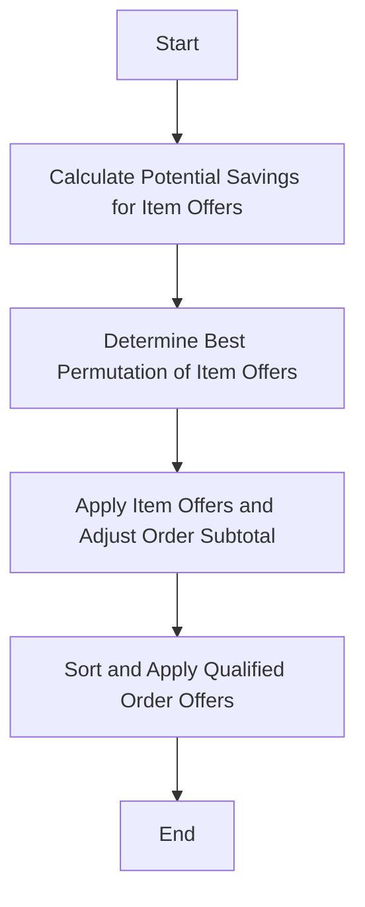

This document will cover the process of applying and comparing order and item offers to determine the best possible discounts for a given order. We'll cover:

1. Calculating potential savings for item offers
2. Determining the best permutation of item offers
3. Applying item offers and adjusting the order subtotal
4. Sorting and applying qualified order offers

Technical document: <SwmLink doc-title="Applying and Comparing Order and Item Offers">[Applying and Comparing Order and Item Offers](/.swm/applying-and-comparing-order-and-item-offers.gc3s5bov.sw.md)</SwmLink>

# [Calculating Potential Savings for Item Offers](https://app.swimm.io/repos/Z2l0aHViJTNBJTNBQnJvYWRsZWFmQ29tbWVyY2UtZGVtby1uZXclM0ElM0FTd2ltbS1EZW1v/docs/gc3s5bov#calculatepotentialsavings)

The process begins by calculating the potential savings for each item offer. This involves iterating through each item offer and determining the savings as if it were the only offer being applied. The potential savings are calculated based on the offer type and the items in the order. This step ensures that we have a clear understanding of the maximum possible discount each item offer can provide.

# [Determining the Best Permutation of Item Offers](https://app.swimm.io/repos/Z2l0aHViJTNBJTNBQnJvYWRsZWFmQ29tbWVyY2UtZGVtby1uZXclM0ElM0FTd2ltbS1EZW1v/docs/gc3s5bov#determinebestpermutation)

Once the potential savings are calculated, the next step is to determine the best permutation of item offers. This involves generating all possible combinations of the item offers and applying each combination to the order to find the one that results in the lowest subtotal. This step ensures that the combination of item offers providing the maximum discount is selected.

# [Applying Item Offers and Adjusting the Order Subtotal](https://app.swimm.io/repos/Z2l0aHViJTNBJTNBQnJvYWRsZWFmQ29tbWVyY2UtZGVtby1uZXclM0ElM0FTd2ltbS1EZW1v/docs/gc3s5bov#applyallitemoffers)

After determining the best permutation of item offers, the next step is to apply these offers to the order. This involves iterating through the list of item offers and applying each one to the order if it meets the qualifying, target, and subtotal requirements. This step ensures that all applicable item offers are applied to the order, contributing to the overall discount. The order subtotal is then adjusted accordingly.

# [Sorting and Applying Qualified Order Offers](https://app.swimm.io/repos/Z2l0aHViJTNBJTNBQnJvYWRsZWFmQ29tbWVyY2UtZGVtby1uZXclM0ElM0FTd2ltbS1EZW1v/docs/gc3s5bov#applyandcompareorderanditemoffers)

Finally, if there are qualified order offers, they are sorted and applied to the order. This step ensures that the best possible discounts are applied to the order by considering both item and order offers. The order offers are sorted by priority and potential discount, and then applied to the order to maximize the overall savings.

&nbsp;

*This is an auto-generated document by Swimm AI 🌊 and has not yet been verified by a human*

<SwmMeta version="3.0.0" repo-id="Z2l0aHViJTNBJTNBQnJvYWRsZWFmQ29tbWVyY2UtZGVtby1uZXclM0ElM0FTd2ltbS1EZW1v" repo-name="BroadleafCommerce-demo-new" doc-type="product-flows">Powered by [Swimm](/)</SwmMeta>
