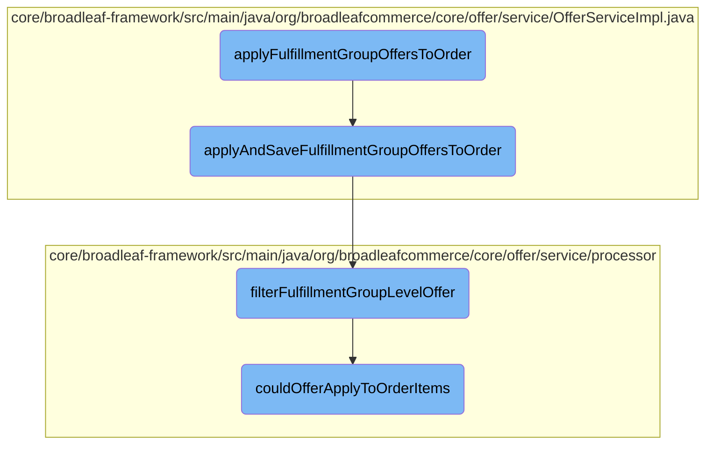

In this document, we will explain the process of applying fulfillment group offers to an order. The process involves filtering applicable offers, checking their applicability to order items, and then applying the qualified offers to the order.

The flow is straightforward and involves three main steps: filtering the offers to find those that can be applied to fulfillment groups, checking if these offers can be applied to the items in the order, and finally applying the qualified offers to the order to update its subtotal and finalize item prices.

# Flow drill down



<SwmSnippet path="/core/broadleaf-framework/src/main/java/org/broadleafcommerce/core/offer/service/OfferServiceImpl.java" line="488">

---

## Filtering and Applying Fulfillment Group Offers

The <SwmToken path="core/broadleaf-framework/src/main/java/org/broadleafcommerce/core/offer/service/OfferServiceImpl.java" pos="490:5:5" line-data="    public Order applyAndSaveFulfillmentGroupOffersToOrder(List&lt;Offer&gt; offers, Order order) throws PricingException {">`applyAndSaveFulfillmentGroupOffersToOrder`</SwmToken> method is responsible for filtering and applying fulfillment group offers to an order. It first creates a promotable order and filters the offers to find those applicable to fulfillment groups. It then processes these offers and applies them to the order, updating the order's subtotal and finalizing item prices.

```java
    @Override
    @Transactional("blTransactionManager")
    public Order applyAndSaveFulfillmentGroupOffersToOrder(List<Offer> offers, Order order) throws PricingException {
        OfferContext offerContext = OfferContext.getOfferContext();
        if (offerContext == null || offerContext.executePromotionCalculation) {
            PromotableOrder promotableOrder =
                    promotableItemFactory.createPromotableOrder(order, true);
            List<Offer> possibleFGOffers = new ArrayList<Offer>();
            for (Offer offer : offers) {
                if (offer.getType().getType().equals(OfferType.FULFILLMENT_GROUP.getType())) {
                    possibleFGOffers.add(offer);
                }
            }
            List<Offer> filteredOffers = orderOfferProcessor.filterOffers(possibleFGOffers, order.getCustomer());
            List<PromotableCandidateFulfillmentGroupOffer> qualifiedFGOffers = new ArrayList<PromotableCandidateFulfillmentGroupOffer>();
            for (Offer offer : filteredOffers) {
                fulfillmentGroupOfferProcessor.filterFulfillmentGroupLevelOffer(promotableOrder, qualifiedFGOffers, offer);
            }
            if (!qualifiedFGOffers.isEmpty()) {
                fulfillmentGroupOfferProcessor.applyAllFulfillmentGroupOffers(qualifiedFGOffers, promotableOrder);
                fulfillmentGroupOfferProcessor.calculateFulfillmentGroupTotal(promotableOrder);
```

---

</SwmSnippet>

<SwmSnippet path="/core/broadleaf-framework/src/main/java/org/broadleafcommerce/core/offer/service/processor/FulfillmentGroupOfferProcessorImpl.java" line="63">

---

### Filtering Fulfillment Group Level Offers

The <SwmToken path="core/broadleaf-framework/src/main/java/org/broadleafcommerce/core/offer/service/processor/FulfillmentGroupOfferProcessorImpl.java" pos="64:5:5" line-data="    public void filterFulfillmentGroupLevelOffer(PromotableOrder order, List&lt;PromotableCandidateFulfillmentGroupOffer&gt; qualifiedFGOffers, Offer offer) {">`filterFulfillmentGroupLevelOffer`</SwmToken> method filters offers at the fulfillment group level. It checks if an offer can be applied to the order or specific items within the order. If the offer qualifies, it creates a candidate fulfillment group offer and adds it to the list of qualified offers.

```java
    @Override
    public void filterFulfillmentGroupLevelOffer(PromotableOrder order, List<PromotableCandidateFulfillmentGroupOffer> qualifiedFGOffers, Offer offer) {
        for (PromotableFulfillmentGroup fulfillmentGroup : order.getFulfillmentGroups()) {
            boolean fgLevelQualification = false;
            fgQualification: {
                // handle legacy fields in addition to the 1.5 order rule field
                if (couldOfferApplyToOrder(offer, order, fulfillmentGroup)) {
                    fgLevelQualification = true;
                    break fgQualification;
                }
                for (PromotableOrderItem discreteOrderItem : order.getAllOrderItems()) {
                    if (couldOfferApplyToOrder(offer, order, discreteOrderItem, fulfillmentGroup)) {
                        fgLevelQualification = true;
                        break fgQualification;
                    }
                }
            }
            if (fgLevelQualification) {
                fgLevelQualification = false;
                // handle 1.5 FG field
                if (couldOfferApplyToFulfillmentGroup(offer, fulfillmentGroup)) {
```

---

</SwmSnippet>

<SwmSnippet path="/core/broadleaf-framework/src/main/java/org/broadleafcommerce/core/offer/service/processor/AbstractBaseProcessor.java" line="86">

---

### Checking Offer Applicability to Order Items

The <SwmToken path="core/broadleaf-framework/src/main/java/org/broadleafcommerce/core/offer/service/processor/AbstractBaseProcessor.java" pos="86:5:5" line-data="    protected CandidatePromotionItems couldOfferApplyToOrderItems(Offer offer, List&lt;PromotableOrderItem&gt; promotableOrderItems) {">`couldOfferApplyToOrderItems`</SwmToken> method checks if an offer can be applied to the items in the order. It evaluates the offer's criteria against the order items and determines if the items meet the offer's requirements. If the criteria are met, the method returns a list of candidate promotion items.

```java
    protected CandidatePromotionItems couldOfferApplyToOrderItems(Offer offer, List<PromotableOrderItem> promotableOrderItems) {
        CandidatePromotionItems candidates = new CandidatePromotionItems();
        if (offer.getQualifyingItemCriteriaXref() == null || offer.getQualifyingItemCriteriaXref().size() == 0) {
            candidates.setMatchedQualifier(true);
        } else {
            for (OfferQualifyingCriteriaXref criteriaXref : offer.getQualifyingItemCriteriaXref()) {
                if (criteriaXref.getOfferItemCriteria() != null) {
                    checkForItemRequirements(offer, candidates, criteriaXref.getOfferItemCriteria(), promotableOrderItems, true);
                    if (!candidates.isMatchedQualifier()) {
                        break;
                    }
                }
            }           
        }

        if (offer.getType().equals(OfferType.ORDER_ITEM) && BooleanUtils.isTrue(offer.getUseListForDiscounts())) {
            for (OfferPriceData offerPriceData : offer.getOfferPriceData()) {
                PromotableOrderItem qualifyingOrderItem = findQualifyingItemForPriceData(offerPriceData, promotableOrderItems);
                if (qualifyingOrderItem != null) {
                    candidates.addFixedTarget(offerPriceData, qualifyingOrderItem);
                    candidates.setMatchedTarget(true);
```

---

</SwmSnippet>

&nbsp;

*This is an auto-generated document by Swimm AI 🌊 and has not yet been verified by a human*

<SwmMeta version="3.0.0" repo-id="Z2l0aHViJTNBJTNBQnJvYWRsZWFmQ29tbWVyY2UtZGVtby1uZXclM0ElM0FTd2ltbS1EZW1v" repo-name="BroadleafCommerce-demo-new" doc-type="flows"><sup>Powered by [Swimm](/)</sup></SwmMeta>
