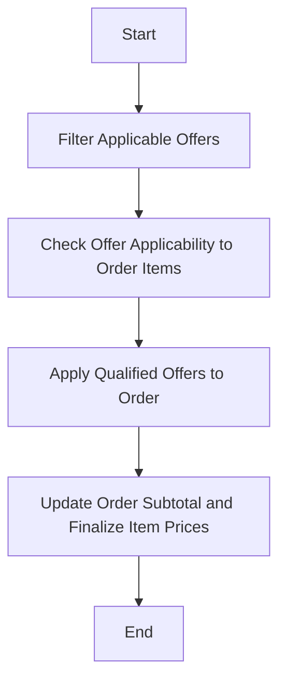

This document will cover the process of applying fulfillment group offers to an order. We'll cover:

1. Filtering applicable offers
2. Checking offer applicability to order items
3. Applying qualified offers to the order.

Technical document: <SwmLink doc-title="Applying Fulfillment Group Offers">[Applying Fulfillment Group Offers](/.swm/applying-fulfillment-group-offers.9np7e11b.sw.md)</SwmLink>

# [Filtering Applicable Offers](https://app.swimm.io/repos/Z2l0aHViJTNBJTNBQnJvYWRsZWFmQ29tbWVyY2UtZGVtby1uZXclM0ElM0FTd2ltbS1EZW1v/docs/9np7e11b#filtering-and-applying-fulfillment-group-offers)

The first step in applying fulfillment group offers is to filter the offers to find those that can be applied to fulfillment groups. This involves creating a promotable order and then filtering the list of offers to identify those that are applicable to fulfillment groups. This step ensures that only relevant offers are considered for the next steps.

# [Checking Offer Applicability to Order Items](https://app.swimm.io/repos/Z2l0aHViJTNBJTNBQnJvYWRsZWFmQ29tbWVyY2UtZGVtby1uZXclM0ElM0FTd2ltbS1EZW1v/docs/9np7e11b#checking-offer-applicability-to-order-items)

Once the applicable offers are filtered, the next step is to check if these offers can be applied to the items in the order. This involves evaluating the offer's criteria against the order items to determine if the items meet the offer's requirements. If the criteria are met, the offer is considered applicable to the order items.

# [Applying Qualified Offers to the Order](https://app.swimm.io/repos/Z2l0aHViJTNBJTNBQnJvYWRsZWFmQ29tbWVyY2UtZGVtby1uZXclM0ElM0FTd2ltbS1EZW1v/docs/9np7e11b#filtering-fulfillment-group-level-offers)

After identifying the offers that can be applied to the order items, the next step is to apply these qualified offers to the order. This involves updating the order's subtotal and finalizing the item prices based on the applied offers. This step ensures that the order reflects the discounts and promotions provided by the fulfillment group offers.

&nbsp;

*This is an auto-generated document by Swimm AI 🌊 and has not yet been verified by a human*

<SwmMeta version="3.0.0" repo-id="Z2l0aHViJTNBJTNBQnJvYWRsZWFmQ29tbWVyY2UtZGVtby1uZXclM0ElM0FTd2ltbS1EZW1v" repo-name="BroadleafCommerce-demo-new" doc-type="product-flows">Powered by [Swimm](/)</SwmMeta>
