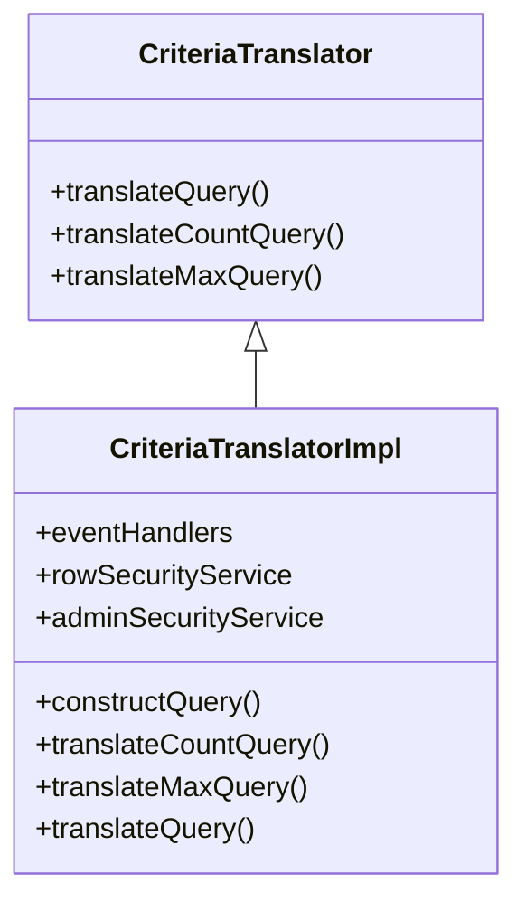

# Basic Concepts of Criteria

Criteria refers to the set of conditions or filters applied to database queries to retrieve specific data. They are used to translate high-level query requirements into JPA <SwmToken path="admin/broadleaf-open-admin-platform/src/main/java/org/broadleafcommerce/openadmin/server/service/persistence/module/criteria/CriteriaTranslator.java" pos="31:1:1" line-data="    TypedQuery&lt;Serializable&gt; translateQuery(DynamicEntityDao dynamicEntityDao, String ceilingEntity, List&lt;FilterMapping&gt; filterMappings, Integer firstResult, Integer maxResults);">`TypedQuery`</SwmToken> instances.

<SwmSnippet path="/admin/broadleaf-open-admin-platform/src/main/java/org/broadleafcommerce/openadmin/server/service/persistence/module/criteria/CriteriaTranslator.java" line="26">

---

## <SwmToken path="admin/broadleaf-open-admin-platform/src/main/java/org/broadleafcommerce/openadmin/server/service/persistence/module/criteria/CriteriaTranslator.java" pos="29:4:4" line-data="public interface CriteriaTranslator {">`CriteriaTranslator`</SwmToken> Interface

The <SwmToken path="admin/broadleaf-open-admin-platform/src/main/java/org/broadleafcommerce/openadmin/server/service/persistence/module/criteria/CriteriaTranslator.java" pos="29:4:4" line-data="public interface CriteriaTranslator {">`CriteriaTranslator`</SwmToken> interface defines methods for translating different types of queries, such as <SwmToken path="admin/broadleaf-open-admin-platform/src/main/java/org/broadleafcommerce/openadmin/server/service/persistence/module/criteria/CriteriaTranslator.java" pos="31:6:6" line-data="    TypedQuery&lt;Serializable&gt; translateQuery(DynamicEntityDao dynamicEntityDao, String ceilingEntity, List&lt;FilterMapping&gt; filterMappings, Integer firstResult, Integer maxResults);">`translateQuery`</SwmToken>, <SwmToken path="admin/broadleaf-open-admin-platform/src/main/java/org/broadleafcommerce/openadmin/server/service/persistence/module/criteria/CriteriaTranslator.java" pos="33:6:6" line-data="    TypedQuery&lt;Serializable&gt; translateCountQuery(DynamicEntityDao dynamicEntityDao, String ceilingEntity, List&lt;FilterMapping&gt; filterMappings);">`translateCountQuery`</SwmToken>, and <SwmToken path="admin/broadleaf-open-admin-platform/src/main/java/org/broadleafcommerce/openadmin/server/service/persistence/module/criteria/CriteriaTranslator.java" pos="35:6:6" line-data="    TypedQuery&lt;Serializable&gt; translateMaxQuery(DynamicEntityDao dynamicEntityDao, String ceilingEntity, List&lt;FilterMapping&gt; filterMappings, String maxField);">`translateMaxQuery`</SwmToken>.

```java
/**
 * @author Jeff Fischer
 */
public interface CriteriaTranslator {

    TypedQuery<Serializable> translateQuery(DynamicEntityDao dynamicEntityDao, String ceilingEntity, List<FilterMapping> filterMappings, Integer firstResult, Integer maxResults);

    TypedQuery<Serializable> translateCountQuery(DynamicEntityDao dynamicEntityDao, String ceilingEntity, List<FilterMapping> filterMappings);

    TypedQuery<Serializable> translateMaxQuery(DynamicEntityDao dynamicEntityDao, String ceilingEntity, List<FilterMapping> filterMappings, String maxField);
}
```

---

</SwmSnippet>

## <SwmToken path="admin/broadleaf-open-admin-platform/src/main/java/org/broadleafcommerce/openadmin/server/service/persistence/module/criteria/CriteriaTranslator.java" pos="29:4:4" line-data="public interface CriteriaTranslator {">`CriteriaTranslator`</SwmToken> Implementation

The <SwmToken path="admin/broadleaf-open-admin-platform/src/main/java/org/broadleafcommerce/openadmin/server/service/persistence/module/criteria/CriteriaTranslatorImpl.java" pos="57:4:4" line-data="public class CriteriaTranslatorImpl implements CriteriaTranslator {">`CriteriaTranslatorImpl`</SwmToken> class implements the <SwmToken path="admin/broadleaf-open-admin-platform/src/main/java/org/broadleafcommerce/openadmin/server/service/persistence/module/criteria/CriteriaTranslator.java" pos="29:4:4" line-data="public interface CriteriaTranslator {">`CriteriaTranslator`</SwmToken> interface and provides the logic for constructing JPA queries based on the provided criteria.

## Restriction Class

The <SwmToken path="admin/broadleaf-open-admin-platform/src/main/java/org/broadleafcommerce/openadmin/server/service/persistence/module/criteria/Restriction.java" pos="42:4:4" line-data="public class Restriction {">`Restriction`</SwmToken> class is responsible for providing JPA <SwmToken path="admin/broadleaf-open-admin-platform/src/main/java/org/broadleafcommerce/openadmin/server/service/persistence/module/criteria/Restriction.java" pos="79:23:23" line-data="            Path explicitPath, List directValues, boolean shouldConvert, CriteriaQuery criteria, List&lt;Predicate&gt; restrictions) {">`Predicate`</SwmToken> instances for query construction based on various objects that define query behavior for the target field.

<SwmSnippet path="/admin/broadleaf-open-admin-platform/src/main/java/org/broadleafcommerce/openadmin/server/service/persistence/module/criteria/Restriction.java" line="79">

---

The <SwmToken path="admin/broadleaf-open-admin-platform/src/main/java/org/broadleafcommerce/openadmin/server/service/persistence/module/criteria/Restriction.java" pos="42:4:4" line-data="public class Restriction {">`Restriction`</SwmToken> class uses the <SwmToken path="admin/broadleaf-open-admin-platform/src/main/java/org/broadleafcommerce/openadmin/server/service/persistence/module/criteria/Restriction.java" pos="80:1:1" line-data="        fieldPathBuilder.setCriteria(criteria);">`fieldPathBuilder`</SwmToken> to set criteria and restrictions for query construction.

```java
            Path explicitPath, List directValues, boolean shouldConvert, CriteriaQuery criteria, List<Predicate> restrictions) {
        fieldPathBuilder.setCriteria(criteria);
        fieldPathBuilder.setRestrictions(restrictions);
```

---

</SwmSnippet>

## <SwmToken path="admin/broadleaf-open-admin-platform/src/main/java/org/broadleafcommerce/openadmin/server/service/persistence/module/criteria/CriteriaTranslator.java" pos="31:20:20" line-data="    TypedQuery&lt;Serializable&gt; translateQuery(DynamicEntityDao dynamicEntityDao, String ceilingEntity, List&lt;FilterMapping&gt; filterMappings, Integer firstResult, Integer maxResults);">`FilterMapping`</SwmToken> Class

The <SwmToken path="admin/broadleaf-open-admin-platform/src/main/java/org/broadleafcommerce/openadmin/server/service/persistence/module/criteria/CriteriaTranslator.java" pos="31:20:20" line-data="    TypedQuery&lt;Serializable&gt; translateQuery(DynamicEntityDao dynamicEntityDao, String ceilingEntity, List&lt;FilterMapping&gt; filterMappings, Integer firstResult, Integer maxResults);">`FilterMapping`</SwmToken> class associates a <SwmToken path="admin/broadleaf-open-admin-platform/src/main/java/org/broadleafcommerce/openadmin/server/service/persistence/module/criteria/Restriction.java" pos="42:4:4" line-data="public class Restriction {">`Restriction`</SwmToken> with a specific field and its filter values, enabling the construction of complex query conditions.

<SwmSnippet path="/admin/broadleaf-open-admin-platform/src/main/java/org/broadleafcommerce/openadmin/server/service/persistence/module/criteria/CriteriaTranslatorImpl.java" line="285">

---

The <SwmToken path="admin/broadleaf-open-admin-platform/src/main/java/org/broadleafcommerce/openadmin/server/service/persistence/module/criteria/CriteriaTranslatorImpl.java" pos="285:7:7" line-data="                    FieldPathBuilder fieldPathBuilder = filterMapping.getRestriction().getFieldPathBuilder();">`filterMapping`</SwmToken> class uses the <SwmToken path="admin/broadleaf-open-admin-platform/src/main/java/org/broadleafcommerce/openadmin/server/service/persistence/module/criteria/CriteriaTranslatorImpl.java" pos="285:1:1" line-data="                    FieldPathBuilder fieldPathBuilder = filterMapping.getRestriction().getFieldPathBuilder();">`FieldPathBuilder`</SwmToken> to set criteria and restrictions, facilitating complex query conditions.

```java
                    FieldPathBuilder fieldPathBuilder = filterMapping.getRestriction().getFieldPathBuilder();
                    fieldPathBuilder.setCriteria(criteria);
                    fieldPathBuilder.setRestrictions(restrictions);
```

---

</SwmSnippet>

&nbsp;

*This is an auto-generated document by Swimm AI 🌊 and has not yet been verified by a human*

<SwmMeta version="3.0.0" repo-id="Z2l0aHViJTNBJTNBQnJvYWRsZWFmQ29tbWVyY2UtZGVtby1uZXclM0ElM0FTd2ltbS1EZW1v" repo-name="BroadleafCommerce-demo-new" doc-type="overview"><sup>Powered by [Swimm](/)</sup></SwmMeta>
