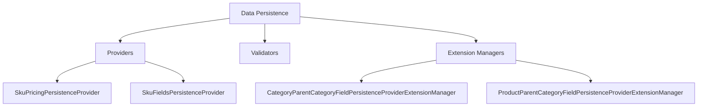

# Basic Concepts of Data Persistence

Data persistence in the Broadleaf admin module involves managing the storage, retrieval, and updating of data within the system. This process is handled by various components such as providers, validators, and extension managers.

## Providers

Providers are responsible for managing specific aspects of data persistence. Examples include <SwmToken path="admin/broadleaf-admin-module/src/main/java/org/broadleafcommerce/admin/server/service/persistence/module/provider/SkuPricingPersistenceProvider.java" pos="50:4:4" line-data="public class SkuPricingPersistenceProvider extends AbstractMoneyFieldPersistenceProvider {">`SkuPricingPersistenceProvider`</SwmToken> and <SwmToken path="admin/broadleaf-admin-module/src/main/java/org/broadleafcommerce/admin/server/service/persistence/module/provider/SkuFieldsPersistenceProvider.java" pos="43:4:4" line-data="public class SkuFieldsPersistenceProvider extends FieldPersistenceProviderAdapter {">`SkuFieldsPersistenceProvider`</SwmToken>.

<SwmSnippet path="/admin/broadleaf-admin-module/src/main/java/org/broadleafcommerce/admin/server/service/persistence/module/provider/SkuPricingPersistenceProvider.java" line="43">

---

The <SwmToken path="admin/broadleaf-admin-module/src/main/java/org/broadleafcommerce/admin/server/service/persistence/module/provider/SkuPricingPersistenceProvider.java" pos="50:4:4" line-data="public class SkuPricingPersistenceProvider extends AbstractMoneyFieldPersistenceProvider {">`SkuPricingPersistenceProvider`</SwmToken> manages the persistence of SKU-related data, specifically extracting friendly display values for SKU prices, taking currency into consideration.

```java
/**
 * Persistence provider capable of extracting friendly display values for Sku prices, taking currency into consideration.
 * 
 * @author Andre Azzolini (apazzolini)
 */
@Scope("prototype")
@Component("blSkuPricingPersistenceProvider")
public class SkuPricingPersistenceProvider extends AbstractMoneyFieldPersistenceProvider {
    
    public static int ORDER = FieldPersistenceProvider.MONEY - 1000;
    
    @Override
    public int getOrder() {
        return ORDER;
    }

    @Override
    public MetadataProviderResponse extractValue(ExtractValueRequest extractValueRequest, Property property) throws PersistenceException {
        if (!canHandleExtraction(extractValueRequest, property)) {
            return MetadataProviderResponse.NOT_HANDLED;
        }
```

---

</SwmSnippet>

<SwmSnippet path="/admin/broadleaf-admin-module/src/main/java/org/broadleafcommerce/admin/server/service/persistence/module/provider/SkuFieldsPersistenceProvider.java" line="43">

---

The <SwmToken path="admin/broadleaf-admin-module/src/main/java/org/broadleafcommerce/admin/server/service/persistence/module/provider/SkuFieldsPersistenceProvider.java" pos="43:4:4" line-data="public class SkuFieldsPersistenceProvider extends FieldPersistenceProviderAdapter {">`SkuFieldsPersistenceProvider`</SwmToken> is responsible for populating the display value of all SKU fields by invoking the getter of the entity property.

```java
public class SkuFieldsPersistenceProvider extends FieldPersistenceProviderAdapter {


    @Override
    public int getOrder() {
        return SkuPricingPersistenceProvider.ORDER + 1;
    }

    @Override
    public MetadataProviderResponse extractValue(ExtractValueRequest extractValueRequest, Property property) {
        if (!canHandleExtraction(extractValueRequest, property)) {
            return MetadataProviderResponse.NOT_HANDLED;
        }

        Object actualValue = extractValueRequest.getRequestedValue();
        String value;
        String displayValue = null;
        if (actualValue instanceof BroadleafEnumerationType) {
            value = ((BroadleafEnumerationType) extractValueRequest.getRequestedValue()).getType();
            displayValue = ((BroadleafEnumerationType) extractValueRequest.getRequestedValue()).getFriendlyType();
        } else {
```

---

</SwmSnippet>

## Extension Managers

Extension managers facilitate the extension of persistence functionalities for specific data types. Examples include <SwmToken path="admin/broadleaf-admin-module/src/main/java/org/broadleafcommerce/admin/server/service/persistence/module/provider/extension/CategoryParentCategoryFieldPersistenceProviderExtensionManager.java" pos="30:4:4" line-data="public class CategoryParentCategoryFieldPersistenceProviderExtensionManager extends ExtensionManager&lt;CategoryParentCategoryFieldPersistenceProviderExtensionHandler&gt; {">`CategoryParentCategoryFieldPersistenceProviderExtensionManager`</SwmToken> and <SwmToken path="admin/broadleaf-admin-module/src/main/java/org/broadleafcommerce/admin/server/service/persistence/module/provider/ProductParentCategoryFieldPersistenceProvider.java" pos="56:3:3" line-data="    protected ProductParentCategoryFieldPersistenceProviderExtensionManager extensionManager;">`ProductParentCategoryFieldPersistenceProviderExtensionManager`</SwmToken>.

<SwmSnippet path="/admin/broadleaf-admin-module/src/main/java/org/broadleafcommerce/admin/server/service/persistence/module/provider/extension/CategoryParentCategoryFieldPersistenceProviderExtensionManager.java" line="9">

---

The <SwmToken path="admin/broadleaf-admin-module/src/main/java/org/broadleafcommerce/admin/server/service/persistence/module/provider/extension/CategoryParentCategoryFieldPersistenceProviderExtensionManager.java" pos="30:4:4" line-data="public class CategoryParentCategoryFieldPersistenceProviderExtensionManager extends ExtensionManager&lt;CategoryParentCategoryFieldPersistenceProviderExtensionHandler&gt; {">`CategoryParentCategoryFieldPersistenceProviderExtensionManager`</SwmToken> facilitates the extension of persistence functionalities for category parent categories.

```java
 * unless the restrictions on use therein are violated and require payment to Broadleaf in which case
 * the Broadleaf End User License Agreement (EULA), Version 1.1
 * (the "Commercial License" located at http://license.broadleafcommerce.org/commercial_license-1.1.txt)
 * shall apply.
 * 
 * Alternatively, the Commercial License may be replaced with a mutually agreed upon license (the "Custom License")
 * between you and Broadleaf Commerce. You may not use this file except in compliance with the applicable license.
```

---

</SwmSnippet>

<SwmSnippet path="/admin/broadleaf-admin-module/src/main/java/org/broadleafcommerce/admin/server/service/persistence/module/provider/extension/ProductParentCategoryFieldPersistenceProviderExtensionManager.java" line="9">

---

The <SwmToken path="admin/broadleaf-admin-module/src/main/java/org/broadleafcommerce/admin/server/service/persistence/module/provider/ProductParentCategoryFieldPersistenceProvider.java" pos="56:3:3" line-data="    protected ProductParentCategoryFieldPersistenceProviderExtensionManager extensionManager;">`ProductParentCategoryFieldPersistenceProviderExtensionManager`</SwmToken> facilitates the extension of persistence functionalities for product parent categories.

```java
 * unless the restrictions on use therein are violated and require payment to Broadleaf in which case
 * the Broadleaf End User License Agreement (EULA), Version 1.1
 * (the "Commercial License" located at http://license.broadleafcommerce.org/commercial_license-1.1.txt)
 * shall apply.
 * 
 * Alternatively, the Commercial License may be replaced with a mutually agreed upon license (the "Custom License")
 * between you and Broadleaf Commerce. You may not use this file except in compliance with the applicable license.
```

---

</SwmSnippet>

## Main Functions

Several main functions are involved in data persistence, including <SwmToken path="admin/broadleaf-admin-module/src/main/java/org/broadleafcommerce/admin/server/service/persistence/module/provider/SkuPricingPersistenceProvider.java" pos="50:4:4" line-data="public class SkuPricingPersistenceProvider extends AbstractMoneyFieldPersistenceProvider {">`SkuPricingPersistenceProvider`</SwmToken> and <SwmToken path="admin/broadleaf-admin-module/src/main/java/org/broadleafcommerce/admin/server/service/persistence/module/provider/ProductParentCategoryFieldPersistenceProvider.java" pos="53:4:4" line-data="public class ProductParentCategoryFieldPersistenceProvider extends FieldPersistenceProviderAdapter {">`ProductParentCategoryFieldPersistenceProvider`</SwmToken>.

<SwmSnippet path="/admin/broadleaf-admin-module/src/main/java/org/broadleafcommerce/admin/server/service/persistence/module/provider/ProductParentCategoryFieldPersistenceProvider.java" line="45">

---

The <SwmToken path="admin/broadleaf-admin-module/src/main/java/org/broadleafcommerce/admin/server/service/persistence/module/provider/ProductParentCategoryFieldPersistenceProvider.java" pos="53:4:4" line-data="public class ProductParentCategoryFieldPersistenceProvider extends FieldPersistenceProviderAdapter {">`ProductParentCategoryFieldPersistenceProvider`</SwmToken> manages the default <SwmToken path="admin/broadleaf-admin-module/src/main/java/org/broadleafcommerce/admin/server/service/persistence/module/provider/ProductParentCategoryFieldPersistenceProvider.java" pos="46:17:17" line-data=" * This field persistence provider manages the default CategoryProductXref reference for a Product instance through">`CategoryProductXref`</SwmToken> reference for a Product instance through the <SwmToken path="admin/broadleaf-admin-module/src/main/java/org/broadleafcommerce/admin/server/service/persistence/module/provider/ProductParentCategoryFieldPersistenceProvider.java" pos="47:6:6" line-data=" * the &quot;defaultCategory&quot; pseudo field.">`defaultCategory`</SwmToken> pseudo field. It handles the persistence and extraction of the parent category for a product, ensuring data integrity and consistency.

```java
/**
 * This field persistence provider manages the default CategoryProductXref reference for a Product instance through
 * the "defaultCategory" pseudo field.
 *
 * @author Jeff Fischer
 */
@Component("blProductParentCategoryFieldPersistenceProvider")
@Scope("prototype")
public class ProductParentCategoryFieldPersistenceProvider extends FieldPersistenceProviderAdapter {

    @Resource(name="blProductParentCategoryFieldPersistenceProviderExtensionManager")
    protected ProductParentCategoryFieldPersistenceProviderExtensionManager extensionManager;

    @Override
    public MetadataProviderResponse populateValue(PopulateValueRequest populateValueRequest, Serializable instance) {
        if (!canHandlePersistence(populateValueRequest, instance)) {
            return MetadataProviderResponse.NOT_HANDLED;
        }
        boolean handled = false;
        if (extensionManager != null) {
            ExtensionResultStatusType result = extensionManager.getProxy().manageParentCategory(populateValueRequest.getProperty(), (Product) instance);
```

---

</SwmSnippet>

&nbsp;

*This is an auto-generated document by Swimm AI 🌊 and has not yet been verified by a human*

<SwmMeta version="3.0.0" repo-id="Z2l0aHViJTNBJTNBQnJvYWRsZWFmQ29tbWVyY2UtZGVtby1uZXclM0ElM0FTd2ltbS1EZW1v" repo-name="BroadleafCommerce-demo-new" doc-type="overview"><sup>Powered by [Swimm](/)</sup></SwmMeta>
