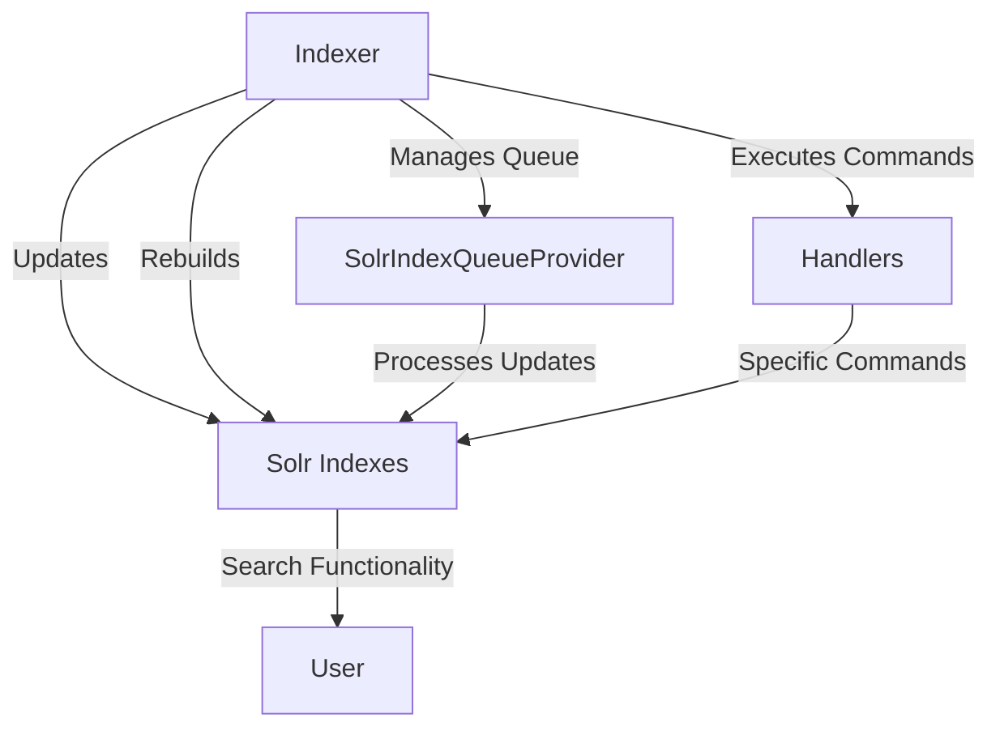

# Overview

The Indexer is a component responsible for managing the indexing operations within the Broadleaf Commerce framework. It primarily deals with updating and rebuilding the Solr indexes, which are crucial for search functionality.

# Key Components

Several key components work together to ensure efficient indexing operations:

## CatalogSolrIndexUpdateService

The `CatalogSolrIndexUpdateService` interface defines methods like `rebuildIndex` to handle the reindexing process for different sites.

## <SwmToken path="core/broadleaf-framework/src/main/java/org/broadleafcommerce/core/search/service/solr/indexer/CatalogSolrIndexUpdateCommandHandlerImpl.java" pos="112:3:3" line-data="    protected SolrIndexQueueProvider queueProvider;">`SolrIndexQueueProvider`</SwmToken>

The <SwmToken path="core/broadleaf-framework/src/main/java/org/broadleafcommerce/core/search/service/solr/indexer/CatalogSolrIndexUpdateCommandHandlerImpl.java" pos="112:3:3" line-data="    protected SolrIndexQueueProvider queueProvider;">`SolrIndexQueueProvider`</SwmToken> manages the queue of indexing operations, ensuring that updates are processed efficiently.

## Handlers

Handlers like <SwmToken path="core/broadleaf-framework/src/main/java/org/broadleafcommerce/core/search/service/solr/indexer/CatalogSolrIndexUpdateCommandHandlerImpl.java" pos="76:12:12" line-data="public class CatalogSolrIndexUpdateCommandHandlerImpl extends AbstractSolrIndexUpdateCommandHandlerImpl implements CatalogSolrIndexCommandHandler, DisposableBean {">`CatalogSolrIndexCommandHandler`</SwmToken> and `SolrIndexUpdateCommandHandler` are used to execute specific indexing commands.

## Default Implementations

The `DefaultSolrIndexQueueProvider` and `CatalogSolrIndexUpdateServiceImpl` provide default implementations for these services, ensuring that the indexing operations are carried out as expected.

# <SwmToken path="core/broadleaf-framework/src/main/java/org/broadleafcommerce/core/search/service/solr/indexer/CatalogSolrIndexUpdateCommandHandlerImpl.java" pos="76:4:4" line-data="public class CatalogSolrIndexUpdateCommandHandlerImpl extends AbstractSolrIndexUpdateCommandHandlerImpl implements CatalogSolrIndexCommandHandler, DisposableBean {">`CatalogSolrIndexUpdateCommandHandlerImpl`</SwmToken>

The <SwmToken path="core/broadleaf-framework/src/main/java/org/broadleafcommerce/core/search/service/solr/indexer/CatalogSolrIndexUpdateCommandHandlerImpl.java" pos="76:4:4" line-data="public class CatalogSolrIndexUpdateCommandHandlerImpl extends AbstractSolrIndexUpdateCommandHandlerImpl implements CatalogSolrIndexCommandHandler, DisposableBean {">`CatalogSolrIndexUpdateCommandHandlerImpl`</SwmToken> class is a default command handler to handle Catalog Solr index commands. It is <SwmToken path="core/broadleaf-framework/src/main/java/org/broadleafcommerce/core/search/service/solr/indexer/CatalogSolrIndexUpdateCommandHandlerImpl.java" pos="70:26:28" line-data=" * Default command handler to handle Catalog Solr index commands. This is multi-threaded.  SKU browsing is not supported with this implementation.">`multi-threaded`</SwmToken> and does not support SKU browsing.

<SwmSnippet path="/core/broadleaf-framework/src/main/java/org/broadleafcommerce/core/search/service/solr/indexer/CatalogSolrIndexUpdateCommandHandlerImpl.java" line="69">

---

This class is responsible for handling Catalog Solr index commands in a <SwmToken path="core/broadleaf-framework/src/main/java/org/broadleafcommerce/core/search/service/solr/indexer/CatalogSolrIndexUpdateCommandHandlerImpl.java" pos="70:26:28" line-data=" * Default command handler to handle Catalog Solr index commands. This is multi-threaded.  SKU browsing is not supported with this implementation.">`multi-threaded`</SwmToken> manner.

```java
/**
 * Default command handler to handle Catalog Solr index commands. This is multi-threaded.  SKU browsing is not supported with this implementation.
 * 
 * @author Kelly Tisdell
 *
 */
```

---

</SwmSnippet>

# <SwmToken path="core/broadleaf-framework/src/main/java/org/broadleafcommerce/core/search/service/solr/indexer/CatalogSolrIndexUpdateCommandHandlerImpl.java" pos="267:5:5" line-data="    protected void populateIndex(final ReindexStateHolder holder, final Long catalogId, final Long siteId, final SandBox sandbox) throws ServiceException {">`populateIndex`</SwmToken> Method

The <SwmToken path="core/broadleaf-framework/src/main/java/org/broadleafcommerce/core/search/service/solr/indexer/CatalogSolrIndexUpdateCommandHandlerImpl.java" pos="267:5:5" line-data="    protected void populateIndex(final ReindexStateHolder holder, final Long catalogId, final Long siteId, final SandBox sandbox) throws ServiceException {">`populateIndex`</SwmToken> method is responsible for populating the index. It coordinates and delegates to other methods and is not recommended to be overridden.

<SwmSnippet path="/core/broadleaf-framework/src/main/java/org/broadleafcommerce/core/search/service/solr/indexer/CatalogSolrIndexUpdateCommandHandlerImpl.java" line="262">

---

This method coordinates and delegates the task of populating the index to other methods.

```java
    /**
     * This method populates the index.
     * 
     * It is not recommended that you override this method.  Rather, consider overriding one of the other methods as this one generally coordinates and delegates to others.
     */
```

---

</SwmSnippet>

# <SwmToken path="core/broadleaf-framework/src/main/java/org/broadleafcommerce/core/search/service/solr/indexer/CatalogSolrIndexUpdateCommandHandlerImpl.java" pos="850:5:5" line-data="    protected Catalog findCatalog(final Long catalogId) {">`findCatalog`</SwmToken> Method

The <SwmToken path="core/broadleaf-framework/src/main/java/org/broadleafcommerce/core/search/service/solr/indexer/CatalogSolrIndexUpdateCommandHandlerImpl.java" pos="850:5:5" line-data="    protected Catalog findCatalog(final Long catalogId) {">`findCatalog`</SwmToken> method reads a <SwmToken path="core/broadleaf-framework/src/main/java/org/broadleafcommerce/core/search/service/solr/indexer/CatalogSolrIndexUpdateCommandHandlerImpl.java" pos="70:13:13" line-data=" * Default command handler to handle Catalog Solr index commands. This is multi-threaded.  SKU browsing is not supported with this implementation.">`Catalog`</SwmToken> by ID. If the ID is null, it returns null.

<SwmSnippet path="/core/broadleaf-framework/src/main/java/org/broadleafcommerce/core/search/service/solr/indexer/CatalogSolrIndexUpdateCommandHandlerImpl.java" line="844">

---

This method retrieves a <SwmToken path="core/broadleaf-framework/src/main/java/org/broadleafcommerce/core/search/service/solr/indexer/CatalogSolrIndexUpdateCommandHandlerImpl.java" pos="845:13:13" line-data="     * This reads a {@link Catalog} by ID.  If the ID is null (default, unless in Multi-Tenant mode), this returns null.">`Catalog`</SwmToken> by its ID, returning null if the ID is null.

```java
    /**
     * This reads a {@link Catalog} by ID.  If the ID is null (default, unless in Multi-Tenant mode), this returns null.
     * 
     * @param catalogId
     * @return
     */
    protected Catalog findCatalog(final Long catalogId) {
        if (catalogId == null) {
            return null;
        }
        return IdentityExecutionUtils.runOperationAndIgnoreIdentifier(new IdentityOperation<Catalog, RuntimeException>() {
            @Override
            public Catalog execute() throws RuntimeException {
                return siteService.findCatalogById(catalogId);
            }
        });
    }
```

---

</SwmSnippet>

<SwmSnippet path="/core/broadleaf-framework/src/main/java/org/broadleafcommerce/core/search/service/solr/indexer/CatalogSolrIndexUpdateCommandHandlerImpl.java" line="862">

---

This method retrieves a <SwmToken path="core/broadleaf-framework/src/main/java/org/broadleafcommerce/core/search/service/solr/indexer/CatalogSolrIndexUpdateCommandHandlerImpl.java" pos="863:13:13" line-data="     * This reads a {@link Site} by ID.  If the ID is null (default, unless in Multi-Tenant mode), this returns null.">`Site`</SwmToken> by its ID, returning null if the ID is null.

```java
    /**
     * This reads a {@link Site} by ID.  If the ID is null (default, unless in Multi-Tenant mode), this returns null.
     * 
     * @param siteId
     * @return
     */
    protected Site findSite(final Long siteId) {
        if (siteId == null) {
            return null;
        }
        return IdentityExecutionUtils.runOperationAndIgnoreIdentifier(new IdentityOperation<Site, RuntimeException>() {
            @Override
            public Site execute() throws RuntimeException {
                return siteService.retrieveNonPersistentSiteById(siteId);
            }
        });
    }
```

---

</SwmSnippet>

# <SwmToken path="common/src/main/java/org/broadleafcommerce/common/web/BroadleafRequestContext.java" pos="75:21:21" line-data="     * This is the same as calling {@link BroadleafRequestContext#getBroadleafRequestContext(boolean)} with the value true.">`getBroadleafRequestContext`</SwmToken> Method

The <SwmToken path="common/src/main/java/org/broadleafcommerce/common/web/BroadleafRequestContext.java" pos="75:21:21" line-data="     * This is the same as calling {@link BroadleafRequestContext#getBroadleafRequestContext(boolean)} with the value true.">`getBroadleafRequestContext`</SwmToken> method returns the current, <SwmToken path="common/src/main/java/org/broadleafcommerce/common/web/BroadleafRequestContext.java" pos="73:10:12" line-data="     * Returns the current, thread-bound {@link BroadleafRequestContext}.  This creates and binds one if it does not exist.">`thread-bound`</SwmToken> <SwmToken path="common/src/main/java/org/broadleafcommerce/common/web/BroadleafRequestContext.java" pos="73:18:18" line-data="     * Returns the current, thread-bound {@link BroadleafRequestContext}.  This creates and binds one if it does not exist.">`BroadleafRequestContext`</SwmToken>. It creates and binds one if it does not exist.

<SwmSnippet path="/common/src/main/java/org/broadleafcommerce/common/web/BroadleafRequestContext.java" line="72">

---

This method ensures that the current thread has a <SwmToken path="common/src/main/java/org/broadleafcommerce/common/web/BroadleafRequestContext.java" pos="73:18:18" line-data="     * Returns the current, thread-bound {@link BroadleafRequestContext}.  This creates and binds one if it does not exist.">`BroadleafRequestContext`</SwmToken> bound to it, creating one if necessary.

```java
    /**
     * Returns the current, thread-bound {@link BroadleafRequestContext}.  This creates and binds one if it does not exist.
     * 
     * This is the same as calling {@link BroadleafRequestContext#getBroadleafRequestContext(boolean)} with the value true.
     * 
     * @return
     */
    public static BroadleafRequestContext getBroadleafRequestContext() {
        return getBroadleafRequestContext(true);
    }
```

---

</SwmSnippet>

&nbsp;

*This is an auto-generated document by Swimm AI 🌊 and has not yet been verified by a human*

<SwmMeta version="3.0.0" repo-id="Z2l0aHViJTNBJTNBQnJvYWRsZWFmQ29tbWVyY2UtZGVtby1uZXclM0ElM0FTd2ltbS1EZW1v" repo-name="BroadleafCommerce-demo-new" doc-type="overview"><sup>Powered by [Swimm](/)</sup></SwmMeta>
