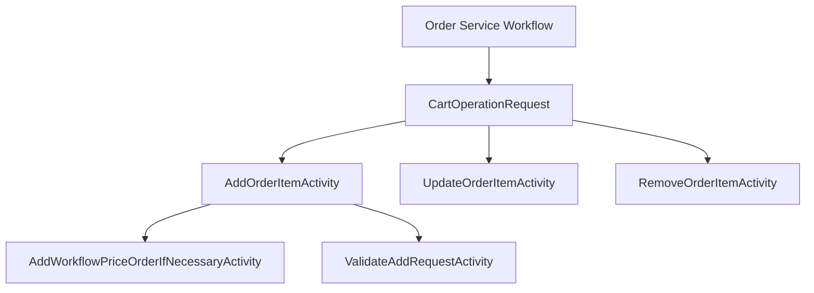

# Overview

The Order Service Workflow in Broadleaf Commerce manages various operations such as adding, updating, and removing items from an order. Each workflow consists of multiple activities, which are individual units of work that perform specific actions.

# <SwmToken path="core/broadleaf-framework/src/main/java/org/broadleafcommerce/core/order/service/workflow/CartOperationRequest.java" pos="39:4:4" line-data="public class CartOperationRequest {">`CartOperationRequest`</SwmToken>

The <SwmToken path="core/broadleaf-framework/src/main/java/org/broadleafcommerce/core/order/service/workflow/CartOperationRequest.java" pos="39:4:4" line-data="public class CartOperationRequest {">`CartOperationRequest`</SwmToken> class is a key component in these workflows, providing the necessary context and data for each activity to execute. It includes details such as the order, item request, and other relevant data.

<SwmSnippet path="/core/broadleaf-framework/src/main/java/org/broadleafcommerce/core/order/service/workflow/CartOperationRequest.java" line="33">

---

The <SwmToken path="core/broadleaf-framework/src/main/java/org/broadleafcommerce/core/order/service/workflow/CartOperationRequest.java" pos="39:4:4" line-data="public class CartOperationRequest {">`CartOperationRequest`</SwmToken> class represents the basic context necessary for the execution of a particular order process workflow operation. It includes fields like <SwmToken path="core/broadleaf-framework/src/main/java/org/broadleafcommerce/core/order/service/workflow/CartOperationRequest.java" pos="41:3:3" line-data="    protected OrderItemRequestDTO itemRequest;">`OrderItemRequestDTO`</SwmToken>, <SwmToken path="core/broadleaf-framework/src/main/java/org/broadleafcommerce/core/order/service/workflow/CartOperationRequest.java" pos="35:9:9" line-data=" * of a particular order process workflow operation.">`order`</SwmToken>, <SwmToken path="core/broadleaf-framework/src/main/java/org/broadleafcommerce/core/order/service/workflow/CartOperationRequest.java" pos="48:3:3" line-data="    protected OrderItem orderItem;">`OrderItem`</SwmToken>, and <SwmToken path="core/broadleaf-framework/src/main/java/org/broadleafcommerce/core/order/service/workflow/CartOperationRequest.java" pos="51:5:5" line-data="    protected Integer orderItemQuantityDelta;">`orderItemQuantityDelta`</SwmToken>.

```java
/**
 * This class represents the basic context necessary for the execution
 * of a particular order process workflow operation.
 * 
 * @author apazzolini
 */
public class CartOperationRequest {

    protected OrderItemRequestDTO itemRequest;
    
    protected Order order;
    
    protected boolean priceOrder;
    
    // Set during the course of the workflow for use in subsequent workflow steps
    protected OrderItem orderItem;
    
    // Set during the course of the workflow for use in subsequent workflow steps
    protected Integer orderItemQuantityDelta;
    
    protected List<Long[]> multishipOptionsToDelete = new ArrayList<Long[]>();
```

---

</SwmSnippet>

# <SwmToken path="core/broadleaf-framework/src/main/java/org/broadleafcommerce/core/order/service/workflow/add/AddOrderItemActivity.java" pos="35:4:4" line-data="public class AddOrderItemActivity extends BaseActivity&lt;ProcessContext&lt;CartOperationRequest&gt;&gt; {">`AddOrderItemActivity`</SwmToken>

The <SwmToken path="core/broadleaf-framework/src/main/java/org/broadleafcommerce/core/order/service/workflow/add/AddOrderItemActivity.java" pos="35:4:4" line-data="public class AddOrderItemActivity extends BaseActivity&lt;ProcessContext&lt;CartOperationRequest&gt;&gt; {">`AddOrderItemActivity`</SwmToken> class is responsible for adding an item to an order. It uses the <SwmToken path="core/broadleaf-framework/src/main/java/org/broadleafcommerce/core/order/service/workflow/CartOperationRequest.java" pos="39:4:4" line-data="public class CartOperationRequest {">`CartOperationRequest`</SwmToken> to get the necessary data and performs the addition operation.

<SwmSnippet path="/core/broadleaf-framework/src/main/java/org/broadleafcommerce/core/order/service/workflow/add/AddOrderItemActivity.java" line="34">

---

The <SwmToken path="core/broadleaf-framework/src/main/java/org/broadleafcommerce/core/order/service/workflow/add/AddOrderItemActivity.java" pos="35:4:4" line-data="public class AddOrderItemActivity extends BaseActivity&lt;ProcessContext&lt;CartOperationRequest&gt;&gt; {">`AddOrderItemActivity`</SwmToken> class demonstrates how a workflow activity uses <SwmToken path="core/broadleaf-framework/src/main/java/org/broadleafcommerce/core/order/service/workflow/add/AddOrderItemActivity.java" pos="35:12:12" line-data="public class AddOrderItemActivity extends BaseActivity&lt;ProcessContext&lt;CartOperationRequest&gt;&gt; {">`CartOperationRequest`</SwmToken> to perform operations on an order. It sets the order and uses various services like <SwmToken path="core/broadleaf-framework/src/main/java/org/broadleafcommerce/core/order/service/workflow/add/AddOrderItemActivity.java" pos="40:3:3" line-data="    protected OrderService orderService;">`OrderService`</SwmToken> and <SwmToken path="core/broadleaf-framework/src/main/java/org/broadleafcommerce/core/order/service/workflow/add/AddOrderItemActivity.java" pos="43:3:3" line-data="    protected OrderItemService orderItemService;">`OrderItemService`</SwmToken>.

```java
@Component("blAddOrderItemActivity")
public class AddOrderItemActivity extends BaseActivity<ProcessContext<CartOperationRequest>> {
    
    public static final int ORDER = 3000;
    
    @Resource(name = "blOrderService")
    protected OrderService orderService;
    
    @Resource(name = "blOrderItemService")
    protected OrderItemService orderItemService;
    
    @Resource(name = "blCatalogService")
    protected CatalogService catalogService;

    @Resource(name = "blGenericEntityDao")
    protected GenericEntityDao genericEntityDao;
    
    public AddOrderItemActivity() {
        setOrder(ORDER);
    }
```

---

</SwmSnippet>

# <SwmToken path="core/broadleaf-framework/src/main/java/org/broadleafcommerce/core/order/service/workflow/update/UpdateOrderItemActivity.java" pos="34:4:4" line-data="public class UpdateOrderItemActivity extends BaseActivity&lt;ProcessContext&lt;CartOperationRequest&gt;&gt; {">`UpdateOrderItemActivity`</SwmToken>

The <SwmToken path="core/broadleaf-framework/src/main/java/org/broadleafcommerce/core/order/service/workflow/update/UpdateOrderItemActivity.java" pos="34:4:4" line-data="public class UpdateOrderItemActivity extends BaseActivity&lt;ProcessContext&lt;CartOperationRequest&gt;&gt; {">`UpdateOrderItemActivity`</SwmToken> class handles updating an existing item in an order. It retrieves the item details from the <SwmToken path="core/broadleaf-framework/src/main/java/org/broadleafcommerce/core/order/service/workflow/CartOperationRequest.java" pos="39:4:4" line-data="public class CartOperationRequest {">`CartOperationRequest`</SwmToken> and applies the necessary updates.

<SwmSnippet path="/core/broadleaf-framework/src/main/java/org/broadleafcommerce/core/order/service/workflow/update/UpdateOrderItemActivity.java" line="34">

---

The <SwmToken path="core/broadleaf-framework/src/main/java/org/broadleafcommerce/core/order/service/workflow/update/UpdateOrderItemActivity.java" pos="34:4:4" line-data="public class UpdateOrderItemActivity extends BaseActivity&lt;ProcessContext&lt;CartOperationRequest&gt;&gt; {">`UpdateOrderItemActivity`</SwmToken> class shows how a workflow activity uses <SwmToken path="core/broadleaf-framework/src/main/java/org/broadleafcommerce/core/order/service/workflow/update/UpdateOrderItemActivity.java" pos="34:12:12" line-data="public class UpdateOrderItemActivity extends BaseActivity&lt;ProcessContext&lt;CartOperationRequest&gt;&gt; {">`CartOperationRequest`</SwmToken> to update an order item. It sets the order and uses the <SwmToken path="core/broadleaf-framework/src/main/java/org/broadleafcommerce/core/order/service/workflow/update/UpdateOrderItemActivity.java" pos="39:3:3" line-data="    protected OrderService orderService;">`OrderService`</SwmToken> to apply updates.

```java
public class UpdateOrderItemActivity extends BaseActivity<ProcessContext<CartOperationRequest>> {

    public static final int ORDER = 3000;
    
    @Resource(name = "blOrderService")
    protected OrderService orderService;
    
    public UpdateOrderItemActivity() {
        setOrder(ORDER);
    }
    
    @Override
    public ProcessContext<CartOperationRequest> execute(ProcessContext<CartOperationRequest> context) throws Exception {
        CartOperationRequest request = context.getSeedData();
        OrderItemRequestDTO orderItemRequestDTO = request.getItemRequest();
```

---

</SwmSnippet>

# <SwmToken path="core/broadleaf-framework/src/main/java/org/broadleafcommerce/core/order/service/workflow/remove/RemoveOrderItemActivity.java" pos="40:4:4" line-data="public class RemoveOrderItemActivity extends BaseActivity&lt;ProcessContext&lt;CartOperationRequest&gt;&gt; {">`RemoveOrderItemActivity`</SwmToken>

The <SwmToken path="core/broadleaf-framework/src/main/java/org/broadleafcommerce/core/order/service/workflow/remove/RemoveOrderItemActivity.java" pos="40:4:4" line-data="public class RemoveOrderItemActivity extends BaseActivity&lt;ProcessContext&lt;CartOperationRequest&gt;&gt; {">`RemoveOrderItemActivity`</SwmToken> class is used to remove an item from an order. It utilizes the <SwmToken path="core/broadleaf-framework/src/main/java/org/broadleafcommerce/core/order/service/workflow/CartOperationRequest.java" pos="39:4:4" line-data="public class CartOperationRequest {">`CartOperationRequest`</SwmToken> to identify the item to be removed and performs the removal operation.

<SwmSnippet path="/core/broadleaf-framework/src/main/java/org/broadleafcommerce/core/order/service/workflow/remove/RemoveOrderItemActivity.java" line="40">

---

The <SwmToken path="core/broadleaf-framework/src/main/java/org/broadleafcommerce/core/order/service/workflow/remove/RemoveOrderItemActivity.java" pos="40:4:4" line-data="public class RemoveOrderItemActivity extends BaseActivity&lt;ProcessContext&lt;CartOperationRequest&gt;&gt; {">`RemoveOrderItemActivity`</SwmToken> class demonstrates how a workflow activity uses <SwmToken path="core/broadleaf-framework/src/main/java/org/broadleafcommerce/core/order/service/workflow/remove/RemoveOrderItemActivity.java" pos="40:12:12" line-data="public class RemoveOrderItemActivity extends BaseActivity&lt;ProcessContext&lt;CartOperationRequest&gt;&gt; {">`CartOperationRequest`</SwmToken> to remove an item from an order. It sets the order and uses the <SwmToken path="core/broadleaf-framework/src/main/java/org/broadleafcommerce/core/order/service/workflow/remove/RemoveOrderItemActivity.java" pos="45:3:3" line-data="    protected OrderService orderService;">`OrderService`</SwmToken> and <SwmToken path="core/broadleaf-framework/src/main/java/org/broadleafcommerce/core/order/service/workflow/remove/RemoveOrderItemActivity.java" pos="48:3:3" line-data="    protected OrderItemService orderItemService;">`OrderItemService`</SwmToken> to perform the removal.

```java
public class RemoveOrderItemActivity extends BaseActivity<ProcessContext<CartOperationRequest>> {

    public static final int ORDER = 4000;
    
    @Resource(name = "blOrderService")
    protected OrderService orderService;
    
    @Resource(name = "blOrderItemService")
    protected OrderItemService orderItemService;
    
    public RemoveOrderItemActivity() {
        setOrder(ORDER);
    }
    
    @Override
    public ProcessContext<CartOperationRequest> execute(ProcessContext<CartOperationRequest> context) throws Exception {
        CartOperationRequest request = context.getSeedData();
```

---

</SwmSnippet>

# Additional Workflow Activities

Other workflow activities like `AddWorkflowPriceOrderIfNecessaryActivity` and <SwmToken path="core/broadleaf-framework/src/main/java/org/broadleafcommerce/core/order/service/workflow/add/ValidateAddRequestActivity.java" pos="59:4:4" line-data="public class ValidateAddRequestActivity extends BaseActivity&lt;ProcessContext&lt;CartOperationRequest&gt;&gt; {">`ValidateAddRequestActivity`</SwmToken> also utilize <SwmToken path="core/broadleaf-framework/src/main/java/org/broadleafcommerce/core/order/service/workflow/CartOperationRequest.java" pos="39:4:4" line-data="public class CartOperationRequest {">`CartOperationRequest`</SwmToken> to perform their respective operations on the order.

<SwmSnippet path="/core/broadleaf-framework/src/main/java/org/broadleafcommerce/core/order/service/workflow/add/ValidateAddRequestActivity.java" line="58">

---

The <SwmToken path="core/broadleaf-framework/src/main/java/org/broadleafcommerce/core/order/service/workflow/add/ValidateAddRequestActivity.java" pos="59:4:4" line-data="public class ValidateAddRequestActivity extends BaseActivity&lt;ProcessContext&lt;CartOperationRequest&gt;&gt; {">`ValidateAddRequestActivity`</SwmToken> class shows another example of a workflow activity utilizing <SwmToken path="core/broadleaf-framework/src/main/java/org/broadleafcommerce/core/order/service/workflow/add/ValidateAddRequestActivity.java" pos="59:12:12" line-data="public class ValidateAddRequestActivity extends BaseActivity&lt;ProcessContext&lt;CartOperationRequest&gt;&gt; {">`CartOperationRequest`</SwmToken> to validate an order item request. It sets the order and uses various services like <SwmToken path="core/broadleaf-framework/src/main/java/org/broadleafcommerce/core/order/service/workflow/add/ValidateAddRequestActivity.java" pos="64:3:3" line-data="    protected OrderItemRequestValidationService orderItemRequestValidationService;">`OrderItemRequestValidationService`</SwmToken> and <SwmToken path="core/broadleaf-framework/src/main/java/org/broadleafcommerce/core/order/service/workflow/add/ValidateAddRequestActivity.java" pos="67:3:3" line-data="    protected OrderService orderService;">`OrderService`</SwmToken>.

```java
@Component("blValidateAddRequestActivity")
public class ValidateAddRequestActivity extends BaseActivity<ProcessContext<CartOperationRequest>> {

    public static final int ORDER = 1000;

    @Resource(name = "blOrderItemRequestValidationService")
    protected OrderItemRequestValidationService orderItemRequestValidationService;
    
    @Resource(name = "blOrderService")
    protected OrderService orderService;
    
    @Resource(name = "blCatalogService")
    protected CatalogService catalogService;

    @Resource(name = "blProductOptionValidationService")
    protected ProductOptionValidationService productOptionValidationService;
    
    @Resource(name = "blOrderItemService")
    protected OrderItemService orderItemService;

    @Resource(name = "blValidateAddRequestActivityExtensionManager")
```

---

</SwmSnippet>

&nbsp;

*This is an auto-generated document by Swimm AI 🌊 and has not yet been verified by a human*

<SwmMeta version="3.0.0" repo-id="Z2l0aHViJTNBJTNBQnJvYWRsZWFmQ29tbWVyY2UtZGVtby1uZXclM0ElM0FTd2ltbS1EZW1v" repo-name="BroadleafCommerce-demo-new" doc-type="overview"><sup>Powered by [Swimm](/)</sup></SwmMeta>
