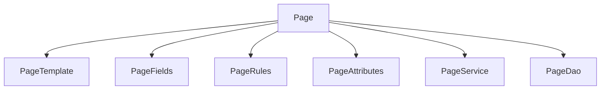

# Overview

A Page in the Broadleaf content management module represents a web page. It includes various attributes such as URL, description, and metadata, which define the content and behavior of the page.

# Page Structure

Pages are associated with PageTemplates, which provide the structure and layout for the content. They also contain <SwmToken path="admin/broadleaf-contentmanagement-module/src/main/java/org/broadleafcommerce/cms/page/domain/Page.java" pos="52:15:15" line-data="    public void setPageFields(Map&lt;String, PageField&gt; pageFields);">`pageFields`</SwmToken>, which store the actual content data for the page.

# Page Rules

Pages can have targeting rules defined by <SwmToken path="admin/broadleaf-contentmanagement-module/src/main/java/org/broadleafcommerce/cms/page/domain/Page.java" pos="102:6:6" line-data="     * @param pageRules">`pageRules`</SwmToken>, which determine when and how the page should be displayed based on certain conditions.

# Page Attributes

Additional attributes can be added to pages through PageAttributes, allowing for further customization.

# Page Management

Pages can be managed through various services and DAOs provided in the module, such as <SwmToken path="admin/broadleaf-contentmanagement-module/src/main/java/org/broadleafcommerce/cms/page/service/PageService.java" pos="35:4:4" line-data="public interface PageService {">`PageService`</SwmToken> and PageDao.

<SwmSnippet path="/admin/broadleaf-contentmanagement-module/src/main/java/org/broadleafcommerce/cms/page/domain/Page.java" line="32">

---

The <SwmToken path="admin/broadleaf-contentmanagement-module/src/main/java/org/broadleafcommerce/cms/page/domain/Page.java" pos="32:4:4" line-data="public interface Page extends Serializable,MultiTenantCloneable&lt;Page&gt; {">`Page`</SwmToken> interface includes methods to get and set attributes like <SwmToken path="admin/broadleaf-contentmanagement-module/src/main/java/org/broadleafcommerce/cms/page/domain/Page.java" pos="36:9:9" line-data="    public void setId(Long id);">`id`</SwmToken>, <SwmToken path="admin/broadleaf-contentmanagement-module/src/main/java/org/broadleafcommerce/cms/page/domain/Page.java" pos="40:9:9" line-data="    public void setFullUrl(String fullUrl);">`fullUrl`</SwmToken>, <SwmToken path="admin/broadleaf-contentmanagement-module/src/main/java/org/broadleafcommerce/cms/page/domain/Page.java" pos="44:9:9" line-data="    public void setDescription(String description);">`description`</SwmToken>, <SwmToken path="admin/broadleaf-contentmanagement-module/src/main/java/org/broadleafcommerce/cms/page/domain/Page.java" pos="46:3:3" line-data="    public PageTemplate getPageTemplate();">`PageTemplate`</SwmToken>, and <SwmToken path="admin/broadleaf-contentmanagement-module/src/main/java/org/broadleafcommerce/cms/page/domain/Page.java" pos="52:15:15" line-data="    public void setPageFields(Map&lt;String, PageField&gt; pageFields);">`pageFields`</SwmToken>.

```java
public interface Page extends Serializable,MultiTenantCloneable<Page> {

    public Long getId();

    public void setId(Long id);

    public String getFullUrl();

    public void setFullUrl(String fullUrl);

    public String getDescription();

    public void setDescription(String description);

    public PageTemplate getPageTemplate();

    public void setPageTemplate(PageTemplate pageTemplate);

    public Map<String, PageField> getPageFields();

    public void setPageFields(Map<String, PageField> pageFields);
```

---

</SwmSnippet>

# Page Service

The <SwmToken path="admin/broadleaf-contentmanagement-module/src/main/java/org/broadleafcommerce/cms/page/service/PageService.java" pos="35:4:4" line-data="public interface PageService {">`PageService`</SwmToken> interface provides methods to manage pages, such as finding pages by ID or URI, saving page templates, and building <SwmToken path="admin/broadleaf-contentmanagement-module/src/main/java/org/broadleafcommerce/cms/page/service/PageService.java" pos="24:12:12" line-data="import org.broadleafcommerce.common.page.dto.PageDTO;">`PageDTO`</SwmToken> lists. It is used in various parts of the module to handle page-related operations.

<SwmSnippet path="/admin/broadleaf-contentmanagement-module/src/main/java/org/broadleafcommerce/cms/page/service/PageService.java" line="35">

---

The <SwmToken path="admin/broadleaf-contentmanagement-module/src/main/java/org/broadleafcommerce/cms/page/service/PageService.java" pos="35:4:4" line-data="public interface PageService {">`PageService`</SwmToken> interface includes methods like <SwmToken path="admin/broadleaf-contentmanagement-module/src/main/java/org/broadleafcommerce/cms/page/service/PageService.java" pos="44:3:3" line-data="    Page findPageById(Long pageId);">`findPageById`</SwmToken>, <SwmToken path="admin/broadleaf-contentmanagement-module/src/main/java/org/broadleafcommerce/cms/page/service/PageService.java" pos="51:9:9" line-data="    Map&lt;String, PageField&gt; findPageFieldMapByPageId(Long pageId);">`findPageFieldMapByPageId`</SwmToken>, and <SwmToken path="admin/broadleaf-contentmanagement-module/src/main/java/org/broadleafcommerce/cms/page/service/PageService.java" pos="59:3:3" line-data="    PageTemplate findPageTemplateById(Long id);">`findPageTemplateById`</SwmToken> to manage pages.

```java
public interface PageService {


    /**
     * Returns the page with the passed in id.
     *
     * @param pageId - The id of the page.
     * @return The associated page.
     */
    Page findPageById(Long pageId);

    /**
     * Returns the page-fields associated with a page.
     * @param pageId
     * @return
     */
    Map<String, PageField> findPageFieldMapByPageId(Long pageId);

    /**
     * Returns the page template with the passed in id.
     *
```

---

</SwmSnippet>

&nbsp;

*This is an auto-generated document by Swimm AI 🌊 and has not yet been verified by a human*

<SwmMeta version="3.0.0" repo-id="Z2l0aHViJTNBJTNBQnJvYWRsZWFmQ29tbWVyY2UtZGVtby1uZXclM0ElM0FTd2ltbS1EZW1v" repo-name="BroadleafCommerce-demo-new" doc-type="overview"><sup>Powered by [Swimm](/)</sup></SwmMeta>
