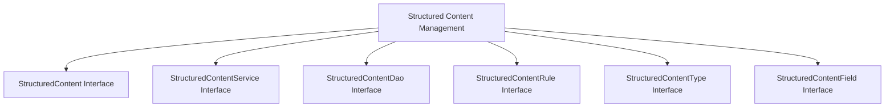

# Overview

Structured content in the Broadleaf content management module refers to the organization and management of content items with predefined fields. These items are defined by their associated <SwmToken path="admin/broadleaf-contentmanagement-module/src/main/java/org/broadleafcommerce/cms/structure/domain/StructuredContent.java" pos="33:21:21" line-data=" * of StructuredContent are defined by its associated {@link StructuredContentType}.">`StructuredContentType`</SwmToken> and are typically managed through the Broadleaf Commerce admin interface. They are often used for purposes such as displaying targeted ads, where different ads can be shown to different users based on match rules and priority settings.

# <SwmToken path="admin/broadleaf-contentmanagement-module/src/main/java/org/broadleafcommerce/cms/structure/domain/StructuredContent.java" pos="31:3:3" line-data=" * StructuredContent implementations provide a representation of a generic content">`StructuredContent`</SwmToken> Interface

The <SwmToken path="admin/broadleaf-contentmanagement-module/src/main/java/org/broadleafcommerce/cms/structure/domain/StructuredContent.java" pos="31:3:3" line-data=" * StructuredContent implementations provide a representation of a generic content">`StructuredContent`</SwmToken> interface provides methods to get and set various attributes of the content, such as its ID, name, locale, type, fields, and priority. It also includes deprecated methods for backward compatibility.

<SwmSnippet path="/admin/broadleaf-contentmanagement-module/src/main/java/org/broadleafcommerce/cms/structure/domain/StructuredContent.java" line="30">

---

The <SwmToken path="admin/broadleaf-contentmanagement-module/src/main/java/org/broadleafcommerce/cms/structure/domain/StructuredContent.java" pos="31:3:3" line-data=" * StructuredContent implementations provide a representation of a generic content">`StructuredContent`</SwmToken> interface defines a generic content item with a set of predefined fields. These fields are defined by its associated <SwmToken path="admin/broadleaf-contentmanagement-module/src/main/java/org/broadleafcommerce/cms/structure/domain/StructuredContent.java" pos="33:21:21" line-data=" * of StructuredContent are defined by its associated {@link StructuredContentType}.">`StructuredContentType`</SwmToken>. Structured content items are typically maintained via the Broadleaf Commerce admin and displayed using the <SwmToken path="admin/broadleaf-contentmanagement-module/src/main/java/org/broadleafcommerce/cms/structure/domain/StructuredContent.java" pos="38:17:17" line-data=" * {@link org.broadleafcommerce.cms.web.structure.DisplayContentTag} taglib.">`DisplayContentTag`</SwmToken> taglib. A common use case is to display targeted ads, where different ads can be shown to different users based on match rules and priority settings.

```java
/**
 * StructuredContent implementations provide a representation of a generic content
 * item with a set of predefined fields.    The fields associated with an instance
 * of StructuredContent are defined by its associated {@link StructuredContentType}.
 * <br>
 * StructuredContent items are typically maintained via the Broadleaf Commerce admin.
 * <br>
 * Display structured content items is typically done using the
 * {@link org.broadleafcommerce.cms.web.structure.DisplayContentTag} taglib.
 * <br>
 * An typical usage for <code>StructuredContent</code> is to display targeted ads.
 * Consider a <code>StructuredContentType</code> of "ad" with fields "ad-image" and
 * "target-url".    This "ad" might show on a websites home page.  By adding
 * <code>StructuredContentMatchRules</code> and setting the <code>priority</code>,
 * different ads could be shown to different users.
 *
 * It would not be typical in a Broadleaf implementation to extend this interface
 * or to use any implementation other than {@link StructuredContentImpl}.
 *
 * @see {@link StructuredContentType}
 * @see {@link StructuredContentImpl}
```

---

</SwmSnippet>

# <SwmToken path="admin/broadleaf-contentmanagement-module/src/main/java/org/broadleafcommerce/cms/structure/service/StructuredContentService.java" pos="38:4:4" line-data="public interface StructuredContentService {">`StructuredContentService`</SwmToken> Interface

The <SwmToken path="admin/broadleaf-contentmanagement-module/src/main/java/org/broadleafcommerce/cms/structure/service/StructuredContentService.java" pos="38:4:4" line-data="public interface StructuredContentService {">`StructuredContentService`</SwmToken> interface offers services to manage structured content items, including finding content by ID, type, or name, retrieving all content types, and saving content types. It also provides methods for looking up content items based on various criteria and managing content caching.

<SwmSnippet path="/admin/broadleaf-contentmanagement-module/src/main/java/org/broadleafcommerce/cms/structure/service/StructuredContentService.java" line="20">

---

The <SwmToken path="admin/broadleaf-contentmanagement-module/src/main/java/org/broadleafcommerce/cms/structure/service/StructuredContentService.java" pos="38:4:4" line-data="public interface StructuredContentService {">`StructuredContentService`</SwmToken> interface provides services to manage <SwmToken path="admin/broadleaf-contentmanagement-module/src/main/java/org/broadleafcommerce/cms/structure/service/StructuredContentService.java" pos="20:12:12" line-data="import org.broadleafcommerce.cms.structure.domain.StructuredContent;">`StructuredContent`</SwmToken> items. This includes finding content by ID, type, or name, retrieving all content types, and saving content types.

```java
import org.broadleafcommerce.cms.structure.domain.StructuredContent;
import org.broadleafcommerce.cms.structure.domain.StructuredContentType;
import org.broadleafcommerce.common.locale.domain.Locale;
import org.broadleafcommerce.common.persistence.EntityConfiguration;
import org.broadleafcommerce.common.sandbox.domain.SandBox;
import org.broadleafcommerce.common.structure.dto.StructuredContentDTO;
import org.hibernate.Criteria;

import java.util.List;
import java.util.Map;

import javax.cache.Cache;

/**
 * Provides services to manage <code>StructuredContent</code> items.
 *
 * @author bpolster
 */
public interface StructuredContentService {
```

---

</SwmSnippet>

<SwmSnippet path="/admin/broadleaf-contentmanagement-module/src/main/java/org/broadleafcommerce/cms/structure/dao/StructuredContentDao.java" line="26">

---

The <SwmToken path="admin/broadleaf-contentmanagement-module/src/main/java/org/broadleafcommerce/cms/structure/dao/StructuredContentDao.java" pos="30:4:4" line-data="public interface StructuredContentDao {">`StructuredContentDao`</SwmToken> interface is responsible for querying and updating <SwmToken path="admin/broadleaf-contentmanagement-module/src/main/java/org/broadleafcommerce/cms/structure/dao/StructuredContentDao.java" pos="27:17:17" line-data=" * Responsible for querying and updating {@link StructuredContent} items">`StructuredContent`</SwmToken> items. It includes methods for finding content by ID or type, retrieving all content types, adding or updating content items, and deleting content items.

```java
/**
 * Responsible for querying and updating {@link StructuredContent} items
 * @author bpolster
 */
public interface StructuredContentDao {

    /**
     * Returns the <code>StructuredContent</code> item that matches
     * the passed in Id.
     * @param contentId
     * @return the found item or null if it does not exist
     */
    public StructuredContent findStructuredContentById(Long contentId);

    /**
     * Returns the <code>StructuredContentType</code> that matches
     * the passed in contentTypeId.
     * @param contentTypeId
     * @return the found item or null if it does not exist
     */
    public StructuredContentType findStructuredContentTypeById(Long contentTypeId);
```

---

</SwmSnippet>

# <SwmToken path="admin/broadleaf-contentmanagement-module/src/main/java/org/broadleafcommerce/cms/structure/domain/StructuredContent.java" pos="198:8:8" line-data="    public Map&lt;String, StructuredContentRule&gt; getStructuredContentMatchRules();">`StructuredContentRule`</SwmToken> Interface

The <SwmToken path="admin/broadleaf-contentmanagement-module/src/main/java/org/broadleafcommerce/cms/structure/domain/StructuredContent.java" pos="198:8:8" line-data="    public Map&lt;String, StructuredContentRule&gt; getStructuredContentMatchRules();">`StructuredContentRule`</SwmToken> interface defines rules for determining if a structured content item should be displayed. These rules are represented as MVEL strings and can be based on various factors such as the current customer, product, time, or request.

<SwmSnippet path="/admin/broadleaf-contentmanagement-module/src/main/java/org/broadleafcommerce/cms/structure/domain/StructuredContentRule.java" line="26">

---

The <SwmToken path="admin/broadleaf-contentmanagement-module/src/main/java/org/broadleafcommerce/cms/structure/domain/StructuredContent.java" pos="198:8:8" line-data="    public Map&lt;String, StructuredContentRule&gt; getStructuredContentMatchRules();">`StructuredContentRule`</SwmToken> interface holds the values for a rule used to determine if a <SwmToken path="admin/broadleaf-contentmanagement-module/src/main/java/org/broadleafcommerce/cms/structure/domain/StructuredContentRule.java" pos="27:30:30" line-data=" * Implementations hold the values for a rule used to determine if a &lt;code&gt;StructuredContent&lt;/code&gt;">`StructuredContent`</SwmToken> item should be displayed. These rules are represented as MVEL strings and can be based on various factors such as the current customer, product, time, or request.

```java
/**
 * Implementations hold the values for a rule used to determine if a <code>StructuredContent</code>
 * item should be displayed.
```

---

</SwmSnippet>

# <SwmToken path="admin/broadleaf-contentmanagement-module/src/main/java/org/broadleafcommerce/cms/structure/domain/StructuredContent.java" pos="33:21:21" line-data=" * of StructuredContent are defined by its associated {@link StructuredContentType}.">`StructuredContentType`</SwmToken> Interface

The <SwmToken path="admin/broadleaf-contentmanagement-module/src/main/java/org/broadleafcommerce/cms/structure/domain/StructuredContent.java" pos="33:21:21" line-data=" * of StructuredContent are defined by its associated {@link StructuredContentType}.">`StructuredContentType`</SwmToken> interface represents a content type, which corresponds to an area where content should be targeted. It includes methods for getting and setting the primary key, name, description, and associated template of the content type.

<SwmSnippet path="/admin/broadleaf-contentmanagement-module/src/main/java/org/broadleafcommerce/cms/structure/domain/StructuredContentType.java" line="86">

---

The <SwmToken path="admin/broadleaf-contentmanagement-module/src/main/java/org/broadleafcommerce/cms/structure/domain/StructuredContent.java" pos="33:21:21" line-data=" * of StructuredContent are defined by its associated {@link StructuredContentType}.">`StructuredContentType`</SwmToken> interface represents a content type, which corresponds to an area where content should be targeted. It includes methods for getting and setting the primary key, name, description, and associated template of the content type.

```java
    @Nonnull
    StructuredContentFieldTemplate getStructuredContentFieldTemplate();

    /**
     * Sets the template associated with this content type.
     * @param scft
     */
    void setStructuredContentFieldTemplate(@Nonnull StructuredContentFieldTemplate scft);
}
```

---

</SwmSnippet>

# <SwmToken path="admin/broadleaf-contentmanagement-module/src/main/java/org/broadleafcommerce/cms/structure/domain/StructuredContent.java" pos="124:8:8" line-data="    public Map&lt;String, StructuredContentField&gt; getStructuredContentFields();">`StructuredContentField`</SwmToken> Interface

The <SwmToken path="admin/broadleaf-contentmanagement-module/src/main/java/org/broadleafcommerce/cms/structure/domain/StructuredContent.java" pos="124:8:8" line-data="    public Map&lt;String, StructuredContentField&gt; getStructuredContentFields();">`StructuredContentField`</SwmToken> interface holds the values for custom fields that are part of a structured content item. Each item maintains a list of its custom fields, determined by the field definitions associated with the content type.

<SwmSnippet path="/admin/broadleaf-contentmanagement-module/src/main/java/org/broadleafcommerce/cms/structure/domain/StructuredContentField.java" line="27">

---

The <SwmToken path="admin/broadleaf-contentmanagement-module/src/main/java/org/broadleafcommerce/cms/structure/domain/StructuredContent.java" pos="124:8:8" line-data="    public Map&lt;String, StructuredContentField&gt; getStructuredContentFields();">`StructuredContentField`</SwmToken> interface holds the values for custom fields that are part of a <SwmToken path="admin/broadleaf-contentmanagement-module/src/main/java/org/broadleafcommerce/cms/structure/domain/StructuredContentField.java" pos="28:28:28" line-data=" * Holds the values for custom fields that are part of a &lt;code&gt;StructuredContent&lt;/code&gt; item.">`StructuredContent`</SwmToken> item. Each item maintains a list of its custom fields, determined by the field definitions associated with the content type.

```java
/**
 * Holds the values for custom fields that are part of a <code>StructuredContent</code> item.
 * <br>
```

---

</SwmSnippet>

&nbsp;

*This is an auto-generated document by Swimm AI 🌊 and has not yet been verified by a human*

<SwmMeta version="3.0.0" repo-id="Z2l0aHViJTNBJTNBQnJvYWRsZWFmQ29tbWVyY2UtZGVtby1uZXclM0ElM0FTd2ltbS1EZW1v" repo-name="BroadleafCommerce-demo-new" doc-type="overview"><sup>Powered by [Swimm](/)</sup></SwmMeta>
