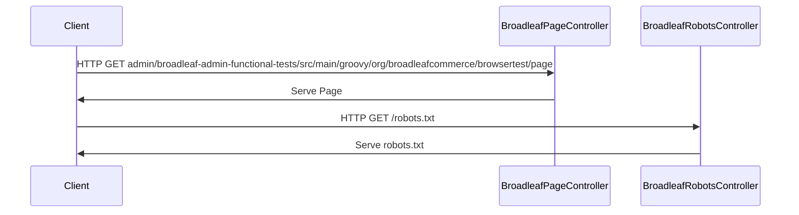

# Overview

Web functionality in the Broadleaf content management module encompasses components and classes responsible for handling web-related tasks such as URL processing, request filtering, and content management. This document provides an overview of key classes and methods that facilitate these functionalities.

# <SwmToken path="admin/broadleaf-contentmanagement-module/src/main/java/org/broadleafcommerce/cms/web/BroadleafProcessURLFilter.java" pos="83:4:4" line-data="public class BroadleafProcessURLFilter extends OncePerRequestFilter {">`BroadleafProcessURLFilter`</SwmToken>

The <SwmToken path="admin/broadleaf-contentmanagement-module/src/main/java/org/broadleafcommerce/cms/web/BroadleafProcessURLFilter.java" pos="83:4:4" line-data="public class BroadleafProcessURLFilter extends OncePerRequestFilter {">`BroadleafProcessURLFilter`</SwmToken> class is a crucial part of the web functionality. It sets up the CMS system by configuring the current sandbox, locale, time of day, and language code used by content items. This filter also checks if a request can be processed by an instance of <SwmToken path="admin/broadleaf-contentmanagement-module/src/main/java/org/broadleafcommerce/cms/web/BroadleafProcessURLFilter.java" pos="72:3:3" line-data=" * URLProcessor and if so, delegates the request to that processor.">`URLProcessor`</SwmToken> and delegates the request accordingly, using an internal cache to quickly determine the appropriate action.

<SwmSnippet path="/admin/broadleaf-contentmanagement-module/src/main/java/org/broadleafcommerce/cms/web/BroadleafProcessURLFilter.java" line="514">

---

The <SwmToken path="admin/broadleaf-contentmanagement-module/src/main/java/org/broadleafcommerce/cms/web/BroadleafProcessURLFilter.java" pos="514:5:5" line-data="    private Site determineSite(ServletRequest request) {">`determineSite`</SwmToken> method in the <SwmToken path="admin/broadleaf-contentmanagement-module/src/main/java/org/broadleafcommerce/cms/web/BroadleafProcessURLFilter.java" pos="83:4:4" line-data="public class BroadleafProcessURLFilter extends OncePerRequestFilter {">`BroadleafProcessURLFilter`</SwmToken> class is responsible for determining the site based on the request. This is essential for multi-tenant support.

```java
    private Site determineSite(ServletRequest request) {
        /* TODO:  Multi-tennant:  Need to add code that determines the site to support
         SiteService.retrieveAllSites();
         For each site, check the identifier type (e.g. hostname, url, param)
         to determine the current site.
         */
        return null;
    }
```

---

</SwmSnippet>

# <SwmToken path="admin/broadleaf-contentmanagement-module/src/main/java/org/broadleafcommerce/cms/web/URLHandlerFilter.java" pos="56:4:4" line-data="public class URLHandlerFilter extends AbstractIgnorableOncePerRequestFilter {">`URLHandlerFilter`</SwmToken>

The <SwmToken path="admin/broadleaf-contentmanagement-module/src/main/java/org/broadleafcommerce/cms/web/URLHandlerFilter.java" pos="56:4:4" line-data="public class URLHandlerFilter extends AbstractIgnorableOncePerRequestFilter {">`URLHandlerFilter`</SwmToken> class, part of the <SwmToken path="admin/broadleaf-contentmanagement-module/src/main/java/org/broadleafcommerce/cms/web/URLHandlerFilter.java" pos="18:2:8" line-data="package org.broadleafcommerce.cms.web;">`org.broadleafcommerce.cms.web`</SwmToken> package, handles URL-related functionalities within the web module.

<SwmSnippet path="/admin/broadleaf-contentmanagement-module/src/main/java/org/broadleafcommerce/cms/web/URLHandlerFilter.java" line="18">

---

The <SwmToken path="admin/broadleaf-contentmanagement-module/src/main/java/org/broadleafcommerce/cms/web/URLHandlerFilter.java" pos="56:4:4" line-data="public class URLHandlerFilter extends AbstractIgnorableOncePerRequestFilter {">`URLHandlerFilter`</SwmToken> class is defined in the <SwmToken path="admin/broadleaf-contentmanagement-module/src/main/java/org/broadleafcommerce/cms/web/URLHandlerFilter.java" pos="18:2:8" line-data="package org.broadleafcommerce.cms.web;">`org.broadleafcommerce.cms.web`</SwmToken> package and imports necessary utilities for URL handling.

```java
package org.broadleafcommerce.cms.web;

import org.apache.commons.lang3.StringUtils;
```

---

</SwmSnippet>

# ContentProcessor and <SwmToken path="admin/broadleaf-contentmanagement-module/src/main/java/org/broadleafcommerce/cms/web/controller/BroadleafPageController.java" pos="60:15:15" line-data="        PageDTO page = (PageDTO) request.getAttribute(PageHandlerMapping.PAGE_ATTRIBUTE_NAME);">`PageHandlerMapping`</SwmToken>

Classes like `ContentProcessor` and <SwmToken path="admin/broadleaf-contentmanagement-module/src/main/java/org/broadleafcommerce/cms/web/controller/BroadleafPageController.java" pos="60:15:15" line-data="        PageDTO page = (PageDTO) request.getAttribute(PageHandlerMapping.PAGE_ATTRIBUTE_NAME);">`PageHandlerMapping`</SwmToken> extend the web capabilities by managing content processing and page handling.

# Web Endpoints

Web endpoints in the Broadleaf content management module handle various HTTP requests to serve pages and other resources.

## <SwmToken path="admin/broadleaf-contentmanagement-module/src/main/java/org/broadleafcommerce/cms/web/controller/BroadleafPageController.java" pos="58:5:5" line-data="    public ModelAndView handleRequest(HttpServletRequest request, HttpServletResponse response) throws Exception {">`handleRequest`</SwmToken>

The <SwmToken path="admin/broadleaf-contentmanagement-module/src/main/java/org/broadleafcommerce/cms/web/controller/BroadleafPageController.java" pos="58:5:5" line-data="    public ModelAndView handleRequest(HttpServletRequest request, HttpServletResponse response) throws Exception {">`handleRequest`</SwmToken> method in the <SwmToken path="admin/broadleaf-contentmanagement-module/src/main/java/org/broadleafcommerce/cms/web/controller/BroadleafPageController.java" pos="46:4:4" line-data="public class BroadleafPageController extends BroadleafAbstractController implements Controller, TemplateTypeAware {">`BroadleafPageController`</SwmToken> class processes incoming HTTP requests to serve pages. It retrieves the <SwmToken path="admin/broadleaf-contentmanagement-module/src/main/java/org/broadleafcommerce/cms/web/controller/BroadleafPageController.java" pos="60:1:1" line-data="        PageDTO page = (PageDTO) request.getAttribute(PageHandlerMapping.PAGE_ATTRIBUTE_NAME);">`PageDTO`</SwmToken> object from the request attributes, sets various model attributes, and determines the appropriate template path for rendering the page. This method also handles content type settings and allows for template path overrides via extension managers.

<SwmSnippet path="/admin/broadleaf-contentmanagement-module/src/main/java/org/broadleafcommerce/cms/web/controller/BroadleafPageController.java" line="57">

---

The <SwmToken path="admin/broadleaf-contentmanagement-module/src/main/java/org/broadleafcommerce/cms/web/controller/BroadleafPageController.java" pos="58:5:5" line-data="    public ModelAndView handleRequest(HttpServletRequest request, HttpServletResponse response) throws Exception {">`handleRequest`</SwmToken> method in the <SwmToken path="admin/broadleaf-contentmanagement-module/src/main/java/org/broadleafcommerce/cms/web/controller/BroadleafPageController.java" pos="46:4:4" line-data="public class BroadleafPageController extends BroadleafAbstractController implements Controller, TemplateTypeAware {">`BroadleafPageController`</SwmToken> class processes HTTP requests and prepares the model and view for rendering the page.

```java
    @Override
    public ModelAndView handleRequest(HttpServletRequest request, HttpServletResponse response) throws Exception {
        ModelAndView model = new ModelAndView();
        PageDTO page = (PageDTO) request.getAttribute(PageHandlerMapping.PAGE_ATTRIBUTE_NAME);
        assert page != null;

        model.addObject(MODEL_ATTRIBUTE_NAME, page);
        model.addObject("pageFields", page.getPageFields()); // For convenience
        model.addObject("BLC_PAGE_TYPE", "page");

        String plainTextStr = (String) page.getPageFields().get("plainText");

        if (!StringUtils.isEmpty(plainTextStr)) {
            if (Boolean.valueOf(plainTextStr)) {
                response.setCharacterEncoding("UTF-8");
                response.setContentType("text/plain");
            }
        }

        String templatePath = page.getTemplatePath();
```

---

</SwmSnippet>

## <SwmToken path="admin/broadleaf-contentmanagement-module/src/main/java/org/broadleafcommerce/cms/web/controller/BroadleafRobotsController.java" pos="59:5:5" line-data="    public String getRobotsFile(HttpServletRequest request, HttpServletResponse response) {">`getRobotsFile`</SwmToken>

The <SwmToken path="admin/broadleaf-contentmanagement-module/src/main/java/org/broadleafcommerce/cms/web/controller/BroadleafRobotsController.java" pos="59:5:5" line-data="    public String getRobotsFile(HttpServletRequest request, HttpServletResponse response) {">`getRobotsFile`</SwmToken> method in the <SwmToken path="admin/broadleaf-contentmanagement-module/src/main/java/org/broadleafcommerce/cms/web/controller/BroadleafRobotsController.java" pos="43:4:4" line-data="public class BroadleafRobotsController {">`BroadleafRobotsController`</SwmToken> class serves the <SwmToken path="admin/broadleaf-contentmanagement-module/src/main/java/org/broadleafcommerce/cms/web/controller/BroadleafRobotsController.java" pos="66:3:5" line-data="                &quot;/robots.txt&quot;, buildMvelParameters(request), isSecure(request));">`robots.txt`</SwmToken> file. It sets the response content type and character encoding, retrieves the <SwmToken path="admin/broadleaf-contentmanagement-module/src/main/java/org/broadleafcommerce/cms/web/controller/BroadleafPageController.java" pos="60:1:1" line-data="        PageDTO page = (PageDTO) request.getAttribute(PageHandlerMapping.PAGE_ATTRIBUTE_NAME);">`PageDTO`</SwmToken> object for the <SwmToken path="admin/broadleaf-contentmanagement-module/src/main/java/org/broadleafcommerce/cms/web/controller/BroadleafRobotsController.java" pos="66:2:5" line-data="                &quot;/robots.txt&quot;, buildMvelParameters(request), isSecure(request));">`/robots.txt`</SwmToken> URI, and returns the body content if available. If the page is not found, it returns a default <SwmToken path="admin/broadleaf-contentmanagement-module/src/main/java/org/broadleafcommerce/cms/web/controller/BroadleafRobotsController.java" pos="66:3:5" line-data="                &quot;/robots.txt&quot;, buildMvelParameters(request), isSecure(request));">`robots.txt`</SwmToken> content.

<SwmSnippet path="/admin/broadleaf-contentmanagement-module/src/main/java/org/broadleafcommerce/cms/web/controller/BroadleafRobotsController.java" line="59">

---

The <SwmToken path="admin/broadleaf-contentmanagement-module/src/main/java/org/broadleafcommerce/cms/web/controller/BroadleafRobotsController.java" pos="59:5:5" line-data="    public String getRobotsFile(HttpServletRequest request, HttpServletResponse response) {">`getRobotsFile`</SwmToken> method in the <SwmToken path="admin/broadleaf-contentmanagement-module/src/main/java/org/broadleafcommerce/cms/web/controller/BroadleafRobotsController.java" pos="43:4:4" line-data="public class BroadleafRobotsController {">`BroadleafRobotsController`</SwmToken> class serves the <SwmToken path="admin/broadleaf-contentmanagement-module/src/main/java/org/broadleafcommerce/cms/web/controller/BroadleafRobotsController.java" pos="66:3:5" line-data="                &quot;/robots.txt&quot;, buildMvelParameters(request), isSecure(request));">`robots.txt`</SwmToken> file, setting the appropriate content type and character encoding.

```java
    public String getRobotsFile(HttpServletRequest request, HttpServletResponse response) {
    	blcContextUtil.establishThinRequestContext();
    	
        response.setContentType("text/plain");
        response.setCharacterEncoding("UTF-8");

        PageDTO page = pageService.findPageByURI(null,
                "/robots.txt", buildMvelParameters(request), isSecure(request));

        if (page != null && page.getPageFields().containsKey("body")) {
            String body = (String) page.getPageFields().get("body");
            body = body.replace("${siteBaseUrl}", baseUrlResolver.getSiteBaseUrl());
            return body;
        } else {
            return getDefaultRobotsTxt();
        }
    }
```

---

</SwmSnippet>

&nbsp;

*This is an auto-generated document by Swimm AI 🌊 and has not yet been verified by a human*

<SwmMeta version="3.0.0" repo-id="Z2l0aHViJTNBJTNBQnJvYWRsZWFmQ29tbWVyY2UtZGVtby1uZXclM0ElM0FTd2ltbS1EZW1v" repo-name="BroadleafCommerce-demo-new" doc-type="overview"><sup>Powered by [Swimm](/)</sup></SwmMeta>
