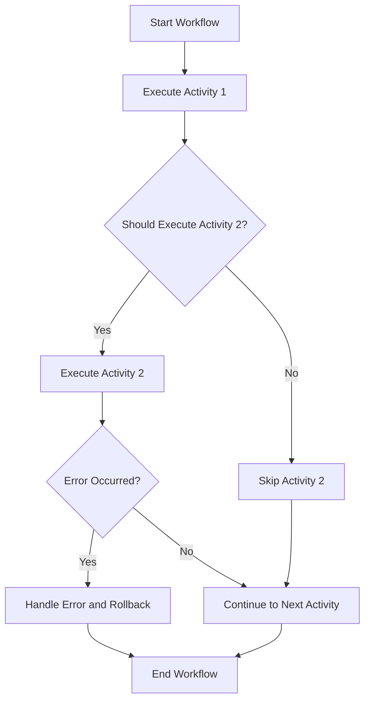

# Basic Concepts of Workflow in Core Module

Workflow refers to the sequence of steps or activities that are executed in a specific order to achieve a particular business process. In the Core Module, workflows are defined using the <SwmToken path="core/broadleaf-framework/src/main/java/org/broadleafcommerce/core/workflow/Activity.java" pos="33:3:3" line-data=" * activity should implement the {@link ModuleActivity} interface as well. This ensures that there is proper logging">`activity`</SwmToken> interface, which represents a single step in the workflow.

Each <SwmToken path="core/broadleaf-framework/src/main/java/org/broadleafcommerce/core/workflow/Activity.java" pos="33:3:3" line-data=" * activity should implement the {@link ModuleActivity} interface as well. This ensures that there is proper logging">`activity`</SwmToken> can be executed, checked for execution conditions, and can have error handling and rollback mechanisms. The <SwmToken path="core/broadleaf-framework/src/main/java/org/broadleafcommerce/core/workflow/Activity.java" pos="40:10:10" line-data=" * @see {@link BaseProcessor}">`BaseProcessor`</SwmToken> class is responsible for managing the ordered collection of <SwmToken path="core/broadleaf-framework/src/main/java/org/broadleafcommerce/core/workflow/Activity.java" pos="33:3:3" line-data=" * activity should implement the {@link ModuleActivity} interface as well. This ensures that there is proper logging">`activity`</SwmToken> instances and executing them in sequence.

The <SwmToken path="core/broadleaf-framework/src/main/java/org/broadleafcommerce/core/workflow/Activity.java" pos="41:10:10" line-data=" * @see {@link SequenceProcessor}">`SequenceProcessor`</SwmToken> class implements the <SwmToken path="core/broadleaf-framework/src/main/java/org/broadleafcommerce/core/workflow/SequenceProcessor.java" pos="46:15:15" line-data="    public &lt;P extends ProcessContext&lt;U&gt;&gt; P doActivities(T seedData) throws WorkflowException {">`doActivities`</SwmToken> method, which iterates through the list of activities, executing each one and handling any exceptions or rollbacks as needed.

The <SwmToken path="core/broadleaf-framework/src/main/java/org/broadleafcommerce/core/workflow/SequenceProcessor.java" pos="50:1:1" line-data="        ActivityStateManager activityStateManager = getBeanFactory().getBean(ActivityStateManager.class, &quot;blActivityStateManager&quot;);">`ActivityStateManager`</SwmToken> and <SwmToken path="core/broadleaf-framework/src/main/java/org/broadleafcommerce/core/workflow/state/ActivityStateManager.java" pos="27:11:11" line-data=" * for registering state and RollbackHandler instances, as well as initiating rollbacks of">`RollbackHandler`</SwmToken> interfaces provide mechanisms for managing the state and handling rollbacks in case of errors during the workflow execution.

<SwmSnippet path="/core/broadleaf-framework/src/main/java/org/broadleafcommerce/core/workflow/Activity.java" line="27">

---

# Activity Interface

The <SwmToken path="core/broadleaf-framework/src/main/java/org/broadleafcommerce/core/workflow/Activity.java" pos="33:3:3" line-data=" * activity should implement the {@link ModuleActivity} interface as well. This ensures that there is proper logging">`activity`</SwmToken> interface defines the contract for a single step in the workflow. It includes methods for executing the activity, checking if it should execute, and handling errors and rollbacks.

```java
/**
 * <p>
 * Interface to be used for workflows in Broadleaf. Usually implementations will subclass {@link BaseActivity}.
 * </p>
 * 
 * Important note: if you are writing a 3rd-party integration module or adding a module outside of the Broadleaf core, your
 * activity should implement the {@link ModuleActivity} interface as well. This ensures that there is proper logging
 * for users that are using your module so that they know exactly what their final workflow configuration looks like.
 *
 * @author Phillip Verheyden (phillipuniverse)
 * @param <T>
 * @see {@link BaseActivity}
 * @see {@link ModuleActivity}
 * @see {@link BaseProcessor}
 * @see {@link SequenceProcessor}
 */
public interface Activity<T extends ProcessContext<?>> extends BeanNameAware, Ordered {

    /**
     * Called by the encompassing processor to activate
     * the execution of the Activity
```

---

</SwmSnippet>

<SwmSnippet path="/core/broadleaf-framework/src/main/java/org/broadleafcommerce/core/workflow/BaseProcessor.java" line="45">

---

# <SwmToken path="core/broadleaf-framework/src/main/java/org/broadleafcommerce/core/workflow/BaseProcessor.java" pos="52:6:6" line-data="public abstract class BaseProcessor&lt;U, T&gt; implements BeanNameAware, BeanFactoryAware, Processor&lt;U, T&gt;, ApplicationListener&lt;ContextRefreshedEvent&gt; {">`BaseProcessor`</SwmToken> Class

The <SwmToken path="core/broadleaf-framework/src/main/java/org/broadleafcommerce/core/workflow/BaseProcessor.java" pos="52:6:6" line-data="public abstract class BaseProcessor&lt;U, T&gt; implements BeanNameAware, BeanFactoryAware, Processor&lt;U, T&gt;, ApplicationListener&lt;ContextRefreshedEvent&gt; {">`BaseProcessor`</SwmToken> class is responsible for managing the ordered collection of <SwmToken path="core/broadleaf-framework/src/main/java/org/broadleafcommerce/core/workflow/BaseProcessor.java" pos="46:9:9" line-data=" * of {@link Activity Activities}">`Activity`</SwmToken> instances and executing them in sequence. It ensures that each activity is executed in the correct order and handles any exceptions or rollbacks as needed.

```java
 * Base class for all Workflow Processors.  Responsible of keeping track of an ordered collection
 * of {@link Activity Activities}
 * 
 * @since March 1, 2005
 * @see Activity
 * 
 */
public abstract class BaseProcessor<U, T> implements BeanNameAware, BeanFactoryAware, Processor<U, T>, ApplicationListener<ContextRefreshedEvent> {

    protected BeanFactory beanFactory;
    protected String beanName;
    protected List<Activity<ProcessContext<U>>> activities = new ArrayList<>();
    protected List<ModuleActivity> moduleActivities = new ArrayList<>();
    
    protected ErrorHandler defaultErrorHandler;

    @Value("${workflow.auto.rollback.on.error}")
    private boolean autoRollbackOnError = true;
    
    /**
     * If set to true, this will allow an empty set of activities, thus creating a 'do-nothing' workflow
```

---

</SwmSnippet>

<SwmSnippet path="/core/broadleaf-framework/src/main/java/org/broadleafcommerce/core/workflow/SequenceProcessor.java" line="45">

---

# <SwmToken path="core/broadleaf-framework/src/main/java/org/broadleafcommerce/core/workflow/Activity.java" pos="41:10:10" line-data=" * @see {@link SequenceProcessor}">`SequenceProcessor`</SwmToken> Class

The <SwmToken path="core/broadleaf-framework/src/main/java/org/broadleafcommerce/core/workflow/Activity.java" pos="41:10:10" line-data=" * @see {@link SequenceProcessor}">`SequenceProcessor`</SwmToken> class implements the <SwmToken path="core/broadleaf-framework/src/main/java/org/broadleafcommerce/core/workflow/SequenceProcessor.java" pos="46:15:15" line-data="    public &lt;P extends ProcessContext&lt;U&gt;&gt; P doActivities(T seedData) throws WorkflowException {">`doActivities`</SwmToken> method, which iterates through the list of activities, executing each one and handling any exceptions or rollbacks as needed.

```java
    @Override
    public <P extends ProcessContext<U>> P doActivities(T seedData) throws WorkflowException {
        if (LOG.isDebugEnabled()) {
            LOG.debug(getBeanName() + " processor is running..");
        }
        ActivityStateManager activityStateManager = getBeanFactory().getBean(ActivityStateManager.class, "blActivityStateManager");
        if (activityStateManager == null) {
            throw new IllegalStateException("Unable to find an instance of ActivityStateManager registered under bean id blActivityStateManager");
        }
        ProcessContext<U> context = null;
        
        RollbackStateLocal rollbackStateLocal = new RollbackStateLocal();
        rollbackStateLocal.setThreadId(String.valueOf(Thread.currentThread().getId()));
        rollbackStateLocal.setWorkflowId(getBeanName());
        RollbackStateLocal.setRollbackStateLocal(rollbackStateLocal);
        
        try {
            //retrieve injected by Spring
            List<Activity<ProcessContext<U>>> activities = getActivities();

            //retrieve a new instance of the Workflow ProcessContext
```

---

</SwmSnippet>

<SwmSnippet path="/core/broadleaf-framework/src/main/java/org/broadleafcommerce/core/workflow/state/ActivityStateManager.java" line="20">

---

# <SwmToken path="core/broadleaf-framework/src/main/java/org/broadleafcommerce/core/workflow/state/ActivityStateManager.java" pos="32:4:4" line-data="public interface ActivityStateManager&lt;T extends ProcessContext&lt;?&gt;&gt; {">`ActivityStateManager`</SwmToken> Interface

The <SwmToken path="core/broadleaf-framework/src/main/java/org/broadleafcommerce/core/workflow/state/ActivityStateManager.java" pos="32:4:4" line-data="public interface ActivityStateManager&lt;T extends ProcessContext&lt;?&gt;&gt; {">`ActivityStateManager`</SwmToken> interface provides mechanisms for managing the state of activities and handling rollbacks in case of errors during the workflow execution.

```java
import org.broadleafcommerce.core.workflow.Activity;
import org.broadleafcommerce.core.workflow.ProcessContext;

import java.util.Map;

/**
 * Manages activity state for the current thread during workflow execution. Provides facility
 * for registering state and RollbackHandler instances, as well as initiating rollbacks of
 * previously registered state.
 *
 * @author Jeff Fischer
 */
public interface ActivityStateManager<T extends ProcessContext<?>> {

    /**
     * Register a RollbackHandler instance and some arbitrary state items with the
     * StateManager. In the event of a rollbackAllState() call, the StateManager will
     * execute all registered RollbackHandler instances. Note, Broadleaf does not try to wrap
     * the RollbackHandler execution in a database transaction. Therefore, if the RollbackHandler
     * implementation requires a database transaction (i.e. it's updating the database), then
     * the implementer must supply it. The easiest way to achieve this is to register the RollbackHandler
```

---

</SwmSnippet>

<SwmSnippet path="/core/broadleaf-framework/src/main/java/org/broadleafcommerce/core/workflow/state/RollbackHandler.java" line="20">

---

# <SwmToken path="core/broadleaf-framework/src/main/java/org/broadleafcommerce/core/workflow/state/RollbackHandler.java" pos="32:4:4" line-data="public interface RollbackHandler&lt;T extends ProcessContext&lt;?&gt;&gt; {">`RollbackHandler`</SwmToken> Interface

The <SwmToken path="core/broadleaf-framework/src/main/java/org/broadleafcommerce/core/workflow/state/RollbackHandler.java" pos="32:4:4" line-data="public interface RollbackHandler&lt;T extends ProcessContext&lt;?&gt;&gt; {">`RollbackHandler`</SwmToken> interface defines the contract for handling rollbacks. Implementations are responsible for performing compensating operations to revert the state of the activity to what it was prior to execution.

```java
import org.broadleafcommerce.core.workflow.Activity;
import org.broadleafcommerce.core.workflow.ProcessContext;

import java.util.Map;

/**
 * Implementations are responsible for performing compensating operations to revert the state of the activity to what it
 * was prior to execution. Activity, ProcessContext and stateConfiguration variables can be used to gather the necessary
 * information to successfully perform the compensating operation.
 *
 * @author Jeff Fischer
 */
public interface RollbackHandler<T extends ProcessContext<?>> {

    /**
     * Rollback the state of the activity to what it was prior to execution.
     *
     * @param activity The Activity instance whose state is being reverted
     * @param processContext The ProcessContext for the workflow
     * @param stateConfiguration Any user-defined state configuration associated with the RollbackHandler
     * @throws RollbackFailureException if there is a failure during the execution of the rollback
```

---

</SwmSnippet>

# Main Functions

There are several main functions in this folder. Some of them are <SwmToken path="core/broadleaf-framework/src/main/java/org/broadleafcommerce/core/workflow/Activity.java" pos="53:5:5" line-data="    public T execute(T context) throws Exception;">`execute`</SwmToken>, <SwmToken path="core/broadleaf-framework/src/main/java/org/broadleafcommerce/core/workflow/Activity.java" pos="64:5:5" line-data="    public boolean shouldExecute(T context);">`shouldExecute`</SwmToken>, <SwmToken path="core/broadleaf-framework/src/main/java/org/broadleafcommerce/core/workflow/Activity.java" pos="70:5:5" line-data="    public ErrorHandler getErrorHandler();">`getErrorHandler`</SwmToken>, <SwmToken path="core/broadleaf-framework/src/main/java/org/broadleafcommerce/core/workflow/Activity.java" pos="72:5:5" line-data="    public void setErrorHandler(final ErrorHandler errorHandler);">`setErrorHandler`</SwmToken>, <SwmToken path="core/broadleaf-framework/src/main/java/org/broadleafcommerce/core/workflow/SequenceProcessor.java" pos="48:5:5" line-data="            LOG.debug(getBeanName() + &quot; processor is running..&quot;);">`getBeanName`</SwmToken>, and <SwmToken path="core/broadleaf-framework/src/main/java/org/broadleafcommerce/core/workflow/Activity.java" pos="83:8:8" line-data="    public RollbackHandler&lt;T&gt; getRollbackHandler();">`getRollbackHandler`</SwmToken>. We will dive a little into <SwmToken path="core/broadleaf-framework/src/main/java/org/broadleafcommerce/core/workflow/Activity.java" pos="53:5:5" line-data="    public T execute(T context) throws Exception;">`execute`</SwmToken> and <SwmToken path="core/broadleaf-framework/src/main/java/org/broadleafcommerce/core/workflow/Activity.java" pos="64:5:5" line-data="    public boolean shouldExecute(T context);">`shouldExecute`</SwmToken>.

<SwmSnippet path="/core/broadleaf-framework/src/main/java/org/broadleafcommerce/core/workflow/Activity.java" line="45">

---

## execute

The <SwmToken path="core/broadleaf-framework/src/main/java/org/broadleafcommerce/core/workflow/Activity.java" pos="53:5:5" line-data="    public T execute(T context) throws Exception;">`execute`</SwmToken> function is called by the encompassing processor to activate the execution of the Activity. It takes a <SwmToken path="core/broadleaf-framework/src/main/java/org/broadleafcommerce/core/workflow/Activity.java" pos="43:10:10" line-data="public interface Activity&lt;T extends ProcessContext&lt;?&gt;&gt; extends BeanNameAware, Ordered {">`ProcessContext`</SwmToken> as a parameter and returns the resulting <SwmToken path="core/broadleaf-framework/src/main/java/org/broadleafcommerce/core/workflow/Activity.java" pos="43:10:10" line-data="public interface Activity&lt;T extends ProcessContext&lt;?&gt;&gt; extends BeanNameAware, Ordered {">`ProcessContext`</SwmToken>.

```java
    /**
     * Called by the encompassing processor to activate
     * the execution of the Activity
     * 
     * @param context - process context for this workflow
     * @return resulting process context
     * @throws Exception
     */
    public T execute(T context) throws Exception;
```

---

</SwmSnippet>

<SwmSnippet path="/core/broadleaf-framework/src/main/java/org/broadleafcommerce/core/workflow/Activity.java" line="55">

---

## <SwmToken path="core/broadleaf-framework/src/main/java/org/broadleafcommerce/core/workflow/Activity.java" pos="64:5:5" line-data="    public boolean shouldExecute(T context);">`shouldExecute`</SwmToken>

The <SwmToken path="core/broadleaf-framework/src/main/java/org/broadleafcommerce/core/workflow/Activity.java" pos="64:5:5" line-data="    public boolean shouldExecute(T context);">`shouldExecute`</SwmToken> function determines if an activity should execute based on the current values in the <SwmToken path="core/broadleaf-framework/src/main/java/org/broadleafcommerce/core/workflow/Activity.java" pos="56:33:33" line-data="     * Determines if an activity should execute based on the current values in the {@link ProcessContext}. For example, a">`ProcessContext`</SwmToken>. This allows for conditional execution of activities within a workflow.

```java
    /**
     * Determines if an activity should execute based on the current values in the {@link ProcessContext}. For example, a
     * context might have both an {@link Order} as well as a String 'status' of what the order should be changed to. It is
     * possible that an activity in a workflow could only deal with a particular status change, and thus could return false
     * from this method.
     * 
     * @param context
     * @return
     */
    public boolean shouldExecute(T context);
```

---

</SwmSnippet>

&nbsp;

*This is an auto-generated document by Swimm AI 🌊 and has not yet been verified by a human*

<SwmMeta version="3.0.0" repo-id="Z2l0aHViJTNBJTNBQnJvYWRsZWFmQ29tbWVyY2UtZGVtby1uZXclM0ElM0FTd2ltbS1EZW1v" repo-name="BroadleafCommerce-demo-new" doc-type="overview"><sup>Powered by [Swimm](/)</sup></SwmMeta>
