In this document, we will explain the process of building an order item from a data transfer object (DTO). This process involves several steps, including retrieving necessary data, creating different types of order items, and ensuring all attributes are properly set.

The flow starts with the <SwmToken path="core/broadleaf-framework/src/main/java/org/broadleafcommerce/core/order/service/OrderItemServiceImpl.java" pos="503:5:5" line-data="    public OrderItem buildOrderItemFromDTO(Order order, OrderItemRequestDTO orderItemRequestDTO) {">`buildOrderItemFromDTO`</SwmToken> method, which takes an order and a DTO as inputs. It retrieves the SKU, product, and category based on the <SwmToken path="core/broadleaf-framework/src/main/java/org/broadleafcommerce/core/util/queue/ZookeeperDistributedQueue.java" pos="144:9:9" line-data="            this.acls = ZooDefs.Ids.OPEN_ACL_UNSAFE;">`Ids`</SwmToken> provided in the DTO. Depending on the type of order item requested, it delegates the creation to specific methods like <SwmToken path="core/broadleaf-framework/src/main/java/org/broadleafcommerce/core/order/service/OrderItemServiceImpl.java" pos="346:5:5" line-data="    public BundleOrderItem createBundleOrderItem(final BundleOrderItemRequest itemRequest) {">`createBundleOrderItem`</SwmToken>, <SwmToken path="core/broadleaf-framework/src/main/java/org/broadleafcommerce/core/order/service/OrderItemServiceImpl.java" pos="308:5:5" line-data="    public GiftWrapOrderItem createGiftWrapOrderItem(final GiftWrapOrderItemRequest itemRequest) {">`createGiftWrapOrderItem`</SwmToken>, or <SwmToken path="core/broadleaf-framework/src/main/java/org/broadleafcommerce/core/order/service/OrderItemServiceImpl.java" pos="216:5:5" line-data="    public DiscreteOrderItem createDiscreteOrderItem(final DiscreteOrderItemRequest itemRequest) {">`createDiscreteOrderItem`</SwmToken>. Each of these methods sets various properties and ensures that the order item is fully populated with all necessary details.

# Flow drill down

```mermaid
graph TD;
      subgraph core/broadleaf-framework/src/main/java/org/broadleafcommerce/core
57af8719e3c48290fcbe97758cea4ee9c6bd85491f654538333d27aaf548e734(buildOrderItemFromDTO):::mainFlowStyle --> b9ad38433628c3eb906aa5a85815255e83ca0dec9ec22543c1a2f49a867a4fbe(createBundleOrderItem):::mainFlowStyle
end

subgraph core/broadleaf-framework/src/main/java/org/broadleafcommerce/core
b9ad38433628c3eb906aa5a85815255e83ca0dec9ec22543c1a2f49a867a4fbe(createBundleOrderItem):::mainFlowStyle --> 979a16a83f16540621063f472f52dd74bbb67e788d8123b2b34460c52791f332(createGiftWrapOrderItem)
end

subgraph core/broadleaf-framework/src/main/java/org/broadleafcommerce/core
b9ad38433628c3eb906aa5a85815255e83ca0dec9ec22543c1a2f49a867a4fbe(createBundleOrderItem):::mainFlowStyle --> f0e2fdd67267567aa7b06e846f6d56fc14d35223f92c10cb8b86a2cfbcfcf3ff(createDiscreteOrderItem):::mainFlowStyle
end

subgraph core/broadleaf-framework/src/main/java/org/broadleafcommerce/core
979a16a83f16540621063f472f52dd74bbb67e788d8123b2b34460c52791f332(createGiftWrapOrderItem) --> c122da6a7a916809e76f4e9908f55f7a5195ff3b457f93f1b241a989a20fa9ac(addAll)
end


      classDef mainFlowStyle color:#000000,fill:#7CB9F4
classDef rootsStyle color:#000000,fill:#00FFF4
classDef Style1 color:#000000,fill:#00FFAA
classDef Style2 color:#000000,fill:#FFFF00
classDef Style3 color:#000000,fill:#AA7CB9

%% Swimm:
%% graph TD;
%%       subgraph <SwmPath>[core/broadleaf-framework/src/main/java/org/broadleafcommerce/core/](core/broadleaf-framework/src/main/java/org/broadleafcommerce/core/)</SwmPath>
%% 57af8719e3c48290fcbe97758cea4ee9c6bd85491f654538333d27aaf548e734(buildOrderItemFromDTO):::mainFlowStyle --> b9ad38433628c3eb906aa5a85815255e83ca0dec9ec22543c1a2f49a867a4fbe(createBundleOrderItem):::mainFlowStyle
%% end
%% 
%% subgraph <SwmPath>[core/broadleaf-framework/src/main/java/org/broadleafcommerce/core/](core/broadleaf-framework/src/main/java/org/broadleafcommerce/core/)</SwmPath>
%% b9ad38433628c3eb906aa5a85815255e83ca0dec9ec22543c1a2f49a867a4fbe(createBundleOrderItem):::mainFlowStyle --> 979a16a83f16540621063f472f52dd74bbb67e788d8123b2b34460c52791f332(createGiftWrapOrderItem)
%% end
%% 
%% subgraph <SwmPath>[core/broadleaf-framework/src/main/java/org/broadleafcommerce/core/](core/broadleaf-framework/src/main/java/org/broadleafcommerce/core/)</SwmPath>
%% b9ad38433628c3eb906aa5a85815255e83ca0dec9ec22543c1a2f49a867a4fbe(createBundleOrderItem):::mainFlowStyle --> f0e2fdd67267567aa7b06e846f6d56fc14d35223f92c10cb8b86a2cfbcfcf3ff(createDiscreteOrderItem):::mainFlowStyle
%% end
%% 
%% subgraph <SwmPath>[core/broadleaf-framework/src/main/java/org/broadleafcommerce/core/](core/broadleaf-framework/src/main/java/org/broadleafcommerce/core/)</SwmPath>
%% 979a16a83f16540621063f472f52dd74bbb67e788d8123b2b34460c52791f332(createGiftWrapOrderItem) --> c122da6a7a916809e76f4e9908f55f7a5195ff3b457f93f1b241a989a20fa9ac(addAll)
%% end
%% 
%% 
%%       classDef mainFlowStyle color:#000000,fill:#7CB9F4
%% classDef rootsStyle color:#000000,fill:#00FFF4
%% classDef Style1 color:#000000,fill:#00FFAA
%% classDef Style2 color:#000000,fill:#FFFF00
%% classDef Style3 color:#000000,fill:#AA7CB9
```



<SwmSnippet path="/core/broadleaf-framework/src/main/java/org/broadleafcommerce/core/order/service/OrderItemServiceImpl.java" line="502">

---

## <SwmToken path="core/broadleaf-framework/src/main/java/org/broadleafcommerce/core/order/service/OrderItemServiceImpl.java" pos="503:5:5" line-data="    public OrderItem buildOrderItemFromDTO(Order order, OrderItemRequestDTO orderItemRequestDTO) {">`buildOrderItemFromDTO`</SwmToken>

The <SwmToken path="core/broadleaf-framework/src/main/java/org/broadleafcommerce/core/order/service/OrderItemServiceImpl.java" pos="503:5:5" line-data="    public OrderItem buildOrderItemFromDTO(Order order, OrderItemRequestDTO orderItemRequestDTO) {">`buildOrderItemFromDTO`</SwmToken> method is responsible for constructing an <SwmToken path="core/broadleaf-framework/src/main/java/org/broadleafcommerce/core/order/service/OrderItemServiceImpl.java" pos="503:3:3" line-data="    public OrderItem buildOrderItemFromDTO(Order order, OrderItemRequestDTO orderItemRequestDTO) {">`OrderItem`</SwmToken> from a given <SwmToken path="core/broadleaf-framework/src/main/java/org/broadleafcommerce/core/order/service/OrderItemServiceImpl.java" pos="503:12:12" line-data="    public OrderItem buildOrderItemFromDTO(Order order, OrderItemRequestDTO orderItemRequestDTO) {">`OrderItemRequestDTO`</SwmToken>. It first retrieves the SKU, product, and category based on the <SwmToken path="core/broadleaf-framework/src/main/java/org/broadleafcommerce/core/util/queue/ZookeeperDistributedQueue.java" pos="144:9:9" line-data="            this.acls = ZooDefs.Ids.OPEN_ACL_UNSAFE;">`Ids`</SwmToken> provided in the DTO. Depending on the type of <SwmToken path="core/broadleaf-framework/src/main/java/org/broadleafcommerce/core/order/service/OrderItemServiceImpl.java" pos="503:12:12" line-data="    public OrderItem buildOrderItemFromDTO(Order order, OrderItemRequestDTO orderItemRequestDTO) {">`OrderItemRequestDTO`</SwmToken>, it delegates the creation to either <SwmToken path="core/broadleaf-framework/src/main/java/org/broadleafcommerce/core/order/service/OrderItemServiceImpl.java" pos="145:5:5" line-data="    public OrderItem createOrderItem(final OrderItemRequest itemRequest) {">`createOrderItem`</SwmToken>, <SwmToken path="core/broadleaf-framework/src/main/java/org/broadleafcommerce/core/order/service/OrderItemServiceImpl.java" pos="216:5:5" line-data="    public DiscreteOrderItem createDiscreteOrderItem(final DiscreteOrderItemRequest itemRequest) {">`createDiscreteOrderItem`</SwmToken>, or <SwmToken path="core/broadleaf-framework/src/main/java/org/broadleafcommerce/core/order/service/OrderItemServiceImpl.java" pos="346:5:5" line-data="    public BundleOrderItem createBundleOrderItem(final BundleOrderItemRequest itemRequest) {">`createBundleOrderItem`</SwmToken>. This method ensures that the correct type of order item is created and populated with the necessary attributes.

```java
    @Override
    public OrderItem buildOrderItemFromDTO(Order order, OrderItemRequestDTO orderItemRequestDTO) {
        Sku sku = null;
        if (orderItemRequestDTO.getSkuId() != null) {
            sku = catalogService.findSkuById(orderItemRequestDTO.getSkuId());
        }

        Product product = null;
        if (orderItemRequestDTO.getProductId() != null) {
            product = catalogService.findProductById(orderItemRequestDTO.getProductId());
        } else if (sku != null) {
            product = sku.getProduct();
        }

        Category category = null;
        if (orderItemRequestDTO.getCategoryId() != null) {
            category = catalogService.findCategoryById(orderItemRequestDTO.getCategoryId());
        }

        if (category == null && product != null) {
            category = product.getDefaultCategory();
```

---

</SwmSnippet>

<SwmSnippet path="/core/broadleaf-framework/src/main/java/org/broadleafcommerce/core/order/service/OrderItemServiceImpl.java" line="345">

---

## <SwmToken path="core/broadleaf-framework/src/main/java/org/broadleafcommerce/core/order/service/OrderItemServiceImpl.java" pos="346:5:5" line-data="    public BundleOrderItem createBundleOrderItem(final BundleOrderItemRequest itemRequest) {">`createBundleOrderItem`</SwmToken>

The <SwmToken path="core/broadleaf-framework/src/main/java/org/broadleafcommerce/core/order/service/OrderItemServiceImpl.java" pos="346:5:5" line-data="    public BundleOrderItem createBundleOrderItem(final BundleOrderItemRequest itemRequest) {">`createBundleOrderItem`</SwmToken> method creates a <SwmToken path="core/broadleaf-framework/src/main/java/org/broadleafcommerce/core/order/service/OrderItemServiceImpl.java" pos="346:3:3" line-data="    public BundleOrderItem createBundleOrderItem(final BundleOrderItemRequest itemRequest) {">`BundleOrderItem`</SwmToken> from a <SwmToken path="core/broadleaf-framework/src/main/java/org/broadleafcommerce/core/order/service/OrderItemServiceImpl.java" pos="346:9:9" line-data="    public BundleOrderItem createBundleOrderItem(final BundleOrderItemRequest itemRequest) {">`BundleOrderItemRequest`</SwmToken>. It sets various properties such as quantity, category, and prices. It also iterates over the discrete items in the bundle and creates either <SwmToken path="core/broadleaf-framework/src/main/java/org/broadleafcommerce/core/order/service/OrderItemServiceImpl.java" pos="308:3:3" line-data="    public GiftWrapOrderItem createGiftWrapOrderItem(final GiftWrapOrderItemRequest itemRequest) {">`GiftWrapOrderItem`</SwmToken> or <SwmToken path="core/broadleaf-framework/src/main/java/org/broadleafcommerce/core/order/service/OrderItemServiceImpl.java" pos="216:3:3" line-data="    public DiscreteOrderItem createDiscreteOrderItem(final DiscreteOrderItemRequest itemRequest) {">`DiscreteOrderItem`</SwmToken> for each, adding them to the bundle. This method ensures that all items in the bundle are properly instantiated and associated with the bundle.

```java
    @Override
    public BundleOrderItem createBundleOrderItem(final BundleOrderItemRequest itemRequest) {
        final BundleOrderItem item = (BundleOrderItem) orderItemDao.create(OrderItemType.BUNDLE);
        item.setQuantity(itemRequest.getQuantity());
        item.setCategory(itemRequest.getCategory());
        item.setName(itemRequest.getName());
        item.setBundleOrderItemFeePrices(itemRequest.getBundleOrderItemFeePrices());
        item.setOrder(itemRequest.getOrder());

        if (itemRequest.getSalePriceOverride() != null) {
            item.setSalePriceOverride(Boolean.TRUE);
            item.setSalePrice(itemRequest.getSalePriceOverride());
            item.setBaseSalePrice(itemRequest.getSalePriceOverride());
        }

        if (itemRequest.getRetailPriceOverride() != null) {
            item.setRetailPriceOverride(Boolean.TRUE);
            item.setRetailPrice(itemRequest.getRetailPriceOverride());
            item.setBaseRetailPrice(itemRequest.getRetailPriceOverride());
        }

```

---

</SwmSnippet>

<SwmSnippet path="/core/broadleaf-framework/src/main/java/org/broadleafcommerce/core/order/service/OrderItemServiceImpl.java" line="307">

---

## <SwmToken path="core/broadleaf-framework/src/main/java/org/broadleafcommerce/core/order/service/OrderItemServiceImpl.java" pos="308:5:5" line-data="    public GiftWrapOrderItem createGiftWrapOrderItem(final GiftWrapOrderItemRequest itemRequest) {">`createGiftWrapOrderItem`</SwmToken>

The <SwmToken path="core/broadleaf-framework/src/main/java/org/broadleafcommerce/core/order/service/OrderItemServiceImpl.java" pos="308:5:5" line-data="    public GiftWrapOrderItem createGiftWrapOrderItem(final GiftWrapOrderItemRequest itemRequest) {">`createGiftWrapOrderItem`</SwmToken> method creates a <SwmToken path="core/broadleaf-framework/src/main/java/org/broadleafcommerce/core/order/service/OrderItemServiceImpl.java" pos="308:3:3" line-data="    public GiftWrapOrderItem createGiftWrapOrderItem(final GiftWrapOrderItemRequest itemRequest) {">`GiftWrapOrderItem`</SwmToken> from a <SwmToken path="core/broadleaf-framework/src/main/java/org/broadleafcommerce/core/order/service/OrderItemServiceImpl.java" pos="308:9:9" line-data="    public GiftWrapOrderItem createGiftWrapOrderItem(final GiftWrapOrderItemRequest itemRequest) {">`GiftWrapOrderItemRequest`</SwmToken>. It sets properties such as SKU, order, quantity, and prices. It also updates the sale and retail prices and assigns the final price. Additionally, it associates the wrapped items with the gift wrap order item. This method ensures that the gift wrap order item is properly configured and linked to the items it wraps.

```java
    @Override
    public GiftWrapOrderItem createGiftWrapOrderItem(final GiftWrapOrderItemRequest itemRequest) {
        final GiftWrapOrderItem item = (GiftWrapOrderItem) orderItemDao.create(OrderItemType.GIFTWRAP);
        item.setSku(itemRequest.getSku());
        item.setOrder(itemRequest.getOrder());
        item.setBundleOrderItem(itemRequest.getBundleOrderItem());
        item.setQuantity(itemRequest.getQuantity());
        item.setCategory(itemRequest.getCategory());
        item.setProduct(itemRequest.getProduct());
        item.setBaseSalePrice(itemRequest.getSku().getSalePrice());
        item.setBaseRetailPrice(itemRequest.getSku().getRetailPrice());
        item.setDiscreteOrderItemFeePrices(itemRequest.getDiscreteOrderItemFeePrices());

        if (itemRequest.getSalePriceOverride() != null) {
            item.setSalePriceOverride(Boolean.TRUE);
            item.setSalePrice(itemRequest.getSalePriceOverride());
            item.setBaseSalePrice(itemRequest.getSalePriceOverride());
        }

        if (itemRequest.getRetailPriceOverride() != null) {
            item.setRetailPriceOverride(Boolean.TRUE);
```

---

</SwmSnippet>

<SwmSnippet path="/core/broadleaf-framework/src/main/java/org/broadleafcommerce/core/order/service/OrderItemServiceImpl.java" line="215">

---

## <SwmToken path="core/broadleaf-framework/src/main/java/org/broadleafcommerce/core/order/service/OrderItemServiceImpl.java" pos="216:5:5" line-data="    public DiscreteOrderItem createDiscreteOrderItem(final DiscreteOrderItemRequest itemRequest) {">`createDiscreteOrderItem`</SwmToken>

The <SwmToken path="core/broadleaf-framework/src/main/java/org/broadleafcommerce/core/order/service/OrderItemServiceImpl.java" pos="216:5:5" line-data="    public DiscreteOrderItem createDiscreteOrderItem(final DiscreteOrderItemRequest itemRequest) {">`createDiscreteOrderItem`</SwmToken> method creates a <SwmToken path="core/broadleaf-framework/src/main/java/org/broadleafcommerce/core/order/service/OrderItemServiceImpl.java" pos="216:3:3" line-data="    public DiscreteOrderItem createDiscreteOrderItem(final DiscreteOrderItemRequest itemRequest) {">`DiscreteOrderItem`</SwmToken> from a <SwmToken path="core/broadleaf-framework/src/main/java/org/broadleafcommerce/core/order/service/OrderItemServiceImpl.java" pos="216:9:9" line-data="    public DiscreteOrderItem createDiscreteOrderItem(final DiscreteOrderItemRequest itemRequest) {">`DiscreteOrderItemRequest`</SwmToken>. It populates the item with various attributes such as category, product, SKU, and prices. It also sets additional attributes and personal messages if provided. This method ensures that the discrete order item is fully populated with all necessary details.

```java
    @Override
    public DiscreteOrderItem createDiscreteOrderItem(final DiscreteOrderItemRequest itemRequest) {
        final DiscreteOrderItem item = (DiscreteOrderItem) orderItemDao.create(OrderItemType.DISCRETE);
        populateDiscreteOrderItem(item, itemRequest);

        item.setBundleOrderItem(itemRequest.getBundleOrderItem());
        if (itemRequest.getSalePriceOverride() != null) {
            item.setBaseSalePrice(itemRequest.getSalePriceOverride());
        }
        item.setDiscreteOrderItemFeePrices(itemRequest.getDiscreteOrderItemFeePrices());

        if (itemRequest.getSalePriceOverride() != null) {
            item.setSalePriceOverride(Boolean.TRUE);
            item.setSalePrice(itemRequest.getSalePriceOverride());
            item.setBaseSalePrice(itemRequest.getSalePriceOverride());
        }

        if (itemRequest.getRetailPriceOverride() != null) {
            item.setRetailPriceOverride(Boolean.TRUE);
            item.setRetailPrice(itemRequest.getRetailPriceOverride());
            item.setBaseRetailPrice(itemRequest.getRetailPriceOverride());
```

---

</SwmSnippet>

<SwmSnippet path="/core/broadleaf-framework/src/main/java/org/broadleafcommerce/core/util/queue/ZookeeperDistributedQueue.java" line="307">

---

## <SwmToken path="core/broadleaf-framework/src/main/java/org/broadleafcommerce/core/util/queue/ZookeeperDistributedQueue.java" pos="308:5:5" line-data="    public boolean addAll(Collection&lt;? extends T&gt; c) {">`addAll`</SwmToken>

The <SwmToken path="core/broadleaf-framework/src/main/java/org/broadleafcommerce/core/util/queue/ZookeeperDistributedQueue.java" pos="308:5:5" line-data="    public boolean addAll(Collection&lt;? extends T&gt; c) {">`addAll`</SwmToken> method in <SwmToken path="core/broadleaf-framework/src/main/java/org/broadleafcommerce/core/util/queue/ZookeeperDistributedQueue.java" pos="69:4:4" line-data="public class ZookeeperDistributedQueue&lt;T extends Serializable&gt; implements DistributedBlockingQueue&lt;T&gt; {">`ZookeeperDistributedQueue`</SwmToken> adds a collection of items to the queue. It first checks if the collection is null or empty, and if not, it writes the items to the queue. This method ensures that all items in the collection are added to the queue in a single operation.

```java
    @Override
    public boolean addAll(Collection<? extends T> c) {
        if (c == null || c.isEmpty()) {
            return false;
        }
        try {
            int count = writeToQueue(new ArrayList<>(c), -1L);
            return count == c.size();
        } catch (InterruptedException e) {
            return false;
        }
        
    }
```

---

</SwmSnippet>

&nbsp;

*This is an auto-generated document by Swimm AI 🌊 and has not yet been verified by a human*

<SwmMeta version="3.0.0" repo-id="Z2l0aHViJTNBJTNBQnJvYWRsZWFmQ29tbWVyY2UtZGVtby1uZXclM0ElM0FTd2ltbS1EZW1v" repo-name="BroadleafCommerce-demo-new" doc-type="flows"><sup>Powered by [Swimm](/)</sup></SwmMeta>
