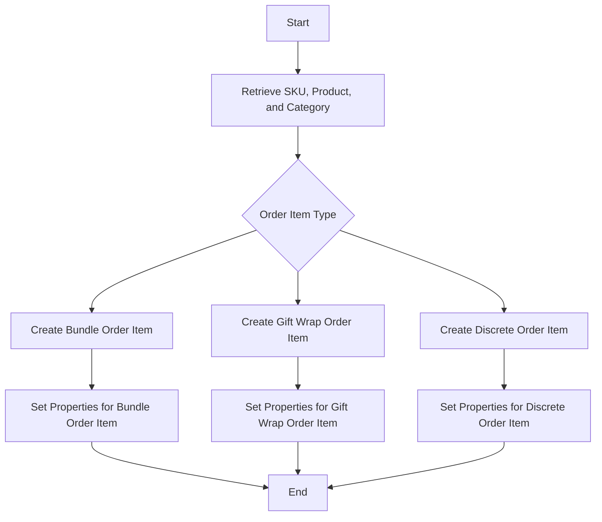

This document will cover the process of building an order item from a Data Transfer Object (DTO). We'll cover:

1. Retrieving necessary data
2. Creating different types of order items
3. Ensuring all attributes are properly set.

Technical document: <SwmLink doc-title="Building an Order Item from DTO">[Building an Order Item from DTO](/.swm/building-an-order-item-from-dto.3rwlzrjf.sw.md)</SwmLink>

# [Retrieving necessary data](https://app.swimm.io/repos/Z2l0aHViJTNBJTNBQnJvYWRsZWFmQ29tbWVyY2UtZGVtby1uZXclM0ElM0FTd2ltbS1EZW1v/docs/3rwlzrjf#buildorderitemfromdto)

The process begins by retrieving the necessary data to build the order item. This includes fetching the SKU, product, and category based on the IDs provided in the DTO. If the SKU ID is present, the SKU is retrieved. Similarly, the product and category are fetched based on their respective IDs. If the category is not provided but the product is, the default category of the product is used. This ensures that all necessary data is available for creating the order item.

# [Creating different types of order items](https://app.swimm.io/repos/Z2l0aHViJTNBJTNBQnJvYWRsZWFmQ29tbWVyY2UtZGVtby1uZXclM0ElM0FTd2ltbS1EZW1v/docs/3rwlzrjf#createbundleorderitem-creategiftwraporderitem-creatediscreteorderitem)

Depending on the type of order item requested, the process delegates the creation to specific methods. These methods include `createBundleOrderItem`, `createGiftWrapOrderItem`, and `createDiscreteOrderItem`. Each method is responsible for creating a specific type of order item and setting its properties. For example, `createBundleOrderItem` handles the creation of bundle order items, `createGiftWrapOrderItem` handles gift wrap order items, and `createDiscreteOrderItem` handles discrete order items. This delegation ensures that the correct type of order item is created based on the request.

# [Ensuring all attributes are properly set](https://app.swimm.io/repos/Z2l0aHViJTNBJTNBQnJvYWRsZWFmQ29tbWVyY2UtZGVtby1uZXclM0ElM0FTd2ltbS1EZW1v/docs/3rwlzrjf#createbundleorderitem-creategiftwraporderitem-creatediscreteorderitem)

Each method responsible for creating an order item ensures that all attributes are properly set. For instance, `createBundleOrderItem` sets properties such as quantity, category, and prices. It also iterates over the discrete items in the bundle and creates either `GiftWrapOrderItem` or `DiscreteOrderItem` for each, adding them to the bundle. Similarly, `createGiftWrapOrderItem` sets properties like SKU, order, quantity, and prices, and associates the wrapped items with the gift wrap order item. `createDiscreteOrderItem` populates the item with attributes such as category, product, SKU, and prices, and sets additional attributes and personal messages if provided. This meticulous setting of attributes ensures that the order item is fully populated with all necessary details, providing a seamless experience for the end user.

&nbsp;

*This is an auto-generated document by Swimm AI 🌊 and has not yet been verified by a human*

<SwmMeta version="3.0.0" repo-id="Z2l0aHViJTNBJTNBQnJvYWRsZWFmQ29tbWVyY2UtZGVtby1uZXclM0ElM0FTd2ltbS1EZW1v" repo-name="BroadleafCommerce-demo-new" doc-type="product-flows">Powered by [Swimm](/)</SwmMeta>
