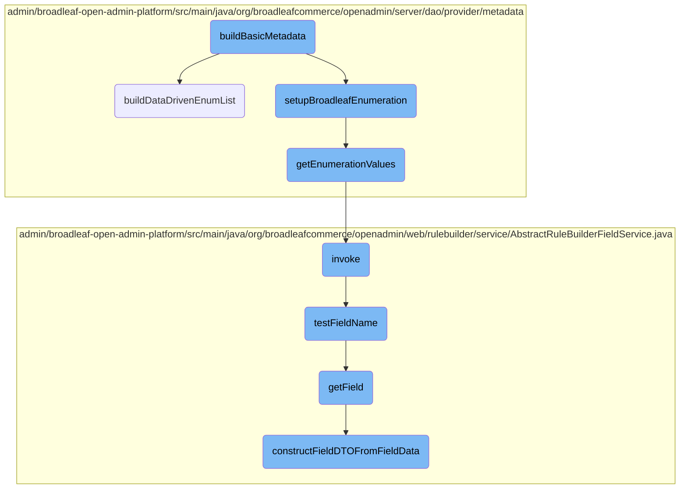
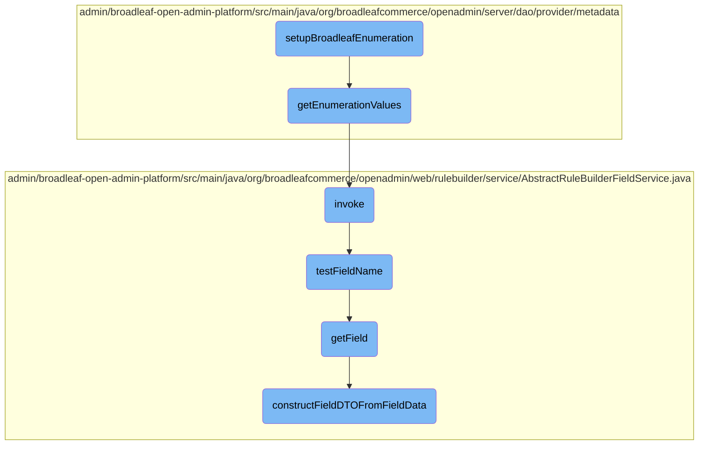
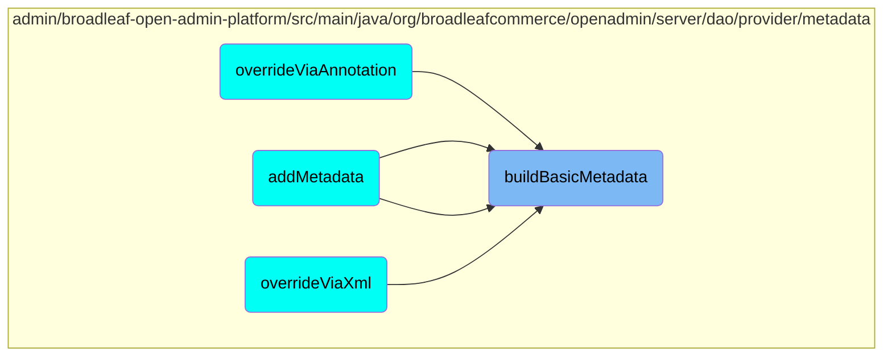

This document provides an overview of the <SwmToken path="admin/broadleaf-open-admin-platform/src/main/java/org/broadleafcommerce/openadmin/server/dao/provider/metadata/BasicFieldMetadataProvider.java" pos="471:5:5" line-data="    protected void buildBasicMetadata(Class&lt;?&gt; parentClass, Class&lt;?&gt; targetClass, Map&lt;String, FieldMetadata&gt; attributes,">`buildBasicMetadata`</SwmToken> function, which is responsible for constructing basic metadata for fields in the admin interface. It covers the initialization of metadata objects, handling of enumeration values, and the retrieval of field values.

The <SwmToken path="admin/broadleaf-open-admin-platform/src/main/java/org/broadleafcommerce/openadmin/server/dao/provider/metadata/BasicFieldMetadataProvider.java" pos="471:5:5" line-data="    protected void buildBasicMetadata(Class&lt;?&gt; parentClass, Class&lt;?&gt; targetClass, Map&lt;String, FieldMetadata&gt; attributes,">`buildBasicMetadata`</SwmToken> function starts by initializing a metadata object for a given field. It sets various properties like field type and display type. If the field is an enumeration, it calls another function to set up the enumeration values. This metadata is then used to configure how fields appear and behave in the admin interface. The process also involves fetching field values from the database and ensuring that the field names are valid.

Here is a high level diagram of the flow, showing only the most important functions:



# Flow drill down

First, we'll zoom into this section of the flow:

```mermaid
graph TD;
      subgraph admin/broadleaf-open-admin-platform/src/main/java/org/broadleafcommerce/openadmin/server/dao/provider/metadata
81f8319125d26639eeeb422408ac128a9fa5d50227077e5d9be348bad2e224cf(buildBasicMetadata):::mainFlowStyle --> 458bdb58d63de7c18f671b0456d38187774c9e580d3155f1afdcd6b8e483a106(buildDataDrivenEnumList)
end

subgraph admin/broadleaf-open-admin-platform/src/main/java/org/broadleafcommerce/openadmin/server/dao/provider/metadata
81f8319125d26639eeeb422408ac128a9fa5d50227077e5d9be348bad2e224cf(buildBasicMetadata):::mainFlowStyle --> 14549256b3ea1bb993cc405654e63f7e59f32ebd0da52912330caf463ebee825(setupBroadleafEnumeration):::mainFlowStyle
end

subgraph admin/broadleaf-open-admin-platform/src/main/java/org/broadleafcommerce/openadmin/server/dao/provider/metadata
14549256b3ea1bb993cc405654e63f7e59f32ebd0da52912330caf463ebee825(setupBroadleafEnumeration):::mainFlowStyle --> hgg5l(...)
end

subgraph admin/broadleaf-open-admin-platform/src/main/java/org/broadleafcommerce/openadmin/server/service/persistence/module/FieldManager.java
458bdb58d63de7c18f671b0456d38187774c9e580d3155f1afdcd6b8e483a106(buildDataDrivenEnumList) --> ddcb073c09911433b61933d36c041aebfceb561643ca926ffe20aa3f19eeb6e2(getFieldValue)
end


      classDef mainFlowStyle color:#000000,fill:#7CB9F4
classDef rootsStyle color:#000000,fill:#00FFF4
classDef Style1 color:#000000,fill:#00FFAA
classDef Style2 color:#000000,fill:#FFFF00
classDef Style3 color:#000000,fill:#AA7CB9

%% Swimm:
%% graph TD;
%%       subgraph <SwmPath>[admin/broadleaf-open-admin-platform/src/main/java/org/broadleafcommerce/openadmin/server/dao/provider/metadata/](admin/broadleaf-open-admin-platform/src/main/java/org/broadleafcommerce/openadmin/server/dao/provider/metadata/)</SwmPath>
%% 81f8319125d26639eeeb422408ac128a9fa5d50227077e5d9be348bad2e224cf(buildBasicMetadata):::mainFlowStyle --> 458bdb58d63de7c18f671b0456d38187774c9e580d3155f1afdcd6b8e483a106(buildDataDrivenEnumList)
%% end
%% 
%% subgraph <SwmPath>[admin/broadleaf-open-admin-platform/src/main/java/org/broadleafcommerce/openadmin/server/dao/provider/metadata/](admin/broadleaf-open-admin-platform/src/main/java/org/broadleafcommerce/openadmin/server/dao/provider/metadata/)</SwmPath>
%% 81f8319125d26639eeeb422408ac128a9fa5d50227077e5d9be348bad2e224cf(buildBasicMetadata):::mainFlowStyle --> 14549256b3ea1bb993cc405654e63f7e59f32ebd0da52912330caf463ebee825(setupBroadleafEnumeration):::mainFlowStyle
%% end
%% 
%% subgraph <SwmPath>[admin/broadleaf-open-admin-platform/src/main/java/org/broadleafcommerce/openadmin/server/dao/provider/metadata/](admin/broadleaf-open-admin-platform/src/main/java/org/broadleafcommerce/openadmin/server/dao/provider/metadata/)</SwmPath>
%% 14549256b3ea1bb993cc405654e63f7e59f32ebd0da52912330caf463ebee825(setupBroadleafEnumeration):::mainFlowStyle --> hgg5l(...)
%% end
%% 
%% subgraph <SwmPath>[admin/broadleaf-open-admin-platform/src/main/java/org/broadleafcommerce/openadmin/server/service/persistence/module/FieldManager.java](admin/broadleaf-open-admin-platform/src/main/java/org/broadleafcommerce/openadmin/server/service/persistence/module/FieldManager.java)</SwmPath>
%% 458bdb58d63de7c18f671b0456d38187774c9e580d3155f1afdcd6b8e483a106(buildDataDrivenEnumList) --> ddcb073c09911433b61933d36c041aebfceb561643ca926ffe20aa3f19eeb6e2(getFieldValue)
%% end
%% 
%% 
%%       classDef mainFlowStyle color:#000000,fill:#7CB9F4
%% classDef rootsStyle color:#000000,fill:#00FFF4
%% classDef Style1 color:#000000,fill:#00FFAA
%% classDef Style2 color:#000000,fill:#FFFF00
%% classDef Style3 color:#000000,fill:#AA7CB9
```



<SwmSnippet path="/admin/broadleaf-open-admin-platform/src/main/java/org/broadleafcommerce/openadmin/server/dao/provider/metadata/BasicFieldMetadataProvider.java" line="471">

---

## Building Basic Metadata

The <SwmToken path="admin/broadleaf-open-admin-platform/src/main/java/org/broadleafcommerce/openadmin/server/dao/provider/metadata/BasicFieldMetadataProvider.java" pos="471:5:5" line-data="    protected void buildBasicMetadata(Class&lt;?&gt; parentClass, Class&lt;?&gt; targetClass, Map&lt;String, FieldMetadata&gt; attributes,">`buildBasicMetadata`</SwmToken> function is responsible for constructing the basic metadata for a given field. It initializes a <SwmToken path="admin/broadleaf-open-admin-platform/src/main/java/org/broadleafcommerce/openadmin/server/dao/provider/metadata/BasicFieldMetadataProvider.java" pos="472:8:8" line-data="            FieldInfo field, FieldMetadataOverride basicFieldMetadata, DynamicEntityDao dynamicEntityDao) {">`basicFieldMetadata`</SwmToken> object and populates it with various properties such as field type, display type, security level, and more. This metadata is then used to configure the behavior and appearance of fields in the admin interface. If the field is of type <SwmToken path="admin/broadleaf-open-admin-platform/src/main/java/org/broadleafcommerce/openadmin/web/rulebuilder/service/AbstractRuleBuilderFieldService.java" pos="98:6:6" line-data="        if (SupportedFieldType.BROADLEAF_ENUMERATION.equals(field.getFieldType())){">`BROADLEAF_ENUMERATION`</SwmToken>, it calls <SwmToken path="admin/broadleaf-open-admin-platform/src/main/java/org/broadleafcommerce/openadmin/server/dao/provider/metadata/AbstractFieldMetadataProvider.java" pos="169:5:5" line-data="    protected void setupBroadleafEnumeration(String broadleafEnumerationClass, BasicFieldMetadata fieldMetadata, DynamicEntityDao dynamicEntityDao) {">`setupBroadleafEnumeration`</SwmToken> to handle enumeration-specific setup.

```java
    protected void buildBasicMetadata(Class<?> parentClass, Class<?> targetClass, Map<String, FieldMetadata> attributes,
            FieldInfo field, FieldMetadataOverride basicFieldMetadata, DynamicEntityDao dynamicEntityDao) {
        BasicFieldMetadata serverMetadata = (BasicFieldMetadata) attributes.get(field.getName());

        BasicFieldMetadata metadata;
        if (serverMetadata != null) {
            metadata = serverMetadata;
        } else {
            metadata = new BasicFieldMetadata();
        }

        metadata.setName(field.getName());
        metadata.setTargetClass(targetClass.getName());
        metadata.setFieldName(field.getName());

        if (basicFieldMetadata.getFieldType() != null) {
            metadata.setFieldType(basicFieldMetadata.getFieldType());
        }
        if (basicFieldMetadata.getDisplayType() != null) {
            metadata.setDisplayType(basicFieldMetadata.getDisplayType());
        }
```

---

</SwmSnippet>

<SwmSnippet path="/admin/broadleaf-open-admin-platform/src/main/java/org/broadleafcommerce/openadmin/server/dao/provider/metadata/BasicFieldMetadataProvider.java" line="690">

---

## Building Data-Driven Enum List

The <SwmToken path="admin/broadleaf-open-admin-platform/src/main/java/org/broadleafcommerce/openadmin/server/dao/provider/metadata/BasicFieldMetadataProvider.java" pos="690:5:5" line-data="    protected void buildDataDrivenEnumList(BasicFieldMetadata metadata) {">`buildDataDrivenEnumList`</SwmToken> function is invoked to build a list of enumeration values for fields that are data-driven. It queries the database to fetch the enumeration values based on the criteria defined in the metadata. The results are then processed and set as enumeration values in the <SwmToken path="admin/broadleaf-open-admin-platform/src/main/java/org/broadleafcommerce/openadmin/server/dao/provider/metadata/BasicFieldMetadataProvider.java" pos="690:7:7" line-data="    protected void buildDataDrivenEnumList(BasicFieldMetadata metadata) {">`BasicFieldMetadata`</SwmToken> object. This allows dynamic enumeration values to be displayed in the admin interface.

```java
    protected void buildDataDrivenEnumList(BasicFieldMetadata metadata) {
        try {
            DynamicEntityDao dynamicEntityDao = PersistenceManagerFactory.getDefaultPersistenceManager().getDynamicEntityDao();
            FieldManager fieldManager = dynamicEntityDao.getFieldManager();

            Class criteriaClass = Class.forName(metadata.getOptionListEntity());

            CriteriaBuilder builder = dynamicEntityDao.getStandardEntityManager().getCriteriaBuilder();
            CriteriaQuery criteria = builder.createQuery(criteriaClass);
            Root root = criteria.from(criteriaClass);
            List<Predicate> restrictions = new ArrayList<>();

            if (metadata.getOptionListEntity().equals(DataDrivenEnumerationValueImpl.class.getName())) {
                restrictions.add(builder.equal(root.get("hidden"), false));
            }

            if (metadata.getOptionFilterParams() != null) {
                for (String[] param : metadata.getOptionFilterParams()) {
                    Path current = root;
                    String key = param[0];
                    if (!key.equals(".ignore")) {
```

---

</SwmSnippet>

<SwmSnippet path="/admin/broadleaf-open-admin-platform/src/main/java/org/broadleafcommerce/openadmin/server/service/persistence/module/FieldManager.java" line="79">

---

## Getting Field Value

The <SwmToken path="admin/broadleaf-open-admin-platform/src/main/java/org/broadleafcommerce/openadmin/server/service/persistence/module/FieldManager.java" pos="79:5:5" line-data="    public Object getFieldValue(Object bean, String fieldName) throws IllegalAccessException, FieldNotAvailableException {">`getFieldValue`</SwmToken> function retrieves the value of a specified field from a given bean. It handles nested fields and map fields by tokenizing the field name and navigating through the object's properties. This function is essential for accessing field values dynamically, especially when building metadata or processing data-driven enumerations.

```java
    public Object getFieldValue(Object bean, String fieldName) throws IllegalAccessException, FieldNotAvailableException {
        StringTokenizer tokens = new StringTokenizer(fieldName, ".");
        Class<?> componentClass = bean.getClass();
        Field field = null;
        Object value = HibernateUtils.deproxy(bean);

        while (tokens.hasMoreTokens()) {
            String fieldNamePart = tokens.nextToken();
            String mapKey = null;
            if (fieldNamePart.contains(FieldManager.MAPFIELDSEPARATOR)) {
                mapKey = fieldNamePart.substring(fieldNamePart.indexOf(FieldManager.MAPFIELDSEPARATOR) + FieldManager.MAPFIELDSEPARATOR.length(), fieldNamePart.length());
                fieldNamePart = fieldNamePart.substring(0, fieldNamePart.indexOf(FieldManager.MAPFIELDSEPARATOR));
            }
            field = getSingleField(componentClass, fieldNamePart);

            if (field != null) {
                field.setAccessible(true);
                value = field.get(value);
                value = HibernateUtils.deproxy(value);

                if (mapKey != null) {
```

---

</SwmSnippet>

Now, lets zoom into this section of the flow:



<SwmSnippet path="/admin/broadleaf-open-admin-platform/src/main/java/org/broadleafcommerce/openadmin/server/dao/provider/metadata/AbstractFieldMetadataProvider.java" line="169">

---

## <SwmToken path="admin/broadleaf-open-admin-platform/src/main/java/org/broadleafcommerce/openadmin/server/dao/provider/metadata/AbstractFieldMetadataProvider.java" pos="169:5:5" line-data="    protected void setupBroadleafEnumeration(String broadleafEnumerationClass, BasicFieldMetadata fieldMetadata, DynamicEntityDao dynamicEntityDao) {">`setupBroadleafEnumeration`</SwmToken>

The <SwmToken path="admin/broadleaf-open-admin-platform/src/main/java/org/broadleafcommerce/openadmin/server/dao/provider/metadata/AbstractFieldMetadataProvider.java" pos="169:5:5" line-data="    protected void setupBroadleafEnumeration(String broadleafEnumerationClass, BasicFieldMetadata fieldMetadata, DynamicEntityDao dynamicEntityDao) {">`setupBroadleafEnumeration`</SwmToken> method initializes the enumeration values for a given field metadata. It retrieves the enumeration values using the <SwmToken path="admin/broadleaf-open-admin-platform/src/main/java/org/broadleafcommerce/openadmin/server/dao/provider/metadata/AbstractFieldMetadataProvider.java" pos="171:17:17" line-data="            List&lt;Tuple&lt;String, String&gt;&gt; enumVals = enumerationUtility.getEnumerationValues(broadleafEnumerationClass, dynamicEntityDao);">`getEnumerationValues`</SwmToken> method from <SwmToken path="admin/broadleaf-open-admin-platform/src/main/java/org/broadleafcommerce/openadmin/server/dao/provider/metadata/AbstractFieldMetadataProvider.java" pos="55:3:3" line-data="    protected BroadleafEnumerationUtility enumerationUtility;">`BroadleafEnumerationUtility`</SwmToken> and sets these values in the <SwmToken path="admin/broadleaf-open-admin-platform/src/main/java/org/broadleafcommerce/openadmin/server/dao/provider/metadata/AbstractFieldMetadataProvider.java" pos="169:14:14" line-data="    protected void setupBroadleafEnumeration(String broadleafEnumerationClass, BasicFieldMetadata fieldMetadata, DynamicEntityDao dynamicEntityDao) {">`fieldMetadata`</SwmToken> object. This method ensures that the field metadata is correctly populated with the enumeration values and class, which is essential for the proper functioning of the field in the admin interface.

```java
    protected void setupBroadleafEnumeration(String broadleafEnumerationClass, BasicFieldMetadata fieldMetadata, DynamicEntityDao dynamicEntityDao) {
        try {
            List<Tuple<String, String>> enumVals = enumerationUtility.getEnumerationValues(broadleafEnumerationClass, dynamicEntityDao);
            
            String[][] enumerationValues = new String[enumVals.size()][2];
            int j = 0;
            for (Tuple<String, String> t : enumVals) {
                enumerationValues[j][0] = t.getFirst();
                enumerationValues[j][1] = t.getSecond();
                j++;
            }
            
            fieldMetadata.setEnumerationValues(enumerationValues);
            fieldMetadata.setEnumerationClass(broadleafEnumerationClass);
        } catch (Exception e) {
            throw new RuntimeException(e);
        }
    }
```

---

</SwmSnippet>

<SwmSnippet path="/admin/broadleaf-open-admin-platform/src/main/java/org/broadleafcommerce/openadmin/server/dao/provider/metadata/BroadleafEnumerationUtility.java" line="37">

---

## <SwmToken path="admin/broadleaf-open-admin-platform/src/main/java/org/broadleafcommerce/openadmin/server/dao/provider/metadata/BroadleafEnumerationUtility.java" pos="38:13:13" line-data="    public List&lt;Tuple&lt;String, String&gt;&gt; getEnumerationValues(String broadleafEnumerationClass, DynamicEntityDao dynamicEntityDao) {">`getEnumerationValues`</SwmToken>

The <SwmToken path="admin/broadleaf-open-admin-platform/src/main/java/org/broadleafcommerce/openadmin/server/dao/provider/metadata/BroadleafEnumerationUtility.java" pos="38:13:13" line-data="    public List&lt;Tuple&lt;String, String&gt;&gt; getEnumerationValues(String broadleafEnumerationClass, DynamicEntityDao dynamicEntityDao) {">`getEnumerationValues`</SwmToken> method retrieves the enumeration values for a given Broadleaf enumeration class. It uses reflection to access the <SwmToken path="admin/broadleaf-open-admin-platform/src/main/java/org/broadleafcommerce/openadmin/server/dao/provider/metadata/BroadleafEnumerationUtility.java" pos="43:12:12" line-data="            Method typeMethod = broadleafEnumeration.getMethod(&quot;getType&quot;);">`getType`</SwmToken> and <SwmToken path="admin/broadleaf-open-admin-platform/src/main/java/org/broadleafcommerce/openadmin/server/dao/provider/metadata/BroadleafEnumerationUtility.java" pos="44:12:12" line-data="            Method friendlyTypeMethod = broadleafEnumeration.getMethod(&quot;getFriendlyType&quot;);">`getFriendlyType`</SwmToken> methods of the enumeration class and constructs a map of these values. The method then converts this map into a list of tuples, which is returned to the caller. This method is crucial for dynamically obtaining the enumeration values that are used in the <SwmToken path="admin/broadleaf-open-admin-platform/src/main/java/org/broadleafcommerce/openadmin/server/dao/provider/metadata/AbstractFieldMetadataProvider.java" pos="169:5:5" line-data="    protected void setupBroadleafEnumeration(String broadleafEnumerationClass, BasicFieldMetadata fieldMetadata, DynamicEntityDao dynamicEntityDao) {">`setupBroadleafEnumeration`</SwmToken> method.

```java
    @SuppressWarnings("rawtypes")
    public List<Tuple<String, String>> getEnumerationValues(String broadleafEnumerationClass, DynamicEntityDao dynamicEntityDao) {
        try {
            Map<String, String> enumVals;
            Class<?> broadleafEnumeration = Class.forName(broadleafEnumerationClass);  
    
            Method typeMethod = broadleafEnumeration.getMethod("getType");
            Method friendlyTypeMethod = broadleafEnumeration.getMethod("getFriendlyType");
            Field types = dynamicEntityDao.getFieldManager().getField(broadleafEnumeration, "TYPES");
            
            if (Comparable.class.isAssignableFrom(broadleafEnumeration)) {
                enumVals = new LinkedHashMap<String, String>();
                if (types != null) {
                    Map<Object, ?> typesMap = getTypesMap(types, broadleafEnumeration);
                    for (final Object value : getSortedEnumValues(typesMap)) {
                        enumVals.put((String) friendlyTypeMethod.invoke(value), (String) typeMethod.invoke(value));
                    }
                }
            } else {
                enumVals = new TreeMap<String, String>();
                if (types != null) {
```

---

</SwmSnippet>

<SwmSnippet path="/admin/broadleaf-open-admin-platform/src/main/java/org/broadleafcommerce/openadmin/web/rulebuilder/service/AbstractRuleBuilderFieldService.java" line="153">

---

## invoke

The <SwmToken path="admin/broadleaf-open-admin-platform/src/main/java/org/broadleafcommerce/openadmin/web/rulebuilder/service/AbstractRuleBuilderFieldService.java" pos="154:5:5" line-data="            public Object invoke(Object proxy, Method method, Object[] args) throws Throwable {">`invoke`</SwmToken> method handles the addition of <SwmToken path="admin/broadleaf-open-admin-platform/src/main/java/org/broadleafcommerce/openadmin/web/rulebuilder/service/AbstractRuleBuilderFieldService.java" pos="156:1:1" line-data="                    FieldData fieldData = (FieldData) args[0];">`FieldData`</SwmToken> objects to a collection. It checks the method name being invoked and, if it is <SwmToken path="admin/broadleaf-open-admin-platform/src/main/java/org/broadleafcommerce/openadmin/web/rulebuilder/service/AbstractRuleBuilderFieldService.java" pos="155:13:13" line-data="                if (method.getName().equals(&quot;add&quot;)) {">`add`</SwmToken> or <SwmToken path="admin/broadleaf-open-admin-platform/src/main/java/org/broadleafcommerce/openadmin/web/rulebuilder/service/AbstractRuleBuilderFieldService.java" pos="159:13:13" line-data="                if (method.getName().equals(&quot;addAll&quot;)) {">`addAll`</SwmToken>, it calls the <SwmToken path="admin/broadleaf-open-admin-platform/src/main/java/org/broadleafcommerce/openadmin/web/rulebuilder/service/AbstractRuleBuilderFieldService.java" pos="157:1:1" line-data="                    testFieldName(fieldData);">`testFieldName`</SwmToken> method to validate the field names. This ensures that any <SwmToken path="admin/broadleaf-open-admin-platform/src/main/java/org/broadleafcommerce/openadmin/web/rulebuilder/service/AbstractRuleBuilderFieldService.java" pos="156:1:1" line-data="                    FieldData fieldData = (FieldData) args[0];">`FieldData`</SwmToken> being added has a valid field name, maintaining the integrity of the data.

```java
            @Override
            public Object invoke(Object proxy, Method method, Object[] args) throws Throwable {
                if (method.getName().equals("add")) {
                    FieldData fieldData = (FieldData) args[0];
                    testFieldName(fieldData);
                }
                if (method.getName().equals("addAll")) {
                    Collection<FieldData> addCollection = (Collection<FieldData>) args[0];
                    Iterator<FieldData> itr = addCollection.iterator();
                    while (itr.hasNext()) {
                        FieldData fieldData = itr.next();
                        testFieldName(fieldData);
                    }
                }
                return method.invoke(fields, args);
            }
```

---

</SwmSnippet>

<SwmSnippet path="/admin/broadleaf-open-admin-platform/src/main/java/org/broadleafcommerce/openadmin/web/rulebuilder/service/AbstractRuleBuilderFieldService.java" line="170">

---

## <SwmToken path="admin/broadleaf-open-admin-platform/src/main/java/org/broadleafcommerce/openadmin/web/rulebuilder/service/AbstractRuleBuilderFieldService.java" pos="170:5:5" line-data="            private void testFieldName(FieldData fieldData) throws ClassNotFoundException {">`testFieldName`</SwmToken>

The <SwmToken path="admin/broadleaf-open-admin-platform/src/main/java/org/broadleafcommerce/openadmin/web/rulebuilder/service/AbstractRuleBuilderFieldService.java" pos="170:5:5" line-data="            private void testFieldName(FieldData fieldData) throws ClassNotFoundException {">`testFieldName`</SwmToken> method validates the field name in a <SwmToken path="admin/broadleaf-open-admin-platform/src/main/java/org/broadleafcommerce/openadmin/web/rulebuilder/service/AbstractRuleBuilderFieldService.java" pos="170:7:7" line-data="            private void testFieldName(FieldData fieldData) throws ClassNotFoundException {">`FieldData`</SwmToken> object. It checks if the field name is not empty and if the <SwmToken path="admin/broadleaf-open-admin-platform/src/main/java/org/broadleafcommerce/openadmin/web/rulebuilder/service/AbstractRuleBuilderFieldService.java" pos="172:18:18" line-data="                    if (!StringUtils.isEmpty(fieldData.getFieldName()) &amp;&amp; dynamicEntityDao != null) {">`dynamicEntityDao`</SwmToken> is available. It then retrieves the DTO class name and checks if the field exists in any of the polymorphic entities derived from the DTO class. If the field is not found, an exception is thrown. This method ensures that only valid field names are used in the <SwmToken path="admin/broadleaf-open-admin-platform/src/main/java/org/broadleafcommerce/openadmin/web/rulebuilder/service/AbstractRuleBuilderFieldService.java" pos="170:7:7" line-data="            private void testFieldName(FieldData fieldData) throws ClassNotFoundException {">`FieldData`</SwmToken> objects.

```java
            private void testFieldName(FieldData fieldData) throws ClassNotFoundException {
                if (!fieldData.getSkipValidation()) {
                    if (!StringUtils.isEmpty(fieldData.getFieldName()) && dynamicEntityDao != null) {
                        String dtoClassName = getDtoClassName();
                        if (fieldData.getOverrideDtoClassName() != null) {
                            dtoClassName = fieldData.getOverrideDtoClassName();
                        }
                        Class<?>[] dtos = dynamicEntityDao.getAllPolymorphicEntitiesFromCeiling(Class.forName(dtoClassName));
                        if (ArrayUtils.isEmpty(dtos)) {
                            dtos = new Class<?>[] { Class.forName(dtoClassName) };
                        }
                        Field field = null;
                        for (Class<?> dto : dtos) {
                            field = dynamicEntityDao.getFieldManager().getField(dto, fieldData.getFieldName());
                            if (field != null) {
                                break;
                            }
                        }
                        if (field == null) {
                            throw new IllegalArgumentException("Unable to find the field declared in FieldData (" + fieldData.getFieldName() + ") on the target class (" + dtoClassName + "), or any registered entity class that derives from it.");
                        }
```

---

</SwmSnippet>

<SwmSnippet path="/admin/broadleaf-open-admin-platform/src/main/java/org/broadleafcommerce/openadmin/web/rulebuilder/service/AbstractRuleBuilderFieldService.java" line="133">

---

## <SwmToken path="admin/broadleaf-open-admin-platform/src/main/java/org/broadleafcommerce/openadmin/web/rulebuilder/service/AbstractRuleBuilderFieldService.java" pos="134:5:5" line-data="    public FieldDTO getField(String fieldName) {">`getField`</SwmToken>

The <SwmToken path="admin/broadleaf-open-admin-platform/src/main/java/org/broadleafcommerce/openadmin/web/rulebuilder/service/AbstractRuleBuilderFieldService.java" pos="134:5:5" line-data="    public FieldDTO getField(String fieldName) {">`getField`</SwmToken> method retrieves a <SwmToken path="admin/broadleaf-open-admin-platform/src/main/java/org/broadleafcommerce/openadmin/web/rulebuilder/service/AbstractRuleBuilderFieldService.java" pos="134:3:3" line-data="    public FieldDTO getField(String fieldName) {">`FieldDTO`</SwmToken> object for a given field name. It iterates over the collection of <SwmToken path="admin/broadleaf-open-admin-platform/src/main/java/org/broadleafcommerce/openadmin/web/rulebuilder/service/AbstractRuleBuilderFieldService.java" pos="135:4:4" line-data="        for (FieldData field : getFields()) {">`FieldData`</SwmToken> objects and, if a match is found, it constructs a <SwmToken path="admin/broadleaf-open-admin-platform/src/main/java/org/broadleafcommerce/openadmin/web/rulebuilder/service/AbstractRuleBuilderFieldService.java" pos="134:3:3" line-data="    public FieldDTO getField(String fieldName) {">`FieldDTO`</SwmToken> from the <SwmToken path="admin/broadleaf-open-admin-platform/src/main/java/org/broadleafcommerce/openadmin/web/rulebuilder/service/AbstractRuleBuilderFieldService.java" pos="135:4:4" line-data="        for (FieldData field : getFields()) {">`FieldData`</SwmToken> using the <SwmToken path="admin/broadleaf-open-admin-platform/src/main/java/org/broadleafcommerce/openadmin/web/rulebuilder/service/AbstractRuleBuilderFieldService.java" pos="137:3:3" line-data="                return constructFieldDTOFromFieldData(field);">`constructFieldDTOFromFieldData`</SwmToken> method. This method provides a way to access the field data in a structured format.

```java
    @Override
    public FieldDTO getField(String fieldName) {
        for (FieldData field : getFields()) {
            if (field.getFieldName().equals(fieldName)) {
                return constructFieldDTOFromFieldData(field);
            }
        }
        return null;
    }
```

---

</SwmSnippet>

<SwmSnippet path="/admin/broadleaf-open-admin-platform/src/main/java/org/broadleafcommerce/openadmin/web/rulebuilder/service/AbstractRuleBuilderFieldService.java" line="82">

---

## <SwmToken path="admin/broadleaf-open-admin-platform/src/main/java/org/broadleafcommerce/openadmin/web/rulebuilder/service/AbstractRuleBuilderFieldService.java" pos="82:5:5" line-data="    protected FieldDTO constructFieldDTOFromFieldData(FieldData field) {">`constructFieldDTOFromFieldData`</SwmToken>

The <SwmToken path="admin/broadleaf-open-admin-platform/src/main/java/org/broadleafcommerce/openadmin/web/rulebuilder/service/AbstractRuleBuilderFieldService.java" pos="82:5:5" line-data="    protected FieldDTO constructFieldDTOFromFieldData(FieldData field) {">`constructFieldDTOFromFieldData`</SwmToken> method creates a <SwmToken path="admin/broadleaf-open-admin-platform/src/main/java/org/broadleafcommerce/openadmin/web/rulebuilder/service/AbstractRuleBuilderFieldService.java" pos="82:3:3" line-data="    protected FieldDTO constructFieldDTOFromFieldData(FieldData field) {">`FieldDTO`</SwmToken> object from a <SwmToken path="admin/broadleaf-open-admin-platform/src/main/java/org/broadleafcommerce/openadmin/web/rulebuilder/service/AbstractRuleBuilderFieldService.java" pos="82:7:7" line-data="    protected FieldDTO constructFieldDTOFromFieldData(FieldData field) {">`FieldData`</SwmToken> object. It sets various properties of the <SwmToken path="admin/broadleaf-open-admin-platform/src/main/java/org/broadleafcommerce/openadmin/web/rulebuilder/service/AbstractRuleBuilderFieldService.java" pos="82:3:3" line-data="    protected FieldDTO constructFieldDTOFromFieldData(FieldData field) {">`FieldDTO`</SwmToken>, such as the label, ID, operators, and values. It also determines the input type based on the field type. This method is essential for converting <SwmToken path="admin/broadleaf-open-admin-platform/src/main/java/org/broadleafcommerce/openadmin/web/rulebuilder/service/AbstractRuleBuilderFieldService.java" pos="82:7:7" line-data="    protected FieldDTO constructFieldDTOFromFieldData(FieldData field) {">`FieldData`</SwmToken> into a format that can be used in the admin interface.

```java
    protected FieldDTO constructFieldDTOFromFieldData(FieldData field) {
        FieldDTO fieldDTO = new FieldDTO();
        //translate the label to display
        String label = field.getFieldLabel();
        BroadleafRequestContext context = BroadleafRequestContext.getBroadleafRequestContext();
        MessageSource messages = context.getMessageSource();
        if (messages != null) {
            label = messages.getMessage(label, null, label, context.getJavaLocale());
        }
        fieldDTO.setLabel(label);

        fieldDTO.setId(field.getFieldName());
        fieldDTO.setOperators(field.getOperators());
        fieldDTO.setSelectizeSectionKey(field.getSelectizeSectionKey());
        fieldDTO.setValues(field.getOptions());

        if (SupportedFieldType.BROADLEAF_ENUMERATION.equals(field.getFieldType())){
            fieldDTO.setInput("select");
        } else {
            fieldDTO.setInput("text");
        }
```

---

</SwmSnippet>

# Where is this flow used?

This flow is used multiple times in the codebase as represented in the following diagram:



&nbsp;

*This is an auto-generated document by Swimm AI 🌊 and has not yet been verified by a human*

<SwmMeta version="3.0.0" repo-id="Z2l0aHViJTNBJTNBQnJvYWRsZWFmQ29tbWVyY2UtZGVtby1uZXclM0ElM0FTd2ltbS1EZW1v" repo-name="BroadleafCommerce-demo-new" doc-type="flows"><sup>Powered by [Swimm](/)</sup></SwmMeta>
