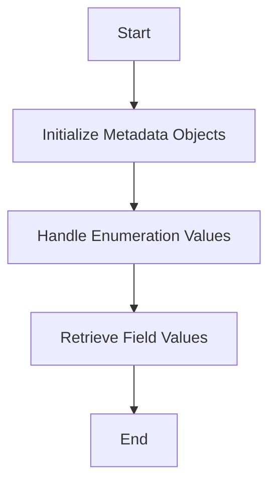

This document will cover the process of building basic metadata for fields in the admin interface. We'll cover:

1. Initializing Metadata Objects
2. Handling Enumeration Values
3. Retrieving Field Values

Technical document: <SwmLink doc-title="Building Basic Metadata">[Building Basic Metadata](/.swm/building-basic-metadata.0bp46lm5.sw.md)</SwmLink>

# [Initializing Metadata Objects](https://app.swimm.io/repos/Z2l0aHViJTNBJTNBQnJvYWRsZWFmQ29tbWVyY2UtZGVtby1uZXclM0ElM0FTd2ltbS1EZW1v/docs/0bp46lm5#building-basic-metadata)

The process begins by initializing a metadata object for a given field. This involves creating a `BasicFieldMetadata` object and setting various properties such as the field type, display type, and security level. These properties determine how the field will appear and behave in the admin interface. For example, the field type could be a text field, a date picker, or a dropdown menu. The display type might specify whether the field is shown as a regular input or a read-only field. Setting these properties ensures that the field is correctly configured for use in the admin interface.

# [Handling Enumeration Values](https://app.swimm.io/repos/Z2l0aHViJTNBJTNBQnJvYWRsZWFmQ29tbWVyY2UtZGVtby1uZXclM0ElM0FTd2ltbS1EZW1v/docs/0bp46lm5#setupbroadleafenumeration)

If the field is an enumeration, the next step is to handle the enumeration values. This involves calling the `setupBroadleafEnumeration` method, which retrieves the enumeration values and sets them in the metadata object. Enumeration values are predefined options that the user can select from, such as a list of countries or a set of status options. By setting these values in the metadata, we ensure that the field displays the correct options in the admin interface. This step is crucial for fields that require a specific set of selectable values.

# [Retrieving Field Values](https://app.swimm.io/repos/Z2l0aHViJTNBJTNBQnJvYWRsZWFmQ29tbWVyY2UtZGVtby1uZXclM0ElM0FTd2ltbS1EZW1v/docs/0bp46lm5#getting-field-value)

The final step in the process is retrieving the field values from the database. This is done using the `getFieldValue` method, which accesses the value of a specified field from a given data object. This step is essential for dynamically obtaining the current value of the field, which is then used to populate the metadata object. For example, if the field represents a product's price, this method will retrieve the current price from the database and set it in the metadata. This ensures that the field displays the correct value in the admin interface.

&nbsp;

*This is an auto-generated document by Swimm AI 🌊 and has not yet been verified by a human*

<SwmMeta version="3.0.0" repo-id="Z2l0aHViJTNBJTNBQnJvYWRsZWFmQ29tbWVyY2UtZGVtby1uZXclM0ElM0FTd2ltbS1EZW1v" repo-name="BroadleafCommerce-demo-new" doc-type="product-flows">Powered by [Swimm](/)</SwmMeta>
