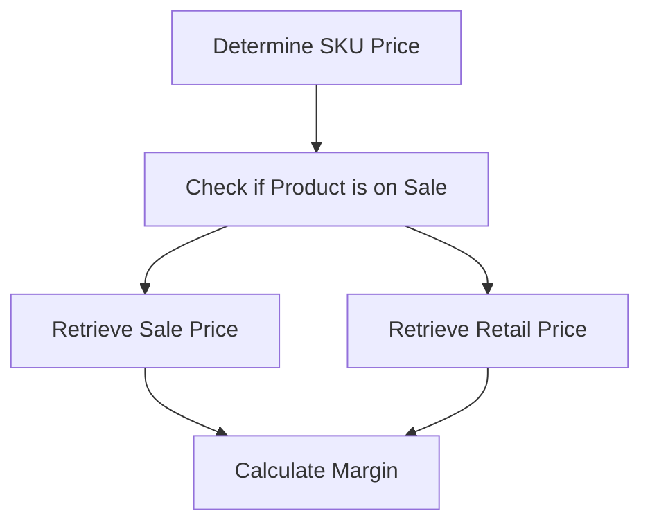

This document will cover the process of calculating SKU margin, which includes:

1. Determining the price of a SKU
2. Checking if a product is on sale
3. Retrieving sale price
4. Retrieving retail price
5. Calculating the margin

Technical document: <SwmLink doc-title="Calculating SKU Margin">[Calculating SKU Margin](/.swm/calculating-sku-margin.nfq50pp2.sw.md)</SwmLink>

# [Determining the price of a SKU](https://app.swimm.io/repos/Z2l0aHViJTNBJTNBQnJvYWRsZWFmQ29tbWVyY2UtZGVtby1uZXclM0ElM0FTd2ltbS1EZW1v/docs/nfq50pp2#determining-price)

The price of a SKU is determined by checking if the product is on sale. If the product is on sale, the sale price is used; otherwise, the retail price is used. This ensures that the most accurate and current price is used for margin calculations.

# [Checking if a product is on sale](https://app.swimm.io/repos/Z2l0aHViJTNBJTNBQnJvYWRsZWFmQ29tbWVyY2UtZGVtby1uZXclM0ElM0FTd2ltbS1EZW1v/docs/nfq50pp2#checking-if-a-product-is-on-sale)

To determine if a product is on sale, we compare the sale price with the retail price. If the sale price is not null, not zero, and less than the retail price, the product is considered to be on sale. This step is crucial for accurate pricing and margin calculations.

# [Retrieving sale price](https://app.swimm.io/repos/Z2l0aHViJTNBJTNBQnJvYWRsZWFmQ29tbWVyY2UtZGVtby1uZXclM0ElM0FTd2ltbS1EZW1v/docs/nfq50pp2#retrieving-sale-price)

The sale price of a SKU is retrieved by first checking for dynamic pricing. If dynamic pricing is available, the sale price is fetched from there. If not, the explicitly set sale price is used. If neither is available, the sale price from the default SKU is used. This ensures that the most relevant sale price is used for margin calculations.

# [Retrieving retail price](https://app.swimm.io/repos/Z2l0aHViJTNBJTNBQnJvYWRsZWFmQ29tbWVyY2UtZGVtby1uZXclM0ElM0FTd2ltbS1EZW1v/docs/nfq50pp2#getretailprice)

The retail price of a SKU is retrieved by calling the internal method that checks for dynamic pricing first. If dynamic pricing is active, the dynamic retail price is used. If not, the static retail price or the default SKU's retail price is used. This step ensures that the most accurate retail price is used for margin calculations.

# [Calculating the margin](https://app.swimm.io/repos/Z2l0aHViJTNBJTNBQnJvYWRsZWFmQ29tbWVyY2UtZGVtby1uZXclM0ElM0FTd2ltbS1EZW1v/docs/nfq50pp2#calculating-margin)

The margin for a SKU is calculated by subtracting the purchase cost from the price and dividing by the price amount. If the price or purchase cost is not available, they are retrieved from the default SKU. If the price is zero or not available, the margin is set to zero. This calculation provides the profit margin for the SKU, which is essential for business decision-making.

&nbsp;

*This is an auto-generated document by Swimm AI 🌊 and has not yet been verified by a human*

<SwmMeta version="3.0.0" repo-id="Z2l0aHViJTNBJTNBQnJvYWRsZWFmQ29tbWVyY2UtZGVtby1uZXclM0ElM0FTd2ltbS1EZW1v" repo-name="BroadleafCommerce-demo-new" doc-type="product-flows">Powered by [Swimm](/)</SwmMeta>
