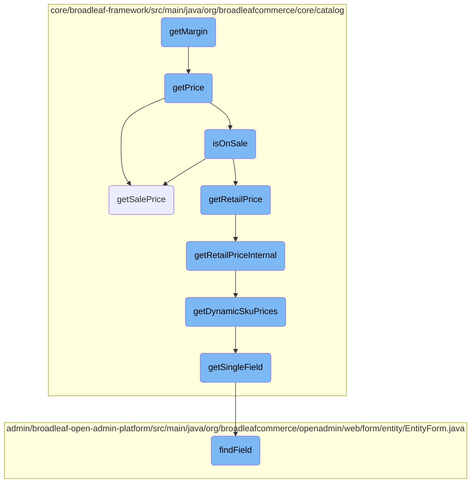
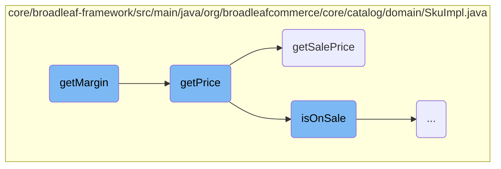
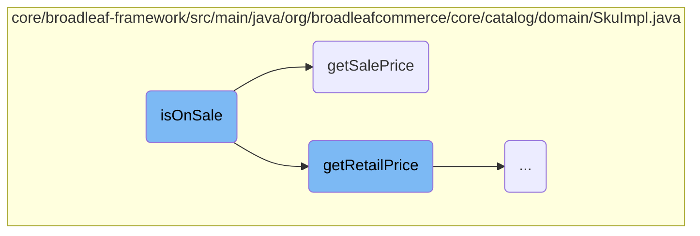
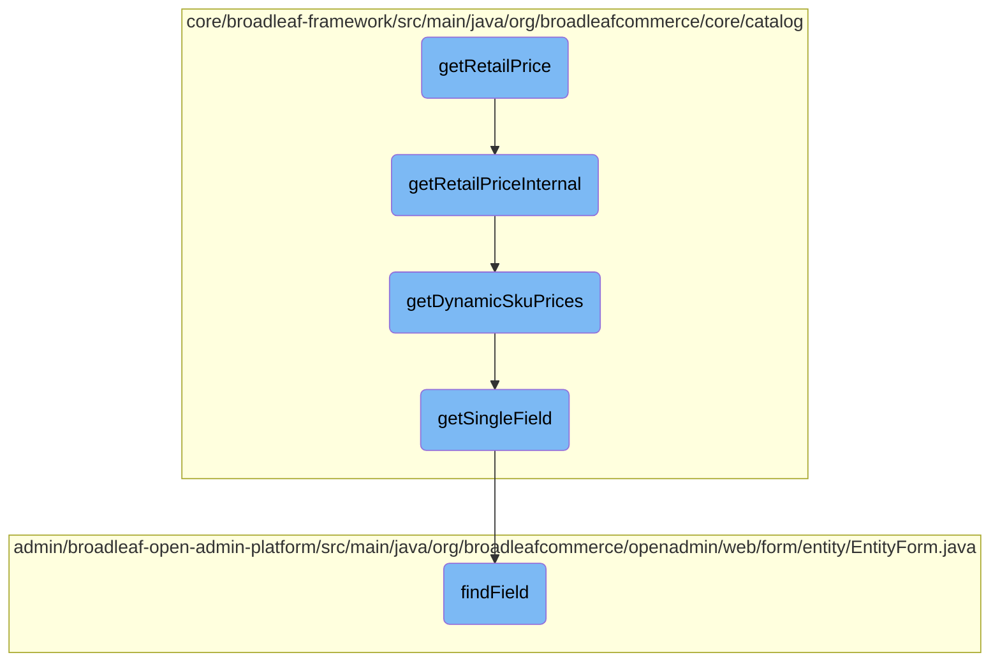

This document explains the process of calculating the margin for a SKU. The margin is determined by subtracting the purchase cost from the price and dividing by the price amount. The document also covers related methods such as determining the price, sale price, and retail price of a SKU.

To calculate the margin for a product, we first need to determine its price and purchase cost. If these values are not directly available, we try to get them from a default SKU. Once we have the price and purchase cost, we subtract the purchase cost from the price and divide by the price amount to get the margin. If the price is zero or not available, the margin is set to zero. The document also explains how to determine if a product is on sale and how to retrieve the sale and retail prices, considering dynamic pricing scenarios.

Here is a high level diagram of the flow, showing only the most important functions:



# Flow drill down

First, we'll zoom into this section of the flow:



<SwmSnippet path="/core/broadleaf-framework/src/main/java/org/broadleafcommerce/core/catalog/domain/SkuImpl.java" line="670">

---

## Calculating Margin

The <SwmToken path="core/broadleaf-framework/src/main/java/org/broadleafcommerce/core/catalog/domain/SkuImpl.java" pos="670:5:5" line-data="    public Money getMargin() {">`getMargin`</SwmToken> method calculates the margin for a SKU by subtracting the purchase cost from the price and dividing by the price amount. If the price or purchase cost is not available, it attempts to retrieve them from the default SKU.

```java
    public Money getMargin() {
        Money margin = null;
        Money price = getPrice();
        Money purchaseCost = getCost();

        if (price == null && hasDefaultSku()) {
            price = lookupDefaultSku().getPrice();
        }

        if (purchaseCost == null && hasDefaultSku()) {
            purchaseCost = lookupDefaultSku().getCost();
        }

        if (price != null && !(price.getAmount().compareTo(BigDecimal.ZERO)==0)) {
            if (purchaseCost != null) {
                margin = price.subtract(purchaseCost).divide(price.getAmount());
            }
        } else {
            margin = Money.ZERO;
        }

```

---

</SwmSnippet>

<SwmSnippet path="/core/broadleaf-framework/src/main/java/org/broadleafcommerce/core/catalog/domain/SkuImpl.java" line="635">

---

## Determining Price

The <SwmToken path="core/broadleaf-framework/src/main/java/org/broadleafcommerce/core/catalog/domain/SkuImpl.java" pos="635:5:5" line-data="    public Money getPrice() {">`getPrice`</SwmToken> method determines the price of a SKU by checking if it is on sale. If it is on sale, it returns the sale price; otherwise, it returns the retail price.

```java
    public Money getPrice() {
        return isOnSale() ? getSalePrice() : getRetailPrice();
    }
```

---

</SwmSnippet>

<SwmSnippet path="/core/broadleaf-framework/src/main/java/org/broadleafcommerce/core/catalog/domain/SkuImpl.java" line="494">

---

### Retrieving Sale Price

The <SwmToken path="core/broadleaf-framework/src/main/java/org/broadleafcommerce/core/catalog/domain/SkuImpl.java" pos="494:5:5" line-data="    public Money getSalePrice() {">`getSalePrice`</SwmToken> method retrieves the sale price of a SKU. It first checks for dynamic pricing and retrieves the sale price from there if available. If not, it checks for an explicitly set sale price or retrieves it from the default SKU. It also considers any option value adjustments.

```java
    public Money getSalePrice() {
        Money returnPrice = null;
        Money optionValueAdjustments = null;

        if (SkuPricingConsiderationContext.hasDynamicPricing()) {
            // We have dynamic pricing, so we will pull the sale price from there
            DynamicSkuPrices dynamicPrices = SkuPricingConsiderationContext.getDynamicSkuPrices(this);
            returnPrice = dynamicPrices.getSalePrice();
            optionValueAdjustments = dynamicPrices.getPriceAdjustment();
            if (SkuPricingConsiderationContext.isPricingConsiderationActive()) {
                return returnPrice;
            }
        } else if (salePrice != null) {
            // We have an explicitly set sale price directly on this entity. We will not apply any adjustments
            returnPrice = new Money(salePrice, getCurrency());
        }

        if (returnPrice == null && hasDefaultSku()) {
            returnPrice = lookupDefaultSku().getSalePrice();
            optionValueAdjustments = getProductOptionValueAdjustments();
        }
```

---

</SwmSnippet>

Now, lets zoom into this section of the flow:



<SwmSnippet path="/core/broadleaf-framework/src/main/java/org/broadleafcommerce/core/catalog/domain/SkuImpl.java" line="458">

---

## Checking if a product is on sale

The <SwmToken path="core/broadleaf-framework/src/main/java/org/broadleafcommerce/core/catalog/domain/SkuImpl.java" pos="458:5:5" line-data="    public boolean isOnSale() {">`isOnSale`</SwmToken> method determines if a product is currently on sale. It compares the sale price with the retail price to make this determination. If the sale price is not null, not zero, and less than the retail price, the product is considered to be on sale.

```java
    public boolean isOnSale() {
        Money retailPrice = getRetailPrice();
        Money salePrice = getSalePrice();
        return (salePrice != null && !salePrice.isZero() && salePrice.lessThan(retailPrice));
    }
```

---

</SwmSnippet>

Now, lets zoom into this section of the flow:



<SwmSnippet path="/core/broadleaf-framework/src/main/java/org/broadleafcommerce/core/catalog/domain/SkuImpl.java" line="537">

---

## <SwmToken path="core/broadleaf-framework/src/main/java/org/broadleafcommerce/core/catalog/domain/SkuImpl.java" pos="538:5:5" line-data="    public Money getRetailPrice() {">`getRetailPrice`</SwmToken>

The <SwmToken path="core/broadleaf-framework/src/main/java/org/broadleafcommerce/core/catalog/domain/SkuImpl.java" pos="538:5:5" line-data="    public Money getRetailPrice() {">`getRetailPrice`</SwmToken> method is a public method that retrieves the retail price of a SKU by calling the <SwmToken path="core/broadleaf-framework/src/main/java/org/broadleafcommerce/core/catalog/domain/SkuImpl.java" pos="539:3:3" line-data="        return getRetailPriceInternal();">`getRetailPriceInternal`</SwmToken> method. This method acts as a simple wrapper to encapsulate the internal logic of fetching the retail price.

```java
    @Override
    public Money getRetailPrice() {
        return getRetailPriceInternal();
    }
```

---

</SwmSnippet>

<SwmSnippet path="/core/broadleaf-framework/src/main/java/org/broadleafcommerce/core/catalog/domain/SkuImpl.java" line="542">

---

## <SwmToken path="core/broadleaf-framework/src/main/java/org/broadleafcommerce/core/catalog/domain/SkuImpl.java" pos="546:5:5" line-data="    protected Money getRetailPriceInternal() {">`getRetailPriceInternal`</SwmToken>

The <SwmToken path="core/broadleaf-framework/src/main/java/org/broadleafcommerce/core/catalog/domain/SkuImpl.java" pos="546:5:5" line-data="    protected Money getRetailPriceInternal() {">`getRetailPriceInternal`</SwmToken> method contains the core logic for determining the retail price of a SKU. It first checks if dynamic pricing is enabled and retrieves the dynamic prices if available. If dynamic pricing is not active, it falls back to the static retail price or the default SKU's retail price. Additionally, it adjusts the price based on any option value adjustments.

```java
    /*
     * This allows us a way to determine or calculate the retail price. If one is not available this method will return null. 
     * This allows the call to hasRetailPrice() to determine if there is a retail price without the overhead of an exception. 
     */
    protected Money getRetailPriceInternal() {
        Money returnPrice = null;
        Money optionValueAdjustments = null;

        if (SkuPricingConsiderationContext.hasDynamicPricing()) {
            // We have dynamic pricing, so we will pull the retail price from there
            DynamicSkuPrices dynamicPrices = SkuPricingConsiderationContext.getDynamicSkuPrices(this);
            returnPrice = dynamicPrices.getRetailPrice();
            optionValueAdjustments = dynamicPrices.getPriceAdjustment();
            if (SkuPricingConsiderationContext.isPricingConsiderationActive()) {
                return returnPrice;
            }
        } else if (retailPrice != null) {
            returnPrice = new Money(retailPrice, getCurrency());
        }

        if (returnPrice == null && hasDefaultSku()) {
```

---

</SwmSnippet>

<SwmSnippet path="/core/broadleaf-framework/src/main/java/org/broadleafcommerce/core/catalog/service/dynamic/SkuPricingConsiderationContext.java" line="95">

---

### <SwmToken path="core/broadleaf-framework/src/main/java/org/broadleafcommerce/core/catalog/service/dynamic/SkuPricingConsiderationContext.java" pos="95:7:7" line-data="    public static DynamicSkuPrices getDynamicSkuPrices(Sku sku) {">`getDynamicSkuPrices`</SwmToken>

The <SwmToken path="core/broadleaf-framework/src/main/java/org/broadleafcommerce/core/catalog/service/dynamic/SkuPricingConsiderationContext.java" pos="95:7:7" line-data="    public static DynamicSkuPrices getDynamicSkuPrices(Sku sku) {">`getDynamicSkuPrices`</SwmToken> method retrieves dynamic pricing information for a SKU. It checks if dynamic pricing is enabled and either fetches the prices from the cache or calculates them using the <SwmToken path="core/broadleaf-framework/src/main/java/org/broadleafcommerce/core/catalog/service/dynamic/SkuPricingConsiderationContext.java" pos="59:11:11" line-data="    public static void setSkuPricingService(DynamicSkuPricingService skuPricingService) {">`skuPricingService`</SwmToken>. This method is crucial for supporting dynamic pricing scenarios.

```java
    public static DynamicSkuPrices getDynamicSkuPrices(Sku sku) {
        DynamicSkuPrices prices = null;
        if (SkuPricingConsiderationContext.hasDynamicPricing()) {
            if (!getThreadCache().containsKey(sku.getId())) {
                // We have dynamic pricing, so we will pull the retail price from there
                if (!SkuPricingConsiderationContext.isPricingConsiderationActive()) {
                    SkuPriceWrapper wrapper = new SkuPriceWrapper(sku);
                    SkuPricingConsiderationContext.startPricingConsideration();
                    try {
                        prices = SkuPricingConsiderationContext.getSkuPricingService().getSkuPrices(wrapper, SkuPricingConsiderationContext.getSkuPricingConsiderationContext());
                    } finally {
                        SkuPricingConsiderationContext.endPricingConsideration();
                    }
                } else {
                    try {
                        prices = new DynamicSkuPrices();
                        Field retail = getSingleField(sku.getClass(), "retailPrice");
                        Object retailVal = retail.get(sku);
                        Money retailPrice = retailVal == null ? null : new Money((BigDecimal) retailVal);
                        Field sale = getSingleField(sku.getClass(), "salePrice");
                        Object saleVal = sale.get(sku);
```

---

</SwmSnippet>

<SwmSnippet path="/core/broadleaf-framework/src/main/java/org/broadleafcommerce/core/catalog/service/dynamic/SkuPricingConsiderationContext.java" line="131">

---

### <SwmToken path="core/broadleaf-framework/src/main/java/org/broadleafcommerce/core/catalog/service/dynamic/SkuPricingConsiderationContext.java" pos="131:9:9" line-data="    protected static synchronized Field getSingleField(Class&lt;?&gt; clazz, String fieldName) throws IllegalStateException {">`getSingleField`</SwmToken>

The <SwmToken path="core/broadleaf-framework/src/main/java/org/broadleafcommerce/core/catalog/service/dynamic/SkuPricingConsiderationContext.java" pos="131:9:9" line-data="    protected static synchronized Field getSingleField(Class&lt;?&gt; clazz, String fieldName) throws IllegalStateException {">`getSingleField`</SwmToken> method uses reflection to retrieve a specific field from a class. It caches the field for future use to improve performance. This method is used within <SwmToken path="core/broadleaf-framework/src/main/java/org/broadleafcommerce/core/catalog/domain/SkuImpl.java" pos="500:9:9" line-data="            DynamicSkuPrices dynamicPrices = SkuPricingConsiderationContext.getDynamicSkuPrices(this);">`getDynamicSkuPrices`</SwmToken> to access the retail and sale price fields of a SKU.

```java
    protected static synchronized Field getSingleField(Class<?> clazz, String fieldName) throws IllegalStateException {
        String cacheKey = clazz.getName() + fieldName;
        if (FIELD_CACHE.containsKey(cacheKey)) {
            return FIELD_CACHE.get(cacheKey);
        }

        Field field = ReflectionUtils.findField(clazz, fieldName);
        if (field != null) {
            field.setAccessible(true);
        }

        FIELD_CACHE.put(cacheKey, field);

        return field;
    }
```

---

</SwmSnippet>

<SwmSnippet path="/admin/broadleaf-open-admin-platform/src/main/java/org/broadleafcommerce/openadmin/web/form/entity/EntityForm.java" line="225">

---

### <SwmToken path="admin/broadleaf-open-admin-platform/src/main/java/org/broadleafcommerce/openadmin/web/form/entity/EntityForm.java" pos="225:5:5" line-data="    public Field findField(String fieldName) {">`findField`</SwmToken>

The <SwmToken path="admin/broadleaf-open-admin-platform/src/main/java/org/broadleafcommerce/openadmin/web/form/entity/EntityForm.java" pos="225:5:5" line-data="    public Field findField(String fieldName) {">`findField`</SwmToken> method retrieves a field from an <SwmToken path="admin/broadleaf-open-admin-platform/src/main/java/org/broadleafcommerce/openadmin/web/form/entity/EntityForm.java" pos="47:4:4" line-data="public class EntityForm {">`EntityForm`</SwmToken> based on the field name. It sanitizes the field name and looks it up in a map of fields. This method is used to dynamically access fields within an entity form.

```java
    public Field findField(String fieldName) {
        fieldName = sanitizeFieldName(fieldName);
        Map<String, Field> fields = getFields();

        return fields.get(fieldName);
    }
```

---

</SwmSnippet>

&nbsp;

*This is an auto-generated document by Swimm AI 🌊 and has not yet been verified by a human*

<SwmMeta version="3.0.0" repo-id="Z2l0aHViJTNBJTNBQnJvYWRsZWFmQ29tbWVyY2UtZGVtby1uZXclM0ElM0FTd2ltbS1EZW1v" repo-name="BroadleafCommerce-demo-new" doc-type="flows"><sup>Powered by [Swimm](/)</sup></SwmMeta>
