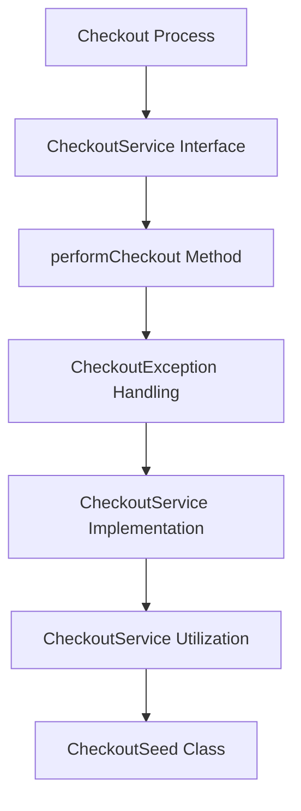

# <SwmToken path="core/broadleaf-framework/src/main/java/org/broadleafcommerce/core/checkout/service/CheckoutService.java" pos="25:4:4" line-data="public interface CheckoutService {">`CheckoutService`</SwmToken> Interface

The <SwmToken path="core/broadleaf-framework/src/main/java/org/broadleafcommerce/core/checkout/service/CheckoutService.java" pos="25:4:4" line-data="public interface CheckoutService {">`CheckoutService`</SwmToken> interface defines the contract for the checkout process, including the method <SwmToken path="core/broadleaf-framework/src/main/java/org/broadleafcommerce/core/checkout/service/CheckoutService.java" pos="39:5:5" line-data="    public CheckoutResponse performCheckout(Order order) throws CheckoutException;">`performCheckout`</SwmToken> which executes the checkout workflow.

<SwmSnippet path="/core/broadleaf-framework/src/main/java/org/broadleafcommerce/core/checkout/service/CheckoutService.java" line="25">

---

The <SwmToken path="core/broadleaf-framework/src/main/java/org/broadleafcommerce/core/checkout/service/CheckoutService.java" pos="39:5:5" line-data="    public CheckoutResponse performCheckout(Order order) throws CheckoutException;">`performCheckout`</SwmToken> method in the <SwmToken path="core/broadleaf-framework/src/main/java/org/broadleafcommerce/core/checkout/service/CheckoutService.java" pos="25:4:4" line-data="public interface CheckoutService {">`CheckoutService`</SwmToken> interface ensures that the order is saved both before and after the workflow execution, allowing activities to modify the order and related entities.

```java
public interface CheckoutService {

    /**
     * <p>Checks out an order by executing the blCheckoutWorkflow. The <b>order</b> is saved both before and after the workflow
     * is executed so that activities can modify the various entities on and related to the <b>order</b>.</p>
     * 
     * <p>This method is also thread-safe; 2 requests cannot attempt to check out the same <b>order</b></p>
     * 
     * @param order the order to be checked out
     * @return
     * @throws CheckoutException if there are any exceptions while executing any of the activities in the workflow (assuming
     * that the workflow does not already have a preconfigured error handler) or if the given <b>order</b> has already been
     * checked out (in Broadleaf terms this means the <b>order</b> has already been changed to {@link OrderStatus#SUBMITTED})
     */
    public CheckoutResponse performCheckout(Order order) throws CheckoutException;
    
}
```

---

</SwmSnippet>

# <SwmToken path="core/broadleaf-framework/src/main/java/org/broadleafcommerce/core/checkout/service/CheckoutService.java" pos="39:5:5" line-data="    public CheckoutResponse performCheckout(Order order) throws CheckoutException;">`performCheckout`</SwmToken> Method

The <SwmToken path="core/broadleaf-framework/src/main/java/org/broadleafcommerce/core/checkout/service/CheckoutService.java" pos="39:5:5" line-data="    public CheckoutResponse performCheckout(Order order) throws CheckoutException;">`performCheckout`</SwmToken> method ensures that the order is saved both before and after the workflow execution, allowing activities to modify the order and related entities. This method is <SwmToken path="core/broadleaf-framework/src/main/java/org/broadleafcommerce/core/checkout/service/CheckoutService.java" pos="31:14:16" line-data="     * &lt;p&gt;This method is also thread-safe; 2 requests cannot attempt to check out the same &lt;b&gt;order&lt;/b&gt;&lt;/p&gt;">`thread-safe`</SwmToken>, preventing multiple requests from attempting to check out the same order simultaneously.

<SwmSnippet path="/core/broadleaf-framework/src/main/java/org/broadleafcommerce/core/checkout/service/CheckoutServiceImpl.java" line="55">

---

The <SwmToken path="core/broadleaf-framework/src/main/java/org/broadleafcommerce/core/checkout/service/CheckoutServiceImpl.java" pos="56:5:5" line-data="    public CheckoutResponse performCheckout(Order order) throws CheckoutException {">`performCheckout`</SwmToken> method implementation in <SwmToken path="core/broadleaf-framework/src/main/java/org/broadleafcommerce/core/checkout/service/CheckoutServiceImpl.java" pos="43:4:4" line-data="public class CheckoutServiceImpl implements CheckoutService {">`CheckoutServiceImpl`</SwmToken> class. It checks if the order has already been completed, saves the order before and after the workflow, and handles any exceptions that occur during the process.

```java
    @Override
    public CheckoutResponse performCheckout(Order order) throws CheckoutException {
        // Immediately fail if this order has already been checked out previously
        if (hasOrderBeenCompleted(order)) {
            throw new CheckoutException("This order has already been submitted or cancelled, unable to checkout order -- id: " + order.getId(), new CheckoutSeed(order, new HashMap<String, Object>()));
        }
        
        CheckoutSeed seed = null;
        try {
            // Do a final save of the order before going through with the checkout workflow
            order = orderService.save(order, false);
            seed = new CheckoutSeed(order, new HashMap<>());

            ProcessContext<CheckoutSeed> context = checkoutWorkflow.doActivities(seed);

            // We need to pull the order off the seed and save it here in case any activity modified the order.
            order = orderService.save(seed.getOrder(), false);
            order.getOrderMessages().addAll(((ActivityMessages) context).getActivityMessages());
            seed.setOrder(order);

            OrderSubmittedEvent event = new OrderSubmittedEvent(this, seed.getOrder().getId(), seed.getOrder().getOrderNumber());
```

---

</SwmSnippet>

# <SwmToken path="core/broadleaf-framework/src/main/java/org/broadleafcommerce/core/checkout/service/CheckoutService.java" pos="35:6:6" line-data="     * @throws CheckoutException if there are any exceptions while executing any of the activities in the workflow (assuming">`CheckoutException`</SwmToken> Handling

If any exceptions occur during the workflow or if the order has already been checked out, a <SwmToken path="core/broadleaf-framework/src/main/java/org/broadleafcommerce/core/checkout/service/CheckoutService.java" pos="35:6:6" line-data="     * @throws CheckoutException if there are any exceptions while executing any of the activities in the workflow (assuming">`CheckoutException`</SwmToken> is thrown. This ensures that the checkout process is robust and can handle errors gracefully.

<SwmSnippet path="/core/broadleaf-framework/src/main/java/org/broadleafcommerce/core/checkout/service/exception/CheckoutException.java" line="30">

---

The <SwmToken path="core/broadleaf-framework/src/main/java/org/broadleafcommerce/core/checkout/service/exception/CheckoutException.java" pos="30:3:3" line-data="    public CheckoutException() {">`CheckoutException`</SwmToken> class handles exceptions that occur during the checkout process. It provides multiple constructors to handle different types of exceptions and stores the <SwmToken path="core/broadleaf-framework/src/main/java/org/broadleafcommerce/core/checkout/service/exception/CheckoutException.java" pos="36:1:1" line-data="        checkoutResponse = seed;">`checkoutResponse`</SwmToken>.

```java
    public CheckoutException() {
        super();
    }

    public CheckoutException(String message, CheckoutSeed seed) {
        super(message);
        checkoutResponse = seed;
    }

    public CheckoutException(Throwable cause, CheckoutSeed seed) {
        super(cause);
        checkoutResponse = seed;
    }

    public CheckoutException(String message, Throwable cause, CheckoutSeed seed) {
        super(message, cause);
        checkoutResponse = seed;
    }

    public CheckoutResponse getCheckoutResponse() {
        return checkoutResponse;
```

---

</SwmSnippet>

# <SwmToken path="core/broadleaf-framework/src/main/java/org/broadleafcommerce/core/checkout/service/CheckoutService.java" pos="25:4:4" line-data="public interface CheckoutService {">`CheckoutService`</SwmToken> Implementation

The <SwmToken path="core/broadleaf-framework/src/main/java/org/broadleafcommerce/core/checkout/service/CheckoutService.java" pos="25:4:4" line-data="public interface CheckoutService {">`CheckoutService`</SwmToken> is implemented by the <SwmToken path="core/broadleaf-framework/src/main/java/org/broadleafcommerce/core/checkout/service/CheckoutServiceImpl.java" pos="43:4:4" line-data="public class CheckoutServiceImpl implements CheckoutService {">`CheckoutServiceImpl`</SwmToken> class, which is annotated as a Spring service. This class contains the actual logic for the checkout process and interacts with other services and components.

<SwmSnippet path="/core/broadleaf-framework/src/main/java/org/broadleafcommerce/core/checkout/service/CheckoutServiceImpl.java" line="42">

---

The <SwmToken path="core/broadleaf-framework/src/main/java/org/broadleafcommerce/core/checkout/service/CheckoutServiceImpl.java" pos="43:4:4" line-data="public class CheckoutServiceImpl implements CheckoutService {">`CheckoutServiceImpl`</SwmToken> class is annotated as a Spring service and implements the <SwmToken path="core/broadleaf-framework/src/main/java/org/broadleafcommerce/core/checkout/service/CheckoutServiceImpl.java" pos="43:8:8" line-data="public class CheckoutServiceImpl implements CheckoutService {">`CheckoutService`</SwmToken> interface. It uses various services and components to perform the checkout process.

```java
@Service("blCheckoutService")
public class CheckoutServiceImpl implements CheckoutService {

    @Resource(name="blCheckoutWorkflow")
    protected Processor<CheckoutSeed, CheckoutSeed> checkoutWorkflow;

    @Autowired
    @Qualifier("blApplicationEventPublisher")
    protected BroadleafApplicationEventPublisher eventPublisher;

    @Resource(name="blOrderService")
    protected OrderService orderService;

    @Override
    public CheckoutResponse performCheckout(Order order) throws CheckoutException {
        // Immediately fail if this order has already been checked out previously
        if (hasOrderBeenCompleted(order)) {
            throw new CheckoutException("This order has already been submitted or cancelled, unable to checkout order -- id: " + order.getId(), new CheckoutSeed(order, new HashMap<String, Object>()));
        }
        
        CheckoutSeed seed = null;
```

---

</SwmSnippet>

# <SwmToken path="core/broadleaf-framework/src/main/java/org/broadleafcommerce/core/checkout/service/CheckoutService.java" pos="25:4:4" line-data="public interface CheckoutService {">`CheckoutService`</SwmToken> Utilization

The <SwmToken path="core/broadleaf-framework/src/main/java/org/broadleafcommerce/core/checkout/service/CheckoutService.java" pos="25:4:4" line-data="public interface CheckoutService {">`CheckoutService`</SwmToken> is utilized in various parts of the framework, such as the <SwmToken path="core/broadleaf-framework/src/main/java/org/broadleafcommerce/core/payment/service/DefaultPaymentGatewayCheckoutService.java" pos="71:4:4" line-data="public class DefaultPaymentGatewayCheckoutService implements PaymentGatewayCheckoutService {">`DefaultPaymentGatewayCheckoutService`</SwmToken> and `AbstractCheckoutController`. This shows the integration of the checkout process with other components of the e-commerce framework.

<SwmSnippet path="/core/broadleaf-framework/src/main/java/org/broadleafcommerce/core/payment/service/DefaultPaymentGatewayCheckoutService.java" line="33">

---

The <SwmToken path="core/broadleaf-framework/src/main/java/org/broadleafcommerce/core/payment/service/DefaultPaymentGatewayCheckoutService.java" pos="34:12:12" line-data="import org.broadleafcommerce.core.checkout.service.CheckoutService;">`CheckoutService`</SwmToken> is used in the <SwmToken path="core/broadleaf-framework/src/main/java/org/broadleafcommerce/core/payment/service/DefaultPaymentGatewayCheckoutService.java" pos="71:4:4" line-data="public class DefaultPaymentGatewayCheckoutService implements PaymentGatewayCheckoutService {">`DefaultPaymentGatewayCheckoutService`</SwmToken> to handle the checkout process when a payment is made. This integration ensures that the checkout process is seamless and consistent.

```java
import org.broadleafcommerce.common.web.payment.controller.PaymentGatewayAbstractController;
import org.broadleafcommerce.core.checkout.service.CheckoutService;
import org.broadleafcommerce.core.checkout.service.exception.CheckoutException;
import org.broadleafcommerce.core.checkout.service.workflow.CheckoutResponse;
import org.broadleafcommerce.core.order.domain.FulfillmentGroup;
import org.broadleafcommerce.core.order.domain.NullOrderImpl;
import org.broadleafcommerce.core.order.domain.Order;
import org.broadleafcommerce.core.order.service.FulfillmentGroupService;
import org.broadleafcommerce.core.order.service.OrderService;
import org.broadleafcommerce.core.order.service.type.OrderStatus;
import org.broadleafcommerce.core.payment.domain.OrderPayment;
import org.broadleafcommerce.core.payment.domain.PaymentTransaction;
import org.broadleafcommerce.profile.core.domain.Address;
import org.broadleafcommerce.profile.core.domain.Country;
import org.broadleafcommerce.profile.core.domain.Customer;
import org.broadleafcommerce.profile.core.domain.Phone;
import org.broadleafcommerce.profile.core.domain.State;
import org.broadleafcommerce.profile.core.service.AddressService;
import org.broadleafcommerce.profile.core.service.CountryService;
import org.broadleafcommerce.profile.core.service.PhoneService;
import org.broadleafcommerce.profile.core.service.StateService;
```

---

</SwmSnippet>

# <SwmToken path="core/broadleaf-framework/src/main/java/org/broadleafcommerce/core/checkout/service/CheckoutServiceImpl.java" pos="46:5:5" line-data="    protected Processor&lt;CheckoutSeed, CheckoutSeed&gt; checkoutWorkflow;">`CheckoutSeed`</SwmToken> Class

The <SwmToken path="core/broadleaf-framework/src/main/java/org/broadleafcommerce/core/checkout/service/CheckoutServiceImpl.java" pos="46:5:5" line-data="    protected Processor&lt;CheckoutSeed, CheckoutSeed&gt; checkoutWorkflow;">`CheckoutSeed`</SwmToken> class is used within the checkout workflow to encapsulate the order and any user-defined fields. This class acts as a data carrier during the checkout process.

<SwmSnippet path="/core/broadleaf-framework/src/main/java/org/broadleafcommerce/core/checkout/service/workflow/CheckoutSeed.java" line="25">

---

The <SwmToken path="core/broadleaf-framework/src/main/java/org/broadleafcommerce/core/checkout/service/workflow/CheckoutSeed.java" pos="25:4:4" line-data="public class CheckoutSeed implements CheckoutResponse {">`CheckoutSeed`</SwmToken> class encapsulates the order and any user-defined fields during the checkout process. It provides methods to get and set the order and user-defined fields.

```java
public class CheckoutSeed implements CheckoutResponse {

    protected Order order;
    protected Map<String, Object> userDefinedFields = new HashMap<>();

    public CheckoutSeed(Order order, Map<String, Object> userDefinedFields) {
        this.order = order;
        this.userDefinedFields = userDefinedFields;
    }

    @Override
    public Order getOrder() {
        return order;
    }
    
    public void setOrder(Order order) {
        this.order = order;
    }

    public Map<String, Object> getUserDefinedFields() {
        return userDefinedFields;
```

---

</SwmSnippet>

&nbsp;

*This is an auto-generated document by Swimm AI 🌊 and has not yet been verified by a human*

<SwmMeta version="3.0.0" repo-id="Z2l0aHViJTNBJTNBQnJvYWRsZWFmQ29tbWVyY2UtZGVtby1uZXclM0ElM0FTd2ltbS1EZW1v" repo-name="BroadleafCommerce-demo-new" doc-type="overview"><sup>Powered by [Swimm](/)</sup></SwmMeta>
