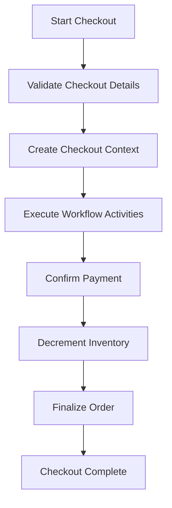

# Understanding Checkout Workflow

The checkout workflow refers to the sequence of activities and tasks executed to complete a customer's order. It ensures that all necessary steps are followed to validate, process, and finalize the order.

The workflow includes various activities such as validating the checkout details, confirming payments, and decrementing inventory. Each activity is designed to handle a specific part of the checkout process, ensuring that the order is processed correctly and efficiently.

## Validate Checkout Details

The `ValidateCheckoutActivity` is responsible for validating the checkout details, ensuring that all necessary information is provided and correct before proceeding to the next step.

## Create Checkout Context

The <SwmToken path="core/broadleaf-framework/src/main/java/org/broadleafcommerce/core/checkout/service/workflow/CheckoutProcessContextFactory.java" pos="25:4:4" line-data="public class CheckoutProcessContextFactory implements ProcessContextFactory&lt;CheckoutSeed, CheckoutSeed&gt; {">`CheckoutProcessContextFactory`</SwmToken> is used to create the context in which the checkout workflow operates, providing the necessary data and state management for the workflow activities.

<SwmSnippet path="/core/broadleaf-framework/src/main/java/org/broadleafcommerce/core/checkout/service/workflow/CheckoutProcessContextFactory.java" line="21">

---

The <SwmToken path="core/broadleaf-framework/src/main/java/org/broadleafcommerce/core/checkout/service/workflow/CheckoutProcessContextFactory.java" pos="25:4:4" line-data="public class CheckoutProcessContextFactory implements ProcessContextFactory&lt;CheckoutSeed, CheckoutSeed&gt; {">`CheckoutProcessContextFactory`</SwmToken> class imports and implements the necessary interfaces to create the context for the checkout workflow.

```java
import org.broadleafcommerce.core.workflow.ProcessContext;
import org.broadleafcommerce.core.workflow.ProcessContextFactory;
import org.broadleafcommerce.core.workflow.WorkflowException;

public class CheckoutProcessContextFactory implements ProcessContextFactory<CheckoutSeed, CheckoutSeed> {
```

---

</SwmSnippet>

## Execute Workflow Activities

The <SwmToken path="core/broadleaf-framework/src/main/java/org/broadleafcommerce/core/checkout/service/workflow/CompositeActivity.java" pos="32:8:8" line-data="    public ProcessContext&lt;CheckoutSeed&gt; execute(ProcessContext&lt;CheckoutSeed&gt; context) throws Exception {">`execute`</SwmToken> function is responsible for executing the workflow activities in the checkout process. It calls the <SwmToken path="core/broadleaf-framework/src/main/java/org/broadleafcommerce/core/checkout/service/workflow/CompositeActivity.java" pos="33:19:19" line-data="        ProcessContext&lt;CheckoutSeed&gt; subContext = (ProcessContext&lt;CheckoutSeed&gt;) workflow.doActivities(context.getSeedData());">`doActivities`</SwmToken> method on the workflow and handles the process context.

<SwmSnippet path="/core/broadleaf-framework/src/main/java/org/broadleafcommerce/core/checkout/service/workflow/CompositeActivity.java" line="31">

---

The <SwmToken path="core/broadleaf-framework/src/main/java/org/broadleafcommerce/core/checkout/service/workflow/CompositeActivity.java" pos="32:8:8" line-data="    public ProcessContext&lt;CheckoutSeed&gt; execute(ProcessContext&lt;CheckoutSeed&gt; context) throws Exception {">`execute`</SwmToken> method in the <SwmToken path="core/broadleaf-framework/src/main/java/org/broadleafcommerce/core/checkout/service/workflow/CompositeActivity.java" pos="24:4:4" line-data="public class CompositeActivity extends BaseActivity&lt;ProcessContext&lt;CheckoutSeed&gt;&gt; {">`CompositeActivity`</SwmToken> class executes the workflow activities and handles the process context.

```java
    @Override
    public ProcessContext<CheckoutSeed> execute(ProcessContext<CheckoutSeed> context) throws Exception {
        ProcessContext<CheckoutSeed> subContext = (ProcessContext<CheckoutSeed>) workflow.doActivities(context.getSeedData());
        if (subContext.isStopped()) {
            context.stopProcess();
        }

        return context;
    }
```

---

</SwmSnippet>

## Perform Workflow Activities

The <SwmToken path="core/broadleaf-framework/src/main/java/org/broadleafcommerce/core/checkout/service/workflow/CompositeActivity.java" pos="33:19:19" line-data="        ProcessContext&lt;CheckoutSeed&gt; subContext = (ProcessContext&lt;CheckoutSeed&gt;) workflow.doActivities(context.getSeedData());">`doActivities`</SwmToken> function is called by the <SwmToken path="core/broadleaf-framework/src/main/java/org/broadleafcommerce/core/checkout/service/workflow/CompositeActivity.java" pos="32:8:8" line-data="    public ProcessContext&lt;CheckoutSeed&gt; execute(ProcessContext&lt;CheckoutSeed&gt; context) throws Exception {">`execute`</SwmToken> method to perform the sequence of workflow activities. It processes the activities and returns the updated process context.

<SwmSnippet path="/core/broadleaf-framework/src/main/java/org/broadleafcommerce/core/workflow/SequenceProcessor.java" line="40">

---

The <SwmToken path="core/broadleaf-framework/src/main/java/org/broadleafcommerce/core/workflow/SequenceProcessor.java" pos="41:15:15" line-data="    public &lt;P extends ProcessContext&lt;U&gt;&gt; P doActivities() throws WorkflowException {">`doActivities`</SwmToken> method in the <SwmToken path="core/broadleaf-framework/src/main/java/org/broadleafcommerce/core/workflow/SequenceProcessor.java" pos="29:4:4" line-data="public class SequenceProcessor&lt;U, T&gt; extends BaseProcessor&lt;U, T&gt; {">`SequenceProcessor`</SwmToken> class processes the workflow activities and returns the updated process context.

```java
    @Override
    public <P extends ProcessContext<U>> P doActivities() throws WorkflowException {
        return doActivities(null);
    }
```

---

</SwmSnippet>

## Confirm Payment

Confirming payment is a critical step in the checkout workflow, ensuring that the customer's payment details are valid and the transaction is successful.

## Decrement Inventory

Decrementing inventory ensures that the purchased items are deducted from the available stock, preventing overselling.

## Finalize Order

Finalizing the order involves updating the order status and generating any necessary order confirmations or receipts.

## Checkout Complete

Once all the steps are completed, the checkout process is marked as complete, and the customer is notified of the successful order placement.

&nbsp;

*This is an auto-generated document by Swimm AI 🌊 and has not yet been verified by a human*

<SwmMeta version="3.0.0" repo-id="Z2l0aHViJTNBJTNBQnJvYWRsZWFmQ29tbWVyY2UtZGVtby1uZXclM0ElM0FTd2ltbS1EZW1v" repo-name="BroadleafCommerce-demo-new" doc-type="overview"><sup>Powered by [Swimm](/)</sup></SwmMeta>
