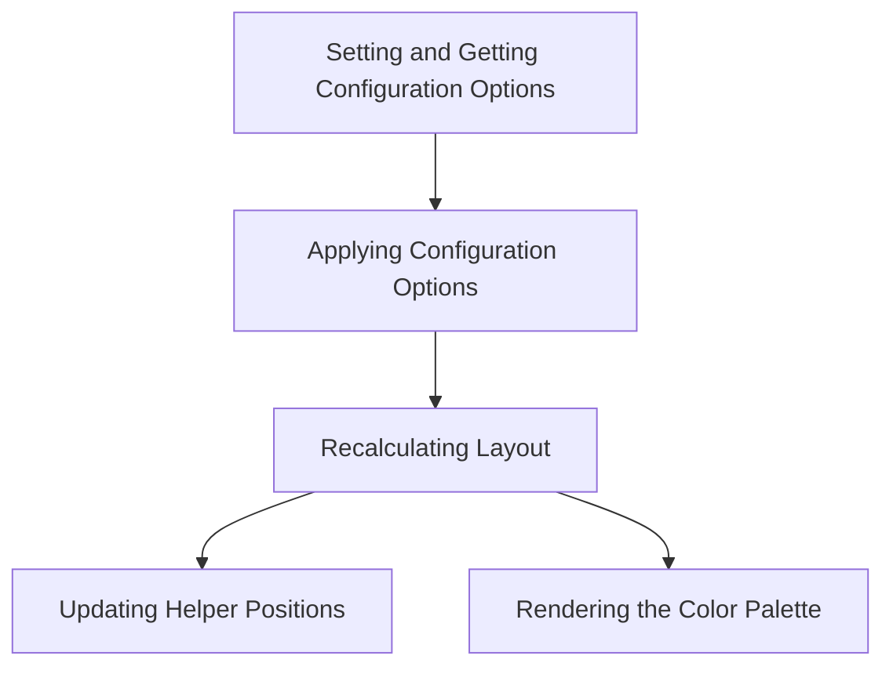

This document will cover the Color Picker Option Flow, which includes:

1. Setting and Getting Configuration Options
2. Applying Configuration Options
3. Recalculating Layout
4. Updating Helper Positions
5. Rendering the Color Palette

Technical document: <SwmLink doc-title="Color Picker Option Flow">[Color Picker Option Flow](/.swm/color-picker-option-flow.qkodtx99.sw.md)</SwmLink>

# [Setting and Getting Configuration Options](https://app.swimm.io/repos/Z2l0aHViJTNBJTNBQnJvYWRsZWFmQ29tbWVyY2UtZGVtby1uZXclM0ElM0FTd2ltbS1EZW1v/docs/qkodtx99#option)

The color picker allows users to either retrieve or update its configuration settings. When no arguments are provided, the current settings are returned. If a single argument is given, it returns the value of that specific setting. When two arguments are provided, the setting is updated with the new value, and the color picker is refreshed to reflect this change.

# [Applying Configuration Options](https://app.swimm.io/repos/Z2l0aHViJTNBJTNBQnJvYWRsZWFmQ29tbWVyY2UtZGVtby1uZXclM0ElM0FTd2ltbS1EZW1v/docs/qkodtx99#apply-options)

Once a configuration option is updated, the color picker needs to apply these new settings. This involves adjusting various UI elements, such as toggling the palette display and setting class names on the container. This ensures that the color picker reflects the user's preferences accurately.

# [Recalculating Layout](https://app.swimm.io/repos/Z2l0aHViJTNBJTNBQnJvYWRsZWFmQ29tbWVyY2UtZGVtby1uZXclM0ElM0FTd2ltbS1EZW1v/docs/qkodtx99#reflow)

After applying the new configuration options, the layout of the color picker must be recalculated. This step updates the dimensions and positions of various elements, such as the dragger and slider. If the color picker is not visible, this step is skipped to avoid unnecessary calculations.

# [Updating Helper Positions](https://app.swimm.io/repos/Z2l0aHViJTNBJTNBQnJvYWRsZWFmQ29tbWVyY2UtZGVtby1uZXclM0ElM0FTd2ltbS1EZW1v/docs/qkodtx99#update-helper-locations)

The helper elements within the color picker, such as the dragger and slider, need to be positioned correctly based on the current settings. This step calculates their positions based on the current saturation, value, and alpha settings. If the color picker is empty, the helpers are hidden; otherwise, they are shown and updated.

# [Rendering the Color Palette](https://app.swimm.io/repos/Z2l0aHViJTNBJTNBQnJvYWRsZWFmQ29tbWVyY2UtZGVtby1uZXclM0ElM0FTd2ltbS1EZW1v/docs/qkodtx99#rendering-the-color-palette)

The final step in the flow is rendering the color palette. This involves generating the HTML for each color in the palette and updating the selection palette from storage. The color picker then updates the palette container with the generated HTML, ensuring that the user sees the correct colors based on their configuration.

&nbsp;

*This is an auto-generated document by Swimm AI 🌊 and has not yet been verified by a human*

<SwmMeta version="3.0.0" repo-id="Z2l0aHViJTNBJTNBQnJvYWRsZWFmQ29tbWVyY2UtZGVtby1uZXclM0ElM0FTd2ltbS1EZW1v" repo-name="BroadleafCommerce-demo-new" doc-type="product-flows">Powered by [Swimm](/)</SwmMeta>
