This document explains the functionality and flow of the <SwmToken path="admin/broadleaf-open-admin-platform/src/main/resources/open_admin_style/js/admin/lib/plugins/spectrum.js" pos="926:3:3" line-data="        function option(optionName, optionValue) {">`option`</SwmToken> function within the color picker plugin. The <SwmToken path="admin/broadleaf-open-admin-platform/src/main/resources/open_admin_style/js/admin/lib/plugins/spectrum.js" pos="926:3:3" line-data="        function option(optionName, optionValue) {">`option`</SwmToken> function is responsible for getting or setting configuration options for the color picker. It interacts with several other functions to update the color picker based on the current configuration.

The <SwmToken path="admin/broadleaf-open-admin-platform/src/main/resources/open_admin_style/js/admin/lib/plugins/spectrum.js" pos="926:3:3" line-data="        function option(optionName, optionValue) {">`option`</SwmToken> function allows you to get or set settings for the color picker. If you call it without any arguments, it gives you the current settings. If you provide one argument, it gives you the value of that specific setting. If you provide two arguments, it updates the setting with the new value and then updates the color picker. This update process involves several steps: applying the new options, recalculating the layout, updating helper positions, and rendering the color palette.

Here is a high level diagram of the flow, showing only the most important functions:

```mermaid
graph TD;
      subgraph admin/broadleaf-open-admin-platform/src/main/resources/open_admin_style/js/admin/lib/plugins/spectrum.js
bab9f5d0fa424dfcb59f7de48b9d05e897f3a336acd0d1074cba72bf6b924f0f(option):::mainFlowStyle --> 1ab85b3782ae95994593569c21e3a25e18ce56e4bb188ac005bd218c70ac7d5b(applyOptions):::mainFlowStyle
end

subgraph admin/broadleaf-open-admin-platform/src/main/resources/open_admin_style/js/admin/lib/plugins/spectrum.js
1ab85b3782ae95994593569c21e3a25e18ce56e4bb188ac005bd218c70ac7d5b(applyOptions):::mainFlowStyle --> c2075116c18ea5b28bdccc5f48fd1e869761de9ba9bd384813190b87b4046f61(reflow):::mainFlowStyle
end

subgraph admin/broadleaf-open-admin-platform/src/main/resources/open_admin_style/js/admin/lib/plugins/spectrum.js
c2075116c18ea5b28bdccc5f48fd1e869761de9ba9bd384813190b87b4046f61(reflow):::mainFlowStyle --> c2fe05f21860463ea753f02484e09d691f5e132e5d31c3f54e57285fcefb4e25(updateHelperLocations)
end

subgraph admin/broadleaf-open-admin-platform/src/main/resources/open_admin_style/js/admin/lib/plugins/spectrum.js
c2075116c18ea5b28bdccc5f48fd1e869761de9ba9bd384813190b87b4046f61(reflow):::mainFlowStyle --> 3e758f6ef3c174058d9a2f25a8c3233032dd89526393fb93e68ba07de63a8e19(drawPalette):::mainFlowStyle
end

subgraph admin/broadleaf-open-admin-platform/src/main/resources/open_admin_style/js/admin/lib/plugins/spectrum.js
3e758f6ef3c174058d9a2f25a8c3233032dd89526393fb93e68ba07de63a8e19(drawPalette):::mainFlowStyle --> ea847d7eda2408b2f0346c6662e8c2aa553b11bb14cafb86b97472aaa9263c72(updateSelectionPaletteFromStorage)
end

subgraph admin/broadleaf-open-admin-platform/src/main/resources/open_admin_style/js/admin/lib/plugins/spectrum.js
3e758f6ef3c174058d9a2f25a8c3233032dd89526393fb93e68ba07de63a8e19(drawPalette):::mainFlowStyle --> 9192259e438f174786cf54cd0a64c31a71a67267fcf5c6ee3077697638b73596(paletteTemplate):::mainFlowStyle
end


      classDef mainFlowStyle color:#000000,fill:#7CB9F4
classDef rootsStyle color:#000000,fill:#00FFF4
classDef Style1 color:#000000,fill:#00FFAA
classDef Style2 color:#000000,fill:#FFFF00
classDef Style3 color:#000000,fill:#AA7CB9

%% Swimm:
%% graph TD;
%%       subgraph <SwmPath>[admin/broadleaf-open-admin-platform/src/main/resources/open_admin_style/js/admin/lib/plugins/spectrum.js](admin/broadleaf-open-admin-platform/src/main/resources/open_admin_style/js/admin/lib/plugins/spectrum.js)</SwmPath>
%% bab9f5d0fa424dfcb59f7de48b9d05e897f3a336acd0d1074cba72bf6b924f0f(option):::mainFlowStyle --> 1ab85b3782ae95994593569c21e3a25e18ce56e4bb188ac005bd218c70ac7d5b(applyOptions):::mainFlowStyle
%% end
%% 
%% subgraph <SwmPath>[admin/broadleaf-open-admin-platform/src/main/resources/open_admin_style/js/admin/lib/plugins/spectrum.js](admin/broadleaf-open-admin-platform/src/main/resources/open_admin_style/js/admin/lib/plugins/spectrum.js)</SwmPath>
%% 1ab85b3782ae95994593569c21e3a25e18ce56e4bb188ac005bd218c70ac7d5b(applyOptions):::mainFlowStyle --> c2075116c18ea5b28bdccc5f48fd1e869761de9ba9bd384813190b87b4046f61(reflow):::mainFlowStyle
%% end
%% 
%% subgraph <SwmPath>[admin/broadleaf-open-admin-platform/src/main/resources/open_admin_style/js/admin/lib/plugins/spectrum.js](admin/broadleaf-open-admin-platform/src/main/resources/open_admin_style/js/admin/lib/plugins/spectrum.js)</SwmPath>
%% c2075116c18ea5b28bdccc5f48fd1e869761de9ba9bd384813190b87b4046f61(reflow):::mainFlowStyle --> c2fe05f21860463ea753f02484e09d691f5e132e5d31c3f54e57285fcefb4e25(updateHelperLocations)
%% end
%% 
%% subgraph <SwmPath>[admin/broadleaf-open-admin-platform/src/main/resources/open_admin_style/js/admin/lib/plugins/spectrum.js](admin/broadleaf-open-admin-platform/src/main/resources/open_admin_style/js/admin/lib/plugins/spectrum.js)</SwmPath>
%% c2075116c18ea5b28bdccc5f48fd1e869761de9ba9bd384813190b87b4046f61(reflow):::mainFlowStyle --> 3e758f6ef3c174058d9a2f25a8c3233032dd89526393fb93e68ba07de63a8e19(drawPalette):::mainFlowStyle
%% end
%% 
%% subgraph <SwmPath>[admin/broadleaf-open-admin-platform/src/main/resources/open_admin_style/js/admin/lib/plugins/spectrum.js](admin/broadleaf-open-admin-platform/src/main/resources/open_admin_style/js/admin/lib/plugins/spectrum.js)</SwmPath>
%% 3e758f6ef3c174058d9a2f25a8c3233032dd89526393fb93e68ba07de63a8e19(drawPalette):::mainFlowStyle --> ea847d7eda2408b2f0346c6662e8c2aa553b11bb14cafb86b97472aaa9263c72(updateSelectionPaletteFromStorage)
%% end
%% 
%% subgraph <SwmPath>[admin/broadleaf-open-admin-platform/src/main/resources/open_admin_style/js/admin/lib/plugins/spectrum.js](admin/broadleaf-open-admin-platform/src/main/resources/open_admin_style/js/admin/lib/plugins/spectrum.js)</SwmPath>
%% 3e758f6ef3c174058d9a2f25a8c3233032dd89526393fb93e68ba07de63a8e19(drawPalette):::mainFlowStyle --> 9192259e438f174786cf54cd0a64c31a71a67267fcf5c6ee3077697638b73596(paletteTemplate):::mainFlowStyle
%% end
%% 
%% 
%%       classDef mainFlowStyle color:#000000,fill:#7CB9F4
%% classDef rootsStyle color:#000000,fill:#00FFF4
%% classDef Style1 color:#000000,fill:#00FFAA
%% classDef Style2 color:#000000,fill:#FFFF00
%% classDef Style3 color:#000000,fill:#AA7CB9
```



# Flow drill down

First, we'll zoom into this section of the flow:

```mermaid
graph TD;
      subgraph admin/broadleaf-open-admin-platform/src/main/resources/open_admin_style/js/admin/lib/plugins/spectrum.js
bab9f5d0fa424dfcb59f7de48b9d05e897f3a336acd0d1074cba72bf6b924f0f(option):::mainFlowStyle --> 1ab85b3782ae95994593569c21e3a25e18ce56e4bb188ac005bd218c70ac7d5b(applyOptions):::mainFlowStyle
end

subgraph admin/broadleaf-open-admin-platform/src/main/resources/open_admin_style/js/admin/lib/plugins/spectrum.js
1ab85b3782ae95994593569c21e3a25e18ce56e4bb188ac005bd218c70ac7d5b(applyOptions):::mainFlowStyle --> c2075116c18ea5b28bdccc5f48fd1e869761de9ba9bd384813190b87b4046f61(reflow):::mainFlowStyle
end

subgraph admin/broadleaf-open-admin-platform/src/main/resources/open_admin_style/js/admin/lib/plugins/spectrum.js
c2075116c18ea5b28bdccc5f48fd1e869761de9ba9bd384813190b87b4046f61(reflow):::mainFlowStyle --> c2fe05f21860463ea753f02484e09d691f5e132e5d31c3f54e57285fcefb4e25(updateHelperLocations)
end

subgraph admin/broadleaf-open-admin-platform/src/main/resources/open_admin_style/js/admin/lib/plugins/spectrum.js
c2075116c18ea5b28bdccc5f48fd1e869761de9ba9bd384813190b87b4046f61(reflow):::mainFlowStyle --> 3e758f6ef3c174058d9a2f25a8c3233032dd89526393fb93e68ba07de63a8e19(drawPalette):::mainFlowStyle
end

subgraph admin/broadleaf-open-admin-platform/src/main/resources/open_admin_style/js/admin/lib/plugins/spectrum.js
3e758f6ef3c174058d9a2f25a8c3233032dd89526393fb93e68ba07de63a8e19(drawPalette):::mainFlowStyle --> 3lt8a(...)
end

subgraph admin/broadleaf-open-admin-platform/src/main/resources/open_admin_style/js/admin/lib/plugins/spectrum.js
c2fe05f21860463ea753f02484e09d691f5e132e5d31c3f54e57285fcefb4e25(updateHelperLocations) --> 216f584e095c79b2f2bf2751a84cd65c133c366ca5f256881cdaf0962fbc3705(show)
end


      classDef mainFlowStyle color:#000000,fill:#7CB9F4
classDef rootsStyle color:#000000,fill:#00FFF4
classDef Style1 color:#000000,fill:#00FFAA
classDef Style2 color:#000000,fill:#FFFF00
classDef Style3 color:#000000,fill:#AA7CB9

%% Swimm:
%% graph TD;
%%       subgraph <SwmPath>[admin/broadleaf-open-admin-platform/src/main/resources/open_admin_style/js/admin/lib/plugins/spectrum.js](admin/broadleaf-open-admin-platform/src/main/resources/open_admin_style/js/admin/lib/plugins/spectrum.js)</SwmPath>
%% bab9f5d0fa424dfcb59f7de48b9d05e897f3a336acd0d1074cba72bf6b924f0f(option):::mainFlowStyle --> 1ab85b3782ae95994593569c21e3a25e18ce56e4bb188ac005bd218c70ac7d5b(applyOptions):::mainFlowStyle
%% end
%% 
%% subgraph <SwmPath>[admin/broadleaf-open-admin-platform/src/main/resources/open_admin_style/js/admin/lib/plugins/spectrum.js](admin/broadleaf-open-admin-platform/src/main/resources/open_admin_style/js/admin/lib/plugins/spectrum.js)</SwmPath>
%% 1ab85b3782ae95994593569c21e3a25e18ce56e4bb188ac005bd218c70ac7d5b(applyOptions):::mainFlowStyle --> c2075116c18ea5b28bdccc5f48fd1e869761de9ba9bd384813190b87b4046f61(reflow):::mainFlowStyle
%% end
%% 
%% subgraph <SwmPath>[admin/broadleaf-open-admin-platform/src/main/resources/open_admin_style/js/admin/lib/plugins/spectrum.js](admin/broadleaf-open-admin-platform/src/main/resources/open_admin_style/js/admin/lib/plugins/spectrum.js)</SwmPath>
%% c2075116c18ea5b28bdccc5f48fd1e869761de9ba9bd384813190b87b4046f61(reflow):::mainFlowStyle --> c2fe05f21860463ea753f02484e09d691f5e132e5d31c3f54e57285fcefb4e25(updateHelperLocations)
%% end
%% 
%% subgraph <SwmPath>[admin/broadleaf-open-admin-platform/src/main/resources/open_admin_style/js/admin/lib/plugins/spectrum.js](admin/broadleaf-open-admin-platform/src/main/resources/open_admin_style/js/admin/lib/plugins/spectrum.js)</SwmPath>
%% c2075116c18ea5b28bdccc5f48fd1e869761de9ba9bd384813190b87b4046f61(reflow):::mainFlowStyle --> 3e758f6ef3c174058d9a2f25a8c3233032dd89526393fb93e68ba07de63a8e19(drawPalette):::mainFlowStyle
%% end
%% 
%% subgraph <SwmPath>[admin/broadleaf-open-admin-platform/src/main/resources/open_admin_style/js/admin/lib/plugins/spectrum.js](admin/broadleaf-open-admin-platform/src/main/resources/open_admin_style/js/admin/lib/plugins/spectrum.js)</SwmPath>
%% 3e758f6ef3c174058d9a2f25a8c3233032dd89526393fb93e68ba07de63a8e19(drawPalette):::mainFlowStyle --> 3lt8a(...)
%% end
%% 
%% subgraph <SwmPath>[admin/broadleaf-open-admin-platform/src/main/resources/open_admin_style/js/admin/lib/plugins/spectrum.js](admin/broadleaf-open-admin-platform/src/main/resources/open_admin_style/js/admin/lib/plugins/spectrum.js)</SwmPath>
%% c2fe05f21860463ea753f02484e09d691f5e132e5d31c3f54e57285fcefb4e25(updateHelperLocations) --> 216f584e095c79b2f2bf2751a84cd65c133c366ca5f256881cdaf0962fbc3705(show)
%% end
%% 
%% 
%%       classDef mainFlowStyle color:#000000,fill:#7CB9F4
%% classDef rootsStyle color:#000000,fill:#00FFF4
%% classDef Style1 color:#000000,fill:#00FFAA
%% classDef Style2 color:#000000,fill:#FFFF00
%% classDef Style3 color:#000000,fill:#AA7CB9
```



<SwmSnippet path="/admin/broadleaf-open-admin-platform/src/main/resources/open_admin_style/js/admin/lib/plugins/spectrum.js" line="926">

---

## Option

The <SwmToken path="admin/broadleaf-open-admin-platform/src/main/resources/open_admin_style/js/admin/lib/plugins/spectrum.js" pos="926:3:3" line-data="        function option(optionName, optionValue) {">`option`</SwmToken> function is responsible for getting or setting configuration options for the color picker. When called with no arguments, it returns a copy of the current options. When called with one argument, it returns the value of the specified option. When called with two arguments, it sets the specified option to the given value and then calls <SwmToken path="admin/broadleaf-open-admin-platform/src/main/resources/open_admin_style/js/admin/lib/plugins/spectrum.js" pos="939:1:1" line-data="            applyOptions();">`applyOptions`</SwmToken> to update the color picker with the new settings.

```javascript
        function option(optionName, optionValue) {
            if (optionName === undefined) {
                return $.extend({}, opts);
            }
            if (optionValue === undefined) {
                return opts[optionName];
            }

            opts[optionName] = optionValue;

            if (optionName === "preferredFormat") {
                currentPreferredFormat = opts.preferredFormat;
            }
            applyOptions();
        }
```

---

</SwmSnippet>

<SwmSnippet path="/admin/broadleaf-open-admin-platform/src/main/resources/open_admin_style/js/admin/lib/plugins/spectrum.js" line="242">

---

## Apply Options

The <SwmToken path="admin/broadleaf-open-admin-platform/src/main/resources/open_admin_style/js/admin/lib/plugins/spectrum.js" pos="242:3:3" line-data="        function applyOptions() {">`applyOptions`</SwmToken> function updates the color picker based on the current configuration options. It adjusts various UI elements, such as toggling the palette display and setting class names on the container. Finally, it calls the <SwmToken path="admin/broadleaf-open-admin-platform/src/main/resources/open_admin_style/js/admin/lib/plugins/spectrum.js" pos="617:1:1" line-data="                reflow();">`reflow`</SwmToken> function to re-calculate the layout.

```javascript
        function applyOptions() {

            if (opts.showPaletteOnly) {
                opts.showPalette = true;
            }

            toggleButton.text(opts.showPaletteOnly ? opts.togglePaletteMoreText : opts.togglePaletteLessText);

            if (opts.palette) {
                palette = opts.palette.slice(0);
                paletteArray = $.isArray(palette[0]) ? palette : [palette];
                paletteLookup = {};
                for (var i = 0; i < paletteArray.length; i++) {
                    for (var j = 0; j < paletteArray[i].length; j++) {
                        var rgb = tinycolor(paletteArray[i][j]).toRgbString();
                        paletteLookup[rgb] = true;
                    }
                }
            }

            container.toggleClass("sp-flat", flat);
```

---

</SwmSnippet>

<SwmSnippet path="/admin/broadleaf-open-admin-platform/src/main/resources/open_admin_style/js/admin/lib/plugins/spectrum.js" line="887">

---

## Reflow

The <SwmToken path="admin/broadleaf-open-admin-platform/src/main/resources/open_admin_style/js/admin/lib/plugins/spectrum.js" pos="887:3:3" line-data="        function reflow() {">`reflow`</SwmToken> function recalculates the layout of the color picker. It updates dimensions and positions of various elements, such as the dragger and slider. If the color picker is not visible, it exits early. It also calls <SwmToken path="admin/broadleaf-open-admin-platform/src/main/resources/open_admin_style/js/admin/lib/plugins/spectrum.js" pos="821:3:3" line-data="        function updateHelperLocations() {">`updateHelperLocations`</SwmToken> to position the helper elements and <SwmToken path="admin/broadleaf-open-admin-platform/src/main/resources/open_admin_style/js/admin/lib/plugins/spectrum.js" pos="541:3:3" line-data="        function drawPalette() {">`drawPalette`</SwmToken> if the palette is enabled.

```javascript
        function reflow() {
            if (!visible) {
                return; // Calculations would be useless and wouldn't be reliable anyways
            }
            dragWidth = dragger.width();
            dragHeight = dragger.height();
            dragHelperHeight = dragHelper.height();
            slideWidth = slider.width();
            slideHeight = slider.height();
            slideHelperHeight = slideHelper.height();
            alphaWidth = alphaSlider.width();
            alphaSlideHelperWidth = alphaSlideHelper.width();

            if (!flat) {
                container.css("position", "absolute");
                if (opts.offset) {
                    container.offset(opts.offset);
                } else {
                    container.offset(getOffset(container, offsetElement));
                }
            }
```

---

</SwmSnippet>

<SwmSnippet path="/admin/broadleaf-open-admin-platform/src/main/resources/open_admin_style/js/admin/lib/plugins/spectrum.js" line="821">

---

## Update Helper Locations

The <SwmToken path="admin/broadleaf-open-admin-platform/src/main/resources/open_admin_style/js/admin/lib/plugins/spectrum.js" pos="821:3:3" line-data="        function updateHelperLocations() {">`updateHelperLocations`</SwmToken> function positions the helper elements within the color picker. It calculates the positions based on the current saturation, value, and alpha settings. If the color picker is empty, it hides the helpers; otherwise, it shows them and updates their positions.

```javascript
        function updateHelperLocations() {
            var s = currentSaturation;
            var v = currentValue;

            if(allowEmpty && isEmpty) {
                //if selected color is empty, hide the helpers
                alphaSlideHelper.hide();
                slideHelper.hide();
                dragHelper.hide();
            }
            else {
                //make sure helpers are visible
                alphaSlideHelper.show();
                slideHelper.show();
                dragHelper.show();

                // Where to show the little circle in that displays your current selected color
                var dragX = s * dragWidth;
                var dragY = dragHeight - (v * dragHeight);
                dragX = Math.max(
                    -dragHelperHeight,
```

---

</SwmSnippet>

<SwmSnippet path="/admin/broadleaf-open-admin-platform/src/main/resources/open_admin_style/js/admin/lib/plugins/spectrum.js" line="613">

---

## Show

The <SwmToken path="admin/broadleaf-open-admin-platform/src/main/resources/open_admin_style/js/admin/lib/plugins/spectrum.js" pos="613:3:3" line-data="        function show() {">`show`</SwmToken> function makes the color picker visible. It triggers the <SwmToken path="admin/broadleaf-open-admin-platform/src/main/resources/open_admin_style/js/admin/lib/plugins/spectrum.js" pos="614:11:11" line-data="            var event = $.Event(&#39;beforeShow.spectrum&#39;);">`beforeShow`</SwmToken> event and checks if it should proceed. If the color picker is already visible, it calls <SwmToken path="admin/broadleaf-open-admin-platform/src/main/resources/open_admin_style/js/admin/lib/plugins/spectrum.js" pos="617:1:1" line-data="                reflow();">`reflow`</SwmToken> and exits. Otherwise, it sets up event listeners, updates the UI, and triggers the <SwmToken path="admin/broadleaf-open-admin-platform/src/main/resources/open_admin_style/js/admin/lib/plugins/spectrum.js" pos="613:3:3" line-data="        function show() {">`show`</SwmToken> event.

```javascript
        function show() {
            var event = $.Event('beforeShow.spectrum');

            if (visible) {
                reflow();
                return;
            }

            boundElement.trigger(event, [ get() ]);

            if (callbacks.beforeShow(get()) === false || event.isDefaultPrevented()) {
                return;
            }

            hideAll();
            visible = true;

            $(doc).on("keydown.spectrum", onkeydown);
            $(doc).on("click.spectrum", clickout);
            $(window).on("resize.spectrum", resize);
            replacer.addClass("sp-active");
```

---

</SwmSnippet>

Now, lets zoom into this section of the flow:

```mermaid
graph TD;
      subgraph admin/broadleaf-open-admin-platform/src/main/resources/open_admin_style/js/admin/lib/plugins/spectrum.js
3e758f6ef3c174058d9a2f25a8c3233032dd89526393fb93e68ba07de63a8e19(drawPalette):::mainFlowStyle --> ea847d7eda2408b2f0346c6662e8c2aa553b11bb14cafb86b97472aaa9263c72(updateSelectionPaletteFromStorage)
end

subgraph admin/broadleaf-open-admin-platform/src/main/resources/open_admin_style/js/admin/lib/plugins/spectrum.js
3e758f6ef3c174058d9a2f25a8c3233032dd89526393fb93e68ba07de63a8e19(drawPalette):::mainFlowStyle --> 9192259e438f174786cf54cd0a64c31a71a67267fcf5c6ee3077697638b73596(paletteTemplate):::mainFlowStyle
end

subgraph admin/broadleaf-open-admin-platform/src/main/resources/open_admin_style/js/admin/lib/plugins/spectrum.js
ea847d7eda2408b2f0346c6662e8c2aa553b11bb14cafb86b97472aaa9263c72(updateSelectionPaletteFromStorage) --> 3d9ec69a10c05d30fb04d23f1e4bdbb762e3c85c353dbf321c3a4ef187f290f3(addColorToSelectionPalette)
end


      classDef mainFlowStyle color:#000000,fill:#7CB9F4
classDef rootsStyle color:#000000,fill:#00FFF4
classDef Style1 color:#000000,fill:#00FFAA
classDef Style2 color:#000000,fill:#FFFF00
classDef Style3 color:#000000,fill:#AA7CB9

%% Swimm:
%% graph TD;
%%       subgraph <SwmPath>[admin/broadleaf-open-admin-platform/src/main/resources/open_admin_style/js/admin/lib/plugins/spectrum.js](admin/broadleaf-open-admin-platform/src/main/resources/open_admin_style/js/admin/lib/plugins/spectrum.js)</SwmPath>
%% 3e758f6ef3c174058d9a2f25a8c3233032dd89526393fb93e68ba07de63a8e19(drawPalette):::mainFlowStyle --> ea847d7eda2408b2f0346c6662e8c2aa553b11bb14cafb86b97472aaa9263c72(updateSelectionPaletteFromStorage)
%% end
%% 
%% subgraph <SwmPath>[admin/broadleaf-open-admin-platform/src/main/resources/open_admin_style/js/admin/lib/plugins/spectrum.js](admin/broadleaf-open-admin-platform/src/main/resources/open_admin_style/js/admin/lib/plugins/spectrum.js)</SwmPath>
%% 3e758f6ef3c174058d9a2f25a8c3233032dd89526393fb93e68ba07de63a8e19(drawPalette):::mainFlowStyle --> 9192259e438f174786cf54cd0a64c31a71a67267fcf5c6ee3077697638b73596(paletteTemplate):::mainFlowStyle
%% end
%% 
%% subgraph <SwmPath>[admin/broadleaf-open-admin-platform/src/main/resources/open_admin_style/js/admin/lib/plugins/spectrum.js](admin/broadleaf-open-admin-platform/src/main/resources/open_admin_style/js/admin/lib/plugins/spectrum.js)</SwmPath>
%% ea847d7eda2408b2f0346c6662e8c2aa553b11bb14cafb86b97472aaa9263c72(updateSelectionPaletteFromStorage) --> 3d9ec69a10c05d30fb04d23f1e4bdbb762e3c85c353dbf321c3a4ef187f290f3(addColorToSelectionPalette)
%% end
%% 
%% 
%%       classDef mainFlowStyle color:#000000,fill:#7CB9F4
%% classDef rootsStyle color:#000000,fill:#00FFF4
%% classDef Style1 color:#000000,fill:#00FFAA
%% classDef Style2 color:#000000,fill:#FFFF00
%% classDef Style3 color:#000000,fill:#AA7CB9
```



<SwmSnippet path="/admin/broadleaf-open-admin-platform/src/main/resources/open_admin_style/js/admin/lib/plugins/spectrum.js" line="541">

---

## Rendering the Color Palette

The <SwmToken path="admin/broadleaf-open-admin-platform/src/main/resources/open_admin_style/js/admin/lib/plugins/spectrum.js" pos="541:3:3" line-data="        function drawPalette() {">`drawPalette`</SwmToken> function is responsible for rendering the color palette. It first retrieves the current color and then maps over the <SwmToken path="admin/broadleaf-open-admin-platform/src/main/resources/open_admin_style/js/admin/lib/plugins/spectrum.js" pos="545:10:10" line-data="            var html = $.map(paletteArray, function (palette, i) {">`paletteArray`</SwmToken> to generate HTML for each palette using the <SwmToken path="admin/broadleaf-open-admin-platform/src/main/resources/open_admin_style/js/admin/lib/plugins/spectrum.js" pos="546:3:3" line-data="                return paletteTemplate(palette, currentColor, &quot;sp-palette-row sp-palette-row-&quot; + i, opts);">`paletteTemplate`</SwmToken> function. After updating the selection palette from storage, it checks if the <SwmToken path="admin/broadleaf-open-admin-platform/src/main/resources/open_admin_style/js/admin/lib/plugins/spectrum.js" pos="551:4:4" line-data="            if (selectionPalette) {">`selectionPalette`</SwmToken> exists and appends it to the HTML. Finally, it updates the <SwmToken path="admin/broadleaf-open-admin-platform/src/main/resources/open_admin_style/js/admin/lib/plugins/spectrum.js" pos="555:1:1" line-data="            paletteContainer.html(html.join(&quot;&quot;));">`paletteContainer`</SwmToken> with the generated HTML.

```javascript
        function drawPalette() {

            var currentColor = get();

            var html = $.map(paletteArray, function (palette, i) {
                return paletteTemplate(palette, currentColor, "sp-palette-row sp-palette-row-" + i, opts);
            });

            updateSelectionPaletteFromStorage();

            if (selectionPalette) {
                html.push(paletteTemplate(getUniqueSelectionPalette(), currentColor, "sp-palette-row sp-palette-row-selection", opts));
            }

            paletteContainer.html(html.join(""));
        }
```

---

</SwmSnippet>

<SwmSnippet path="/admin/broadleaf-open-admin-platform/src/main/resources/open_admin_style/js/admin/lib/plugins/spectrum.js" line="484">

---

## Updating the Selection Palette from Storage

The <SwmToken path="admin/broadleaf-open-admin-platform/src/main/resources/open_admin_style/js/admin/lib/plugins/spectrum.js" pos="484:3:3" line-data="        function updateSelectionPaletteFromStorage() {">`updateSelectionPaletteFromStorage`</SwmToken> function updates the selection palette by retrieving it from the local storage. It first checks if <SwmToken path="admin/broadleaf-open-admin-platform/src/main/resources/open_admin_style/js/admin/lib/plugins/spectrum.js" pos="486:4:4" line-data="            if (localStorageKey &amp;&amp; window.localStorage) {">`localStorageKey`</SwmToken> and <SwmToken path="admin/broadleaf-open-admin-platform/src/main/resources/open_admin_style/js/admin/lib/plugins/spectrum.js" pos="486:8:10" line-data="            if (localStorageKey &amp;&amp; window.localStorage) {">`window.localStorage`</SwmToken> are available. If so, it attempts to migrate old palettes to a new format and then retrieves the selection palette from local storage, splitting it into an array.

```javascript
        function updateSelectionPaletteFromStorage() {

            if (localStorageKey && window.localStorage) {

                // Migrate old palettes over to new format.  May want to remove this eventually.
                try {
                    var oldPalette = window.localStorage[localStorageKey].split(",#");
                    if (oldPalette.length > 1) {
                        delete window.localStorage[localStorageKey];
                        $.each(oldPalette, function(i, c) {
                             addColorToSelectionPalette(c);
                        });
                    }
                }
                catch(e) { }

                try {
                    selectionPalette = window.localStorage[localStorageKey].split(";");
                }
                catch (e) { }
            }
```

---

</SwmSnippet>

<SwmSnippet path="/admin/broadleaf-open-admin-platform/src/main/resources/open_admin_style/js/admin/lib/plugins/spectrum.js" line="133">

---

## Generating Palette HTML

The <SwmToken path="admin/broadleaf-open-admin-platform/src/main/resources/open_admin_style/js/admin/lib/plugins/spectrum.js" pos="133:3:3" line-data="    function paletteTemplate (p, color, className, opts) {">`paletteTemplate`</SwmToken> function generates the HTML for a given palette. It iterates over the palette colors, creating HTML elements for each color. It also handles the case where no color is selected by adding a clear display element. The generated HTML is then returned as a string.

```javascript
    function paletteTemplate (p, color, className, opts) {
        var html = [];
        for (var i = 0; i < p.length; i++) {
            var current = p[i];
            if(current) {
                var tiny = tinycolor(current);
                var c = tiny.toHsl().l < 0.5 ? "sp-thumb-el sp-thumb-dark" : "sp-thumb-el sp-thumb-light";
                c += (tinycolor.equals(color, current)) ? " sp-thumb-active" : "";
                var formattedString = tiny.toString(opts.preferredFormat || "rgb");
                var swatchStyle = rgbaSupport ? ("background-color:" + tiny.toRgbString()) : "filter:" + tiny.toFilter();
                html.push('<span title="' + formattedString + '" data-color="' + tiny.toRgbString() + '" class="' + c + '"><span class="sp-thumb-inner" style="' + swatchStyle + ';"></span></span>');
            } else {
                var cls = 'sp-clear-display';
                html.push($('<div />')
                    .append($('<span data-color="" style="background-color:transparent;" class="' + cls + '"></span>')
                        .attr('title', opts.noColorSelectedText)
                    )
                    .html()
                );
            }
        }
```

---

</SwmSnippet>

<SwmSnippet path="/admin/broadleaf-open-admin-platform/src/main/resources/open_admin_style/js/admin/lib/plugins/spectrum.js" line="507">

---

## Adding Color to Selection Palette

The <SwmToken path="admin/broadleaf-open-admin-platform/src/main/resources/open_admin_style/js/admin/lib/plugins/spectrum.js" pos="507:3:3" line-data="        function addColorToSelectionPalette(color) {">`addColorToSelectionPalette`</SwmToken> function adds a new color to the selection palette. It first checks if the <SwmToken path="admin/broadleaf-open-admin-platform/src/main/resources/open_admin_style/js/admin/lib/plugins/spectrum.js" pos="508:4:4" line-data="            if (showSelectionPalette) {">`showSelectionPalette`</SwmToken> flag is true. If the color is not already in the palette, it adds it and ensures the palette does not exceed the maximum selection size by removing the oldest color if necessary. It then updates the local storage with the new selection palette.

```javascript
        function addColorToSelectionPalette(color) {
            if (showSelectionPalette) {
                var rgb = tinycolor(color).toRgbString();
                if (!paletteLookup[rgb] && $.inArray(rgb, selectionPalette) === -1) {
                    selectionPalette.push(rgb);
                    while(selectionPalette.length > maxSelectionSize) {
                        selectionPalette.shift();
                    }
                }

                if (localStorageKey && window.localStorage) {
                    try {
                        window.localStorage[localStorageKey] = selectionPalette.join(";");
                    }
                    catch(e) { }
                }
            }
        }
```

---

</SwmSnippet>

&nbsp;

*This is an auto-generated document by Swimm AI 🌊 and has not yet been verified by a human*

<SwmMeta version="3.0.0" repo-id="Z2l0aHViJTNBJTNBQnJvYWRsZWFmQ29tbWVyY2UtZGVtby1uZXclM0ElM0FTd2ltbS1EZW1v" repo-name="BroadleafCommerce-demo-new" doc-type="flows"><sup>Powered by [Swimm](/)</sup></SwmMeta>
