In this document, we will explain the role of the <SwmToken path="admin/broadleaf-open-admin-platform/src/main/resources/open_admin_style/js/admin/lib/plugins/spectrum.js" pos="955:3:3" line-data="        function setOffset(coord) {">`setOffset`</SwmToken> function within the color picker flow. This function is crucial for ensuring the correct positioning and appearance of the color picker UI.

The <SwmToken path="admin/broadleaf-open-admin-platform/src/main/resources/open_admin_style/js/admin/lib/plugins/spectrum.js" pos="955:3:3" line-data="        function setOffset(coord) {">`setOffset`</SwmToken> function sets the position for the color picker container based on given coordinates. Once the position is set, it triggers a reflow to update the UI, ensuring that the color picker is displayed correctly. This involves recalculating dimensions and positions of various elements, updating helper locations, and redrawing the palette if necessary. The reflow process is essential for maintaining the correct layout and appearance of the color picker.

Here is a high level diagram of the flow, showing only the most important functions:

```mermaid
graph TD;
      subgraph admin/broadleaf-open-admin-platform/src/main/resources/open_admin_style/js/admin/lib/plugins/spectrum.js
55c3cfe1888bdb865757cc513e06bb041e77ddab6ddca8b4b14146c11af6d94d(setOffset):::mainFlowStyle --> c2075116c18ea5b28bdccc5f48fd1e869761de9ba9bd384813190b87b4046f61(reflow):::mainFlowStyle
end

subgraph admin/broadleaf-open-admin-platform/src/main/resources/open_admin_style/js/admin/lib/plugins/spectrum.js
c2075116c18ea5b28bdccc5f48fd1e869761de9ba9bd384813190b87b4046f61(reflow):::mainFlowStyle --> c2fe05f21860463ea753f02484e09d691f5e132e5d31c3f54e57285fcefb4e25(updateHelperLocations)
end

subgraph admin/broadleaf-open-admin-platform/src/main/resources/open_admin_style/js/admin/lib/plugins/spectrum.js
c2075116c18ea5b28bdccc5f48fd1e869761de9ba9bd384813190b87b4046f61(reflow):::mainFlowStyle --> 3e758f6ef3c174058d9a2f25a8c3233032dd89526393fb93e68ba07de63a8e19(drawPalette):::mainFlowStyle
end

subgraph admin/broadleaf-open-admin-platform/src/main/resources/open_admin_style/js/admin/lib/plugins/spectrum.js
3e758f6ef3c174058d9a2f25a8c3233032dd89526393fb93e68ba07de63a8e19(drawPalette):::mainFlowStyle --> ea847d7eda2408b2f0346c6662e8c2aa553b11bb14cafb86b97472aaa9263c72(updateSelectionPaletteFromStorage)
end

subgraph admin/broadleaf-open-admin-platform/src/main/resources/open_admin_style/js/admin/lib/plugins/spectrum.js
3e758f6ef3c174058d9a2f25a8c3233032dd89526393fb93e68ba07de63a8e19(drawPalette):::mainFlowStyle --> 9192259e438f174786cf54cd0a64c31a71a67267fcf5c6ee3077697638b73596(paletteTemplate):::mainFlowStyle
end


      classDef mainFlowStyle color:#000000,fill:#7CB9F4
classDef rootsStyle color:#000000,fill:#00FFF4
classDef Style1 color:#000000,fill:#00FFAA
classDef Style2 color:#000000,fill:#FFFF00
classDef Style3 color:#000000,fill:#AA7CB9

%% Swimm:
%% graph TD;
%%       subgraph <SwmPath>[admin/broadleaf-open-admin-platform/src/main/resources/open_admin_style/js/admin/lib/plugins/spectrum.js](admin/broadleaf-open-admin-platform/src/main/resources/open_admin_style/js/admin/lib/plugins/spectrum.js)</SwmPath>
%% 55c3cfe1888bdb865757cc513e06bb041e77ddab6ddca8b4b14146c11af6d94d(setOffset):::mainFlowStyle --> c2075116c18ea5b28bdccc5f48fd1e869761de9ba9bd384813190b87b4046f61(reflow):::mainFlowStyle
%% end
%% 
%% subgraph <SwmPath>[admin/broadleaf-open-admin-platform/src/main/resources/open_admin_style/js/admin/lib/plugins/spectrum.js](admin/broadleaf-open-admin-platform/src/main/resources/open_admin_style/js/admin/lib/plugins/spectrum.js)</SwmPath>
%% c2075116c18ea5b28bdccc5f48fd1e869761de9ba9bd384813190b87b4046f61(reflow):::mainFlowStyle --> c2fe05f21860463ea753f02484e09d691f5e132e5d31c3f54e57285fcefb4e25(updateHelperLocations)
%% end
%% 
%% subgraph <SwmPath>[admin/broadleaf-open-admin-platform/src/main/resources/open_admin_style/js/admin/lib/plugins/spectrum.js](admin/broadleaf-open-admin-platform/src/main/resources/open_admin_style/js/admin/lib/plugins/spectrum.js)</SwmPath>
%% c2075116c18ea5b28bdccc5f48fd1e869761de9ba9bd384813190b87b4046f61(reflow):::mainFlowStyle --> 3e758f6ef3c174058d9a2f25a8c3233032dd89526393fb93e68ba07de63a8e19(drawPalette):::mainFlowStyle
%% end
%% 
%% subgraph <SwmPath>[admin/broadleaf-open-admin-platform/src/main/resources/open_admin_style/js/admin/lib/plugins/spectrum.js](admin/broadleaf-open-admin-platform/src/main/resources/open_admin_style/js/admin/lib/plugins/spectrum.js)</SwmPath>
%% 3e758f6ef3c174058d9a2f25a8c3233032dd89526393fb93e68ba07de63a8e19(drawPalette):::mainFlowStyle --> ea847d7eda2408b2f0346c6662e8c2aa553b11bb14cafb86b97472aaa9263c72(updateSelectionPaletteFromStorage)
%% end
%% 
%% subgraph <SwmPath>[admin/broadleaf-open-admin-platform/src/main/resources/open_admin_style/js/admin/lib/plugins/spectrum.js](admin/broadleaf-open-admin-platform/src/main/resources/open_admin_style/js/admin/lib/plugins/spectrum.js)</SwmPath>
%% 3e758f6ef3c174058d9a2f25a8c3233032dd89526393fb93e68ba07de63a8e19(drawPalette):::mainFlowStyle --> 9192259e438f174786cf54cd0a64c31a71a67267fcf5c6ee3077697638b73596(paletteTemplate):::mainFlowStyle
%% end
%% 
%% 
%%       classDef mainFlowStyle color:#000000,fill:#7CB9F4
%% classDef rootsStyle color:#000000,fill:#00FFF4
%% classDef Style1 color:#000000,fill:#00FFAA
%% classDef Style2 color:#000000,fill:#FFFF00
%% classDef Style3 color:#000000,fill:#AA7CB9
```



# Flow drill down

First, we'll zoom into this section of the flow:

```mermaid
graph TD;
      subgraph admin/broadleaf-open-admin-platform/src/main/resources/open_admin_style/js/admin/lib/plugins/spectrum.js
55c3cfe1888bdb865757cc513e06bb041e77ddab6ddca8b4b14146c11af6d94d(setOffset):::mainFlowStyle --> c2075116c18ea5b28bdccc5f48fd1e869761de9ba9bd384813190b87b4046f61(reflow):::mainFlowStyle
end

subgraph admin/broadleaf-open-admin-platform/src/main/resources/open_admin_style/js/admin/lib/plugins/spectrum.js
c2075116c18ea5b28bdccc5f48fd1e869761de9ba9bd384813190b87b4046f61(reflow):::mainFlowStyle --> c2fe05f21860463ea753f02484e09d691f5e132e5d31c3f54e57285fcefb4e25(updateHelperLocations)
end

subgraph admin/broadleaf-open-admin-platform/src/main/resources/open_admin_style/js/admin/lib/plugins/spectrum.js
c2075116c18ea5b28bdccc5f48fd1e869761de9ba9bd384813190b87b4046f61(reflow):::mainFlowStyle --> 3e758f6ef3c174058d9a2f25a8c3233032dd89526393fb93e68ba07de63a8e19(drawPalette):::mainFlowStyle
end

subgraph admin/broadleaf-open-admin-platform/src/main/resources/open_admin_style/js/admin/lib/plugins/spectrum.js
3e758f6ef3c174058d9a2f25a8c3233032dd89526393fb93e68ba07de63a8e19(drawPalette):::mainFlowStyle --> xpbl3(...)
end

subgraph admin/broadleaf-open-admin-platform/src/main/resources/open_admin_style/js/admin/lib/plugins/spectrum.js
c2fe05f21860463ea753f02484e09d691f5e132e5d31c3f54e57285fcefb4e25(updateHelperLocations) --> 216f584e095c79b2f2bf2751a84cd65c133c366ca5f256881cdaf0962fbc3705(show)
end


      classDef mainFlowStyle color:#000000,fill:#7CB9F4
classDef rootsStyle color:#000000,fill:#00FFF4
classDef Style1 color:#000000,fill:#00FFAA
classDef Style2 color:#000000,fill:#FFFF00
classDef Style3 color:#000000,fill:#AA7CB9

%% Swimm:
%% graph TD;
%%       subgraph <SwmPath>[admin/broadleaf-open-admin-platform/src/main/resources/open_admin_style/js/admin/lib/plugins/spectrum.js](admin/broadleaf-open-admin-platform/src/main/resources/open_admin_style/js/admin/lib/plugins/spectrum.js)</SwmPath>
%% 55c3cfe1888bdb865757cc513e06bb041e77ddab6ddca8b4b14146c11af6d94d(setOffset):::mainFlowStyle --> c2075116c18ea5b28bdccc5f48fd1e869761de9ba9bd384813190b87b4046f61(reflow):::mainFlowStyle
%% end
%% 
%% subgraph <SwmPath>[admin/broadleaf-open-admin-platform/src/main/resources/open_admin_style/js/admin/lib/plugins/spectrum.js](admin/broadleaf-open-admin-platform/src/main/resources/open_admin_style/js/admin/lib/plugins/spectrum.js)</SwmPath>
%% c2075116c18ea5b28bdccc5f48fd1e869761de9ba9bd384813190b87b4046f61(reflow):::mainFlowStyle --> c2fe05f21860463ea753f02484e09d691f5e132e5d31c3f54e57285fcefb4e25(updateHelperLocations)
%% end
%% 
%% subgraph <SwmPath>[admin/broadleaf-open-admin-platform/src/main/resources/open_admin_style/js/admin/lib/plugins/spectrum.js](admin/broadleaf-open-admin-platform/src/main/resources/open_admin_style/js/admin/lib/plugins/spectrum.js)</SwmPath>
%% c2075116c18ea5b28bdccc5f48fd1e869761de9ba9bd384813190b87b4046f61(reflow):::mainFlowStyle --> 3e758f6ef3c174058d9a2f25a8c3233032dd89526393fb93e68ba07de63a8e19(drawPalette):::mainFlowStyle
%% end
%% 
%% subgraph <SwmPath>[admin/broadleaf-open-admin-platform/src/main/resources/open_admin_style/js/admin/lib/plugins/spectrum.js](admin/broadleaf-open-admin-platform/src/main/resources/open_admin_style/js/admin/lib/plugins/spectrum.js)</SwmPath>
%% 3e758f6ef3c174058d9a2f25a8c3233032dd89526393fb93e68ba07de63a8e19(drawPalette):::mainFlowStyle --> xpbl3(...)
%% end
%% 
%% subgraph <SwmPath>[admin/broadleaf-open-admin-platform/src/main/resources/open_admin_style/js/admin/lib/plugins/spectrum.js](admin/broadleaf-open-admin-platform/src/main/resources/open_admin_style/js/admin/lib/plugins/spectrum.js)</SwmPath>
%% c2fe05f21860463ea753f02484e09d691f5e132e5d31c3f54e57285fcefb4e25(updateHelperLocations) --> 216f584e095c79b2f2bf2751a84cd65c133c366ca5f256881cdaf0962fbc3705(show)
%% end
%% 
%% 
%%       classDef mainFlowStyle color:#000000,fill:#7CB9F4
%% classDef rootsStyle color:#000000,fill:#00FFF4
%% classDef Style1 color:#000000,fill:#00FFAA
%% classDef Style2 color:#000000,fill:#FFFF00
%% classDef Style3 color:#000000,fill:#AA7CB9
```



<SwmSnippet path="/admin/broadleaf-open-admin-platform/src/main/resources/open_admin_style/js/admin/lib/plugins/spectrum.js" line="955">

---

## <SwmToken path="admin/broadleaf-open-admin-platform/src/main/resources/open_admin_style/js/admin/lib/plugins/spectrum.js" pos="955:3:3" line-data="        function setOffset(coord) {">`setOffset`</SwmToken>

The <SwmToken path="admin/broadleaf-open-admin-platform/src/main/resources/open_admin_style/js/admin/lib/plugins/spectrum.js" pos="955:3:3" line-data="        function setOffset(coord) {">`setOffset`</SwmToken> function sets the offset for the color picker container and triggers a reflow to update the UI. This ensures that the color picker is positioned correctly based on the provided coordinates.

```javascript
        function setOffset(coord) {
            opts.offset = coord;
            reflow();
        }
```

---

</SwmSnippet>

<SwmSnippet path="/admin/broadleaf-open-admin-platform/src/main/resources/open_admin_style/js/admin/lib/plugins/spectrum.js" line="887">

---

## reflow

The <SwmToken path="admin/broadleaf-open-admin-platform/src/main/resources/open_admin_style/js/admin/lib/plugins/spectrum.js" pos="887:3:3" line-data="        function reflow() {">`reflow`</SwmToken> function recalculates the dimensions and positions of various elements within the color picker. It updates the helper locations and redraws the palette if necessary. This function is crucial for maintaining the correct layout and appearance of the color picker.

```javascript
        function reflow() {
            if (!visible) {
                return; // Calculations would be useless and wouldn't be reliable anyways
            }
            dragWidth = dragger.width();
            dragHeight = dragger.height();
            dragHelperHeight = dragHelper.height();
            slideWidth = slider.width();
            slideHeight = slider.height();
            slideHelperHeight = slideHelper.height();
            alphaWidth = alphaSlider.width();
            alphaSlideHelperWidth = alphaSlideHelper.width();

            if (!flat) {
                container.css("position", "absolute");
                if (opts.offset) {
                    container.offset(opts.offset);
                } else {
                    container.offset(getOffset(container, offsetElement));
                }
            }
```

---

</SwmSnippet>

<SwmSnippet path="/admin/broadleaf-open-admin-platform/src/main/resources/open_admin_style/js/admin/lib/plugins/spectrum.js" line="821">

---

### <SwmToken path="admin/broadleaf-open-admin-platform/src/main/resources/open_admin_style/js/admin/lib/plugins/spectrum.js" pos="821:3:3" line-data="        function updateHelperLocations() {">`updateHelperLocations`</SwmToken>

The <SwmToken path="admin/broadleaf-open-admin-platform/src/main/resources/open_admin_style/js/admin/lib/plugins/spectrum.js" pos="821:3:3" line-data="        function updateHelperLocations() {">`updateHelperLocations`</SwmToken> function updates the positions of the helper elements (e.g., dragger, slider) based on the current color values. This ensures that the UI accurately reflects the selected color.

```javascript
        function updateHelperLocations() {
            var s = currentSaturation;
            var v = currentValue;

            if(allowEmpty && isEmpty) {
                //if selected color is empty, hide the helpers
                alphaSlideHelper.hide();
                slideHelper.hide();
                dragHelper.hide();
            }
            else {
                //make sure helpers are visible
                alphaSlideHelper.show();
                slideHelper.show();
                dragHelper.show();

                // Where to show the little circle in that displays your current selected color
                var dragX = s * dragWidth;
                var dragY = dragHeight - (v * dragHeight);
                dragX = Math.max(
                    -dragHelperHeight,
```

---

</SwmSnippet>

<SwmSnippet path="/admin/broadleaf-open-admin-platform/src/main/resources/open_admin_style/js/admin/lib/plugins/spectrum.js" line="613">

---

### show

The <SwmToken path="admin/broadleaf-open-admin-platform/src/main/resources/open_admin_style/js/admin/lib/plugins/spectrum.js" pos="613:3:3" line-data="        function show() {">`show`</SwmToken> function makes the color picker visible and triggers a reflow to ensure it is displayed correctly. It also sets up event listeners for user interactions and updates the UI to reflect the current state.

```javascript
        function show() {
            var event = $.Event('beforeShow.spectrum');

            if (visible) {
                reflow();
                return;
            }

            boundElement.trigger(event, [ get() ]);

            if (callbacks.beforeShow(get()) === false || event.isDefaultPrevented()) {
                return;
            }

            hideAll();
            visible = true;

            $(doc).on("keydown.spectrum", onkeydown);
            $(doc).on("click.spectrum", clickout);
            $(window).on("resize.spectrum", resize);
            replacer.addClass("sp-active");
```

---

</SwmSnippet>

Now, lets zoom into this section of the flow:

```mermaid
graph TD;
      subgraph admin/broadleaf-open-admin-platform/src/main/resources/open_admin_style/js/admin/lib/plugins/spectrum.js
3e758f6ef3c174058d9a2f25a8c3233032dd89526393fb93e68ba07de63a8e19(drawPalette):::mainFlowStyle --> ea847d7eda2408b2f0346c6662e8c2aa553b11bb14cafb86b97472aaa9263c72(updateSelectionPaletteFromStorage)
end

subgraph admin/broadleaf-open-admin-platform/src/main/resources/open_admin_style/js/admin/lib/plugins/spectrum.js
3e758f6ef3c174058d9a2f25a8c3233032dd89526393fb93e68ba07de63a8e19(drawPalette):::mainFlowStyle --> 9192259e438f174786cf54cd0a64c31a71a67267fcf5c6ee3077697638b73596(paletteTemplate):::mainFlowStyle
end

subgraph admin/broadleaf-open-admin-platform/src/main/resources/open_admin_style/js/admin/lib/plugins/spectrum.js
ea847d7eda2408b2f0346c6662e8c2aa553b11bb14cafb86b97472aaa9263c72(updateSelectionPaletteFromStorage) --> 3d9ec69a10c05d30fb04d23f1e4bdbb762e3c85c353dbf321c3a4ef187f290f3(addColorToSelectionPalette)
end


      classDef mainFlowStyle color:#000000,fill:#7CB9F4
classDef rootsStyle color:#000000,fill:#00FFF4
classDef Style1 color:#000000,fill:#00FFAA
classDef Style2 color:#000000,fill:#FFFF00
classDef Style3 color:#000000,fill:#AA7CB9

%% Swimm:
%% graph TD;
%%       subgraph <SwmPath>[admin/broadleaf-open-admin-platform/src/main/resources/open_admin_style/js/admin/lib/plugins/spectrum.js](admin/broadleaf-open-admin-platform/src/main/resources/open_admin_style/js/admin/lib/plugins/spectrum.js)</SwmPath>
%% 3e758f6ef3c174058d9a2f25a8c3233032dd89526393fb93e68ba07de63a8e19(drawPalette):::mainFlowStyle --> ea847d7eda2408b2f0346c6662e8c2aa553b11bb14cafb86b97472aaa9263c72(updateSelectionPaletteFromStorage)
%% end
%% 
%% subgraph <SwmPath>[admin/broadleaf-open-admin-platform/src/main/resources/open_admin_style/js/admin/lib/plugins/spectrum.js](admin/broadleaf-open-admin-platform/src/main/resources/open_admin_style/js/admin/lib/plugins/spectrum.js)</SwmPath>
%% 3e758f6ef3c174058d9a2f25a8c3233032dd89526393fb93e68ba07de63a8e19(drawPalette):::mainFlowStyle --> 9192259e438f174786cf54cd0a64c31a71a67267fcf5c6ee3077697638b73596(paletteTemplate):::mainFlowStyle
%% end
%% 
%% subgraph <SwmPath>[admin/broadleaf-open-admin-platform/src/main/resources/open_admin_style/js/admin/lib/plugins/spectrum.js](admin/broadleaf-open-admin-platform/src/main/resources/open_admin_style/js/admin/lib/plugins/spectrum.js)</SwmPath>
%% ea847d7eda2408b2f0346c6662e8c2aa553b11bb14cafb86b97472aaa9263c72(updateSelectionPaletteFromStorage) --> 3d9ec69a10c05d30fb04d23f1e4bdbb762e3c85c353dbf321c3a4ef187f290f3(addColorToSelectionPalette)
%% end
%% 
%% 
%%       classDef mainFlowStyle color:#000000,fill:#7CB9F4
%% classDef rootsStyle color:#000000,fill:#00FFF4
%% classDef Style1 color:#000000,fill:#00FFAA
%% classDef Style2 color:#000000,fill:#FFFF00
%% classDef Style3 color:#000000,fill:#AA7CB9
```



<SwmSnippet path="/admin/broadleaf-open-admin-platform/src/main/resources/open_admin_style/js/admin/lib/plugins/spectrum.js" line="541">

---

## Rendering the Color Palette

The <SwmToken path="admin/broadleaf-open-admin-platform/src/main/resources/open_admin_style/js/admin/lib/plugins/spectrum.js" pos="541:3:3" line-data="        function drawPalette() {">`drawPalette`</SwmToken> function is responsible for rendering the color palette. It first retrieves the current color and then maps over the <SwmToken path="admin/broadleaf-open-admin-platform/src/main/resources/open_admin_style/js/admin/lib/plugins/spectrum.js" pos="545:10:10" line-data="            var html = $.map(paletteArray, function (palette, i) {">`paletteArray`</SwmToken> to generate HTML for each palette using the <SwmToken path="admin/broadleaf-open-admin-platform/src/main/resources/open_admin_style/js/admin/lib/plugins/spectrum.js" pos="546:3:3" line-data="                return paletteTemplate(palette, currentColor, &quot;sp-palette-row sp-palette-row-&quot; + i, opts);">`paletteTemplate`</SwmToken> function. It also updates the selection palette from storage and appends the unique selection palette to the HTML if it exists. Finally, it sets the generated HTML to the <SwmToken path="admin/broadleaf-open-admin-platform/src/main/resources/open_admin_style/js/admin/lib/plugins/spectrum.js" pos="555:1:1" line-data="            paletteContainer.html(html.join(&quot;&quot;));">`paletteContainer`</SwmToken>.

```javascript
        function drawPalette() {

            var currentColor = get();

            var html = $.map(paletteArray, function (palette, i) {
                return paletteTemplate(palette, currentColor, "sp-palette-row sp-palette-row-" + i, opts);
            });

            updateSelectionPaletteFromStorage();

            if (selectionPalette) {
                html.push(paletteTemplate(getUniqueSelectionPalette(), currentColor, "sp-palette-row sp-palette-row-selection", opts));
            }

            paletteContainer.html(html.join(""));
        }
```

---

</SwmSnippet>

<SwmSnippet path="/admin/broadleaf-open-admin-platform/src/main/resources/open_admin_style/js/admin/lib/plugins/spectrum.js" line="484">

---

## Updating the Selection Palette from Storage

The <SwmToken path="admin/broadleaf-open-admin-platform/src/main/resources/open_admin_style/js/admin/lib/plugins/spectrum.js" pos="484:3:3" line-data="        function updateSelectionPaletteFromStorage() {">`updateSelectionPaletteFromStorage`</SwmToken> function updates the selection palette by retrieving it from the local storage. It first checks if the local storage key and window local storage are available. If so, it attempts to migrate old palettes to a new format and then retrieves the selection palette from the local storage.

```javascript
        function updateSelectionPaletteFromStorage() {

            if (localStorageKey && window.localStorage) {

                // Migrate old palettes over to new format.  May want to remove this eventually.
                try {
                    var oldPalette = window.localStorage[localStorageKey].split(",#");
                    if (oldPalette.length > 1) {
                        delete window.localStorage[localStorageKey];
                        $.each(oldPalette, function(i, c) {
                             addColorToSelectionPalette(c);
                        });
                    }
                }
                catch(e) { }

                try {
                    selectionPalette = window.localStorage[localStorageKey].split(";");
                }
                catch (e) { }
            }
```

---

</SwmSnippet>

<SwmSnippet path="/admin/broadleaf-open-admin-platform/src/main/resources/open_admin_style/js/admin/lib/plugins/spectrum.js" line="133">

---

## Generating Palette Template

The <SwmToken path="admin/broadleaf-open-admin-platform/src/main/resources/open_admin_style/js/admin/lib/plugins/spectrum.js" pos="133:3:3" line-data="    function paletteTemplate (p, color, className, opts) {">`paletteTemplate`</SwmToken> function generates the HTML template for a given palette. It iterates over the palette colors and creates HTML elements for each color, applying appropriate styles and classes based on the color properties. It also handles the case where no color is selected.

```javascript
    function paletteTemplate (p, color, className, opts) {
        var html = [];
        for (var i = 0; i < p.length; i++) {
            var current = p[i];
            if(current) {
                var tiny = tinycolor(current);
                var c = tiny.toHsl().l < 0.5 ? "sp-thumb-el sp-thumb-dark" : "sp-thumb-el sp-thumb-light";
                c += (tinycolor.equals(color, current)) ? " sp-thumb-active" : "";
                var formattedString = tiny.toString(opts.preferredFormat || "rgb");
                var swatchStyle = rgbaSupport ? ("background-color:" + tiny.toRgbString()) : "filter:" + tiny.toFilter();
                html.push('<span title="' + formattedString + '" data-color="' + tiny.toRgbString() + '" class="' + c + '"><span class="sp-thumb-inner" style="' + swatchStyle + ';"></span></span>');
            } else {
                var cls = 'sp-clear-display';
                html.push($('<div />')
                    .append($('<span data-color="" style="background-color:transparent;" class="' + cls + '"></span>')
                        .attr('title', opts.noColorSelectedText)
                    )
                    .html()
                );
            }
        }
```

---

</SwmSnippet>

<SwmSnippet path="/admin/broadleaf-open-admin-platform/src/main/resources/open_admin_style/js/admin/lib/plugins/spectrum.js" line="507">

---

## Adding Color to Selection Palette

The <SwmToken path="admin/broadleaf-open-admin-platform/src/main/resources/open_admin_style/js/admin/lib/plugins/spectrum.js" pos="507:3:3" line-data="        function addColorToSelectionPalette(color) {">`addColorToSelectionPalette`</SwmToken> function adds a new color to the selection palette. It first checks if the selection palette should be shown. If so, it converts the color to its RGB string representation and adds it to the selection palette if it is not already present. It also ensures the selection palette does not exceed the maximum size and updates the local storage with the new selection palette.

```javascript
        function addColorToSelectionPalette(color) {
            if (showSelectionPalette) {
                var rgb = tinycolor(color).toRgbString();
                if (!paletteLookup[rgb] && $.inArray(rgb, selectionPalette) === -1) {
                    selectionPalette.push(rgb);
                    while(selectionPalette.length > maxSelectionSize) {
                        selectionPalette.shift();
                    }
                }

                if (localStorageKey && window.localStorage) {
                    try {
                        window.localStorage[localStorageKey] = selectionPalette.join(";");
                    }
                    catch(e) { }
                }
            }
        }
```

---

</SwmSnippet>

&nbsp;

*This is an auto-generated document by Swimm AI 🌊 and has not yet been verified by a human*

<SwmMeta version="3.0.0" repo-id="Z2l0aHViJTNBJTNBQnJvYWRsZWFmQ29tbWVyY2UtZGVtby1uZXclM0ElM0FTd2ltbS1EZW1v" repo-name="BroadleafCommerce-demo-new" doc-type="flows"><sup>Powered by [Swimm](/)</sup></SwmMeta>
