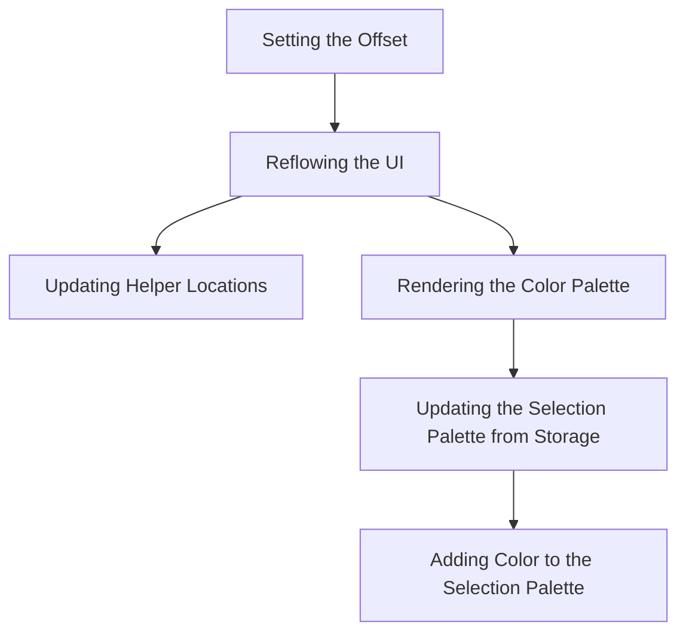

This document will cover the Color Picker Positioning feature, which includes:

1. Setting the Offset
2. Reflowing the UI
3. Updating Helper Locations
4. Rendering the Color Palette
5. Updating the Selection Palette from Storage
6. Adding Color to the Selection Palette

Technical document: <SwmLink doc-title="Color Picker Positioning">[Color Picker Positioning](/.swm/color-picker-positioning.26rjqj43.sw.md)</SwmLink>

# [Setting the Offset](https://app.swimm.io/repos/Z2l0aHViJTNBJTNBQnJvYWRsZWFmQ29tbWVyY2UtZGVtby1uZXclM0ElM0FTd2ltbS1EZW1v/docs/26rjqj43#setoffset)

The 'setOffset' function is responsible for positioning the color picker container based on given coordinates. This ensures that the color picker appears at the correct location on the screen, providing a seamless user experience. When the offset is set, it triggers a reflow to update the UI, ensuring that the color picker is displayed correctly.

# [Reflowing the UI](https://app.swimm.io/repos/Z2l0aHViJTNBJTNBQnJvYWRsZWFmQ29tbWVyY2UtZGVtby1uZXclM0ElM0FTd2ltbS1EZW1v/docs/26rjqj43#reflow)

The 'reflow' function recalculates the dimensions and positions of various elements within the color picker. This includes updating the positions of the dragger, slider, and other helper elements. The reflow process is essential for maintaining the correct layout and appearance of the color picker, ensuring that all elements are displayed correctly and interact as expected.

# [Updating Helper Locations](https://app.swimm.io/repos/Z2l0aHViJTNBJTNBQnJvYWRsZWFmQ29tbWVyY2UtZGVtby1uZXclM0ElM0FTd2ltbS1EZW1v/docs/26rjqj43#updatehelperlocations)

The 'updateHelperLocations' function updates the positions of the helper elements (e.g., dragger, slider) based on the current color values. This ensures that the UI accurately reflects the selected color, providing visual feedback to the user about their selection. If the selected color is empty, the helpers are hidden; otherwise, they are shown and positioned according to the current saturation and value.

# [Rendering the Color Palette](https://app.swimm.io/repos/Z2l0aHViJTNBJTNBQnJvYWRsZWFmQ29tbWVyY2UtZGVtby1uZXclM0ElM0FTd2ltbS1EZW1v/docs/26rjqj43#drawpalette)

The 'drawPalette' function is responsible for rendering the color palette. It retrieves the current color and generates HTML for each palette using the 'paletteTemplate' function. It also updates the selection palette from storage and appends the unique selection palette to the HTML if it exists. Finally, it sets the generated HTML to the 'paletteContainer', ensuring that the color palette is displayed correctly.

# [Updating the Selection Palette from Storage](https://app.swimm.io/repos/Z2l0aHViJTNBJTNBQnJvYWRsZWFmQ29tbWVyY2UtZGVtby1uZXclM0ElM0FTd2ltbS1EZW1v/docs/26rjqj43#updateselectionpalettefromstorage)

The 'updateSelectionPaletteFromStorage' function updates the selection palette by retrieving it from the local storage. It checks if the local storage key and window local storage are available, migrates old palettes to a new format if necessary, and retrieves the selection palette from the local storage. This ensures that the user's selection palette is always up-to-date and reflects their most recent selections.

# [Adding Color to the Selection Palette](https://app.swimm.io/repos/Z2l0aHViJTNBJTNBQnJvYWRsZWFmQ29tbWVyY2UtZGVtby1uZXclM0ElM0FTd2ltbS1EZW1v/docs/26rjqj43#addcolortoselectionpalette)

The 'addColorToSelectionPalette' function adds a new color to the selection palette. It checks if the selection palette should be shown, converts the color to its RGB string representation, and adds it to the selection palette if it is not already present. It also ensures that the selection palette does not exceed the maximum size and updates the local storage with the new selection palette. This allows users to easily access their most frequently used colors.

&nbsp;

*This is an auto-generated document by Swimm AI 🌊 and has not yet been verified by a human*

<SwmMeta version="3.0.0" repo-id="Z2l0aHViJTNBJTNBQnJvYWRsZWFmQ29tbWVyY2UtZGVtby1uZXclM0ElM0FTd2ltbS1EZW1v" repo-name="BroadleafCommerce-demo-new" doc-type="product-flows">Powered by [Swimm](/)</SwmMeta>
