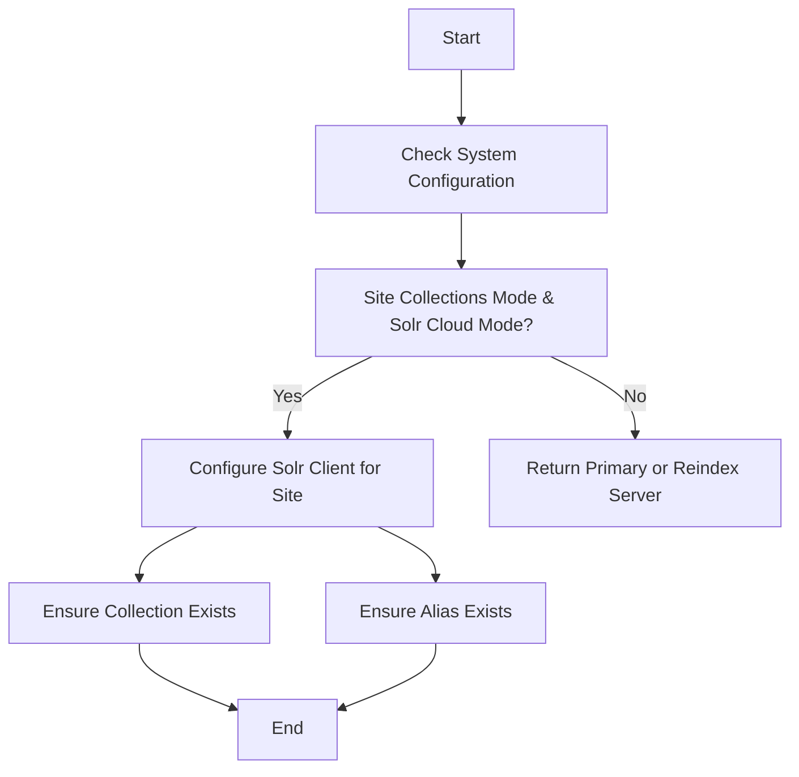

This document will cover the process of configuring the Solr server for reindexing. We'll cover:

1. Checking system configuration
2. Setting up the Solr client for a specific site
3. Ensuring necessary Solr infrastructure is in place.

Technical document: <SwmLink doc-title="Configuring Solr Server for Reindexing">[Configuring Solr Server for Reindexing](/.swm/configuring-solr-server-for-reindexing.yay6j9jh.sw.md)</SwmLink>

# [Checking System Configuration](https://app.swimm.io/repos/Z2l0aHViJTNBJTNBQnJvYWRsZWFmQ29tbWVyY2UtZGVtby1uZXclM0ElM0FTd2ltbS1EZW1v/docs/yay6j9jh#getreindexserver)

The process begins by checking the system's configuration to determine if it is in site collections mode and Solr Cloud mode. This step is crucial because it dictates the subsequent steps in configuring the Solr server for reindexing. If the system is in site collections mode and Solr Cloud mode, it will proceed to configure the Solr client for a specific site. Otherwise, it will return either the primary server or the reindex server based on whether the system is in single-core mode.

# [Setting Up the Solr Client for a Specific Site](https://app.swimm.io/repos/Z2l0aHViJTNBJTNBQnJvYWRsZWFmQ29tbWVyY2UtZGVtby1uZXclM0ElM0FTd2ltbS1EZW1v/docs/yay6j9jh#getsitereindexserver)

If the system is in site collections mode and Solr Cloud mode, the next step is to configure the Solr client for the specific site. This involves retrieving the current site context and connecting the Solr client. The site context provides the necessary information about the site for which the Solr client is being configured. Connecting the Solr client ensures that it is ready to interact with the Solr server for reindexing purposes.

# [Ensuring Necessary Solr Infrastructure is in Place](https://app.swimm.io/repos/Z2l0aHViJTNBJTNBQnJvYWRsZWFmQ29tbWVyY2UtZGVtby1uZXclM0ElM0FTd2ltbS1EZW1v/docs/yay6j9jh#createcollectionifnotexist)

Once the Solr client is configured for the specific site, it is essential to ensure that the necessary Solr infrastructure is in place. This involves two key steps: ensuring that the required collection exists and ensuring that the necessary alias exists. The collection is a logical grouping of documents in Solr, and the alias is a reference to the collection that facilitates easier management. If the collection or alias does not exist, they are created to ensure that the Solr server is properly set up for reindexing.

&nbsp;

*This is an auto-generated document by Swimm AI 🌊 and has not yet been verified by a human*

<SwmMeta version="3.0.0" repo-id="Z2l0aHViJTNBJTNBQnJvYWRsZWFmQ29tbWVyY2UtZGVtby1uZXclM0ElM0FTd2ltbS1EZW1v" repo-name="BroadleafCommerce-demo-new" doc-type="product-flows">Powered by [Swimm](/)</SwmMeta>
