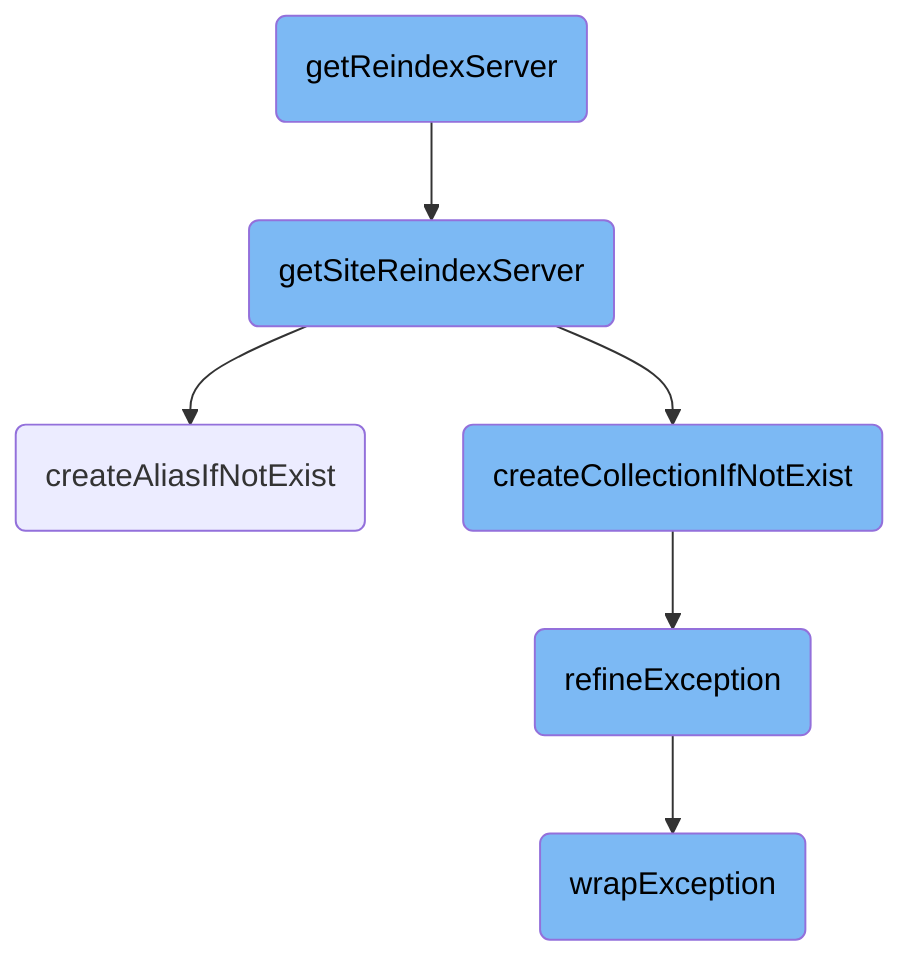
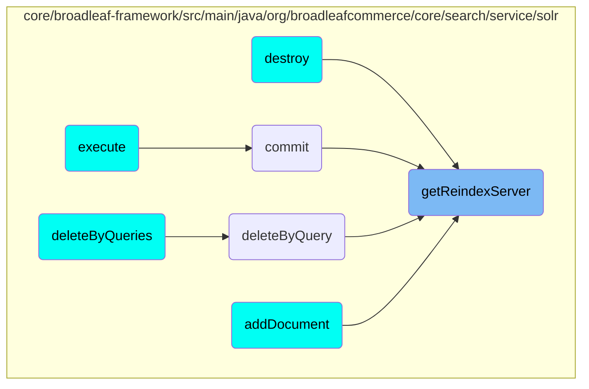

In this document, we will explain the process of determining and configuring the Solr server for reindexing. The process involves checking the system's configuration, setting up the Solr client for a specific site, and ensuring the necessary Solr infrastructure is in place.

The flow starts by checking if the system is in site collections mode and Solr Cloud mode. If it is, it configures the Solr client for the specific site by retrieving the site context and connecting the Solr client. It then ensures that the necessary collection and alias exist for the site. If the system is not in site collections mode, it returns either the primary server or the reindex server based on whether the system is in single-core mode.

# Flow drill down



<SwmSnippet path="/core/broadleaf-framework/src/main/java/org/broadleafcommerce/core/search/service/solr/SolrConfiguration.java" line="274">

---

## <SwmToken path="core/broadleaf-framework/src/main/java/org/broadleafcommerce/core/search/service/solr/SolrConfiguration.java" pos="273:5:5" line-data="    public SolrClient getReindexServer() {">`getReindexServer`</SwmToken>

The <SwmToken path="core/broadleaf-framework/src/main/java/org/broadleafcommerce/core/search/service/solr/SolrConfiguration.java" pos="273:5:5" line-data="    public SolrClient getReindexServer() {">`getReindexServer`</SwmToken> method determines which Solr server to use for reindexing based on the current configuration. If the system is in site collections mode and Solr Cloud mode, it delegates to <SwmToken path="core/broadleaf-framework/src/main/java/org/broadleafcommerce/core/search/service/solr/SolrConfiguration.java" pos="275:3:3" line-data="            return getSiteReindexServer();">`getSiteReindexServer`</SwmToken>. Otherwise, it returns either the primary server or the reindex server depending on whether the system is in single-core mode.

```java
        if (isSiteCollections() && isSolrCloudMode()) {
            return getSiteReindexServer();
        }
        
        return isSingleCoreMode() ? primaryServer : reindexServer;
    }
```

---

</SwmSnippet>

<SwmSnippet path="/core/broadleaf-framework/src/main/java/org/broadleafcommerce/core/search/service/solr/SolrConfiguration.java" line="611">

---

## <SwmToken path="core/broadleaf-framework/src/main/java/org/broadleafcommerce/core/search/service/solr/SolrConfiguration.java" pos="611:5:5" line-data="    public SolrClient getSiteReindexServer() {">`getSiteReindexServer`</SwmToken>

The <SwmToken path="core/broadleaf-framework/src/main/java/org/broadleafcommerce/core/search/service/solr/SolrConfiguration.java" pos="611:5:5" line-data="    public SolrClient getSiteReindexServer() {">`getSiteReindexServer`</SwmToken> method configures the Solr client for a specific site. It retrieves the current site context, connects the Solr client, and ensures that the necessary collection and alias exist for the site. This involves calling <SwmToken path="core/broadleaf-framework/src/main/java/org/broadleafcommerce/core/search/service/solr/SolrConfiguration.java" pos="622:1:1" line-data="            createCollectionIfNotExist(client, collectionName);">`createCollectionIfNotExist`</SwmToken> and <SwmToken path="core/broadleaf-framework/src/main/java/org/broadleafcommerce/core/search/service/solr/SolrConfiguration.java" pos="623:1:1" line-data="            createAliasIfNotExist(client, collectionName, collectionName);">`createAliasIfNotExist`</SwmToken> to set up the Solr infrastructure for the site's reindexing process.

```java
    public SolrClient getSiteReindexServer() {
        BroadleafRequestContext ctx = BroadleafRequestContext.getBroadleafRequestContext();
        Site site = ctx.getNonPersistentSite();

        CloudSolrClient client = (CloudSolrClient) primaryServer;
        client.connect();
        
        String aliasName = getSiteReindexAliasName(site);
        if (aliasName != null) {
            String collectionName = getSiteReindexCollectionName(site);

            createCollectionIfNotExist(client, collectionName);
            createAliasIfNotExist(client, collectionName, collectionName);
        }

        return client;
```

---

</SwmSnippet>

<SwmSnippet path="/core/broadleaf-framework/src/main/java/org/broadleafcommerce/core/search/service/solr/SolrConfiguration.java" line="642">

---

### <SwmToken path="core/broadleaf-framework/src/main/java/org/broadleafcommerce/core/search/service/solr/SolrConfiguration.java" pos="642:5:5" line-data="    protected void createAliasIfNotExist(CloudSolrClient client, String collectionName, String aliasName) {">`createAliasIfNotExist`</SwmToken>

The <SwmToken path="core/broadleaf-framework/src/main/java/org/broadleafcommerce/core/search/service/solr/SolrConfiguration.java" pos="642:5:5" line-data="    protected void createAliasIfNotExist(CloudSolrClient client, String collectionName, String aliasName) {">`createAliasIfNotExist`</SwmToken> method checks if an alias for a Solr collection exists. If not, it creates the alias using Solr's <SwmToken path="core/broadleaf-framework/src/main/java/org/broadleafcommerce/core/search/service/solr/SolrConfiguration.java" pos="647:1:1" line-data="                CollectionAdminRequest.createAlias(aliasName, collectionName).process(client);">`CollectionAdminRequest`</SwmToken>. This ensures that the alias points to the correct collection, facilitating easier management of Solr collections.

```java
    protected void createAliasIfNotExist(CloudSolrClient client, String collectionName, String aliasName) {
        Aliases aliases = client.getZkStateReader().getAliases();
        Map<String, String> aliasCollectionMap = aliases.getCollectionAliasMap();
        if (!aliasCollectionMap.containsKey(aliasName)) {
            try {
                CollectionAdminRequest.createAlias(aliasName, collectionName).process(client);
            } catch (SolrServerException e) {
                throw ExceptionHelper.refineException(e);
            } catch (IOException e) {
                throw ExceptionHelper.refineException(e);
            }
        }
    }
```

---

</SwmSnippet>

<SwmSnippet path="/core/broadleaf-framework/src/main/java/org/broadleafcommerce/core/search/service/solr/SolrConfiguration.java" line="629">

---

### <SwmToken path="core/broadleaf-framework/src/main/java/org/broadleafcommerce/core/search/service/solr/SolrConfiguration.java" pos="629:5:5" line-data="    protected void createCollectionIfNotExist(CloudSolrClient client, String collectionName) {">`createCollectionIfNotExist`</SwmToken>

The <SwmToken path="core/broadleaf-framework/src/main/java/org/broadleafcommerce/core/search/service/solr/SolrConfiguration.java" pos="629:5:5" line-data="    protected void createCollectionIfNotExist(CloudSolrClient client, String collectionName) {">`createCollectionIfNotExist`</SwmToken> method ensures that a Solr collection exists for the site. If the collection does not exist, it creates it using Solr's <SwmToken path="core/broadleaf-framework/src/main/java/org/broadleafcommerce/core/search/service/solr/SolrConfiguration.java" pos="632:1:1" line-data="                CollectionAdminRequest.createCollection(collectionName, getSolrCloudConfigName(), getSolrCloudNumShards(), getSolrCloudNumReplicas())">`CollectionAdminRequest`</SwmToken>. This is crucial for setting up the necessary infrastructure for site-specific indexing.

```java
    protected void createCollectionIfNotExist(CloudSolrClient client, String collectionName) {
        if (!client.getZkStateReader().getClusterState().hasCollection(collectionName)) {
            try {
                CollectionAdminRequest.createCollection(collectionName, getSolrCloudConfigName(), getSolrCloudNumShards(), getSolrCloudNumReplicas())
                        .setMaxShardsPerNode(getSolrCloudNumShards()).process(client);
            } catch (SolrServerException e) {
                throw ExceptionHelper.refineException(e);
            } catch (IOException e) {
                throw ExceptionHelper.refineException(e);
            }
        }
    }
```

---

</SwmSnippet>

<SwmSnippet path="/common/src/main/java/org/broadleafcommerce/common/exception/ExceptionHelper.java" line="34">

---

### <SwmToken path="common/src/main/java/org/broadleafcommerce/common/exception/ExceptionHelper.java" pos="34:22:22" line-data="    public static &lt;G extends Throwable, J extends RuntimeException&gt; RuntimeException refineException(Class&lt;G&gt; refineType, Class&lt;J&gt; wrapType, String message, Throwable e) {">`refineException`</SwmToken>

The <SwmToken path="common/src/main/java/org/broadleafcommerce/common/exception/ExceptionHelper.java" pos="34:22:22" line-data="    public static &lt;G extends Throwable, J extends RuntimeException&gt; RuntimeException refineException(Class&lt;G&gt; refineType, Class&lt;J&gt; wrapType, String message, Throwable e) {">`refineException`</SwmToken> method refines exceptions by checking their type and wrapping them in a more appropriate runtime exception. This helps in providing more meaningful error messages and handling specific exception types more gracefully.

```java
    public static <G extends Throwable, J extends RuntimeException> RuntimeException refineException(Class<G> refineType, Class<J> wrapType, String message, Throwable e) {
        if (refineType.isAssignableFrom(e.getClass())) {
            return wrapException(e, wrapType, message);
        }
        if (e.getCause() != null) {
            return refineException(refineType, wrapType, message, e.getCause());
        }
        if (e instanceof UndeclaredThrowableException) {
            return refineException(refineType, wrapType, message, ((UndeclaredThrowableException) e).getUndeclaredThrowable());
        }
        if (e instanceof InvocationTargetException) {
            return refineException(refineType, wrapType, message, ((InvocationTargetException) e).getTargetException());
        }
        return wrapException(e, wrapType, message);
    }
```

---

</SwmSnippet>

<SwmSnippet path="/common/src/main/java/org/broadleafcommerce/common/exception/ExceptionHelper.java" line="90">

---

### <SwmToken path="common/src/main/java/org/broadleafcommerce/common/exception/ExceptionHelper.java" pos="90:15:15" line-data="    private static &lt;J extends RuntimeException&gt; RuntimeException wrapException(Throwable e, Class&lt;J&gt; wrapType, String message) {">`wrapException`</SwmToken>

The <SwmToken path="common/src/main/java/org/broadleafcommerce/common/exception/ExceptionHelper.java" pos="90:15:15" line-data="    private static &lt;J extends RuntimeException&gt; RuntimeException wrapException(Throwable e, Class&lt;J&gt; wrapType, String message) {">`wrapException`</SwmToken> method wraps a given exception in a specified runtime exception type. This is used by <SwmToken path="core/broadleaf-framework/src/main/java/org/broadleafcommerce/core/search/service/solr/SolrConfiguration.java" pos="635:5:5" line-data="                throw ExceptionHelper.refineException(e);">`refineException`</SwmToken> to ensure that exceptions are consistently wrapped and logged, providing better error handling and debugging capabilities.

```java
    private static <J extends RuntimeException> RuntimeException wrapException(Throwable e, Class<J> wrapType, String message) {
        if (e instanceof RuntimeException) {
            return (RuntimeException) e;
        }
        try {
            if (StringUtils.isEmpty(message)) {
                return wrapType.getConstructor(Throwable.class).newInstance(e);
            } else {
                return wrapType.getConstructor(String.class, Throwable.class).newInstance(message, e);
            }
        } catch (Exception e1) {
            LOG.error("Could not wrap exception", e1);
            throw new RuntimeException(e);
        }
    }
```

---

</SwmSnippet>

# Where is this flow used?

This flow is used multiple times in the codebase as represented in the following diagram:



&nbsp;

*This is an auto-generated document by Swimm AI 🌊 and has not yet been verified by a human*

<SwmMeta version="3.0.0" repo-id="Z2l0aHViJTNBJTNBQnJvYWRsZWFmQ29tbWVyY2UtZGVtby1uZXclM0ElM0FTd2ltbS1EZW1v" repo-name="BroadleafCommerce-demo-new" doc-type="flows"><sup>Powered by [Swimm](/)</sup></SwmMeta>
