```mermaid
classDiagram
    class CustomPersistenceHandlerAdapter {
        <<abstract>>
        +canHandleAdd()
        +canHandleInspect()
        +canHandleUpdate()
        +canHandleRemove()
    }
    class CategoryCustomPersistenceHandler {
        +allowCategoryDeleteWithChildren : boolean
        +extensionManager : CategoryCustomPersistenceHandlerExtensionManager
        +categoryDao : CategoryDao
        +sandBoxHelper : SandBoxHelper
    }
    CustomPersistenceHandlerAdapter <|-- CategoryCustomPersistenceHandler
    class SkuCustomPersistenceHandlerExtensionHandler {
        +skuUpdated(Sku updated) : ExtensionResultStatusType
    }
    class SkuCustomPersistenceHandlerExtensionManager {
        +SkuCustomPersistenceHandlerExtensionManager()
    }
    SkuCustomPersistenceHandlerExtensionManager <|-- SkuCustomPersistenceHandlerExtensionHandler

%% Swimm:
%% classDiagram
%%     class <SwmToken path="admin/broadleaf-admin-module/src/main/java/org/broadleafcommerce/admin/server/service/handler/CategoryCustomPersistenceHandler.java" pos="65:8:8" line-data="public class CategoryCustomPersistenceHandler extends CustomPersistenceHandlerAdapter {">`CustomPersistenceHandlerAdapter`</SwmToken> {
%%         <<abstract>>
%%         +canHandleAdd()
%%         +canHandleInspect()
%%         +canHandleUpdate()
%%         +canHandleRemove()
%%     }
%%     class <SwmToken path="admin/broadleaf-admin-module/src/main/java/org/broadleafcommerce/admin/server/service/handler/CategoryCustomPersistenceHandler.java" pos="65:4:4" line-data="public class CategoryCustomPersistenceHandler extends CustomPersistenceHandlerAdapter {">`CategoryCustomPersistenceHandler`</SwmToken> {
%%         +allowCategoryDeleteWithChildren : boolean
%%         +extensionManager : <SwmToken path="admin/broadleaf-admin-module/src/main/java/org/broadleafcommerce/admin/server/service/handler/CategoryCustomPersistenceHandler.java" pos="76:3:3" line-data="    protected CategoryCustomPersistenceHandlerExtensionManager extensionManager;">`CategoryCustomPersistenceHandlerExtensionManager`</SwmToken>
%%         +categoryDao : <SwmToken path="admin/broadleaf-admin-module/src/main/java/org/broadleafcommerce/admin/server/service/handler/CategoryCustomPersistenceHandler.java" pos="79:3:3" line-data="    protected CategoryDao categoryDao;">`CategoryDao`</SwmToken>
%%         +sandBoxHelper : <SwmToken path="admin/broadleaf-admin-module/src/main/java/org/broadleafcommerce/admin/server/service/handler/CategoryCustomPersistenceHandler.java" pos="82:3:3" line-data="    protected SandBoxHelper sandBoxHelper;">`SandBoxHelper`</SwmToken>
%%     }
%%     <SwmToken path="admin/broadleaf-admin-module/src/main/java/org/broadleafcommerce/admin/server/service/handler/CategoryCustomPersistenceHandler.java" pos="65:8:8" line-data="public class CategoryCustomPersistenceHandler extends CustomPersistenceHandlerAdapter {">`CustomPersistenceHandlerAdapter`</SwmToken> <|-- <SwmToken path="admin/broadleaf-admin-module/src/main/java/org/broadleafcommerce/admin/server/service/handler/CategoryCustomPersistenceHandler.java" pos="65:4:4" line-data="public class CategoryCustomPersistenceHandler extends CustomPersistenceHandlerAdapter {">`CategoryCustomPersistenceHandler`</SwmToken>
%%     class <SwmToken path="admin/broadleaf-admin-module/src/main/java/org/broadleafcommerce/admin/server/service/handler/SkuCustomPersistenceHandlerExtensionHandler.java" pos="29:4:4" line-data="public interface SkuCustomPersistenceHandlerExtensionHandler extends ExtensionHandler {">`SkuCustomPersistenceHandlerExtensionHandler`</SwmToken> {
%%         +skuUpdated(Sku updated) : <SwmToken path="admin/broadleaf-admin-module/src/main/java/org/broadleafcommerce/admin/server/service/handler/SkuCustomPersistenceHandlerExtensionHandler.java" pos="37:1:1" line-data="    ExtensionResultStatusType skuUpdated(Sku updated);">`ExtensionResultStatusType`</SwmToken>
%%     }
%%     class <SwmToken path="admin/broadleaf-admin-module/src/main/java/org/broadleafcommerce/admin/server/service/handler/SkuCustomPersistenceHandlerExtensionManager.java" pos="29:4:4" line-data="public class SkuCustomPersistenceHandlerExtensionManager extends ExtensionManager&lt;SkuCustomPersistenceHandlerExtensionHandler&gt; {">`SkuCustomPersistenceHandlerExtensionManager`</SwmToken> {
%%         +SkuCustomPersistenceHandlerExtensionManager()
%%     }
%%     <SwmToken path="admin/broadleaf-admin-module/src/main/java/org/broadleafcommerce/admin/server/service/handler/SkuCustomPersistenceHandlerExtensionManager.java" pos="29:4:4" line-data="public class SkuCustomPersistenceHandlerExtensionManager extends ExtensionManager&lt;SkuCustomPersistenceHandlerExtensionHandler&gt; {">`SkuCustomPersistenceHandlerExtensionManager`</SwmToken> <|-- <SwmToken path="admin/broadleaf-admin-module/src/main/java/org/broadleafcommerce/admin/server/service/handler/SkuCustomPersistenceHandlerExtensionHandler.java" pos="29:4:4" line-data="public interface SkuCustomPersistenceHandlerExtensionHandler extends ExtensionHandler {">`SkuCustomPersistenceHandlerExtensionHandler`</SwmToken>
```

# Understanding Custom Persistence Handlers

Handlers in the Broadleaf admin module are specialized components responsible for managing the persistence and retrieval of specific entities within the system. They extend the functionality of the core persistence framework by providing custom logic for handling complex operations related to entities such as Skus, Categories, Offers, and Products.

Handlers determine whether they can manage a particular operation by implementing methods like <SwmToken path="admin/broadleaf-admin-module/src/main/java/org/broadleafcommerce/admin/server/service/handler/CategoryCustomPersistenceHandler.java" pos="92:5:5" line-data="    public Boolean canHandleInspect(PersistencePackage persistencePackage) {">`canHandleInspect`</SwmToken>, `canHandleFetch`, <SwmToken path="admin/broadleaf-admin-module/src/main/java/org/broadleafcommerce/admin/server/service/handler/CategoryCustomPersistenceHandler.java" pos="85:5:5" line-data="    public Boolean canHandleAdd(PersistencePackage persistencePackage) {">`canHandleAdd`</SwmToken>, and <SwmToken path="admin/broadleaf-admin-module/src/main/java/org/broadleafcommerce/admin/server/service/handler/CategoryCustomPersistenceHandler.java" pos="97:5:5" line-data="    public Boolean canHandleUpdate(PersistencePackage persistencePackage) {">`canHandleUpdate`</SwmToken>. These methods check the type of operation and the entity involved to decide if the handler should process the request.

Handlers also provide additional criteria and metadata for entities, ensuring that the data is correctly processed and displayed in the admin interface. For example, the `SkuCustomPersistenceHandler` manages the persistence of SKU entities, including custom criteria for SKU lookups and additional fields for product options.

Handlers are essential for extending the admin module's capabilities, allowing for customized behavior and data management tailored to specific business requirements.

<SwmSnippet path="/admin/broadleaf-admin-module/src/main/java/org/broadleafcommerce/admin/server/service/handler/CategoryCustomPersistenceHandler.java" line="64">

---

The <SwmToken path="admin/broadleaf-admin-module/src/main/java/org/broadleafcommerce/admin/server/service/handler/CategoryCustomPersistenceHandler.java" pos="65:4:4" line-data="public class CategoryCustomPersistenceHandler extends CustomPersistenceHandlerAdapter {">`CategoryCustomPersistenceHandler`</SwmToken> class is annotated with <SwmToken path="admin/broadleaf-admin-module/src/main/java/org/broadleafcommerce/admin/server/service/handler/CategoryCustomPersistenceHandler.java" pos="64:0:1" line-data="@Component(&quot;blCategoryCustomPersistenceHandler&quot;)">`@Component`</SwmToken> and includes various fields and resources such as <SwmToken path="admin/broadleaf-admin-module/src/main/java/org/broadleafcommerce/admin/server/service/handler/CategoryCustomPersistenceHandler.java" pos="73:5:5" line-data="    protected boolean allowCategoryDeleteWithChildren;">`allowCategoryDeleteWithChildren`</SwmToken>, <SwmToken path="admin/broadleaf-admin-module/src/main/java/org/broadleafcommerce/admin/server/service/handler/CategoryCustomPersistenceHandler.java" pos="76:5:5" line-data="    protected CategoryCustomPersistenceHandlerExtensionManager extensionManager;">`extensionManager`</SwmToken>, <SwmToken path="admin/broadleaf-admin-module/src/main/java/org/broadleafcommerce/admin/server/service/handler/CategoryCustomPersistenceHandler.java" pos="79:3:3" line-data="    protected CategoryDao categoryDao;">`CategoryDao`</SwmToken>, and <SwmToken path="admin/broadleaf-admin-module/src/main/java/org/broadleafcommerce/admin/server/service/handler/CategoryCustomPersistenceHandler.java" pos="82:3:3" line-data="    protected SandBoxHelper sandBoxHelper;">`SandBoxHelper`</SwmToken>.

```java
@Component("blCategoryCustomPersistenceHandler")
public class CategoryCustomPersistenceHandler extends CustomPersistenceHandlerAdapter {

    private static final Log LOG = LogFactory.getLog(CategoryCustomPersistenceHandler.class);
    protected static final String DEFAULT_PARENT_CATEGORY = "defaultParentCategory";
    protected static final String ID_PROPERTY = "id";
    protected static final String CATEGORY_SEPARATOR = " -> ";

    @Value("${allow.category.delete.with.children:false}")
    protected boolean allowCategoryDeleteWithChildren;

    @Resource(name = "blCategoryCustomPersistenceHandlerExtensionManager")
    protected CategoryCustomPersistenceHandlerExtensionManager extensionManager;

    @Resource(name = "blCategoryDao")
    protected CategoryDao categoryDao;

    @Resource(name = "blSandBoxHelper")
    protected SandBoxHelper sandBoxHelper;
```

---

</SwmSnippet>

# <SwmToken path="admin/broadleaf-admin-module/src/main/java/org/broadleafcommerce/admin/server/service/handler/SkuCustomPersistenceHandlerExtensionHandler.java" pos="29:4:4" line-data="public interface SkuCustomPersistenceHandlerExtensionHandler extends ExtensionHandler {">`SkuCustomPersistenceHandlerExtensionHandler`</SwmToken>

The <SwmToken path="admin/broadleaf-admin-module/src/main/java/org/broadleafcommerce/admin/server/service/handler/SkuCustomPersistenceHandlerExtensionHandler.java" pos="29:4:4" line-data="public interface SkuCustomPersistenceHandlerExtensionHandler extends ExtensionHandler {">`SkuCustomPersistenceHandlerExtensionHandler`</SwmToken> interface allows for special behavior to be defined when a SKU is updated via the admin. It includes a method <SwmToken path="admin/broadleaf-admin-module/src/main/java/org/broadleafcommerce/admin/server/service/handler/SkuCustomPersistenceHandlerExtensionHandler.java" pos="37:3:3" line-data="    ExtensionResultStatusType skuUpdated(Sku updated);">`skuUpdated`</SwmToken> that provides hooks for the before and after save state of the SKU.

<SwmSnippet path="/admin/broadleaf-admin-module/src/main/java/org/broadleafcommerce/admin/server/service/handler/SkuCustomPersistenceHandlerExtensionHandler.java" line="29">

---

The <SwmToken path="admin/broadleaf-admin-module/src/main/java/org/broadleafcommerce/admin/server/service/handler/SkuCustomPersistenceHandlerExtensionHandler.java" pos="29:4:4" line-data="public interface SkuCustomPersistenceHandlerExtensionHandler extends ExtensionHandler {">`SkuCustomPersistenceHandlerExtensionHandler`</SwmToken> interface defines the <SwmToken path="admin/broadleaf-admin-module/src/main/java/org/broadleafcommerce/admin/server/service/handler/SkuCustomPersistenceHandlerExtensionHandler.java" pos="37:3:3" line-data="    ExtensionResultStatusType skuUpdated(Sku updated);">`skuUpdated`</SwmToken> method, which allows for custom behavior during SKU updates.

```java
public interface SkuCustomPersistenceHandlerExtensionHandler extends ExtensionHandler {

    /**
     * Hook for the before and after save state of the sku
     *
     * @param updated
     * @return
     */
    ExtensionResultStatusType skuUpdated(Sku updated);

    public static final int DEFAULT_PRIORITY = Integer.MAX_VALUE;
}
```

---

</SwmSnippet>

# <SwmToken path="admin/broadleaf-admin-module/src/main/java/org/broadleafcommerce/admin/server/service/handler/SkuCustomPersistenceHandlerExtensionManager.java" pos="29:4:4" line-data="public class SkuCustomPersistenceHandlerExtensionManager extends ExtensionManager&lt;SkuCustomPersistenceHandlerExtensionHandler&gt; {">`SkuCustomPersistenceHandlerExtensionManager`</SwmToken>

The <SwmToken path="admin/broadleaf-admin-module/src/main/java/org/broadleafcommerce/admin/server/service/handler/SkuCustomPersistenceHandlerExtensionManager.java" pos="29:4:4" line-data="public class SkuCustomPersistenceHandlerExtensionManager extends ExtensionManager&lt;SkuCustomPersistenceHandlerExtensionHandler&gt; {">`SkuCustomPersistenceHandlerExtensionManager`</SwmToken> class extends <SwmToken path="admin/broadleaf-admin-module/src/main/java/org/broadleafcommerce/admin/server/service/handler/CategoryCustomPersistenceHandler.java" pos="76:5:5" line-data="    protected CategoryCustomPersistenceHandlerExtensionManager extensionManager;">`extensionManager`</SwmToken> and manages the extensions for <SwmToken path="admin/broadleaf-admin-module/src/main/java/org/broadleafcommerce/admin/server/service/handler/SkuCustomPersistenceHandlerExtensionHandler.java" pos="29:4:4" line-data="public interface SkuCustomPersistenceHandlerExtensionHandler extends ExtensionHandler {">`SkuCustomPersistenceHandlerExtensionHandler`</SwmToken>. It initializes the manager with the handler class.

<SwmSnippet path="/admin/broadleaf-admin-module/src/main/java/org/broadleafcommerce/admin/server/service/handler/SkuCustomPersistenceHandlerExtensionManager.java" line="28">

---

The <SwmToken path="admin/broadleaf-admin-module/src/main/java/org/broadleafcommerce/admin/server/service/handler/SkuCustomPersistenceHandlerExtensionManager.java" pos="29:4:4" line-data="public class SkuCustomPersistenceHandlerExtensionManager extends ExtensionManager&lt;SkuCustomPersistenceHandlerExtensionHandler&gt; {">`SkuCustomPersistenceHandlerExtensionManager`</SwmToken> class is annotated with <SwmToken path="admin/broadleaf-admin-module/src/main/java/org/broadleafcommerce/admin/server/service/handler/SkuCustomPersistenceHandlerExtensionManager.java" pos="28:0:1" line-data="@Service(&quot;blSkuCustomPersistenceHandlerExtensionManager&quot;)">`@Service`</SwmToken> and initializes the manager with the <SwmToken path="admin/broadleaf-admin-module/src/main/java/org/broadleafcommerce/admin/server/service/handler/SkuCustomPersistenceHandlerExtensionManager.java" pos="29:10:10" line-data="public class SkuCustomPersistenceHandlerExtensionManager extends ExtensionManager&lt;SkuCustomPersistenceHandlerExtensionHandler&gt; {">`SkuCustomPersistenceHandlerExtensionHandler`</SwmToken> class.

```java
@Service("blSkuCustomPersistenceHandlerExtensionManager")
public class SkuCustomPersistenceHandlerExtensionManager extends ExtensionManager<SkuCustomPersistenceHandlerExtensionHandler> {

    public SkuCustomPersistenceHandlerExtensionManager() {
        super(SkuCustomPersistenceHandlerExtensionHandler.class);
    }
```

---

</SwmSnippet>

&nbsp;

*This is an auto-generated document by Swimm AI 🌊 and has not yet been verified by a human*

<SwmMeta version="3.0.0" repo-id="Z2l0aHViJTNBJTNBQnJvYWRsZWFmQ29tbWVyY2UtZGVtby1uZXclM0ElM0FTd2ltbS1EZW1v" repo-name="BroadleafCommerce-demo-new" doc-type="overview"><sup>Powered by [Swimm](/)</sup></SwmMeta>
