This document explains the <SwmToken path="admin/broadleaf-open-admin-platform/src/main/java/org/broadleafcommerce/openadmin/server/service/persistence/module/BasicPersistenceModule.java" pos="1250:5:5" line-data="    public DynamicResultSet fetch(PersistencePackage persistencePackage, CriteriaTransferObject cto) throws ServiceException {">`fetch`</SwmToken> method, which is responsible for retrieving data based on specified criteria. It covers how the method handles sorting, filtering, and merging properties to construct the final result set. Additionally, it delves into related methods like <SwmToken path="admin/broadleaf-open-admin-platform/src/main/java/org/broadleafcommerce/openadmin/server/service/persistence/module/BasicPersistenceModule.java" pos="1265:1:1" line-data="                addTranslationSearchIfNeeded(cto, mergedProperties);">`addTranslationSearchIfNeeded`</SwmToken>, <SwmToken path="admin/broadleaf-open-admin-platform/src/main/java/org/broadleafcommerce/openadmin/server/service/persistence/module/BasicPersistenceModule.java" pos="1148:5:5" line-data="    public void remove(PersistencePackage persistencePackage) throws ServiceException {">`remove`</SwmToken>, <SwmToken path="admin/broadleaf-open-admin-platform/src/main/java/org/broadleafcommerce/openadmin/server/service/persistence/module/FieldManager.java" pos="79:5:5" line-data="    public Object getFieldValue(Object bean, String fieldName) throws IllegalAccessException, FieldNotAvailableException {">`getFieldValue`</SwmToken>, <SwmToken path="admin/broadleaf-open-admin-platform/src/main/java/org/broadleafcommerce/openadmin/server/service/persistence/module/BasicPersistenceModule.java" pos="898:5:5" line-data="    public Object getPrimaryKey(Entity entity, Map&lt;String, FieldMetadata&gt; mergedUnfilteredProperties) {">`getPrimaryKey`</SwmToken>, and <SwmToken path="admin/broadleaf-open-admin-platform/src/main/java/org/broadleafcommerce/openadmin/server/service/persistence/module/BasicPersistenceModule.java" pos="905:6:6" line-data="            if (temp.getFieldType() == SupportedFieldType.ID &amp;&amp; !property.contains(&quot;.&quot;)) {">`getFieldType`</SwmToken>.

The <SwmToken path="admin/broadleaf-open-admin-platform/src/main/java/org/broadleafcommerce/openadmin/server/service/persistence/module/BasicPersistenceModule.java" pos="1250:5:5" line-data="    public DynamicResultSet fetch(PersistencePackage persistencePackage, CriteriaTransferObject cto) throws ServiceException {">`fetch`</SwmToken> method is like a smart search tool that looks for data based on certain rules you give it. First, it checks if it needs to sort the data in a specific way. Then, it combines different pieces of information to make sure it has everything it needs. If the data involves different languages, it adjusts the search to include those translations. Finally, it gathers all the data that matches the rules and gives you the results.

# Flow drill down

```mermaid
graph TD;
      subgraph admin/broadleaf-open-admin-platform/src/main/java/org/broadleafcommerce/openadmin/server/service/persistence/module
60c41e091b0873616d00d52bfe0759cfcfb16aded6f633d301b8e2e34c70fda5(fetch):::mainFlowStyle --> 2895ee71ecf89b8e25c56c9eea03ddb1e3421833639bbb3f3d3e07ae186cddaf(addTranslationSearchIfNeeded):::mainFlowStyle
end

subgraph admin/broadleaf-open-admin-platform/src/main/java/org/broadleafcommerce/openadmin/server/service/persistence/module
2895ee71ecf89b8e25c56c9eea03ddb1e3421833639bbb3f3d3e07ae186cddaf(addTranslationSearchIfNeeded):::mainFlowStyle --> 43c6fbe2ee61b07898e38bfefe3bdbdbd248a8f0a0455efb12e5c364ca101f57(remove):::mainFlowStyle
end

subgraph admin/broadleaf-open-admin-platform/src/main/java/org/broadleafcommerce/openadmin/server/service/persistence/module
43c6fbe2ee61b07898e38bfefe3bdbdbd248a8f0a0455efb12e5c364ca101f57(remove):::mainFlowStyle --> ddcb073c09911433b61933d36c041aebfceb561643ca926ffe20aa3f19eeb6e2(getFieldValue)
end

subgraph admin/broadleaf-open-admin-platform/src/main/java/org/broadleafcommerce/openadmin/server/service/persistence/module
43c6fbe2ee61b07898e38bfefe3bdbdbd248a8f0a0455efb12e5c364ca101f57(remove):::mainFlowStyle --> db9fc8aeaf4e2947c6ce3ada63c7422db6e794f2735642152f2f9603aeb076e0(getPrimaryKey):::mainFlowStyle
end

subgraph admin/broadleaf-open-admin-platform/src/main/java/org/broadleafcommerce/openadmin/server/service/persistence/module
db9fc8aeaf4e2947c6ce3ada63c7422db6e794f2735642152f2f9603aeb076e0(getPrimaryKey):::mainFlowStyle --> 0386a5886eb7028921340e0df06c06585662f594e1a2c586d0623cecd2c8b4a5(getFieldType):::mainFlowStyle
end


      classDef mainFlowStyle color:#000000,fill:#7CB9F4
classDef rootsStyle color:#000000,fill:#00FFF4
classDef Style1 color:#000000,fill:#00FFAA
classDef Style2 color:#000000,fill:#FFFF00
classDef Style3 color:#000000,fill:#AA7CB9

%% Swimm:
%% graph TD;
%%       subgraph <SwmPath>[admin/broadleaf-open-admin-platform/src/main/java/org/broadleafcommerce/openadmin/server/service/persistence/module/](admin/broadleaf-open-admin-platform/src/main/java/org/broadleafcommerce/openadmin/server/service/persistence/module/)</SwmPath>
%% 60c41e091b0873616d00d52bfe0759cfcfb16aded6f633d301b8e2e34c70fda5(fetch):::mainFlowStyle --> 2895ee71ecf89b8e25c56c9eea03ddb1e3421833639bbb3f3d3e07ae186cddaf(addTranslationSearchIfNeeded):::mainFlowStyle
%% end
%% 
%% subgraph <SwmPath>[admin/broadleaf-open-admin-platform/src/main/java/org/broadleafcommerce/openadmin/server/service/persistence/module/](admin/broadleaf-open-admin-platform/src/main/java/org/broadleafcommerce/openadmin/server/service/persistence/module/)</SwmPath>
%% 2895ee71ecf89b8e25c56c9eea03ddb1e3421833639bbb3f3d3e07ae186cddaf(addTranslationSearchIfNeeded):::mainFlowStyle --> 43c6fbe2ee61b07898e38bfefe3bdbdbd248a8f0a0455efb12e5c364ca101f57(remove):::mainFlowStyle
%% end
%% 
%% subgraph <SwmPath>[admin/broadleaf-open-admin-platform/src/main/java/org/broadleafcommerce/openadmin/server/service/persistence/module/](admin/broadleaf-open-admin-platform/src/main/java/org/broadleafcommerce/openadmin/server/service/persistence/module/)</SwmPath>
%% 43c6fbe2ee61b07898e38bfefe3bdbdbd248a8f0a0455efb12e5c364ca101f57(remove):::mainFlowStyle --> ddcb073c09911433b61933d36c041aebfceb561643ca926ffe20aa3f19eeb6e2(getFieldValue)
%% end
%% 
%% subgraph <SwmPath>[admin/broadleaf-open-admin-platform/src/main/java/org/broadleafcommerce/openadmin/server/service/persistence/module/](admin/broadleaf-open-admin-platform/src/main/java/org/broadleafcommerce/openadmin/server/service/persistence/module/)</SwmPath>
%% 43c6fbe2ee61b07898e38bfefe3bdbdbd248a8f0a0455efb12e5c364ca101f57(remove):::mainFlowStyle --> db9fc8aeaf4e2947c6ce3ada63c7422db6e794f2735642152f2f9603aeb076e0(getPrimaryKey):::mainFlowStyle
%% end
%% 
%% subgraph <SwmPath>[admin/broadleaf-open-admin-platform/src/main/java/org/broadleafcommerce/openadmin/server/service/persistence/module/](admin/broadleaf-open-admin-platform/src/main/java/org/broadleafcommerce/openadmin/server/service/persistence/module/)</SwmPath>
%% db9fc8aeaf4e2947c6ce3ada63c7422db6e794f2735642152f2f9603aeb076e0(getPrimaryKey):::mainFlowStyle --> 0386a5886eb7028921340e0df06c06585662f594e1a2c586d0623cecd2c8b4a5(getFieldType):::mainFlowStyle
%% end
%% 
%% 
%%       classDef mainFlowStyle color:#000000,fill:#7CB9F4
%% classDef rootsStyle color:#000000,fill:#00FFF4
%% classDef Style1 color:#000000,fill:#00FFAA
%% classDef Style2 color:#000000,fill:#FFFF00
%% classDef Style3 color:#000000,fill:#AA7CB9
```



<SwmSnippet path="/admin/broadleaf-open-admin-platform/src/main/java/org/broadleafcommerce/openadmin/server/service/persistence/module/BasicPersistenceModule.java" line="1250">

---

## Fetch

The <SwmToken path="admin/broadleaf-open-admin-platform/src/main/java/org/broadleafcommerce/openadmin/server/service/persistence/module/BasicPersistenceModule.java" pos="1250:5:5" line-data="    public DynamicResultSet fetch(PersistencePackage persistencePackage, CriteriaTransferObject cto) throws ServiceException {">`fetch`</SwmToken> method is responsible for retrieving data based on the criteria specified in the <SwmToken path="admin/broadleaf-open-admin-platform/src/main/java/org/broadleafcommerce/openadmin/server/service/persistence/module/BasicPersistenceModule.java" pos="1250:7:7" line-data="    public DynamicResultSet fetch(PersistencePackage persistencePackage, CriteriaTransferObject cto) throws ServiceException {">`PersistencePackage`</SwmToken> and <SwmToken path="admin/broadleaf-open-admin-platform/src/main/java/org/broadleafcommerce/openadmin/server/service/persistence/module/BasicPersistenceModule.java" pos="1250:12:12" line-data="    public DynamicResultSet fetch(PersistencePackage persistencePackage, CriteriaTransferObject cto) throws ServiceException {">`CriteriaTransferObject`</SwmToken>. It handles sorting, filtering, and merging properties to construct the final result set.

```java
    public DynamicResultSet fetch(PersistencePackage persistencePackage, CriteriaTransferObject cto) throws ServiceException {
        Entity[] payload;
        int totalRecords;
        PersistencePerspective persistencePerspective = persistencePackage.getPersistencePerspective();
        String ceilingEntityFullyQualifiedClassname = persistencePackage.getCeilingEntityFullyQualifiedClassname();
        ForeignKey foreignKey = (ForeignKey) persistencePerspective.getPersistencePerspectiveItems().get(PersistencePerspectiveItemType.FOREIGNKEY);

        try {
            if (foreignKey != null && foreignKey.getSortField() != null) {
                FilterAndSortCriteria sortCriteria = cto.get(foreignKey.getSortField());
                sortCriteria.setSortAscending(foreignKey.getSortAscending());
            }

            Map<String, FieldMetadata> mergedProperties = getMergedProperties(persistencePackage, cto);
            if (useTranslationSearch) {
                addTranslationSearchIfNeeded(cto, mergedProperties);
            }
            List<FilterMapping> filterMappings = getFilterMappings(persistencePerspective, cto, persistencePackage
                    .getFetchTypeFullyQualifiedClassname(), mergedProperties);
            List<FilterMapping> standardFilterMappings = new ArrayList<FilterMapping>(filterMappings);
            if (CollectionUtils.isNotEmpty(cto.getAdditionalFilterMappings())) {
```

---

</SwmSnippet>

<SwmSnippet path="/admin/broadleaf-open-admin-platform/src/main/java/org/broadleafcommerce/openadmin/server/service/persistence/module/BasicPersistenceModule.java" line="1299">

---

## Add Translation Search If Needed

The <SwmToken path="admin/broadleaf-open-admin-platform/src/main/java/org/broadleafcommerce/openadmin/server/service/persistence/module/BasicPersistenceModule.java" pos="1299:5:5" line-data="    private void addTranslationSearchIfNeeded(CriteriaTransferObject cto, Map&lt;String, FieldMetadata&gt; mergedProperties) {">`addTranslationSearchIfNeeded`</SwmToken> method enhances the search criteria to include translations. It modifies the criteria map to account for locale-specific translations, ensuring that searches are comprehensive and inclusive of all relevant locales.

```java
    private void addTranslationSearchIfNeeded(CriteriaTransferObject cto, Map<String, FieldMetadata> mergedProperties) {
        Map<String, FilterAndSortCriteria> criteriaMap = cto.getCriteriaMap();
        FilterAndSortCriteria fsc = criteriaMap.get("translationLocale");
        List<String> filterValues = new ArrayList<>();
        if (fsc != null) {
            filterValues = fsc.getFilterValues();
            criteriaMap.remove("translationLocale");
        }
        //If locale is generic - than we use all locales of this language
        //For example, if locale = "en" than we use also "en_GB" and "en_US"
        if (filterValues.size() > 0 && filterValues.get(0).indexOf("_") < 0) {
            String currentLocaleCode = filterValues.get(0);
            List<org.broadleafcommerce.common.locale.domain.Locale> locales = localeService.findAllLocales();
            for (org.broadleafcommerce.common.locale.domain.Locale locale : locales) {
                if (!locale.getLocaleCode().equals(currentLocaleCode) && currentLocaleCode.equals(locale.getLocaleCode().substring(0,2))) {
                    filterValues.add(locale.getLocaleCode());
                }
            }
        }
        Iterator<Entry<String, FilterAndSortCriteria>> iterator = criteriaMap.entrySet().iterator();
        while (iterator.hasNext()) {
```

---

</SwmSnippet>

<SwmSnippet path="/admin/broadleaf-open-admin-platform/src/main/java/org/broadleafcommerce/openadmin/server/service/persistence/module/BasicPersistenceModule.java" line="1148">

---

## Remove

The <SwmToken path="admin/broadleaf-open-admin-platform/src/main/java/org/broadleafcommerce/openadmin/server/service/persistence/module/BasicPersistenceModule.java" pos="1148:5:5" line-data="    public void remove(PersistencePackage persistencePackage) throws ServiceException {">`remove`</SwmToken> method handles the deletion of entities. It checks for foreign key constraints and ensures that the entity can be safely removed without violating any relationships. Depending on the operation type, it either performs a non-destructive remove or a basic remove.

```java
    public void remove(PersistencePackage persistencePackage) throws ServiceException {
        Entity entity = persistencePackage.getEntity();
        PersistencePerspective persistencePerspective = persistencePackage.getPersistencePerspective();
        ForeignKey foreignKey = (ForeignKey) persistencePerspective.getPersistencePerspectiveItems().get(PersistencePerspectiveItemType.FOREIGNKEY);
        if (foreignKey != null && !foreignKey.getMutable()) {
            throw new SecurityServiceException("Entity not mutable");
        }
        try {
            Class<?>[] entities = persistenceManager.getPolymorphicEntities(persistencePackage.getCeilingEntityFullyQualifiedClassname());
            Map<String, FieldMetadata> mergedUnfilteredProperties = persistenceManager.getDynamicEntityDao().getMergedProperties(
                    persistencePackage.getCeilingEntityFullyQualifiedClassname(),
                    entities,
                    foreignKey,
                    persistencePerspective.getAdditionalNonPersistentProperties(),
                    persistencePerspective.getAdditionalForeignKeys(),
                    MergedPropertyType.PRIMARY,
                    persistencePerspective.getPopulateToOneFields(),
                    persistencePerspective.getIncludeFields(),
                    persistencePerspective.getExcludeFields(),
                    persistencePerspective.getConfigurationKey(),
                    ""
```

---

</SwmSnippet>

<SwmSnippet path="/admin/broadleaf-open-admin-platform/src/main/java/org/broadleafcommerce/openadmin/server/service/persistence/module/FieldManager.java" line="79">

---

### Get Field Value

The <SwmToken path="admin/broadleaf-open-admin-platform/src/main/java/org/broadleafcommerce/openadmin/server/service/persistence/module/FieldManager.java" pos="79:5:5" line-data="    public Object getFieldValue(Object bean, String fieldName) throws IllegalAccessException, FieldNotAvailableException {">`getFieldValue`</SwmToken> method retrieves the value of a specified field from a given bean. It handles nested fields and map fields, ensuring that the correct value is extracted even if the field is deeply nested or part of a map.

```java
    public Object getFieldValue(Object bean, String fieldName) throws IllegalAccessException, FieldNotAvailableException {
        StringTokenizer tokens = new StringTokenizer(fieldName, ".");
        Class<?> componentClass = bean.getClass();
        Field field = null;
        Object value = HibernateUtils.deproxy(bean);

        while (tokens.hasMoreTokens()) {
            String fieldNamePart = tokens.nextToken();
            String mapKey = null;
            if (fieldNamePart.contains(FieldManager.MAPFIELDSEPARATOR)) {
                mapKey = fieldNamePart.substring(fieldNamePart.indexOf(FieldManager.MAPFIELDSEPARATOR) + FieldManager.MAPFIELDSEPARATOR.length(), fieldNamePart.length());
                fieldNamePart = fieldNamePart.substring(0, fieldNamePart.indexOf(FieldManager.MAPFIELDSEPARATOR));
            }
            field = getSingleField(componentClass, fieldNamePart);

            if (field != null) {
                field.setAccessible(true);
                value = field.get(value);
                value = HibernateUtils.deproxy(value);

                if (mapKey != null) {
```

---

</SwmSnippet>

<SwmSnippet path="/admin/broadleaf-open-admin-platform/src/main/java/org/broadleafcommerce/openadmin/server/service/persistence/module/BasicPersistenceModule.java" line="898">

---

### Get Primary Key

The <SwmToken path="admin/broadleaf-open-admin-platform/src/main/java/org/broadleafcommerce/openadmin/server/service/persistence/module/BasicPersistenceModule.java" pos="898:5:5" line-data="    public Object getPrimaryKey(Entity entity, Map&lt;String, FieldMetadata&gt; mergedUnfilteredProperties) {">`getPrimaryKey`</SwmToken> method extracts the primary key value from an entity. It identifies the primary key field and retrieves its value, ensuring that the correct identifier is used for operations like retrieval and deletion.

```java
    public Object getPrimaryKey(Entity entity, Map<String, FieldMetadata> mergedUnfilteredProperties) {
        Map<String, FieldMetadata> mergedProperties = filterOutCollectionMetadata(mergedUnfilteredProperties);
        Object primaryKey = null;
        String idPropertyName = null;
        BasicFieldMetadata metaData = null;
        for (String property : mergedProperties.keySet()) {
            BasicFieldMetadata temp = (BasicFieldMetadata) mergedProperties.get(property);
            if (temp.getFieldType() == SupportedFieldType.ID && !property.contains(".")) {
                idPropertyName = property;
                metaData = temp;
                break;
            }
        }
        if (idPropertyName == null) {
            throw new RuntimeException("Could not find a primary key property in the passed entity with type: " + entity.getType()[0]);
        }
        for (Property property : entity.getProperties()) {
            if (property.getName().equals(idPropertyName)) {
                switch (metaData.getSecondaryType()) {
                    case INTEGER:
                        primaryKey = (property.getValue() == null) ? null : Long.valueOf(property.getValue());
```

---

</SwmSnippet>

<SwmSnippet path="/admin/broadleaf-open-admin-platform/src/main/java/org/broadleafcommerce/openadmin/server/service/persistence/module/FieldManager.java" line="200">

---

### Get Field Type

The <SwmToken path="admin/broadleaf-open-admin-platform/src/main/java/org/broadleafcommerce/openadmin/server/service/persistence/module/FieldManager.java" pos="200:6:6" line-data="    public Class&lt;?&gt; getFieldType(Field field) {">`getFieldType`</SwmToken> method determines the type of a given field. It consults the entity configuration manager and the persistence manager to identify the most specific type for the field, ensuring accurate type information for further processing.

```java
    public Class<?> getFieldType(Field field) {
        //consult the entity configuration manager to see if there is a user
        //configured entity for this class
        Class<?> response;
        try {
            response = entityConfiguration.lookupEntityClass(field.getType().getName());
        } catch (Exception e) {
            //Use the most extended type based on the field type
            PersistenceManager persistenceManager = getPersistenceManager(field.getType());
            Class<?>[] entities = persistenceManager.getUpDownInheritance(field.getType());
            if (!ArrayUtils.isEmpty(entities)) {
                response = entities[entities.length-1];
                LOG.info("Unable to find a reference to ("+field.getType().getName()+") in the EntityConfigurationManager. " +
                        "Using the most extended form of this class identified as ("+entities[0].getName()+")");
            } else {
                //Just use the field type
                response = field.getType();
                LOG.debug("Unable to find a reference to ("+field.getType().getName()+") in the EntityConfigurationManager. " +
                        "Using the type of this class.");
            }
        }
```

---

</SwmSnippet>

&nbsp;

*This is an auto-generated document by Swimm AI 🌊 and has not yet been verified by a human*

<SwmMeta version="3.0.0" repo-id="Z2l0aHViJTNBJTNBQnJvYWRsZWFmQ29tbWVyY2UtZGVtby1uZXclM0ElM0FTd2ltbS1EZW1v" repo-name="BroadleafCommerce-demo-new" doc-type="flows"><sup>Powered by [Swimm](/)</sup></SwmMeta>
