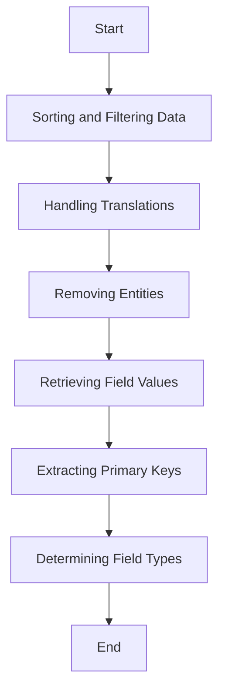

The data fetching process involves several steps to ensure that the data retrieved meets the specified criteria. This document will cover:

1. Sorting and Filtering Data
2. Handling Translations
3. Removing Entities
4. Retrieving Field Values
5. Extracting Primary Keys
6. Determining Field Types

Technical document: <SwmLink doc-title="Data Fetching Process">[Data Fetching Process](/.swm/data-fetching-process.f1vy5qzr.sw.md)</SwmLink>

# [Sorting and Filtering Data](https://app.swimm.io/repos/Z2l0aHViJTNBJTNBQnJvYWRsZWFmQ29tbWVyY2UtZGVtby1uZXclM0ElM0FTd2ltbS1EZW1v/docs/f1vy5qzr#fetch)

The data fetching process begins by sorting and filtering the data based on the specified criteria. This ensures that the data retrieved is relevant and meets the user's requirements. Sorting involves arranging the data in a specific order, such as ascending or descending, based on a particular field. Filtering involves selecting only the data that meets certain conditions, such as a specific date range or category.

# [Handling Translations](https://app.swimm.io/repos/Z2l0aHViJTNBJTNBQnJvYWRsZWFmQ29tbWVyY2UtZGVtby1uZXclM0ElM0FTd2ltbS1EZW1v/docs/f1vy5qzr#add-translation-search-if-needed)

When the data involves different languages, the system adjusts the search criteria to include translations. This ensures that the search results are comprehensive and include all relevant locales. For example, if the search is for 'en' (English), the system will also include 'en_GB' (British English) and 'en_US' (American English) in the search results.

# [Removing Entities](https://app.swimm.io/repos/Z2l0aHViJTNBJTNBQnJvYWRsZWFmQ29tbWVyY2UtZGVtby1uZXclM0ElM0FTd2ltbS1EZW1v/docs/f1vy5qzr#remove)

The removal process involves deleting entities from the system. Before an entity is removed, the system checks for any foreign key constraints to ensure that the deletion does not violate any relationships. Depending on the operation type, the system may perform a non-destructive remove, which keeps a record of the entity, or a basic remove, which permanently deletes the entity.

# [Retrieving Field Values](https://app.swimm.io/repos/Z2l0aHViJTNBJTNBQnJvYWRsZWFmQ29tbWVyY2UtZGVtby1uZXclM0ElM0FTd2ltbS1EZW1v/docs/f1vy5qzr#get-field-value)

Retrieving field values involves extracting the value of a specified field from a given entity. This process handles nested fields and map fields, ensuring that the correct value is extracted even if the field is deeply nested or part of a map. This step is crucial for obtaining accurate data for further processing.

# [Extracting Primary Keys](https://app.swimm.io/repos/Z2l0aHViJTNBJTNBQnJvYWRsZWFmQ29tbWVyY2UtZGVtby1uZXclM0ElM0FTd2ltbS1EZW1v/docs/f1vy5qzr#get-primary-key)

Extracting primary keys involves identifying and retrieving the primary key value from an entity. The primary key is a unique identifier for the entity and is essential for operations like retrieval and deletion. The system identifies the primary key field and retrieves its value to ensure that the correct entity is being processed.

# [Determining Field Types](https://app.swimm.io/repos/Z2l0aHViJTNBJTNBQnJvYWRsZWFmQ29tbWVyY2UtZGVtby1uZXclM0ElM0FTd2ltbS1EZW1v/docs/f1vy5qzr#get-field-type)

Determining field types involves identifying the type of a given field. The system consults the entity configuration manager and the persistence manager to identify the most specific type for the field. This step ensures that the system has accurate type information for further processing, which is crucial for data integrity and consistency.

&nbsp;

*This is an auto-generated document by Swimm AI 🌊 and has not yet been verified by a human*

<SwmMeta version="3.0.0" repo-id="Z2l0aHViJTNBJTNBQnJvYWRsZWFmQ29tbWVyY2UtZGVtby1uZXclM0ElM0FTd2ltbS1EZW1v" repo-name="BroadleafCommerce-demo-new" doc-type="product-flows">Powered by [Swimm](/)</SwmMeta>
