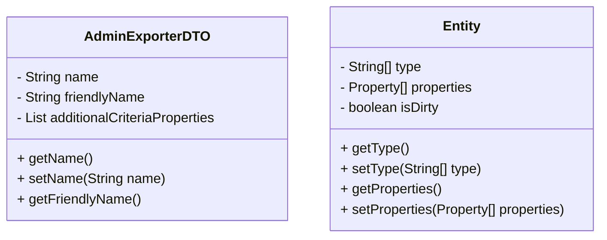

# Understanding Data Transfer Objects in Broadleaf Open Admin Platform

Data Transfer Objects (DTOs) are used within the Broadleaf Open Admin Platform to carry data between processes, reducing the number of method calls. They encapsulate data and send it from one subsystem of an application to another, maintaining a clean separation between different layers of the application, such as the service layer and the presentation layer.

<SwmSnippet path="/admin/broadleaf-open-admin-platform/src/main/java/org/broadleafcommerce/openadmin/dto/AdminExporterDTO.java" line="23">

---

The <SwmToken path="admin/broadleaf-open-admin-platform/src/main/java/org/broadleafcommerce/openadmin/dto/AdminExporterDTO.java" pos="27:4:4" line-data="public class AdminExporterDTO implements Serializable {">`AdminExporterDTO`</SwmToken> class is used for exporting admin data. It includes fields like <SwmToken path="admin/broadleaf-open-admin-platform/src/main/java/org/broadleafcommerce/openadmin/dto/AdminExporterDTO.java" pos="31:5:5" line-data="    protected String name;">`name`</SwmToken>, <SwmToken path="admin/broadleaf-open-admin-platform/src/main/java/org/broadleafcommerce/openadmin/dto/AdminExporterDTO.java" pos="32:5:5" line-data="    protected String friendlyName;">`friendlyName`</SwmToken>, and <SwmToken path="admin/broadleaf-open-admin-platform/src/main/java/org/broadleafcommerce/openadmin/dto/AdminExporterDTO.java" pos="33:8:8" line-data="    protected List&lt;Property&gt; additionalCriteriaProperties;">`additionalCriteriaProperties`</SwmToken>. The class provides getter and setter methods for these fields, allowing other parts of the application to access and modify the data.

```java
/**
 * 
 * @author Phillip Verheyden
 */
public class AdminExporterDTO implements Serializable {

    private static final long serialVersionUID = 1L;

    protected String name;
    protected String friendlyName;
    protected List<Property> additionalCriteriaProperties;
    
    public String getName() {
        return name;
    }
    
    public void setName(String name) {
        this.name = name;
    }
    
    public String getFriendlyName() {
```

---

</SwmSnippet>

<SwmSnippet path="/admin/broadleaf-open-admin-platform/src/main/java/org/broadleafcommerce/openadmin/dto/Entity.java" line="38">

---

The <SwmToken path="admin/broadleaf-open-admin-platform/src/main/java/org/broadleafcommerce/openadmin/dto/Entity.java" pos="47:4:4" line-data="public class Entity implements Serializable {">`Entity`</SwmToken> class represents a generic entity structure. It includes fields like <SwmToken path="admin/broadleaf-open-admin-platform/src/main/java/org/broadleafcommerce/openadmin/dto/Entity.java" pos="52:7:7" line-data="    protected String[] type;">`type`</SwmToken>, <SwmToken path="admin/broadleaf-open-admin-platform/src/main/java/org/broadleafcommerce/openadmin/dto/Entity.java" pos="39:37:37" line-data=" * Generic DTO for a domain object. Each property of the domain object is represented by the &#39;properties&#39; instance variable">`properties`</SwmToken>, and <SwmToken path="admin/broadleaf-open-admin-platform/src/main/java/org/broadleafcommerce/openadmin/dto/Entity.java" pos="58:5:5" line-data="    protected boolean isDirty = false;">`isDirty`</SwmToken>. The class provides getter and setter methods for these fields, allowing other parts of the application to access and modify the data.

```java
/**
 * Generic DTO for a domain object. Each property of the domain object is represented by the 'properties' instance variable
 * which allows for further display metadata to be stored.
 * 
 * @author jfischer
 * @see {@link Property}
 *
 */
@JsonAutoDetect
public class Entity implements Serializable {

    protected static final long serialVersionUID = 1L;

    @JsonProperty
    protected String[] type;

    @JsonProperty(value = "entityProperties")
    protected Property[] properties;

    @JsonProperty
    protected boolean isDirty = false;
```

---

</SwmSnippet>

The <SwmToken path="admin/broadleaf-open-admin-platform/src/main/java/org/broadleafcommerce/openadmin/dto/AdminExporterDTO.java" pos="18:2:8" line-data="package org.broadleafcommerce.openadmin.dto;">`org.broadleafcommerce.openadmin.dto`</SwmToken> package contains various DTO classes like <SwmToken path="admin/broadleaf-open-admin-platform/src/main/java/org/broadleafcommerce/openadmin/dto/AdminExporterDTO.java" pos="27:4:4" line-data="public class AdminExporterDTO implements Serializable {">`AdminExporterDTO`</SwmToken>, <SwmToken path="admin/broadleaf-open-admin-platform/src/main/java/org/broadleafcommerce/openadmin/dto/Entity.java" pos="47:4:4" line-data="public class Entity implements Serializable {">`Entity`</SwmToken>, `MapMetadata`, and `TabMetadata`. These classes represent different types of data structures and metadata required for the admin functionalities.

Using DTOs helps in optimizing the performance of the application by minimizing the number of remote calls and reducing the amount of data transferred.

&nbsp;

*This is an auto-generated document by Swimm AI 🌊 and has not yet been verified by a human*

<SwmMeta version="3.0.0" repo-id="Z2l0aHViJTNBJTNBQnJvYWRsZWFmQ29tbWVyY2UtZGVtby1uZXclM0ElM0FTd2ltbS1EZW1v" repo-name="BroadleafCommerce-demo-new" doc-type="overview"><sup>Powered by [Swimm](/)</sup></SwmMeta>
