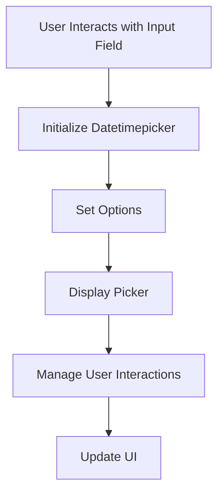

This document will cover the Datetimepicker functionality, which includes:

1. Initializing the Datetimepicker
2. Setting Options
3. Managing User Interactions
4. Displaying the Picker
5. Updating the UI.

Technical document: <SwmLink doc-title="Datetimepicker Functionality">[Datetimepicker Functionality](/.swm/datetimepicker-functionality.w2743eno.sw.md)</SwmLink>

# [Initializing the Datetimepicker](https://app.swimm.io/repos/Z2l0aHViJTNBJTNBQnJvYWRsZWFmQ29tbWVyY2UtZGVtby1uZXclM0ElM0FTd2ltbS1EZW1v/docs/w2743eno#datetimepicker-initialization)

The Datetimepicker initializes when the user interacts with the input field. This involves setting up event listeners that trigger the initialization process. The goal is to ensure that the Datetimepicker is only initialized when necessary, optimizing performance by delaying the initialization until the user actually interacts with the input field.

# [Setting Options](https://app.swimm.io/repos/Z2l0aHViJTNBJTNBQnJvYWRsZWFmQ29tbWVyY2UtZGVtby1uZXclM0ElM0FTd2ltbS1EZW1v/docs/w2743eno#setting-options)

The `setOptions` function allows customization of the Datetimepicker by merging user-provided options with default settings. This customization includes setting allowed times, weekends, and disabled dates. The purpose is to provide flexibility in how the Datetimepicker behaves and appears, ensuring it meets the specific needs of the user.

# [Managing User Interactions](https://app.swimm.io/repos/Z2l0aHViJTNBJTNBQnJvYWRsZWFmQ29tbWVyY2UtZGVtby1uZXclM0ElM0FTd2ltbS1EZW1v/docs/w2743eno#scrolling-mechanism)

The scrolling mechanism within the Datetimepicker ensures smooth navigation through the time options. This is crucial for providing a seamless user experience, allowing users to easily scroll through and select their desired time.

# [Displaying the Picker](https://app.swimm.io/repos/Z2l0aHViJTNBJTNBQnJvYWRsZWFmQ29tbWVyY2UtZGVtby1uZXclM0ElM0FTd2ltbS1EZW1v/docs/w2743eno#displaying-the-picker)

The `show` function is responsible for displaying the Datetimepicker. It triggers events, manages visibility, and sets up necessary event listeners for user interactions. This ensures that the Datetimepicker is displayed correctly and is ready for user input.

# [Updating the UI](https://app.swimm.io/repos/Z2l0aHViJTNBJTNBQnJvYWRsZWFmQ29tbWVyY2UtZGVtby1uZXclM0ElM0FTd2ltbS1EZW1v/docs/w2743eno#updating-the-ui)

The `updateUI` function updates various UI elements of the Datetimepicker based on the current state and user interactions. This includes updating the background color and input fields. The goal is to ensure that the UI reflects the current state of the Datetimepicker, providing a consistent and intuitive user experience.

&nbsp;

*This is an auto-generated document by Swimm AI 🌊 and has not yet been verified by a human*

<SwmMeta version="3.0.0" repo-id="Z2l0aHViJTNBJTNBQnJvYWRsZWFmQ29tbWVyY2UtZGVtby1uZXclM0ElM0FTd2ltbS1EZW1v" repo-name="BroadleafCommerce-demo-new" doc-type="product-flows">Powered by [Swimm](/)</SwmMeta>
