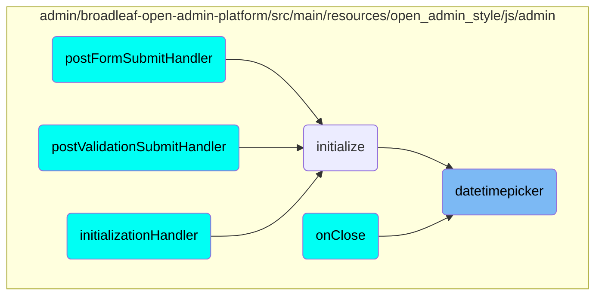

This document provides an overview of the datetimepicker functionality. It covers the initialization process, setting options, and managing user interactions to ensure a smooth user experience.

The datetimepicker is a widget that allows users to select dates and times easily. It initializes when the user interacts with the input field, sets options to customize its behavior, and handles user interactions like scrolling and displaying the picker. The flow involves lazy initialization to optimize performance, creating the datetimepicker with necessary HTML elements, and updating the UI based on user preferences.

Here is a high level diagram of the flow, showing only the most important functions:

```mermaid
graph TD;
      subgraph admin/broadleaf-open-admin-platform/src/main/resources/open_admin_style/js/admin/lib/plugins
e570905f73bf09ea404a28ceb987fa903e402a07dcd24a296abd1a9f40420e92(datetimepicker):::mainFlowStyle --> 478af971df1cc58a2b19fa2f81e6f77e376c3e569893160674868bd2ce48db6b(xdsoftScroller)
end

subgraph admin/broadleaf-open-admin-platform/src/main/resources/open_admin_style/js/admin/lib/plugins
e570905f73bf09ea404a28ceb987fa903e402a07dcd24a296abd1a9f40420e92(datetimepicker):::mainFlowStyle --> 216f584e095c79b2f2bf2751a84cd65c133c366ca5f256881cdaf0962fbc3705(show)
end

subgraph admin/broadleaf-open-admin-platform/src/main/resources/open_admin_style/js/admin/lib/plugins
e570905f73bf09ea404a28ceb987fa903e402a07dcd24a296abd1a9f40420e92(datetimepicker):::mainFlowStyle --> 7d98c25427cf2e877afad2c02b6f035b9af96abb7ed149509bc1104398f655c3(lazyInit):::mainFlowStyle
end

subgraph admin/broadleaf-open-admin-platform/src/main/resources/open_admin_style/js/admin/lib/plugins
7d98c25427cf2e877afad2c02b6f035b9af96abb7ed149509bc1104398f655c3(lazyInit):::mainFlowStyle --> c4b78b471189dd65024d7e68c5d86d801d41ef8ad705f7daebccf9617da08929(createDateTimePicker):::mainFlowStyle
end

subgraph admin/broadleaf-open-admin-platform/src/main/resources/open_admin_style/js/admin/lib/plugins
c4b78b471189dd65024d7e68c5d86d801d41ef8ad705f7daebccf9617da08929(createDateTimePicker):::mainFlowStyle --> 478af971df1cc58a2b19fa2f81e6f77e376c3e569893160674868bd2ce48db6b(xdsoftScroller)
end

subgraph admin/broadleaf-open-admin-platform/src/main/resources/open_admin_style/js/admin/lib/plugins
c4b78b471189dd65024d7e68c5d86d801d41ef8ad705f7daebccf9617da08929(createDateTimePicker):::mainFlowStyle --> 216f584e095c79b2f2bf2751a84cd65c133c366ca5f256881cdaf0962fbc3705(show)
end

subgraph admin/broadleaf-open-admin-platform/src/main/resources/open_admin_style/js/admin/lib/plugins
c4b78b471189dd65024d7e68c5d86d801d41ef8ad705f7daebccf9617da08929(createDateTimePicker):::mainFlowStyle --> e99c22fca9e5d0821ab37e591218b4bb971aee4b41dfc962830547b904d271f4(setOptions):::mainFlowStyle
end

subgraph admin/broadleaf-open-admin-platform/src/main/resources/open_admin_style/js/admin/lib/plugins
e99c22fca9e5d0821ab37e591218b4bb971aee4b41dfc962830547b904d271f4(setOptions):::mainFlowStyle --> 478af971df1cc58a2b19fa2f81e6f77e376c3e569893160674868bd2ce48db6b(xdsoftScroller)
end


      classDef mainFlowStyle color:#000000,fill:#7CB9F4
classDef rootsStyle color:#000000,fill:#00FFF4
classDef Style1 color:#000000,fill:#00FFAA
classDef Style2 color:#000000,fill:#FFFF00
classDef Style3 color:#000000,fill:#AA7CB9

%% Swimm:
%% graph TD;
%%       subgraph <SwmPath>[admin/broadleaf-open-admin-platform/src/main/resources/open_admin_style/js/admin/lib/plugins/](admin/broadleaf-open-admin-platform/src/main/resources/open_admin_style/js/admin/lib/plugins/)</SwmPath>
%% e570905f73bf09ea404a28ceb987fa903e402a07dcd24a296abd1a9f40420e92(datetimepicker):::mainFlowStyle --> 478af971df1cc58a2b19fa2f81e6f77e376c3e569893160674868bd2ce48db6b(xdsoftScroller)
%% end
%% 
%% subgraph <SwmPath>[admin/broadleaf-open-admin-platform/src/main/resources/open_admin_style/js/admin/lib/plugins/](admin/broadleaf-open-admin-platform/src/main/resources/open_admin_style/js/admin/lib/plugins/)</SwmPath>
%% e570905f73bf09ea404a28ceb987fa903e402a07dcd24a296abd1a9f40420e92(datetimepicker):::mainFlowStyle --> 216f584e095c79b2f2bf2751a84cd65c133c366ca5f256881cdaf0962fbc3705(show)
%% end
%% 
%% subgraph <SwmPath>[admin/broadleaf-open-admin-platform/src/main/resources/open_admin_style/js/admin/lib/plugins/](admin/broadleaf-open-admin-platform/src/main/resources/open_admin_style/js/admin/lib/plugins/)</SwmPath>
%% e570905f73bf09ea404a28ceb987fa903e402a07dcd24a296abd1a9f40420e92(datetimepicker):::mainFlowStyle --> 7d98c25427cf2e877afad2c02b6f035b9af96abb7ed149509bc1104398f655c3(lazyInit):::mainFlowStyle
%% end
%% 
%% subgraph <SwmPath>[admin/broadleaf-open-admin-platform/src/main/resources/open_admin_style/js/admin/lib/plugins/](admin/broadleaf-open-admin-platform/src/main/resources/open_admin_style/js/admin/lib/plugins/)</SwmPath>
%% 7d98c25427cf2e877afad2c02b6f035b9af96abb7ed149509bc1104398f655c3(lazyInit):::mainFlowStyle --> c4b78b471189dd65024d7e68c5d86d801d41ef8ad705f7daebccf9617da08929(createDateTimePicker):::mainFlowStyle
%% end
%% 
%% subgraph <SwmPath>[admin/broadleaf-open-admin-platform/src/main/resources/open_admin_style/js/admin/lib/plugins/](admin/broadleaf-open-admin-platform/src/main/resources/open_admin_style/js/admin/lib/plugins/)</SwmPath>
%% c4b78b471189dd65024d7e68c5d86d801d41ef8ad705f7daebccf9617da08929(createDateTimePicker):::mainFlowStyle --> 478af971df1cc58a2b19fa2f81e6f77e376c3e569893160674868bd2ce48db6b(xdsoftScroller)
%% end
%% 
%% subgraph <SwmPath>[admin/broadleaf-open-admin-platform/src/main/resources/open_admin_style/js/admin/lib/plugins/](admin/broadleaf-open-admin-platform/src/main/resources/open_admin_style/js/admin/lib/plugins/)</SwmPath>
%% c4b78b471189dd65024d7e68c5d86d801d41ef8ad705f7daebccf9617da08929(createDateTimePicker):::mainFlowStyle --> 216f584e095c79b2f2bf2751a84cd65c133c366ca5f256881cdaf0962fbc3705(show)
%% end
%% 
%% subgraph <SwmPath>[admin/broadleaf-open-admin-platform/src/main/resources/open_admin_style/js/admin/lib/plugins/](admin/broadleaf-open-admin-platform/src/main/resources/open_admin_style/js/admin/lib/plugins/)</SwmPath>
%% c4b78b471189dd65024d7e68c5d86d801d41ef8ad705f7daebccf9617da08929(createDateTimePicker):::mainFlowStyle --> e99c22fca9e5d0821ab37e591218b4bb971aee4b41dfc962830547b904d271f4(setOptions):::mainFlowStyle
%% end
%% 
%% subgraph <SwmPath>[admin/broadleaf-open-admin-platform/src/main/resources/open_admin_style/js/admin/lib/plugins/](admin/broadleaf-open-admin-platform/src/main/resources/open_admin_style/js/admin/lib/plugins/)</SwmPath>
%% e99c22fca9e5d0821ab37e591218b4bb971aee4b41dfc962830547b904d271f4(setOptions):::mainFlowStyle --> 478af971df1cc58a2b19fa2f81e6f77e376c3e569893160674868bd2ce48db6b(xdsoftScroller)
%% end
%% 
%% 
%%       classDef mainFlowStyle color:#000000,fill:#7CB9F4
%% classDef rootsStyle color:#000000,fill:#00FFF4
%% classDef Style1 color:#000000,fill:#00FFAA
%% classDef Style2 color:#000000,fill:#FFFF00
%% classDef Style3 color:#000000,fill:#AA7CB9
```



# Flow drill down

First, we'll zoom into this section of the flow:

```mermaid
graph TD;
      subgraph admin/broadleaf-open-admin-platform/src/main/resources/open_admin_style/js/admin/lib/plugins
e570905f73bf09ea404a28ceb987fa903e402a07dcd24a296abd1a9f40420e92(datetimepicker):::mainFlowStyle --> 478af971df1cc58a2b19fa2f81e6f77e376c3e569893160674868bd2ce48db6b(xdsoftScroller)
end

subgraph admin/broadleaf-open-admin-platform/src/main/resources/open_admin_style/js/admin/lib/plugins
e570905f73bf09ea404a28ceb987fa903e402a07dcd24a296abd1a9f40420e92(datetimepicker):::mainFlowStyle --> 216f584e095c79b2f2bf2751a84cd65c133c366ca5f256881cdaf0962fbc3705(show)
end

subgraph admin/broadleaf-open-admin-platform/src/main/resources/open_admin_style/js/admin/lib/plugins
e570905f73bf09ea404a28ceb987fa903e402a07dcd24a296abd1a9f40420e92(datetimepicker):::mainFlowStyle --> 7d98c25427cf2e877afad2c02b6f035b9af96abb7ed149509bc1104398f655c3(lazyInit):::mainFlowStyle
end

subgraph admin/broadleaf-open-admin-platform/src/main/resources/open_admin_style/js/admin/lib/plugins
7d98c25427cf2e877afad2c02b6f035b9af96abb7ed149509bc1104398f655c3(lazyInit):::mainFlowStyle --> ycout(...)
end

subgraph admin/broadleaf-open-admin-platform/src/main/resources/open_admin_style/js/admin/lib/plugins
216f584e095c79b2f2bf2751a84cd65c133c366ca5f256881cdaf0962fbc3705(show) --> c2075116c18ea5b28bdccc5f48fd1e869761de9ba9bd384813190b87b4046f61(reflow)
end

subgraph admin/broadleaf-open-admin-platform/src/main/resources/open_admin_style/js/admin/lib/plugins
216f584e095c79b2f2bf2751a84cd65c133c366ca5f256881cdaf0962fbc3705(show) --> eeefc90edb35bd32ed31ecb4a4b5b3a0b232df48d153e328de117a1fc73ad18f(updateUI)
end

subgraph admin/broadleaf-open-admin-platform/src/main/resources/open_admin_style/js/admin/lib/plugins
478af971df1cc58a2b19fa2f81e6f77e376c3e569893160674868bd2ce48db6b(xdsoftScroller) --> 216f584e095c79b2f2bf2751a84cd65c133c366ca5f256881cdaf0962fbc3705(show)
end


      classDef mainFlowStyle color:#000000,fill:#7CB9F4
classDef rootsStyle color:#000000,fill:#00FFF4
classDef Style1 color:#000000,fill:#00FFAA
classDef Style2 color:#000000,fill:#FFFF00
classDef Style3 color:#000000,fill:#AA7CB9

%% Swimm:
%% graph TD;
%%       subgraph <SwmPath>[admin/broadleaf-open-admin-platform/src/main/resources/open_admin_style/js/admin/lib/plugins/](admin/broadleaf-open-admin-platform/src/main/resources/open_admin_style/js/admin/lib/plugins/)</SwmPath>
%% e570905f73bf09ea404a28ceb987fa903e402a07dcd24a296abd1a9f40420e92(datetimepicker):::mainFlowStyle --> 478af971df1cc58a2b19fa2f81e6f77e376c3e569893160674868bd2ce48db6b(xdsoftScroller)
%% end
%% 
%% subgraph <SwmPath>[admin/broadleaf-open-admin-platform/src/main/resources/open_admin_style/js/admin/lib/plugins/](admin/broadleaf-open-admin-platform/src/main/resources/open_admin_style/js/admin/lib/plugins/)</SwmPath>
%% e570905f73bf09ea404a28ceb987fa903e402a07dcd24a296abd1a9f40420e92(datetimepicker):::mainFlowStyle --> 216f584e095c79b2f2bf2751a84cd65c133c366ca5f256881cdaf0962fbc3705(show)
%% end
%% 
%% subgraph <SwmPath>[admin/broadleaf-open-admin-platform/src/main/resources/open_admin_style/js/admin/lib/plugins/](admin/broadleaf-open-admin-platform/src/main/resources/open_admin_style/js/admin/lib/plugins/)</SwmPath>
%% e570905f73bf09ea404a28ceb987fa903e402a07dcd24a296abd1a9f40420e92(datetimepicker):::mainFlowStyle --> 7d98c25427cf2e877afad2c02b6f035b9af96abb7ed149509bc1104398f655c3(lazyInit):::mainFlowStyle
%% end
%% 
%% subgraph <SwmPath>[admin/broadleaf-open-admin-platform/src/main/resources/open_admin_style/js/admin/lib/plugins/](admin/broadleaf-open-admin-platform/src/main/resources/open_admin_style/js/admin/lib/plugins/)</SwmPath>
%% 7d98c25427cf2e877afad2c02b6f035b9af96abb7ed149509bc1104398f655c3(lazyInit):::mainFlowStyle --> ycout(...)
%% end
%% 
%% subgraph <SwmPath>[admin/broadleaf-open-admin-platform/src/main/resources/open_admin_style/js/admin/lib/plugins/](admin/broadleaf-open-admin-platform/src/main/resources/open_admin_style/js/admin/lib/plugins/)</SwmPath>
%% 216f584e095c79b2f2bf2751a84cd65c133c366ca5f256881cdaf0962fbc3705(show) --> c2075116c18ea5b28bdccc5f48fd1e869761de9ba9bd384813190b87b4046f61(reflow)
%% end
%% 
%% subgraph <SwmPath>[admin/broadleaf-open-admin-platform/src/main/resources/open_admin_style/js/admin/lib/plugins/](admin/broadleaf-open-admin-platform/src/main/resources/open_admin_style/js/admin/lib/plugins/)</SwmPath>
%% 216f584e095c79b2f2bf2751a84cd65c133c366ca5f256881cdaf0962fbc3705(show) --> eeefc90edb35bd32ed31ecb4a4b5b3a0b232df48d153e328de117a1fc73ad18f(updateUI)
%% end
%% 
%% subgraph <SwmPath>[admin/broadleaf-open-admin-platform/src/main/resources/open_admin_style/js/admin/lib/plugins/](admin/broadleaf-open-admin-platform/src/main/resources/open_admin_style/js/admin/lib/plugins/)</SwmPath>
%% 478af971df1cc58a2b19fa2f81e6f77e376c3e569893160674868bd2ce48db6b(xdsoftScroller) --> 216f584e095c79b2f2bf2751a84cd65c133c366ca5f256881cdaf0962fbc3705(show)
%% end
%% 
%% 
%%       classDef mainFlowStyle color:#000000,fill:#7CB9F4
%% classDef rootsStyle color:#000000,fill:#00FFF4
%% classDef Style1 color:#000000,fill:#00FFAA
%% classDef Style2 color:#000000,fill:#FFFF00
%% classDef Style3 color:#000000,fill:#AA7CB9
```



<SwmSnippet path="/admin/broadleaf-open-admin-platform/src/main/resources/open_admin_style/js/admin/lib/plugins/jquery.datetimepicker.js" line="695">

---

## datetimepicker Initialization

The <SwmToken path="admin/broadleaf-open-admin-platform/src/main/resources/open_admin_style/js/admin/lib/plugins/jquery.datetimepicker.js" pos="715:3:3" line-data="			var datetimepicker = $(&#39;&lt;div &#39; + (options.id ? &#39;id=&quot;&#39; + options.id + &#39;&quot;&#39; : &#39;&#39;) + &#39; &#39; + (options.style ? &#39;style=&quot;&#39; + options.style + &#39;&quot;&#39; : &#39;&#39;) + &#39; class=&quot;xdsoft_datetimepicker xdsoft_&#39; + options.theme + &#39; xdsoft_noselect &#39; + (options.weeks ? &#39; xdsoft_showweeks&#39; : &#39;&#39;) + options.className + &#39;&quot;&gt;&lt;/div&gt;&#39;),">`datetimepicker`</SwmToken> function initializes the datetime picker widget. It sets up event listeners to trigger the initialization when the input field is interacted with.

```javascript
			lazyInit = function (input) {
				input
					.on('open.xdsoft focusin.xdsoft mousedown.xdsoft', function initOnActionCallback(event) {
						if (input.is(':disabled') || input.is(':hidden') || !input.is(':visible') || input.data('xdsoft_datetimepicker')) {
							return;
						}
```

---

</SwmSnippet>

<SwmSnippet path="/admin/broadleaf-open-admin-platform/src/main/resources/open_admin_style/js/admin/lib/plugins/jquery.datetimepicker.js" line="803">

---

## Setting Options

The <SwmToken path="admin/broadleaf-open-admin-platform/src/main/resources/open_admin_style/js/admin/lib/plugins/jquery.datetimepicker.js" pos="803:3:3" line-data="			datetimepicker.setOptions = function (_options) {">`setOptions`</SwmToken> function allows customization of the datetime picker by merging user-provided options with default settings.

```javascript
			datetimepicker.setOptions = function (_options) {
				options = $.extend(true, {}, options, _options);

				if (_options.allowTimes && $.isArray(_options.allowTimes) && _options.allowTimes.length) {
```

---

</SwmSnippet>

<SwmSnippet path="/admin/broadleaf-open-admin-platform/src/main/resources/open_admin_style/js/admin/lib/plugins/jquery.datetimepicker.js" line="552">

---

## Scrolling Mechanism

The <SwmToken path="admin/broadleaf-open-admin-platform/src/main/resources/open_admin_style/js/admin/lib/plugins/jquery.datetimepicker.js" pos="509:4:4" line-data="	$.fn.xdsoftScroller = function (percent) {">`xdsoftScroller`</SwmToken> function handles the scrolling mechanism within the datetime picker, ensuring smooth navigation through the time options.

```javascript
				calcOffset = function calcOffset(event) {
					var offset = pointerEventToXY(event).y - startY + startTopScroll;
					if (offset < 0) {
						offset = 0;
```

---

</SwmSnippet>

<SwmSnippet path="/admin/broadleaf-open-admin-platform/src/main/resources/open_admin_style/js/admin/lib/plugins/spectrum.js" line="613">

---

## Displaying the Picker

The <SwmToken path="admin/broadleaf-open-admin-platform/src/main/resources/open_admin_style/js/admin/lib/plugins/spectrum.js" pos="613:3:3" line-data="        function show() {">`show`</SwmToken> function is responsible for displaying the datetime picker. It triggers events, manages visibility, and sets up necessary event listeners for user interactions.

```javascript
        function show() {
            var event = $.Event('beforeShow.spectrum');

            if (visible) {
                reflow();
                return;
            }

            boundElement.trigger(event, [ get() ]);

            if (callbacks.beforeShow(get()) === false || event.isDefaultPrevented()) {
                return;
            }

            hideAll();
            visible = true;

            $(doc).on("keydown.spectrum", onkeydown);
            $(doc).on("click.spectrum", clickout);
            $(window).on("resize.spectrum", resize);
            replacer.addClass("sp-active");
```

---

</SwmSnippet>

<SwmSnippet path="/admin/broadleaf-open-admin-platform/src/main/resources/open_admin_style/js/admin/lib/plugins/spectrum.js" line="887">

---

## Reflowing the UI

The <SwmToken path="admin/broadleaf-open-admin-platform/src/main/resources/open_admin_style/js/admin/lib/plugins/spectrum.js" pos="887:3:3" line-data="        function reflow() {">`reflow`</SwmToken> function adjusts the layout and positioning of the datetime picker elements to ensure they are correctly displayed on the screen.

```javascript
        function reflow() {
            if (!visible) {
                return; // Calculations would be useless and wouldn't be reliable anyways
            }
            dragWidth = dragger.width();
            dragHeight = dragger.height();
            dragHelperHeight = dragHelper.height();
            slideWidth = slider.width();
            slideHeight = slider.height();
            slideHelperHeight = slideHelper.height();
            alphaWidth = alphaSlider.width();
            alphaSlideHelperWidth = alphaSlideHelper.width();

            if (!flat) {
                container.css("position", "absolute");
                if (opts.offset) {
                    container.offset(opts.offset);
                } else {
                    container.offset(getOffset(container, offsetElement));
                }
            }
```

---

</SwmSnippet>

<SwmSnippet path="/admin/broadleaf-open-admin-platform/src/main/resources/open_admin_style/js/admin/lib/plugins/spectrum.js" line="745">

---

## Updating the UI

The <SwmToken path="admin/broadleaf-open-admin-platform/src/main/resources/open_admin_style/js/admin/lib/plugins/spectrum.js" pos="745:3:3" line-data="        function updateUI() {">`updateUI`</SwmToken> function updates various UI elements of the datetime picker, such as the background color and input fields, based on the current state and user interactions.

```javascript
        function updateUI() {

            textInput.removeClass("sp-validation-error");

            updateHelperLocations();

            // Update dragger background color (gradients take care of saturation and value).
            var flatColor = tinycolor.fromRatio({ h: currentHue, s: 1, v: 1 });
            dragger.css("background-color", flatColor.toHexString());

            // Get a format that alpha will be included in (hex and names ignore alpha)
            var format = currentPreferredFormat;
            if (currentAlpha < 1 && !(currentAlpha === 0 && format === "name")) {
                if (format === "hex" || format === "hex3" || format === "hex6" || format === "name") {
                    format = "rgb";
                }
            }

            var realColor = get({ format: format }),
                displayColor = '';

```

---

</SwmSnippet>

Now, lets zoom into this section of the flow:

```mermaid
graph TD;
      subgraph admin/broadleaf-open-admin-platform/src/main/resources/open_admin_style/js/admin/lib/plugins
7d98c25427cf2e877afad2c02b6f035b9af96abb7ed149509bc1104398f655c3(lazyInit):::mainFlowStyle --> c4b78b471189dd65024d7e68c5d86d801d41ef8ad705f7daebccf9617da08929(createDateTimePicker):::mainFlowStyle
end

subgraph admin/broadleaf-open-admin-platform/src/main/resources/open_admin_style/js/admin/lib/plugins
c4b78b471189dd65024d7e68c5d86d801d41ef8ad705f7daebccf9617da08929(createDateTimePicker):::mainFlowStyle --> 478af971df1cc58a2b19fa2f81e6f77e376c3e569893160674868bd2ce48db6b(xdsoftScroller)
end

subgraph admin/broadleaf-open-admin-platform/src/main/resources/open_admin_style/js/admin/lib/plugins
c4b78b471189dd65024d7e68c5d86d801d41ef8ad705f7daebccf9617da08929(createDateTimePicker):::mainFlowStyle --> 216f584e095c79b2f2bf2751a84cd65c133c366ca5f256881cdaf0962fbc3705(show)
end

subgraph admin/broadleaf-open-admin-platform/src/main/resources/open_admin_style/js/admin/lib/plugins
c4b78b471189dd65024d7e68c5d86d801d41ef8ad705f7daebccf9617da08929(createDateTimePicker):::mainFlowStyle --> e99c22fca9e5d0821ab37e591218b4bb971aee4b41dfc962830547b904d271f4(setOptions):::mainFlowStyle
end

subgraph admin/broadleaf-open-admin-platform/src/main/resources/open_admin_style/js/admin/lib/plugins
216f584e095c79b2f2bf2751a84cd65c133c366ca5f256881cdaf0962fbc3705(show) --> c2075116c18ea5b28bdccc5f48fd1e869761de9ba9bd384813190b87b4046f61(reflow)
end

subgraph admin/broadleaf-open-admin-platform/src/main/resources/open_admin_style/js/admin/lib/plugins
216f584e095c79b2f2bf2751a84cd65c133c366ca5f256881cdaf0962fbc3705(show) --> eeefc90edb35bd32ed31ecb4a4b5b3a0b232df48d153e328de117a1fc73ad18f(updateUI)
end

subgraph admin/broadleaf-open-admin-platform/src/main/resources/open_admin_style/js/admin/lib/plugins
478af971df1cc58a2b19fa2f81e6f77e376c3e569893160674868bd2ce48db6b(xdsoftScroller) --> 216f584e095c79b2f2bf2751a84cd65c133c366ca5f256881cdaf0962fbc3705(show)
end


      classDef mainFlowStyle color:#000000,fill:#7CB9F4
classDef rootsStyle color:#000000,fill:#00FFF4
classDef Style1 color:#000000,fill:#00FFAA
classDef Style2 color:#000000,fill:#FFFF00
classDef Style3 color:#000000,fill:#AA7CB9

%% Swimm:
%% graph TD;
%%       subgraph <SwmPath>[admin/broadleaf-open-admin-platform/src/main/resources/open_admin_style/js/admin/lib/plugins/](admin/broadleaf-open-admin-platform/src/main/resources/open_admin_style/js/admin/lib/plugins/)</SwmPath>
%% 7d98c25427cf2e877afad2c02b6f035b9af96abb7ed149509bc1104398f655c3(lazyInit):::mainFlowStyle --> c4b78b471189dd65024d7e68c5d86d801d41ef8ad705f7daebccf9617da08929(createDateTimePicker):::mainFlowStyle
%% end
%% 
%% subgraph <SwmPath>[admin/broadleaf-open-admin-platform/src/main/resources/open_admin_style/js/admin/lib/plugins/](admin/broadleaf-open-admin-platform/src/main/resources/open_admin_style/js/admin/lib/plugins/)</SwmPath>
%% c4b78b471189dd65024d7e68c5d86d801d41ef8ad705f7daebccf9617da08929(createDateTimePicker):::mainFlowStyle --> 478af971df1cc58a2b19fa2f81e6f77e376c3e569893160674868bd2ce48db6b(xdsoftScroller)
%% end
%% 
%% subgraph <SwmPath>[admin/broadleaf-open-admin-platform/src/main/resources/open_admin_style/js/admin/lib/plugins/](admin/broadleaf-open-admin-platform/src/main/resources/open_admin_style/js/admin/lib/plugins/)</SwmPath>
%% c4b78b471189dd65024d7e68c5d86d801d41ef8ad705f7daebccf9617da08929(createDateTimePicker):::mainFlowStyle --> 216f584e095c79b2f2bf2751a84cd65c133c366ca5f256881cdaf0962fbc3705(show)
%% end
%% 
%% subgraph <SwmPath>[admin/broadleaf-open-admin-platform/src/main/resources/open_admin_style/js/admin/lib/plugins/](admin/broadleaf-open-admin-platform/src/main/resources/open_admin_style/js/admin/lib/plugins/)</SwmPath>
%% c4b78b471189dd65024d7e68c5d86d801d41ef8ad705f7daebccf9617da08929(createDateTimePicker):::mainFlowStyle --> e99c22fca9e5d0821ab37e591218b4bb971aee4b41dfc962830547b904d271f4(setOptions):::mainFlowStyle
%% end
%% 
%% subgraph <SwmPath>[admin/broadleaf-open-admin-platform/src/main/resources/open_admin_style/js/admin/lib/plugins/](admin/broadleaf-open-admin-platform/src/main/resources/open_admin_style/js/admin/lib/plugins/)</SwmPath>
%% 216f584e095c79b2f2bf2751a84cd65c133c366ca5f256881cdaf0962fbc3705(show) --> c2075116c18ea5b28bdccc5f48fd1e869761de9ba9bd384813190b87b4046f61(reflow)
%% end
%% 
%% subgraph <SwmPath>[admin/broadleaf-open-admin-platform/src/main/resources/open_admin_style/js/admin/lib/plugins/](admin/broadleaf-open-admin-platform/src/main/resources/open_admin_style/js/admin/lib/plugins/)</SwmPath>
%% 216f584e095c79b2f2bf2751a84cd65c133c366ca5f256881cdaf0962fbc3705(show) --> eeefc90edb35bd32ed31ecb4a4b5b3a0b232df48d153e328de117a1fc73ad18f(updateUI)
%% end
%% 
%% subgraph <SwmPath>[admin/broadleaf-open-admin-platform/src/main/resources/open_admin_style/js/admin/lib/plugins/](admin/broadleaf-open-admin-platform/src/main/resources/open_admin_style/js/admin/lib/plugins/)</SwmPath>
%% 478af971df1cc58a2b19fa2f81e6f77e376c3e569893160674868bd2ce48db6b(xdsoftScroller) --> 216f584e095c79b2f2bf2751a84cd65c133c366ca5f256881cdaf0962fbc3705(show)
%% end
%% 
%% 
%%       classDef mainFlowStyle color:#000000,fill:#7CB9F4
%% classDef rootsStyle color:#000000,fill:#00FFF4
%% classDef Style1 color:#000000,fill:#00FFAA
%% classDef Style2 color:#000000,fill:#FFFF00
%% classDef Style3 color:#000000,fill:#AA7CB9
```



<SwmSnippet path="/admin/broadleaf-open-admin-platform/src/main/resources/open_admin_style/js/admin/lib/plugins/jquery.datetimepicker.js" line="695">

---

## Lazy Initialization

The <SwmToken path="admin/broadleaf-open-admin-platform/src/main/resources/open_admin_style/js/admin/lib/plugins/jquery.datetimepicker.js" pos="695:1:1" line-data="			lazyInit = function (input) {">`lazyInit`</SwmToken> function is responsible for initializing the <SwmToken path="admin/broadleaf-open-admin-platform/src/main/resources/open_admin_style/js/admin/lib/plugins/jquery.datetimepicker.js" pos="715:3:3" line-data="			var datetimepicker = $(&#39;&lt;div &#39; + (options.id ? &#39;id=&quot;&#39; + options.id + &#39;&quot;&#39; : &#39;&#39;) + &#39; &#39; + (options.style ? &#39;style=&quot;&#39; + options.style + &#39;&quot;&#39; : &#39;&#39;) + &#39; class=&quot;xdsoft_datetimepicker xdsoft_&#39; + options.theme + &#39; xdsoft_noselect &#39; + (options.weeks ? &#39; xdsoft_showweeks&#39; : &#39;&#39;) + options.className + &#39;&quot;&gt;&lt;/div&gt;&#39;),">`datetimepicker`</SwmToken> only when necessary. It attaches event listeners to the input field and triggers the initialization process when the input field is interacted with. This helps in optimizing performance by delaying the initialization until it is actually needed.

```javascript
			lazyInit = function (input) {
				input
					.on('open.xdsoft focusin.xdsoft mousedown.xdsoft', function initOnActionCallback(event) {
						if (input.is(':disabled') || input.is(':hidden') || !input.is(':visible') || input.data('xdsoft_datetimepicker')) {
							return;
						}
						clearTimeout(lazyInitTimer);
						lazyInitTimer = setTimeout(function () {

							if (!input.data('xdsoft_datetimepicker')) {
								createDateTimePicker(input);
							}
							input
								.off('open.xdsoft focusin.xdsoft mousedown.xdsoft', initOnActionCallback)
								.trigger('open.xdsoft');
						}, 100);
					});
			};
```

---

</SwmSnippet>

<SwmSnippet path="/admin/broadleaf-open-admin-platform/src/main/resources/open_admin_style/js/admin/lib/plugins/jquery.datetimepicker.js" line="714">

---

## Creating <SwmToken path="admin/broadleaf-open-admin-platform/src/main/resources/open_admin_style/js/admin/lib/plugins/jquery.datetimepicker.js" pos="715:3:3" line-data="			var datetimepicker = $(&#39;&lt;div &#39; + (options.id ? &#39;id=&quot;&#39; + options.id + &#39;&quot;&#39; : &#39;&#39;) + &#39; &#39; + (options.style ? &#39;style=&quot;&#39; + options.style + &#39;&quot;&#39; : &#39;&#39;) + &#39; class=&quot;xdsoft_datetimepicker xdsoft_&#39; + options.theme + &#39; xdsoft_noselect &#39; + (options.weeks ? &#39; xdsoft_showweeks&#39; : &#39;&#39;) + options.className + &#39;&quot;&gt;&lt;/div&gt;&#39;),">`datetimepicker`</SwmToken>

The <SwmToken path="admin/broadleaf-open-admin-platform/src/main/resources/open_admin_style/js/admin/lib/plugins/jquery.datetimepicker.js" pos="714:1:1" line-data="		createDateTimePicker = function (input) {">`createDateTimePicker`</SwmToken> function is called by <SwmToken path="admin/broadleaf-open-admin-platform/src/main/resources/open_admin_style/js/admin/lib/plugins/jquery.datetimepicker.js" pos="695:1:1" line-data="			lazyInit = function (input) {">`lazyInit`</SwmToken> to create the <SwmToken path="admin/broadleaf-open-admin-platform/src/main/resources/open_admin_style/js/admin/lib/plugins/jquery.datetimepicker.js" pos="715:3:3" line-data="			var datetimepicker = $(&#39;&lt;div &#39; + (options.id ? &#39;id=&quot;&#39; + options.id + &#39;&quot;&#39; : &#39;&#39;) + &#39; &#39; + (options.style ? &#39;style=&quot;&#39; + options.style + &#39;&quot;&#39; : &#39;&#39;) + &#39; class=&quot;xdsoft_datetimepicker xdsoft_&#39; + options.theme + &#39; xdsoft_noselect &#39; + (options.weeks ? &#39; xdsoft_showweeks&#39; : &#39;&#39;) + options.className + &#39;&quot;&gt;&lt;/div&gt;&#39;),">`datetimepicker`</SwmToken> widget. It constructs the necessary HTML elements and sets up the initial configuration for the <SwmToken path="admin/broadleaf-open-admin-platform/src/main/resources/open_admin_style/js/admin/lib/plugins/jquery.datetimepicker.js" pos="715:3:3" line-data="			var datetimepicker = $(&#39;&lt;div &#39; + (options.id ? &#39;id=&quot;&#39; + options.id + &#39;&quot;&#39; : &#39;&#39;) + &#39; &#39; + (options.style ? &#39;style=&quot;&#39; + options.style + &#39;&quot;&#39; : &#39;&#39;) + &#39; class=&quot;xdsoft_datetimepicker xdsoft_&#39; + options.theme + &#39; xdsoft_noselect &#39; + (options.weeks ? &#39; xdsoft_showweeks&#39; : &#39;&#39;) + options.className + &#39;&quot;&gt;&lt;/div&gt;&#39;),">`datetimepicker`</SwmToken>. This includes creating the date picker, time picker, and other UI components.

```javascript
		createDateTimePicker = function (input) {
			var datetimepicker = $('<div ' + (options.id ? 'id="' + options.id + '"' : '') + ' ' + (options.style ? 'style="' + options.style + '"' : '') + ' class="xdsoft_datetimepicker xdsoft_' + options.theme + ' xdsoft_noselect ' + (options.weeks ? ' xdsoft_showweeks' : '') + options.className + '"></div>'),
				xdsoft_copyright = $('<div class="xdsoft_copyright"><a target="_blank" href="http://xdsoft.net/jqplugins/datetimepicker/">xdsoft.net</a></div>'),
				datepicker = $('<div class="xdsoft_datepicker active"></div>'),
				mounth_picker = $('<div class="xdsoft_mounthpicker"><button type="button" class="xdsoft_prev"></button><button type="button" class="xdsoft_today_button"></button>' +
					'<div class="xdsoft_label xdsoft_month"><span></span><i></i></div>' +
					'<div class="xdsoft_label xdsoft_year"><span></span><i></i></div>' +
					'<button type="button" class="xdsoft_next"></button></div>'),
				calendar = $('<div class="xdsoft_calendar"></div>'),
				timepicker = $('<div class="xdsoft_timepicker active"><button type="button" class="xdsoft_prev"></button><div class="xdsoft_time_box"></div><button type="button" class="xdsoft_next"></button></div>'),
				timeboxparent = timepicker.find('.xdsoft_time_box').eq(0),
				timebox = $('<div class="xdsoft_time_variant"></div>'),
				/*scrollbar = $('<div class="xdsoft_scrollbar"></div>'),
				scroller = $('<div class="xdsoft_scroller"></div>'),*/
				monthselect = $('<div class="xdsoft_select xdsoft_monthselect"><div></div></div>'),
				yearselect = $('<div class="xdsoft_select xdsoft_yearselect"><div></div></div>'),
				triggerAfterOpen = false,
				XDSoft_datetime,
				//scroll_element,
				xchangeTimer,
				timerclick,
```

---

</SwmSnippet>

<SwmSnippet path="/admin/broadleaf-open-admin-platform/src/main/resources/open_admin_style/js/admin/lib/plugins/jquery.datetimepicker.js" line="803">

---

## Setting Options

The <SwmToken path="admin/broadleaf-open-admin-platform/src/main/resources/open_admin_style/js/admin/lib/plugins/jquery.datetimepicker.js" pos="803:3:3" line-data="			datetimepicker.setOptions = function (_options) {">`setOptions`</SwmToken> function allows for the configuration of the <SwmToken path="admin/broadleaf-open-admin-platform/src/main/resources/open_admin_style/js/admin/lib/plugins/jquery.datetimepicker.js" pos="803:1:1" line-data="			datetimepicker.setOptions = function (_options) {">`datetimepicker`</SwmToken>. It merges the provided options with the default options and updates the <SwmToken path="admin/broadleaf-open-admin-platform/src/main/resources/open_admin_style/js/admin/lib/plugins/jquery.datetimepicker.js" pos="803:1:1" line-data="			datetimepicker.setOptions = function (_options) {">`datetimepicker`</SwmToken> accordingly. This function is crucial for customizing the behavior and appearance of the <SwmToken path="admin/broadleaf-open-admin-platform/src/main/resources/open_admin_style/js/admin/lib/plugins/jquery.datetimepicker.js" pos="803:1:1" line-data="			datetimepicker.setOptions = function (_options) {">`datetimepicker`</SwmToken> based on user preferences.

```javascript
			datetimepicker.setOptions = function (_options) {
				options = $.extend(true, {}, options, _options);

				if (_options.allowTimes && $.isArray(_options.allowTimes) && _options.allowTimes.length) {
					options.allowTimes = $.extend(true, [], _options.allowTimes);
				}

				if (_options.weekends && $.isArray(_options.weekends) && _options.weekends.length) {
					options.weekends = $.extend(true, [], _options.weekends);
				}

				if (_options.disabledDates && $.isArray(_options.disabledDates) && _options.disabledDates.length) {
                    options.disabledDates = $.extend(true, [], _options.disabledDates);
                }

				if ((options.open || options.opened) && (!options.inline)) {
					input.trigger('open.xdsoft');
				}

				if (options.inline) {
					triggerAfterOpen = true;
```

---

</SwmSnippet>

# Where is this flow used?

This flow is used multiple times in the codebase as represented in the following diagram:



&nbsp;

*This is an auto-generated document by Swimm AI 🌊 and has not yet been verified by a human*

<SwmMeta version="3.0.0" repo-id="Z2l0aHViJTNBJTNBQnJvYWRsZWFmQ29tbWVyY2UtZGVtby1uZXclM0ElM0FTd2ltbS1EZW1v" repo-name="BroadleafCommerce-demo-new" doc-type="flows"><sup>Powered by [Swimm](/)</sup></SwmMeta>
