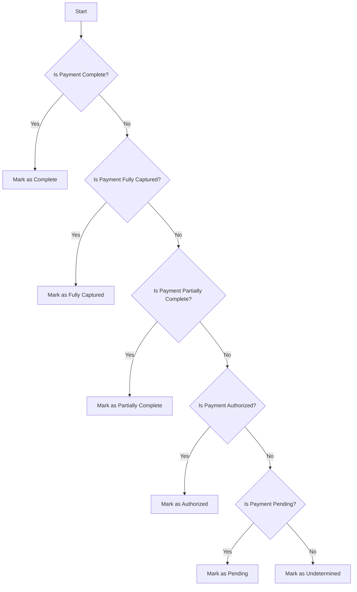

This document will cover the process of determining the payment status of an order. We'll cover:

1. Checking if the payment is complete
2. Checking if the payment is fully captured
3. Checking if the payment is partially complete
4. Checking if the payment is authorized
5. Checking if the payment is pending
6. Marking the payment status as undetermined if none of the conditions are met.

Technical document: <SwmLink doc-title="Determining Order Payment Status">[Determining Order Payment Status](/.swm/determining-order-payment-status.cbei6yu4.sw.md)</SwmLink>

# [Checking if the payment is complete](https://app.swimm.io/repos/Z2l0aHViJTNBJTNBQnJvYWRsZWFmQ29tbWVyY2UtZGVtby1uZXclM0ElM0FTd2ltbS1EZW1v/docs/cbei6yu4#determinecomplete)

The first step in determining the payment status is to check if the payment is complete. This involves looking for successful reverse authorization or detached credit transactions. Additionally, it compares the total authorized amount with the total voided or refunded amount. If the total authorized amount equals the total voided or refunded amount, the payment is marked as complete.

# [Checking if the payment is fully captured](https://app.swimm.io/repos/Z2l0aHViJTNBJTNBQnJvYWRsZWFmQ29tbWVyY2UtZGVtby1uZXclM0ElM0FTd2ltbS1EZW1v/docs/cbei6yu4#determinefullycaptured)

If the payment is not complete, the next step is to check if it is fully captured. This involves comparing the total authorized amount with the total captured amount. If the total authorized amount equals the total captured amount, the payment is marked as fully captured.

# [Checking if the payment is partially complete](https://app.swimm.io/repos/Z2l0aHViJTNBJTNBQnJvYWRsZWFmQ29tbWVyY2UtZGVtby1uZXclM0ElM0FTd2ltbS1EZW1v/docs/cbei6yu4#determinepartiallycomplete)

If the payment is neither complete nor fully captured, the next step is to check if it is partially complete. This involves evaluating various conditions, such as the presence of refunds, voids, and captures. If any of these conditions are met, the payment is marked as partially complete.

# [Checking if the payment is authorized](https://app.swimm.io/repos/Z2l0aHViJTNBJTNBQnJvYWRsZWFmQ29tbWVyY2UtZGVtby1uZXclM0ElM0FTd2ltbS1EZW1v/docs/cbei6yu4#determineauthorized)

If the payment is not partially complete, the next step is to check if it is authorized. This involves verifying that the payment is not fully captured and contains a successful authorization transaction. If these conditions are met, the payment is marked as authorized.

# [Checking if the payment is pending](https://app.swimm.io/repos/Z2l0aHViJTNBJTNBQnJvYWRsZWFmQ29tbWVyY2UtZGVtby1uZXclM0ElM0FTd2ltbS1EZW1v/docs/cbei6yu4#determinepending)

If the payment is not authorized, the next step is to check if it is pending. This involves ensuring that the payment is neither authorized nor fully captured but contains a successful pending transaction. If these conditions are met, the payment is marked as pending.

# [Marking the payment status as undetermined](https://app.swimm.io/repos/Z2l0aHViJTNBJTNBQnJvYWRsZWFmQ29tbWVyY2UtZGVtby1uZXclM0ElM0FTd2ltbS1EZW1v/docs/cbei6yu4#determineorderpaymentstatus)

If none of the above conditions are met, the payment status is marked as undetermined. This indicates that the payment status could not be classified based on the available information.

&nbsp;

*This is an auto-generated document by Swimm AI 🌊 and has not yet been verified by a human*

<SwmMeta version="3.0.0" repo-id="Z2l0aHViJTNBJTNBQnJvYWRsZWFmQ29tbWVyY2UtZGVtby1uZXclM0ElM0FTd2ltbS1EZW1v" repo-name="BroadleafCommerce-demo-new" doc-type="product-flows">Powered by [Swimm](/)</SwmMeta>
