In this document, we will explain the process of determining the payment status of an order. The process involves checking various conditions to classify the payment status accurately.

The flow starts by checking if the payment is complete. If not, it checks if the payment is fully captured. If that is also not the case, it then checks if the payment is partially complete. If none of these conditions are met, it checks if the payment is authorized. If the payment is not authorized, it checks if it is pending. If none of these conditions apply, the payment status is marked as undetermined.

# Flow drill down

```mermaid
graph TD;
      subgraph core/broadleaf-framework/src/main/java/org/broadleafcommerce/core/payment/service/OrderPaymentStatusServiceImpl.java
8f5b8f91270c1727caa17b1931c59e4e90d6c44dbe749fc127aa5fe926886aa8(determineOrderPaymentStatus):::mainFlowStyle --> 0a0669ae93ea6884a6f74ae382da1edd35f4abe03d05a7a31096812761e819dd(determinePending)
end

subgraph core/broadleaf-framework/src/main/java/org/broadleafcommerce/core/payment/service/OrderPaymentStatusServiceImpl.java
8f5b8f91270c1727caa17b1931c59e4e90d6c44dbe749fc127aa5fe926886aa8(determineOrderPaymentStatus):::mainFlowStyle --> 79d2ad025acea046d70c54504a8c3052e9d210bbb21034af7bfd72dcb54f0a9b(determineAuthorized)
end

subgraph core/broadleaf-framework/src/main/java/org/broadleafcommerce/core/payment/service/OrderPaymentStatusServiceImpl.java
8f5b8f91270c1727caa17b1931c59e4e90d6c44dbe749fc127aa5fe926886aa8(determineOrderPaymentStatus):::mainFlowStyle --> d5644ffc884e52d934a493922b232bb5c0b81150404bd00e1e9bc6a63a2571b3(determineFullyCaptured)
end

subgraph core/broadleaf-framework/src/main/java/org/broadleafcommerce/core/payment/service/OrderPaymentStatusServiceImpl.java
8f5b8f91270c1727caa17b1931c59e4e90d6c44dbe749fc127aa5fe926886aa8(determineOrderPaymentStatus):::mainFlowStyle --> de3b5ade3962c1fa254f4d68c70f6fc36f78bd9c618baa8ee209f52e8322fb95(determinePartiallyComplete):::mainFlowStyle
end

subgraph core/broadleaf-framework/src/main/java/org/broadleafcommerce/core/payment/service/OrderPaymentStatusServiceImpl.java
de3b5ade3962c1fa254f4d68c70f6fc36f78bd9c618baa8ee209f52e8322fb95(determinePartiallyComplete):::mainFlowStyle --> 22edea278e0fa9e01889ca4a29d7462298ec7df7bc55ff89ab600bd56f9fe241(determineComplete):::mainFlowStyle
end

subgraph core/broadleaf-framework/src/main/java/org/broadleafcommerce/core/payment/service/OrderPaymentStatusServiceImpl.java
79d2ad025acea046d70c54504a8c3052e9d210bbb21034af7bfd72dcb54f0a9b(determineAuthorized) --> d5644ffc884e52d934a493922b232bb5c0b81150404bd00e1e9bc6a63a2571b3(determineFullyCaptured)
end

subgraph core/broadleaf-framework/src/main/java/org/broadleafcommerce/core/payment/service/OrderPaymentStatusServiceImpl.java
0a0669ae93ea6884a6f74ae382da1edd35f4abe03d05a7a31096812761e819dd(determinePending) --> 79d2ad025acea046d70c54504a8c3052e9d210bbb21034af7bfd72dcb54f0a9b(determineAuthorized)
end


      classDef mainFlowStyle color:#000000,fill:#7CB9F4
classDef rootsStyle color:#000000,fill:#00FFF4
classDef Style1 color:#000000,fill:#00FFAA
classDef Style2 color:#000000,fill:#FFFF00
classDef Style3 color:#000000,fill:#AA7CB9

%% Swimm:
%% graph TD;
%%       subgraph <SwmPath>[core/broadleaf-framework/src/main/java/org/broadleafcommerce/core/payment/service/OrderPaymentStatusServiceImpl.java](core/broadleaf-framework/src/main/java/org/broadleafcommerce/core/payment/service/OrderPaymentStatusServiceImpl.java)</SwmPath>
%% 8f5b8f91270c1727caa17b1931c59e4e90d6c44dbe749fc127aa5fe926886aa8(determineOrderPaymentStatus):::mainFlowStyle --> 0a0669ae93ea6884a6f74ae382da1edd35f4abe03d05a7a31096812761e819dd(determinePending)
%% end
%% 
%% subgraph <SwmPath>[core/broadleaf-framework/src/main/java/org/broadleafcommerce/core/payment/service/OrderPaymentStatusServiceImpl.java](core/broadleaf-framework/src/main/java/org/broadleafcommerce/core/payment/service/OrderPaymentStatusServiceImpl.java)</SwmPath>
%% 8f5b8f91270c1727caa17b1931c59e4e90d6c44dbe749fc127aa5fe926886aa8(determineOrderPaymentStatus):::mainFlowStyle --> 79d2ad025acea046d70c54504a8c3052e9d210bbb21034af7bfd72dcb54f0a9b(determineAuthorized)
%% end
%% 
%% subgraph <SwmPath>[core/broadleaf-framework/src/main/java/org/broadleafcommerce/core/payment/service/OrderPaymentStatusServiceImpl.java](core/broadleaf-framework/src/main/java/org/broadleafcommerce/core/payment/service/OrderPaymentStatusServiceImpl.java)</SwmPath>
%% 8f5b8f91270c1727caa17b1931c59e4e90d6c44dbe749fc127aa5fe926886aa8(determineOrderPaymentStatus):::mainFlowStyle --> d5644ffc884e52d934a493922b232bb5c0b81150404bd00e1e9bc6a63a2571b3(determineFullyCaptured)
%% end
%% 
%% subgraph <SwmPath>[core/broadleaf-framework/src/main/java/org/broadleafcommerce/core/payment/service/OrderPaymentStatusServiceImpl.java](core/broadleaf-framework/src/main/java/org/broadleafcommerce/core/payment/service/OrderPaymentStatusServiceImpl.java)</SwmPath>
%% 8f5b8f91270c1727caa17b1931c59e4e90d6c44dbe749fc127aa5fe926886aa8(determineOrderPaymentStatus):::mainFlowStyle --> de3b5ade3962c1fa254f4d68c70f6fc36f78bd9c618baa8ee209f52e8322fb95(determinePartiallyComplete):::mainFlowStyle
%% end
%% 
%% subgraph <SwmPath>[core/broadleaf-framework/src/main/java/org/broadleafcommerce/core/payment/service/OrderPaymentStatusServiceImpl.java](core/broadleaf-framework/src/main/java/org/broadleafcommerce/core/payment/service/OrderPaymentStatusServiceImpl.java)</SwmPath>
%% de3b5ade3962c1fa254f4d68c70f6fc36f78bd9c618baa8ee209f52e8322fb95(determinePartiallyComplete):::mainFlowStyle --> 22edea278e0fa9e01889ca4a29d7462298ec7df7bc55ff89ab600bd56f9fe241(determineComplete):::mainFlowStyle
%% end
%% 
%% subgraph <SwmPath>[core/broadleaf-framework/src/main/java/org/broadleafcommerce/core/payment/service/OrderPaymentStatusServiceImpl.java](core/broadleaf-framework/src/main/java/org/broadleafcommerce/core/payment/service/OrderPaymentStatusServiceImpl.java)</SwmPath>
%% 79d2ad025acea046d70c54504a8c3052e9d210bbb21034af7bfd72dcb54f0a9b(determineAuthorized) --> d5644ffc884e52d934a493922b232bb5c0b81150404bd00e1e9bc6a63a2571b3(determineFullyCaptured)
%% end
%% 
%% subgraph <SwmPath>[core/broadleaf-framework/src/main/java/org/broadleafcommerce/core/payment/service/OrderPaymentStatusServiceImpl.java](core/broadleaf-framework/src/main/java/org/broadleafcommerce/core/payment/service/OrderPaymentStatusServiceImpl.java)</SwmPath>
%% 0a0669ae93ea6884a6f74ae382da1edd35f4abe03d05a7a31096812761e819dd(determinePending) --> 79d2ad025acea046d70c54504a8c3052e9d210bbb21034af7bfd72dcb54f0a9b(determineAuthorized)
%% end
%% 
%% 
%%       classDef mainFlowStyle color:#000000,fill:#7CB9F4
%% classDef rootsStyle color:#000000,fill:#00FFF4
%% classDef Style1 color:#000000,fill:#00FFAA
%% classDef Style2 color:#000000,fill:#FFFF00
%% classDef Style3 color:#000000,fill:#AA7CB9
```



<SwmSnippet path="/core/broadleaf-framework/src/main/java/org/broadleafcommerce/core/payment/service/OrderPaymentStatusServiceImpl.java" line="32">

---

## <SwmToken path="core/broadleaf-framework/src/main/java/org/broadleafcommerce/core/payment/service/OrderPaymentStatusServiceImpl.java" pos="33:5:5" line-data="    public OrderPaymentStatus determineOrderPaymentStatus(OrderPayment orderPayment) {">`determineOrderPaymentStatus`</SwmToken>

The <SwmToken path="core/broadleaf-framework/src/main/java/org/broadleafcommerce/core/payment/service/OrderPaymentStatusServiceImpl.java" pos="33:5:5" line-data="    public OrderPaymentStatus determineOrderPaymentStatus(OrderPayment orderPayment) {">`determineOrderPaymentStatus`</SwmToken> method orchestrates the determination of the payment status for an order. It sequentially checks various conditions by invoking helper methods like <SwmToken path="core/broadleaf-framework/src/main/java/org/broadleafcommerce/core/payment/service/OrderPaymentStatusServiceImpl.java" pos="35:4:4" line-data="        if (determineComplete(orderPayment)) {">`determineComplete`</SwmToken>, <SwmToken path="core/broadleaf-framework/src/main/java/org/broadleafcommerce/core/payment/service/OrderPaymentStatusServiceImpl.java" pos="37:7:7" line-data="        }else if (determineFullyCaptured(orderPayment)) {">`determineFullyCaptured`</SwmToken>, <SwmToken path="core/broadleaf-framework/src/main/java/org/broadleafcommerce/core/payment/service/OrderPaymentStatusServiceImpl.java" pos="39:8:8" line-data="        } else if (determinePartiallyComplete(orderPayment)) {">`determinePartiallyComplete`</SwmToken>, <SwmToken path="core/broadleaf-framework/src/main/java/org/broadleafcommerce/core/payment/service/OrderPaymentStatusServiceImpl.java" pos="41:8:8" line-data="        } else if (determineAuthorized(orderPayment)) {">`determineAuthorized`</SwmToken>, and <SwmToken path="core/broadleaf-framework/src/main/java/org/broadleafcommerce/core/payment/service/OrderPaymentStatusServiceImpl.java" pos="43:8:8" line-data="        } else if (determinePending(orderPayment)) {">`determinePending`</SwmToken>. Based on the results of these checks, it returns the appropriate <SwmToken path="core/broadleaf-framework/src/main/java/org/broadleafcommerce/core/payment/service/OrderPaymentStatusServiceImpl.java" pos="33:3:3" line-data="    public OrderPaymentStatus determineOrderPaymentStatus(OrderPayment orderPayment) {">`OrderPaymentStatus`</SwmToken>.

```java
    @Override
    public OrderPaymentStatus determineOrderPaymentStatus(OrderPayment orderPayment) {

        if (determineComplete(orderPayment)) {
            return OrderPaymentStatus.COMPLETE;
        }else if (determineFullyCaptured(orderPayment)) {
            return OrderPaymentStatus.FULLY_CAPTURED;
        } else if (determinePartiallyComplete(orderPayment)) {
            return OrderPaymentStatus.PARTIALLY_COMPLETE;
        } else if (determineAuthorized(orderPayment)) {
            return OrderPaymentStatus.AUTHORIZED;
        } else if (determinePending(orderPayment)) {
            return OrderPaymentStatus.PENDING;
        } else if (determineUnconfirmed(orderPayment)) {
            return OrderPaymentStatus.UNCONFIRMED;
        }

        return OrderPaymentStatus.UNDETERMINED;
    }
```

---

</SwmSnippet>

<SwmSnippet path="/core/broadleaf-framework/src/main/java/org/broadleafcommerce/core/payment/service/OrderPaymentStatusServiceImpl.java" line="108">

---

### <SwmToken path="core/broadleaf-framework/src/main/java/org/broadleafcommerce/core/payment/service/OrderPaymentStatusServiceImpl.java" pos="108:5:5" line-data="    protected boolean determinePending(OrderPayment payment) {">`determinePending`</SwmToken>

The <SwmToken path="core/broadleaf-framework/src/main/java/org/broadleafcommerce/core/payment/service/OrderPaymentStatusServiceImpl.java" pos="108:5:5" line-data="    protected boolean determinePending(OrderPayment payment) {">`determinePending`</SwmToken> method checks if the payment is in a pending state. It ensures that the payment is neither authorized nor fully captured but contains a successful pending transaction.

```java
    protected boolean determinePending(OrderPayment payment) {
        return !determineAuthorized(payment) &&
                !containsSuccessfulType(payment, PaymentTransactionType.AUTHORIZE_AND_CAPTURE) &&
                containsSuccessfulType(payment, PaymentTransactionType.PENDING);
    }
```

---

</SwmSnippet>

<SwmSnippet path="/core/broadleaf-framework/src/main/java/org/broadleafcommerce/core/payment/service/OrderPaymentStatusServiceImpl.java" line="104">

---

### <SwmToken path="core/broadleaf-framework/src/main/java/org/broadleafcommerce/core/payment/service/OrderPaymentStatusServiceImpl.java" pos="104:5:5" line-data="    protected boolean determineAuthorized(OrderPayment payment) {">`determineAuthorized`</SwmToken>

The <SwmToken path="core/broadleaf-framework/src/main/java/org/broadleafcommerce/core/payment/service/OrderPaymentStatusServiceImpl.java" pos="104:5:5" line-data="    protected boolean determineAuthorized(OrderPayment payment) {">`determineAuthorized`</SwmToken> method checks if the payment is authorized. It verifies that the payment is not fully captured and contains a successful authorization transaction.

```java
    protected boolean determineAuthorized(OrderPayment payment) {
        return !determineFullyCaptured(payment) && containsSuccessfulType(payment, PaymentTransactionType.AUTHORIZE);
    }
```

---

</SwmSnippet>

<SwmSnippet path="/core/broadleaf-framework/src/main/java/org/broadleafcommerce/core/payment/service/OrderPaymentStatusServiceImpl.java" line="96">

---

### <SwmToken path="core/broadleaf-framework/src/main/java/org/broadleafcommerce/core/payment/service/OrderPaymentStatusServiceImpl.java" pos="96:5:5" line-data="    protected boolean determineFullyCaptured(OrderPayment payment) {">`determineFullyCaptured`</SwmToken>

The <SwmToken path="core/broadleaf-framework/src/main/java/org/broadleafcommerce/core/payment/service/OrderPaymentStatusServiceImpl.java" pos="96:5:5" line-data="    protected boolean determineFullyCaptured(OrderPayment payment) {">`determineFullyCaptured`</SwmToken> method checks if the payment is fully captured. It compares the total authorized amount with the total captured amount to determine if the payment is fully captured.

```java
    protected boolean determineFullyCaptured(OrderPayment payment) {
        Money fullAuthAmount = payment.getSuccessfulTransactionAmountForType(PaymentTransactionType.AUTHORIZE);
        Money fullCaptureAmount = payment.getSuccessfulTransactionAmountForType(PaymentTransactionType.CAPTURE);

        return containsSuccessfulType(payment, PaymentTransactionType.AUTHORIZE_AND_CAPTURE) ||
                (fullAuthAmount.greaterThan(Money.ZERO) && fullAuthAmount.equals(fullCaptureAmount));
    }
```

---

</SwmSnippet>

<SwmSnippet path="/core/broadleaf-framework/src/main/java/org/broadleafcommerce/core/payment/service/OrderPaymentStatusServiceImpl.java" line="82">

---

### <SwmToken path="core/broadleaf-framework/src/main/java/org/broadleafcommerce/core/payment/service/OrderPaymentStatusServiceImpl.java" pos="82:5:5" line-data="    protected boolean determinePartiallyComplete(OrderPayment payment) {">`determinePartiallyComplete`</SwmToken>

The <SwmToken path="core/broadleaf-framework/src/main/java/org/broadleafcommerce/core/payment/service/OrderPaymentStatusServiceImpl.java" pos="82:5:5" line-data="    protected boolean determinePartiallyComplete(OrderPayment payment) {">`determinePartiallyComplete`</SwmToken> method checks if the payment is partially complete. It evaluates various conditions, such as the presence of refunds, voids, and captures, to determine if the payment is partially complete.

```java
    protected boolean determinePartiallyComplete(OrderPayment payment) {
        Money fullAuthAmount = payment.getSuccessfulTransactionAmountForType(PaymentTransactionType.AUTHORIZE);
        Money fullCaptureAmount = payment.getSuccessfulTransactionAmountForType(PaymentTransactionType.CAPTURE);
        Money totalVoidAmount = payment.getSuccessfulTransactionAmountForType(PaymentTransactionType.VOID);
        Money totalRefundAmount = payment.getSuccessfulTransactionAmountForType(PaymentTransactionType.REFUND);

        return !determineComplete(payment) &&
                ((totalRefundAmount.greaterThan(Money.ZERO) && fullAuthAmount.greaterThan(totalRefundAmount)) ||
                 (totalVoidAmount.greaterThan(Money.ZERO) && fullAuthAmount.greaterThan(totalVoidAmount)) ||
                        (containsSuccessfulType(payment, PaymentTransactionType.CAPTURE) &&
                         fullAuthAmount.greaterThan(Money.ZERO) &&
                         fullAuthAmount.greaterThan(fullCaptureAmount)));
    }
```

---

</SwmSnippet>

<SwmSnippet path="/core/broadleaf-framework/src/main/java/org/broadleafcommerce/core/payment/service/OrderPaymentStatusServiceImpl.java" line="63">

---

### <SwmToken path="core/broadleaf-framework/src/main/java/org/broadleafcommerce/core/payment/service/OrderPaymentStatusServiceImpl.java" pos="63:5:5" line-data="    protected boolean determineComplete(OrderPayment payment) {">`determineComplete`</SwmToken>

The <SwmToken path="core/broadleaf-framework/src/main/java/org/broadleafcommerce/core/payment/service/OrderPaymentStatusServiceImpl.java" pos="63:5:5" line-data="    protected boolean determineComplete(OrderPayment payment) {">`determineComplete`</SwmToken> method checks if the payment is complete. It looks for successful reverse authorization or detached credit transactions and compares the total authorized amount with the total voided or refunded amount to determine if the payment is complete.

```java
    protected boolean determineComplete(OrderPayment payment) {
        List<PaymentTransaction> txs = new ArrayList<>();
        txs.addAll(payment.getTransactionsForType(PaymentTransactionType.REVERSE_AUTH));
        txs.addAll(payment.getTransactionsForType(PaymentTransactionType.DETACHED_CREDIT));
        for (PaymentTransaction tx : txs) {
            if (tx.getSuccess()) {
                return true;
            }
        }

        Money fullAuthAmount = payment.getSuccessfulTransactionAmountForType(PaymentTransactionType.AUTHORIZE_AND_CAPTURE)
                .add(payment.getSuccessfulTransactionAmountForType(PaymentTransactionType.AUTHORIZE));
        Money totalVoidAmount = payment.getSuccessfulTransactionAmountForType(PaymentTransactionType.VOID);
        Money totalRefundAmount = payment.getSuccessfulTransactionAmountForType(PaymentTransactionType.REFUND);

        return fullAuthAmount.greaterThan(Money.ZERO) &&
                (fullAuthAmount.equals(totalRefundAmount) || fullAuthAmount.equals(totalVoidAmount));
    }
```

---

</SwmSnippet>

# Where is this flow used?

This flow is used multiple times in the codebase as represented in the following diagram:

(Note - these are only some of the entry points of this flow)

```mermaid
graph TD;
      subgraph core/broadleaf-framework/src/main/java/org/broadleafcommerce/core/payment/service
bcc1bbb2eb9ee6f2b5ee38a88da4d462003ef5d80f0cfdded471d32049bf4407(execute):::rootsStyle --> 8f5b8f91270c1727caa17b1931c59e4e90d6c44dbe749fc127aa5fe926886aa8(determineOrderPaymentStatus):::mainFlowStyle
end

subgraph core/broadleaf-framework/src/main/java/org/broadleafcommerce/core/checkout/service
9cb7e8b55d63588ec9e0f347f5452706c4a8ed4b7cce186e59c7f26f25aae1a3(performCheckout):::rootsStyle --> 9d7c44cf8b2467d088facc6dc5ee2cdc5f6530fb83fe091ee2aa7d7fe7215d1f(hasOrderBeenCompleted)
end

subgraph core/broadleaf-framework/src/main/java/org/broadleafcommerce/core/payment/domain/OrderPaymentImpl.java
9d7c44cf8b2467d088facc6dc5ee2cdc5f6530fb83fe091ee2aa7d7fe7215d1f(hasOrderBeenCompleted) --> 115c1bc616ec800b38ee07b9b407f8dd8cde23a33c3649cb0ee3ef8c982e6fa2(getStatus)
end

subgraph core/broadleaf-framework/src/main/java/org/broadleafcommerce/core/payment/service
115c1bc616ec800b38ee07b9b407f8dd8cde23a33c3649cb0ee3ef8c982e6fa2(getStatus) --> 8f5b8f91270c1727caa17b1931c59e4e90d6c44dbe749fc127aa5fe926886aa8(determineOrderPaymentStatus):::mainFlowStyle
end

subgraph core/broadleaf-framework-web/src/main/java/org/broadleafcommerce/core/web/order/security
c790c7e80698127dcdc435fdeff047d524eda12d285e7c6467f6717aa4a58897(doFilterInternalUnlessIgnored):::rootsStyle --> 61f9943a955b19bc03997c0147c589192c708d4ec571ac1c931df6d88cc5c1a0(process)
end

subgraph core/broadleaf-framework-web/src/main/java/org/broadleafcommerce/core/web/order/security
61f9943a955b19bc03997c0147c589192c708d4ec571ac1c931df6d88cc5c1a0(process) --> 33d05f4a0fa71453413892f693fb928870181739d3eda71d3b8d15a7d41f02a4(getOverrideCart)
end

subgraph core/broadleaf-framework/src/main/java/org/broadleafcommerce/core/payment/domain/OrderPaymentImpl.java
33d05f4a0fa71453413892f693fb928870181739d3eda71d3b8d15a7d41f02a4(getOverrideCart) --> 115c1bc616ec800b38ee07b9b407f8dd8cde23a33c3649cb0ee3ef8c982e6fa2(getStatus)
end

subgraph core/broadleaf-framework/src/main/java/org/broadleafcommerce/core/payment/domain/OrderPaymentImpl.java
a086447957858a1d6ec8c2b23dc0988a64ac41c44cf6ab3eef6a1562103a6232(applyPaymentToOrder):::rootsStyle --> 115c1bc616ec800b38ee07b9b407f8dd8cde23a33c3649cb0ee3ef8c982e6fa2(getStatus)
end

subgraph core/broadleaf-framework-web/src/main/java/org/broadleafcommerce/core/web/order/security
72c459dd143536d7e1530c932b1b40d5f201eae08665075029babff93a53240b(preHandle):::rootsStyle --> 61f9943a955b19bc03997c0147c589192c708d4ec571ac1c931df6d88cc5c1a0(process)
end


      classDef mainFlowStyle color:#000000,fill:#7CB9F4
classDef rootsStyle color:#000000,fill:#00FFF4
classDef Style1 color:#000000,fill:#00FFAA
classDef Style2 color:#000000,fill:#FFFF00
classDef Style3 color:#000000,fill:#AA7CB9

%% Swimm:
%% graph TD;
%%       subgraph <SwmPath>[core/broadleaf-framework/src/main/java/org/broadleafcommerce/core/payment/service/](core/broadleaf-framework/src/main/java/org/broadleafcommerce/core/payment/service/)</SwmPath>
%% bcc1bbb2eb9ee6f2b5ee38a88da4d462003ef5d80f0cfdded471d32049bf4407(execute):::rootsStyle --> 8f5b8f91270c1727caa17b1931c59e4e90d6c44dbe749fc127aa5fe926886aa8(determineOrderPaymentStatus):::mainFlowStyle
%% end
%% 
%% subgraph <SwmPath>[core/broadleaf-framework/src/main/java/org/broadleafcommerce/core/checkout/service/](core/broadleaf-framework/src/main/java/org/broadleafcommerce/core/checkout/service/)</SwmPath>
%% 9cb7e8b55d63588ec9e0f347f5452706c4a8ed4b7cce186e59c7f26f25aae1a3(performCheckout):::rootsStyle --> 9d7c44cf8b2467d088facc6dc5ee2cdc5f6530fb83fe091ee2aa7d7fe7215d1f(hasOrderBeenCompleted)
%% end
%% 
%% subgraph <SwmPath>[core/broadleaf-framework/src/main/java/org/broadleafcommerce/core/payment/domain/OrderPaymentImpl.java](core/broadleaf-framework/src/main/java/org/broadleafcommerce/core/payment/domain/OrderPaymentImpl.java)</SwmPath>
%% 9d7c44cf8b2467d088facc6dc5ee2cdc5f6530fb83fe091ee2aa7d7fe7215d1f(hasOrderBeenCompleted) --> 115c1bc616ec800b38ee07b9b407f8dd8cde23a33c3649cb0ee3ef8c982e6fa2(getStatus)
%% end
%% 
%% subgraph <SwmPath>[core/broadleaf-framework/src/main/java/org/broadleafcommerce/core/payment/service/](core/broadleaf-framework/src/main/java/org/broadleafcommerce/core/payment/service/)</SwmPath>
%% 115c1bc616ec800b38ee07b9b407f8dd8cde23a33c3649cb0ee3ef8c982e6fa2(getStatus) --> 8f5b8f91270c1727caa17b1931c59e4e90d6c44dbe749fc127aa5fe926886aa8(determineOrderPaymentStatus):::mainFlowStyle
%% end
%% 
%% subgraph <SwmPath>[core/broadleaf-framework-web/src/main/java/org/broadleafcommerce/core/web/order/security/](core/broadleaf-framework-web/src/main/java/org/broadleafcommerce/core/web/order/security/)</SwmPath>
%% c790c7e80698127dcdc435fdeff047d524eda12d285e7c6467f6717aa4a58897(doFilterInternalUnlessIgnored):::rootsStyle --> 61f9943a955b19bc03997c0147c589192c708d4ec571ac1c931df6d88cc5c1a0(process)
%% end
%% 
%% subgraph <SwmPath>[core/broadleaf-framework-web/src/main/java/org/broadleafcommerce/core/web/order/security/](core/broadleaf-framework-web/src/main/java/org/broadleafcommerce/core/web/order/security/)</SwmPath>
%% 61f9943a955b19bc03997c0147c589192c708d4ec571ac1c931df6d88cc5c1a0(process) --> 33d05f4a0fa71453413892f693fb928870181739d3eda71d3b8d15a7d41f02a4(getOverrideCart)
%% end
%% 
%% subgraph <SwmPath>[core/broadleaf-framework/src/main/java/org/broadleafcommerce/core/payment/domain/OrderPaymentImpl.java](core/broadleaf-framework/src/main/java/org/broadleafcommerce/core/payment/domain/OrderPaymentImpl.java)</SwmPath>
%% 33d05f4a0fa71453413892f693fb928870181739d3eda71d3b8d15a7d41f02a4(getOverrideCart) --> 115c1bc616ec800b38ee07b9b407f8dd8cde23a33c3649cb0ee3ef8c982e6fa2(getStatus)
%% end
%% 
%% subgraph <SwmPath>[core/broadleaf-framework/src/main/java/org/broadleafcommerce/core/payment/domain/OrderPaymentImpl.java](core/broadleaf-framework/src/main/java/org/broadleafcommerce/core/payment/domain/OrderPaymentImpl.java)</SwmPath>
%% a086447957858a1d6ec8c2b23dc0988a64ac41c44cf6ab3eef6a1562103a6232(applyPaymentToOrder):::rootsStyle --> 115c1bc616ec800b38ee07b9b407f8dd8cde23a33c3649cb0ee3ef8c982e6fa2(getStatus)
%% end
%% 
%% subgraph <SwmPath>[core/broadleaf-framework-web/src/main/java/org/broadleafcommerce/core/web/order/security/](core/broadleaf-framework-web/src/main/java/org/broadleafcommerce/core/web/order/security/)</SwmPath>
%% 72c459dd143536d7e1530c932b1b40d5f201eae08665075029babff93a53240b(preHandle):::rootsStyle --> 61f9943a955b19bc03997c0147c589192c708d4ec571ac1c931df6d88cc5c1a0(process)
%% end
%% 
%% 
%%       classDef mainFlowStyle color:#000000,fill:#7CB9F4
%% classDef rootsStyle color:#000000,fill:#00FFF4
%% classDef Style1 color:#000000,fill:#00FFAA
%% classDef Style2 color:#000000,fill:#FFFF00
%% classDef Style3 color:#000000,fill:#AA7CB9
```



&nbsp;

*This is an auto-generated document by Swimm AI 🌊 and has not yet been verified by a human*

<SwmMeta version="3.0.0" repo-id="Z2l0aHViJTNBJTNBQnJvYWRsZWFmQ29tbWVyY2UtZGVtby1uZXclM0ElM0FTd2ltbS1EZW1v" repo-name="BroadleafCommerce-demo-new" doc-type="flows"><sup>Powered by [Swimm](/)</sup></SwmMeta>
