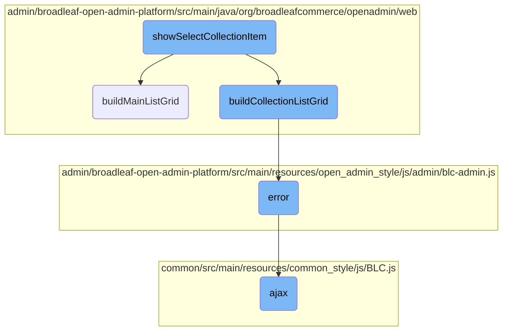

In this document, we will explain the process of displaying a modal dialog that allows users to select an item from a <SwmToken path="admin/broadleaf-open-admin-platform/src/main/java/org/broadleafcommerce/openadmin/web/controller/entity/AdminBasicOperationsController.java" pos="77:24:26" line-data="     * Shows the modal dialog that is used to select a &quot;to-one&quot; collection item. For example, this could be used to show">`to-one`</SwmToken> collection. This process involves several steps, including building the main list grid, handling errors, and making AJAX requests.

The flow starts with displaying a modal dialog where users can select an item from a collection. Depending on the type of field, it either builds a main list grid or a collection list grid. If any errors occur during this process, they are handled by an error function. Finally, an AJAX request is made to fetch the necessary data for the modal dialog.

# Flow drill down



<SwmSnippet path="/admin/broadleaf-open-admin-platform/src/main/java/org/broadleafcommerce/openadmin/web/controller/entity/AdminBasicOperationsController.java" line="76">

---

## <SwmToken path="admin/broadleaf-open-admin-platform/src/main/java/org/broadleafcommerce/openadmin/web/controller/entity/AdminBasicOperationsController.java" pos="90:5:5" line-data="    public String showSelectCollectionItem(HttpServletRequest request, HttpServletResponse response, Model model,">`showSelectCollectionItem`</SwmToken>

The <SwmToken path="admin/broadleaf-open-admin-platform/src/main/java/org/broadleafcommerce/openadmin/web/controller/entity/AdminBasicOperationsController.java" pos="90:5:5" line-data="    public String showSelectCollectionItem(HttpServletRequest request, HttpServletResponse response, Model model,">`showSelectCollectionItem`</SwmToken> function is responsible for displaying a modal dialog that allows users to select an item from a <SwmToken path="admin/broadleaf-open-admin-platform/src/main/java/org/broadleafcommerce/openadmin/web/controller/entity/AdminBasicOperationsController.java" pos="77:24:26" line-data="     * Shows the modal dialog that is used to select a &quot;to-one&quot; collection item. For example, this could be used to show">`to-one`</SwmToken> collection. This is particularly useful for fields like <SwmToken path="admin/broadleaf-open-admin-platform/src/main/java/org/broadleafcommerce/openadmin/web/controller/entity/AdminBasicOperationsController.java" pos="78:20:20" line-data="     * a list of categories for the ManyToOne field &quot;defaultCategory&quot; in Product.">`defaultCategory`</SwmToken> in a Product entity. The function builds a <SwmToken path="admin/broadleaf-open-admin-platform/src/main/java/org/broadleafcommerce/openadmin/web/service/FormBuilderServiceImpl.java" pos="419:1:1" line-data="        PersistencePackageRequest ppr = PersistencePackageRequest.fromMetadata(fmd, sectionCrumbs);">`PersistencePackageRequest`</SwmToken> to fetch metadata and records, which are then used to construct a <SwmToken path="admin/broadleaf-open-admin-platform/src/main/java/org/broadleafcommerce/openadmin/web/service/FormBuilderServiceImpl.java" pos="205:3:3" line-data="    public ListGrid buildMainListGrid(DynamicResultSet drs, ClassMetadata cmd, String sectionKey, List&lt;SectionCrumb&gt; sectionCrumbs)">`ListGrid`</SwmToken> for the modal. Depending on the field type, it either calls <SwmToken path="admin/broadleaf-open-admin-platform/src/main/java/org/broadleafcommerce/openadmin/web/service/FormBuilderServiceImpl.java" pos="205:5:5" line-data="    public ListGrid buildMainListGrid(DynamicResultSet drs, ClassMetadata cmd, String sectionKey, List&lt;SectionCrumb&gt; sectionCrumbs)">`buildMainListGrid`</SwmToken> or <SwmToken path="admin/broadleaf-open-admin-platform/src/main/java/org/broadleafcommerce/openadmin/web/service/FormBuilderServiceImpl.java" pos="414:5:5" line-data="    public ListGrid buildCollectionListGrid(String containingEntityId, DynamicResultSet drs, Property field, ">`buildCollectionListGrid`</SwmToken> to generate the appropriate grid structure.

```java
    /**
     * Shows the modal dialog that is used to select a "to-one" collection item. For example, this could be used to show
     * a list of categories for the ManyToOne field "defaultCategory" in Product.
     * 
     * @param request
     * @param response
     * @param model
     * @param pathVars
     * @param owningClass
     * @param collectionField
     * @return the return view path
     * @throws Exception
     */
    @RequestMapping(value = "/{owningClass:.*}/{collectionField:.*}/select", method = RequestMethod.GET)
    public String showSelectCollectionItem(HttpServletRequest request, HttpServletResponse response, Model model,
            @PathVariable Map<String, String> pathVars,
            @PathVariable(value = "owningClass") String owningClass,
            @PathVariable(value = "collectionField") String collectionField,
            @RequestParam(required = false) String requestingEntityId,
            @RequestParam(defaultValue = "false") boolean dynamicField,
            @RequestParam MultiValueMap<String, String> requestParams) throws Exception {
```

---

</SwmSnippet>

<SwmSnippet path="/admin/broadleaf-open-admin-platform/src/main/java/org/broadleafcommerce/openadmin/web/service/FormBuilderServiceImpl.java" line="204">

---

### <SwmToken path="admin/broadleaf-open-admin-platform/src/main/java/org/broadleafcommerce/openadmin/web/service/FormBuilderServiceImpl.java" pos="205:5:5" line-data="    public ListGrid buildMainListGrid(DynamicResultSet drs, ClassMetadata cmd, String sectionKey, List&lt;SectionCrumb&gt; sectionCrumbs)">`buildMainListGrid`</SwmToken>

The <SwmToken path="admin/broadleaf-open-admin-platform/src/main/java/org/broadleafcommerce/openadmin/web/service/FormBuilderServiceImpl.java" pos="205:5:5" line-data="    public ListGrid buildMainListGrid(DynamicResultSet drs, ClassMetadata cmd, String sectionKey, List&lt;SectionCrumb&gt; sectionCrumbs)">`buildMainListGrid`</SwmToken> function constructs a <SwmToken path="admin/broadleaf-open-admin-platform/src/main/java/org/broadleafcommerce/openadmin/web/service/FormBuilderServiceImpl.java" pos="205:3:3" line-data="    public ListGrid buildMainListGrid(DynamicResultSet drs, ClassMetadata cmd, String sectionKey, List&lt;SectionCrumb&gt; sectionCrumbs)">`ListGrid`</SwmToken> for the main entity list. It processes the metadata to create header fields and sets up the grid's properties, such as the ID property and filter criteria. This grid is used when the collection field is dynamic or contains specific criteria.

```java
    @Override
    public ListGrid buildMainListGrid(DynamicResultSet drs, ClassMetadata cmd, String sectionKey, List<SectionCrumb> sectionCrumbs)
            throws ServiceException {

        List<Field> headerFields = new ArrayList<>();
        ListGrid.Type type = ListGrid.Type.MAIN;
        String idProperty = "id";

        FieldWrapper wrapper = new FieldWrapper();
        ArrayList<FieldDTO> defaultWrapperFields = new ArrayList<>();
        for (Property p : cmd.getProperties()) {
            if (p.getMetadata() instanceof BasicFieldMetadata) {
                BasicFieldMetadata fmd = (BasicFieldMetadata) p.getMetadata();
                
                if (SupportedFieldType.ID.equals(fmd.getFieldType())) {
                    idProperty = fmd.getName();
                }
                
                if (fmd.isProminent() != null && fmd.isProminent() 
                        && !ArrayUtils.contains(getGridHiddenVisibilities(), fmd.getVisibility())) {
                    Field hf = createHeaderField(p, fmd);
```

---

</SwmSnippet>

<SwmSnippet path="/admin/broadleaf-open-admin-platform/src/main/java/org/broadleafcommerce/openadmin/web/service/FormBuilderServiceImpl.java" line="413">

---

### <SwmToken path="admin/broadleaf-open-admin-platform/src/main/java/org/broadleafcommerce/openadmin/web/service/FormBuilderServiceImpl.java" pos="414:5:5" line-data="    public ListGrid buildCollectionListGrid(String containingEntityId, DynamicResultSet drs, Property field, ">`buildCollectionListGrid`</SwmToken>

The <SwmToken path="admin/broadleaf-open-admin-platform/src/main/java/org/broadleafcommerce/openadmin/web/service/FormBuilderServiceImpl.java" pos="414:5:5" line-data="    public ListGrid buildCollectionListGrid(String containingEntityId, DynamicResultSet drs, Property field, ">`buildCollectionListGrid`</SwmToken> function creates a <SwmToken path="admin/broadleaf-open-admin-platform/src/main/java/org/broadleafcommerce/openadmin/web/service/FormBuilderServiceImpl.java" pos="414:3:3" line-data="    public ListGrid buildCollectionListGrid(String containingEntityId, DynamicResultSet drs, Property field, ">`ListGrid`</SwmToken> for a collection field. It handles various field types, including basic fields, adorned target collections, and maps. The function sets up header fields, determines the grid type, and configures properties like editability and sortability.

```java
    @Override
    public ListGrid buildCollectionListGrid(String containingEntityId, DynamicResultSet drs, Property field, 
            String sectionKey, List<SectionCrumb> sectionCrumbs)
            throws ServiceException {
        FieldMetadata fmd = field.getMetadata();
        // Get the class metadata for this particular field
        PersistencePackageRequest ppr = PersistencePackageRequest.fromMetadata(fmd, sectionCrumbs);
        // TODO: 9/27/2022 remove "if (field != null)" or move up before "field.getMetadata()"
        if (field != null) {
            ppr.setSectionEntityField(field.getName());
        }
        ClassMetadata cmd = adminEntityService.getClassMetadata(ppr).getDynamicResultSet().getClassMetaData();

        List<Field> headerFields = new ArrayList<>();
        ListGrid.Type type = null;
        boolean editable = false;
        boolean sortable = false;
        boolean readOnly = false;
        boolean hideIdColumn = false;
        boolean canFilterAndSort = true;
        boolean modalSingleSelectable = false;
```

---

</SwmSnippet>

<SwmSnippet path="/admin/broadleaf-open-admin-platform/src/main/resources/open_admin_style/js/admin/blc-admin.js" line="1178">

---

### error

The <SwmToken path="admin/broadleaf-open-admin-platform/src/main/resources/open_admin_style/js/admin/blc-admin.js" pos="1180:1:1" line-data="                error: function (error) {">`error`</SwmToken> function is a simple error handler for AJAX requests. It is used to handle any errors that occur during the AJAX call initiated by the <SwmToken path="admin/broadleaf-open-admin-platform/src/main/java/org/broadleafcommerce/openadmin/web/controller/entity/AdminBasicOperationsController.java" pos="90:5:5" line-data="    public String showSelectCollectionItem(HttpServletRequest request, HttpServletResponse response, Model model,">`showSelectCollectionItem`</SwmToken> flow.

```javascript
                url: BLC.servletContext + '/update-navigation',
                type: "GET",
                error: function (error) {
                }
```

---

</SwmSnippet>

<SwmSnippet path="/common/src/main/resources/common_style/js/BLC.js" line="135">

---

### ajax

The <SwmToken path="common/src/main/resources/common_style/js/BLC.js" pos="135:3:3" line-data="    function ajax(options, callback) {">`ajax`</SwmToken> function is a utility for making AJAX requests. It sets default options, handles CSRF tokens, and processes the response. This function is used to make the AJAX call in the <SwmToken path="admin/broadleaf-open-admin-platform/src/main/java/org/broadleafcommerce/openadmin/web/controller/entity/AdminBasicOperationsController.java" pos="90:5:5" line-data="    public String showSelectCollectionItem(HttpServletRequest request, HttpServletResponse response, Model model,">`showSelectCollectionItem`</SwmToken> flow.

```javascript
    function ajax(options, callback) {
        if (options.type == null) {
            options.type = 'GET';
        }

        var baseUrl = window.location.href;
        if (baseUrl.indexOf('isPostAdd') != -1) {
            if (options.url.indexOf('isPostAdd') < 0) {
                if (options.url.indexOf('?') > 0) {
                    options.url += "&";
                } else {
                    options.url += "?";
                }
                options.url += "isPostAdd=true";
            }
        }
        var savedCatalogElement = $('input[name ="catalogEntityCatalogDiscriminatorId"]');
        var savedCatalog=null;

        if(savedCatalogElement.length){
            //0 should be the one we need, other can be from the modal form
```

---

</SwmSnippet>

&nbsp;

*This is an auto-generated document by Swimm AI 🌊 and has not yet been verified by a human*

<SwmMeta version="3.0.0" repo-id="Z2l0aHViJTNBJTNBQnJvYWRsZWFmQ29tbWVyY2UtZGVtby1uZXclM0ElM0FTd2ltbS1EZW1v" repo-name="BroadleafCommerce-demo-new" doc-type="flows"><sup>Powered by [Swimm](/)</sup></SwmMeta>
