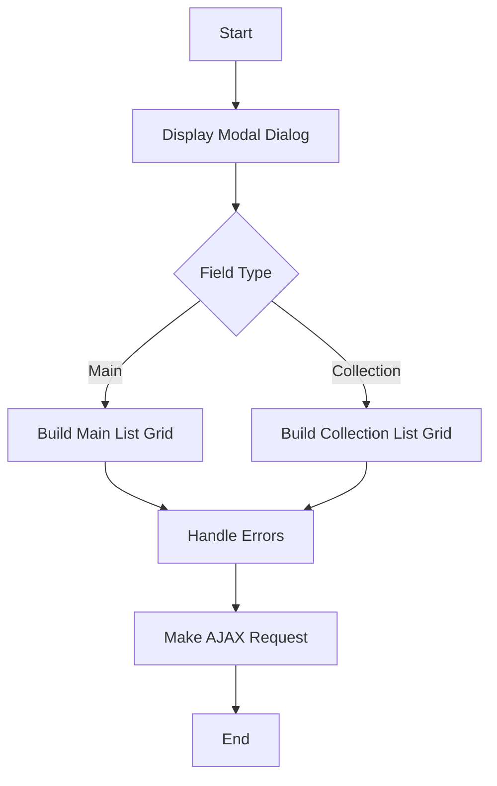

This document will cover the process of displaying a modal dialog for selecting collection items. We'll cover:

1. Displaying the Modal Dialog
2. Building the Main List Grid
3. Building the Collection List Grid
4. Handling Errors
5. Making AJAX Requests

Technical document: <SwmLink doc-title="Displaying a Modal Dialog for Selecting Collection Items">[Displaying a Modal Dialog for Selecting Collection Items](/.swm/displaying-a-modal-dialog-for-selecting-collection-items.8ndz535b.sw.md)</SwmLink>

# [Displaying the Modal Dialog](https://app.swimm.io/repos/Z2l0aHViJTNBJTNBQnJvYWRsZWFmQ29tbWVyY2UtZGVtby1uZXclM0ElM0FTd2ltbS1EZW1v/docs/8ndz535b#showselectcollectionitem)

The process begins with displaying a modal dialog that allows users to select an item from a 'to-one' collection. This is particularly useful for fields like 'defaultCategory' in a Product entity. The modal dialog is designed to provide a user-friendly interface for selecting items, ensuring that users can easily navigate and choose the appropriate item from the collection.

# [Building the Main List Grid](https://app.swimm.io/repos/Z2l0aHViJTNBJTNBQnJvYWRsZWFmQ29tbWVyY2UtZGVtby1uZXclM0ElM0FTd2ltbS1EZW1v/docs/8ndz535b#buildmainlistgrid)

When the field type is dynamic or contains specific criteria, the system builds a Main List Grid. This grid displays the main entity list, processing metadata to create header fields and setting up properties like the ID property and filter criteria. The Main List Grid ensures that users can view and select items based on the defined criteria, providing a structured and organized display of the available options.

# [Building the Collection List Grid](https://app.swimm.io/repos/Z2l0aHViJTNBJTNBQnJvYWRsZWFmQ29tbWVyY2UtZGVtby1uZXclM0ElM0FTd2ltbS1EZW1v/docs/8ndz535b#buildcollectionlistgrid)

For collection fields, the system builds a Collection List Grid. This grid handles various field types, including basic fields, adorned target collections, and maps. It sets up header fields, determines the grid type, and configures properties like editability and sortability. The Collection List Grid provides a comprehensive view of the collection items, allowing users to easily select the desired item from the collection.

# [Handling Errors](https://app.swimm.io/repos/Z2l0aHViJTNBJTNBQnJvYWRsZWFmQ29tbWVyY2UtZGVtby1uZXclM0ElM0FTd2ltbS1EZW1v/docs/8ndz535b#error)

If any errors occur during the process, they are handled by an error function. This function ensures that any issues are promptly addressed, providing feedback to the user and maintaining the integrity of the selection process. Effective error handling is crucial for ensuring a smooth and seamless user experience.

# [Making AJAX Requests](https://app.swimm.io/repos/Z2l0aHViJTNBJTNBQnJvYWRsZWFmQ29tbWVyY2UtZGVtby1uZXclM0ElM0FTd2ltbS1EZW1v/docs/8ndz535b#ajax)

Finally, an AJAX request is made to fetch the necessary data for the modal dialog. This request retrieves the relevant information from the server, ensuring that the modal dialog is populated with the correct data. The AJAX request is essential for dynamically updating the modal dialog based on user interactions, providing a responsive and interactive user experience.

&nbsp;

*This is an auto-generated document by Swimm AI 🌊 and has not yet been verified by a human*

<SwmMeta version="3.0.0" repo-id="Z2l0aHViJTNBJTNBQnJvYWRsZWFmQ29tbWVyY2UtZGVtby1uZXclM0ElM0FTd2ltbS1EZW1v" repo-name="BroadleafCommerce-demo-new" doc-type="product-flows">Powered by [Swimm](/)</SwmMeta>
