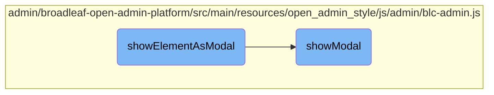

In this document, we will explain the process of displaying an element as a modal. The process involves preparing the element, wrapping it if necessary, appending it to the body, and finally displaying it.

The flow is straightforward and involves a few steps: first, it checks if there is an existing modal and hides it if present. Then, it ensures the element has a proper wrapper inside the modal body. If the element needs to be wrapped in a modal structure, it does so. Finally, it appends the element to the body and calls another function to display it.

# Flow drill down



<SwmSnippet path="/admin/broadleaf-open-admin-platform/src/main/resources/open_admin_style/js/admin/blc-admin.js" line="348">

---

## Displaying an Element as a Modal

The <SwmToken path="admin/broadleaf-open-admin-platform/src/main/resources/open_admin_style/js/admin/blc-admin.js" pos="348:1:1" line-data="        showElementAsModal : function($element, onModalHide, onModalHideArgs) {">`showElementAsModal`</SwmToken> function is responsible for preparing and displaying an element as a modal. It first checks if there is an existing modal with the class <SwmToken path="admin/broadleaf-open-admin-platform/src/main/resources/open_admin_style/js/admin/blc-admin.js" pos="349:25:27" line-data="            if (BLCAdmin.currentModal() != null &amp;&amp; BLCAdmin.currentModal().hasClass(&#39;loading-modal&#39;)) {">`loading-modal`</SwmToken> and hides it if present. Then, it ensures the element has a <SwmToken path="admin/broadleaf-open-admin-platform/src/main/resources/open_admin_style/js/admin/blc-admin.js" pos="353:11:13" line-data="            if (!$element.find(&#39;.content-yield&#39;).length) {">`content-yield`</SwmToken> wrapper inside the modal body. If the element has the class <SwmToken path="admin/broadleaf-open-admin-platform/src/main/resources/open_admin_style/js/admin/blc-admin.js" pos="357:9:13" line-data="            if($element.hasClass(&#39;wrap-in-modal&#39;)) {">`wrap-in-modal`</SwmToken>, it wraps the element in a modal structure. Finally, it appends the element to the body and calls the <SwmToken path="admin/broadleaf-open-admin-platform/src/main/resources/open_admin_style/js/admin/blc-admin.js" pos="361:1:1" line-data="            showModal($element, onModalHide, onModalHideArgs);">`showModal`</SwmToken> function to display it.

```javascript
        showElementAsModal : function($element, onModalHide, onModalHideArgs) {
            if (BLCAdmin.currentModal() != null && BLCAdmin.currentModal().hasClass('loading-modal')) {
                BLCAdmin.hideCurrentModal();
            }

            if (!$element.find('.content-yield').length) {
                var content = $('<div>', { 'class': 'content-yield'});
                $element.find('.modal-body').wrapInner(content);
            }
            if($element.hasClass('wrap-in-modal')) {
                $element = wrapInModal($element);
            }
            $('body').append($element);
            showModal($element, onModalHide, onModalHideArgs);
        },
```

---

</SwmSnippet>

<SwmSnippet path="/admin/broadleaf-open-admin-platform/src/main/resources/open_admin_style/js/admin/blc-admin.js" line="52">

---

### Showing the Modal

The <SwmToken path="admin/broadleaf-open-admin-platform/src/main/resources/open_admin_style/js/admin/blc-admin.js" pos="52:3:3" line-data="    function showModal($data, onModalHide, onModalHideArgs) {">`showModal`</SwmToken> function handles the actual display of the modal. It initializes the modal with specific options, such as whether to show a backdrop and disabling default keyboard behavior. If there are already active modals, it adjusts the <SwmToken path="admin/broadleaf-open-admin-platform/src/main/resources/open_admin_style/js/admin/blc-admin.js" pos="59:28:30" line-data="        // If we already have an active modal, we need to modify its z-index so that it will be">`z-index`</SwmToken> and position of the new modal to ensure proper stacking. The function also binds a callback for the modal hidden event to handle cleanup tasks, such as removing filter builders and the modal itself from the DOM. Additionally, it initializes fields, tabs, buttons, and sets the maximum height for the modal.

```javascript
    function showModal($data, onModalHide, onModalHideArgs) {
        // If we already have an active modal, we don't need another backdrop on subsequent modals
        $data.modal({
            backdrop: (modals.length < 1),
            keyboard: false  // disable default keyboard behavior; wasn't intended to work with layered modals
        });

        // If we already have an active modal, we need to modify its z-index so that it will be
        // hidden by the current backdrop
        if (modals.length > 0) {
            modals.last().css('z-index', '1040');

            // We will also offset modals by the given option values
            $data.css('left', $data.position().left + (stackedModalOptions.left * modals.length) + 'px');
            $data.css('top', $data.position().top + (stackedModalOptions.top * modals.length) + 'px');
        }

        // Save our new modal into our stack
        modals.push($data);
        // Bind a callback for the modal hidden event...
        $data.on('hidden', function() {
```

---

</SwmSnippet>

# Where is this flow used?

This flow is used multiple times in the codebase as represented in the following diagram:

```mermaid
graph TD;
      subgraph admin/broadleaf-open-admin-platform/src/main/resources/open_admin_style/js/admin
6693d74b9569e2e35ebd0c549b381940e9e82629eb003cc6dc24ffc2425e94f0(defaultErrorHandler):::rootsStyle --> 44df895de89afca0f5fec205284c2207bfc3349087174b9c612717c997d2c152(showMessageAsModal)
end

subgraph admin/broadleaf-open-admin-platform/src/main/resources/open_admin_style/js/admin
44df895de89afca0f5fec205284c2207bfc3349087174b9c612717c997d2c152(showMessageAsModal) --> 25f2b77be1468922938a0b4fff2e2f5be88f7c6c39912cfc04cc6aa7891fd85b(showMessageAsModalWithCallback)
end

subgraph admin/broadleaf-open-admin-platform/src/main/resources/open_admin_style/js/admin
25f2b77be1468922938a0b4fff2e2f5be88f7c6c39912cfc04cc6aa7891fd85b(showMessageAsModalWithCallback) --> 3bba2b0d6d38995afa22eedfb12cb9bd28db3ff0cff7702778587cbb1f41ccff(showElementAsModal):::mainFlowStyle
end

subgraph admin/broadleaf-open-admin-platform/src/main/resources/open_admin_style/js/admin
9865f7ba5d55fc3791619230fe3ce4238f4ffd42a81dfc0f9e1f70d200b898f0(update):::rootsStyle --> 44df895de89afca0f5fec205284c2207bfc3349087174b9c612717c997d2c152(showMessageAsModal)
end


      classDef mainFlowStyle color:#000000,fill:#7CB9F4
classDef rootsStyle color:#000000,fill:#00FFF4
classDef Style1 color:#000000,fill:#00FFAA
classDef Style2 color:#000000,fill:#FFFF00
classDef Style3 color:#000000,fill:#AA7CB9

%% Swimm:
%% graph TD;
%%       subgraph <SwmPath>[admin/broadleaf-open-admin-platform/src/main/resources/open_admin_style/js/admin/](admin/broadleaf-open-admin-platform/src/main/resources/open_admin_style/js/admin/)</SwmPath>
%% 6693d74b9569e2e35ebd0c549b381940e9e82629eb003cc6dc24ffc2425e94f0(defaultErrorHandler):::rootsStyle --> 44df895de89afca0f5fec205284c2207bfc3349087174b9c612717c997d2c152(showMessageAsModal)
%% end
%% 
%% subgraph <SwmPath>[admin/broadleaf-open-admin-platform/src/main/resources/open_admin_style/js/admin/](admin/broadleaf-open-admin-platform/src/main/resources/open_admin_style/js/admin/)</SwmPath>
%% 44df895de89afca0f5fec205284c2207bfc3349087174b9c612717c997d2c152(showMessageAsModal) --> 25f2b77be1468922938a0b4fff2e2f5be88f7c6c39912cfc04cc6aa7891fd85b(showMessageAsModalWithCallback)
%% end
%% 
%% subgraph <SwmPath>[admin/broadleaf-open-admin-platform/src/main/resources/open_admin_style/js/admin/](admin/broadleaf-open-admin-platform/src/main/resources/open_admin_style/js/admin/)</SwmPath>
%% 25f2b77be1468922938a0b4fff2e2f5be88f7c6c39912cfc04cc6aa7891fd85b(showMessageAsModalWithCallback) --> 3bba2b0d6d38995afa22eedfb12cb9bd28db3ff0cff7702778587cbb1f41ccff(showElementAsModal):::mainFlowStyle
%% end
%% 
%% subgraph <SwmPath>[admin/broadleaf-open-admin-platform/src/main/resources/open_admin_style/js/admin/](admin/broadleaf-open-admin-platform/src/main/resources/open_admin_style/js/admin/)</SwmPath>
%% 9865f7ba5d55fc3791619230fe3ce4238f4ffd42a81dfc0f9e1f70d200b898f0(update):::rootsStyle --> 44df895de89afca0f5fec205284c2207bfc3349087174b9c612717c997d2c152(showMessageAsModal)
%% end
%% 
%% 
%%       classDef mainFlowStyle color:#000000,fill:#7CB9F4
%% classDef rootsStyle color:#000000,fill:#00FFF4
%% classDef Style1 color:#000000,fill:#00FFAA
%% classDef Style2 color:#000000,fill:#FFFF00
%% classDef Style3 color:#000000,fill:#AA7CB9
```



&nbsp;

*This is an auto-generated document by Swimm AI 🌊 and has not yet been verified by a human*

<SwmMeta version="3.0.0" repo-id="Z2l0aHViJTNBJTNBQnJvYWRsZWFmQ29tbWVyY2UtZGVtby1uZXclM0ElM0FTd2ltbS1EZW1v" repo-name="BroadleafCommerce-demo-new" doc-type="flows"><sup>Powered by [Swimm](/)</sup></SwmMeta>
