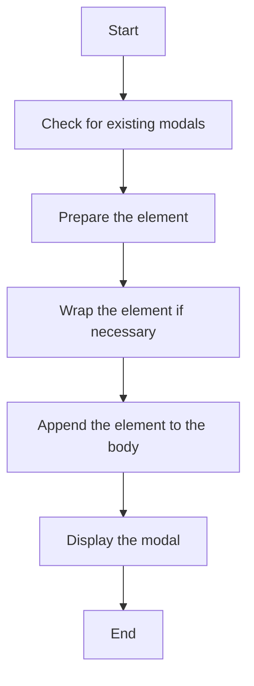

This document will cover the process of displaying an element as a modal, which includes:

1. Checking for existing modals
2. Preparing the element
3. Wrapping the element if necessary
4. Appending the element to the body
5. Displaying the modal.

Technical document: <SwmLink doc-title="Displaying an Element as a Modal">[Displaying an Element as a Modal](/.swm/displaying-an-element-as-a-modal.03d74fdo.sw.md)</SwmLink>

# [Checking for existing modals](https://app.swimm.io/repos/Z2l0aHViJTNBJTNBQnJvYWRsZWFmQ29tbWVyY2UtZGVtby1uZXclM0ElM0FTd2ltbS1EZW1v/docs/03d74fdo#showelementasmodal)

The process begins by checking if there is an existing modal currently displayed. If a modal with the class 'loading-modal' is found, it is hidden. This ensures that only one modal is visible at a time, providing a clear and focused user experience.

# [Preparing the element](https://app.swimm.io/repos/Z2l0aHViJTNBJTNBQnJvYWRsZWFmQ29tbWVyY2UtZGVtby1uZXclM0ElM0FTd2ltbS1EZW1v/docs/03d74fdo#showelementasmodal)

Next, the element that needs to be displayed as a modal is prepared. This involves ensuring that the element has a 'content-yield' wrapper inside the modal body. This wrapper is essential for maintaining a consistent structure and styling for all modals.

# [Wrapping the element if necessary](https://app.swimm.io/repos/Z2l0aHViJTNBJTNBQnJvYWRsZWFmQ29tbWVyY2UtZGVtby1uZXclM0ElM0FTd2ltbS1EZW1v/docs/03d74fdo#showelementasmodal)

If the element has the class 'wrap-in-modal', it is wrapped in a modal structure. This step is crucial for elements that do not inherently have a modal structure, ensuring they are displayed correctly within the modal framework.

# [Appending the element to the body](https://app.swimm.io/repos/Z2l0aHViJTNBJTNBQnJvYWRsZWFmQ29tbWVyY2UtZGVtby1uZXclM0ElM0FTd2ltbS1EZW1v/docs/03d74fdo#showelementasmodal)

Once the element is prepared and wrapped, it is appended to the body of the document. This step makes the element part of the DOM, allowing it to be displayed as a modal.

# [Displaying the modal](https://app.swimm.io/repos/Z2l0aHViJTNBJTNBQnJvYWRsZWFmQ29tbWVyY2UtZGVtby1uZXclM0ElM0FTd2ltbS1EZW1v/docs/03d74fdo#showmodal)

Finally, the modal is displayed. This involves initializing the modal with specific options, such as whether to show a backdrop and disabling default keyboard behavior. If there are already active modals, the z-index and position of the new modal are adjusted to ensure proper stacking. A callback is also bound for the modal hidden event to handle cleanup tasks, such as removing the modal from the DOM.

&nbsp;

*This is an auto-generated document by Swimm AI 🌊 and has not yet been verified by a human*

<SwmMeta version="3.0.0" repo-id="Z2l0aHViJTNBJTNBQnJvYWRsZWFmQ29tbWVyY2UtZGVtby1uZXclM0ElM0FTd2ltbS1EZW1v" repo-name="BroadleafCommerce-demo-new" doc-type="product-flows">Powered by [Swimm](/)</SwmMeta>
