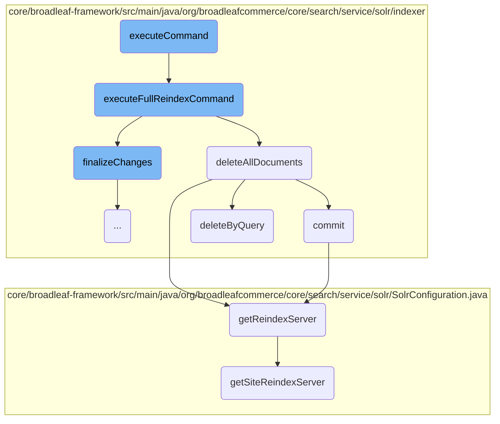

```mermaid
graph TD;
      subgraph core/broadleaf-framework/src/main/java/org/broadleafcommerce/core/search/service/solr/indexer
04df445583a0ffa1fc71c555a5fb3dda6401b8389eb2bbbc942782fa25dfa2d5(finalizeChanges):::mainFlowStyle --> 700e033f3f106991f5b8f357ebc5d884d15accaed23cc2c5ac4e045626375ea0(commit)
end

subgraph core/broadleaf-framework/src/main/java/org/broadleafcommerce/core/search/service/solr/indexer
04df445583a0ffa1fc71c555a5fb3dda6401b8389eb2bbbc942782fa25dfa2d5(finalizeChanges):::mainFlowStyle --> c76830bae09c18188cd1f210943ea133456e55bf61b09a6fe2e5e779f2344eaf(rollback)
end

subgraph core/broadleaf-framework/src/main/java/org/broadleafcommerce/core/search/service/solr/indexer
04df445583a0ffa1fc71c555a5fb3dda6401b8389eb2bbbc942782fa25dfa2d5(finalizeChanges):::mainFlowStyle --> c738f2e28fc579826ac5dff61f9cc35d8ae00ac350b2b477ecf114e86d1dae24(swapCollections):::mainFlowStyle
end

subgraph core/broadleaf-framework/src/main/java/org/broadleafcommerce/core/search/service/solr/indexer
c738f2e28fc579826ac5dff61f9cc35d8ae00ac350b2b477ecf114e86d1dae24(swapCollections):::mainFlowStyle --> 4tjrp(...)
end

subgraph core/broadleaf-framework/src/main/java/org/broadleafcommerce/core/search/service/solr/SolrConfiguration.java
c76830bae09c18188cd1f210943ea133456e55bf61b09a6fe2e5e779f2344eaf(rollback) --> 8d30075ee2673e23b0a4fda4558a74470c28290eb65fbaeeebcbf577d633fa81(getReindexServer)
end

subgraph core/broadleaf-framework/src/main/java/org/broadleafcommerce/core/search/service/solr/SolrConfiguration.java
8d30075ee2673e23b0a4fda4558a74470c28290eb65fbaeeebcbf577d633fa81(getReindexServer) --> bc7df526d2e7b829068cc7d926c303198303639bb77bff8e1ec0b15c323ccf53(getSiteReindexServer)
end

subgraph core/broadleaf-framework/src/main/java/org/broadleafcommerce/core/search/service/solr/SolrConfiguration.java
700e033f3f106991f5b8f357ebc5d884d15accaed23cc2c5ac4e045626375ea0(commit) --> 8d30075ee2673e23b0a4fda4558a74470c28290eb65fbaeeebcbf577d633fa81(getReindexServer)
end


      classDef mainFlowStyle color:#000000,fill:#7CB9F4
classDef rootsStyle color:#000000,fill:#00FFF4
classDef Style1 color:#000000,fill:#00FFAA
classDef Style2 color:#000000,fill:#FFFF00
classDef Style3 color:#000000,fill:#AA7CB9

%% Swimm:
%% graph TD;
%%       subgraph <SwmPath>[core/broadleaf-framework/src/main/java/org/broadleafcommerce/core/search/service/solr/indexer/](core/broadleaf-framework/src/main/java/org/broadleafcommerce/core/search/service/solr/indexer/)</SwmPath>
%% 04df445583a0ffa1fc71c555a5fb3dda6401b8389eb2bbbc942782fa25dfa2d5(finalizeChanges):::mainFlowStyle --> 700e033f3f106991f5b8f357ebc5d884d15accaed23cc2c5ac4e045626375ea0(commit)
%% end
%% 
%% subgraph <SwmPath>[core/broadleaf-framework/src/main/java/org/broadleafcommerce/core/search/service/solr/indexer/](core/broadleaf-framework/src/main/java/org/broadleafcommerce/core/search/service/solr/indexer/)</SwmPath>
%% 04df445583a0ffa1fc71c555a5fb3dda6401b8389eb2bbbc942782fa25dfa2d5(finalizeChanges):::mainFlowStyle --> c76830bae09c18188cd1f210943ea133456e55bf61b09a6fe2e5e779f2344eaf(rollback)
%% end
%% 
%% subgraph <SwmPath>[core/broadleaf-framework/src/main/java/org/broadleafcommerce/core/search/service/solr/indexer/](core/broadleaf-framework/src/main/java/org/broadleafcommerce/core/search/service/solr/indexer/)</SwmPath>
%% 04df445583a0ffa1fc71c555a5fb3dda6401b8389eb2bbbc942782fa25dfa2d5(finalizeChanges):::mainFlowStyle --> c738f2e28fc579826ac5dff61f9cc35d8ae00ac350b2b477ecf114e86d1dae24(swapCollections):::mainFlowStyle
%% end
%% 
%% subgraph <SwmPath>[core/broadleaf-framework/src/main/java/org/broadleafcommerce/core/search/service/solr/indexer/](core/broadleaf-framework/src/main/java/org/broadleafcommerce/core/search/service/solr/indexer/)</SwmPath>
%% c738f2e28fc579826ac5dff61f9cc35d8ae00ac350b2b477ecf114e86d1dae24(swapCollections):::mainFlowStyle --> 4tjrp(...)
%% end
%% 
%% subgraph <SwmPath>[core/broadleaf-framework/src/main/java/org/broadleafcommerce/core/search/service/solr/SolrConfiguration.java](core/broadleaf-framework/src/main/java/org/broadleafcommerce/core/search/service/solr/SolrConfiguration.java)</SwmPath>
%% c76830bae09c18188cd1f210943ea133456e55bf61b09a6fe2e5e779f2344eaf(rollback) --> 8d30075ee2673e23b0a4fda4558a74470c28290eb65fbaeeebcbf577d633fa81(getReindexServer)
%% end
%% 
%% subgraph <SwmPath>[core/broadleaf-framework/src/main/java/org/broadleafcommerce/core/search/service/solr/SolrConfiguration.java](core/broadleaf-framework/src/main/java/org/broadleafcommerce/core/search/service/solr/SolrConfiguration.java)</SwmPath>
%% 8d30075ee2673e23b0a4fda4558a74470c28290eb65fbaeeebcbf577d633fa81(getReindexServer) --> bc7df526d2e7b829068cc7d926c303198303639bb77bff8e1ec0b15c323ccf53(getSiteReindexServer)
%% end
%% 
%% subgraph <SwmPath>[core/broadleaf-framework/src/main/java/org/broadleafcommerce/core/search/service/solr/SolrConfiguration.java](core/broadleaf-framework/src/main/java/org/broadleafcommerce/core/search/service/solr/SolrConfiguration.java)</SwmPath>
%% 700e033f3f106991f5b8f357ebc5d884d15accaed23cc2c5ac4e045626375ea0(commit) --> 8d30075ee2673e23b0a4fda4558a74470c28290eb65fbaeeebcbf577d633fa81(getReindexServer)
%% end
%% 
%% 
%%       classDef mainFlowStyle color:#000000,fill:#7CB9F4
%% classDef rootsStyle color:#000000,fill:#00FFF4
%% classDef Style1 color:#000000,fill:#00FFAA
%% classDef Style2 color:#000000,fill:#FFFF00
%% classDef Style3 color:#000000,fill:#AA7CB9
```

```mermaid
graph TD;
      subgraph core/broadleaf-framework/src/main/java/org/broadleafcommerce/core/search/service/solr
c738f2e28fc579826ac5dff61f9cc35d8ae00ac350b2b477ecf114e86d1dae24(swapCollections):::mainFlowStyle --> c3362a669a9ea85c67a369ee0395939e33caa13341e15d753730d6b1db9e793e(swapActiveCores):::mainFlowStyle
end

subgraph core/broadleaf-framework/src/main/java/org/broadleafcommerce/core/util/queue/ZookeeperDistributedQueue.java
c3362a669a9ea85c67a369ee0395939e33caa13341e15d753730d6b1db9e793e(swapActiveCores):::mainFlowStyle --> aa8cdbe4a9d4c527322ee913c1e765a2f4378a597904b96c93633a5c88b90652(isEmpty)
end

subgraph core/broadleaf-framework/src/main/java/org/broadleafcommerce/core/search/service/solr
c3362a669a9ea85c67a369ee0395939e33caa13341e15d753730d6b1db9e793e(swapActiveCores):::mainFlowStyle --> 8d30075ee2673e23b0a4fda4558a74470c28290eb65fbaeeebcbf577d633fa81(getReindexServer)
end

subgraph core/broadleaf-framework/src/main/java/org/broadleafcommerce/core/search/service/solr
c3362a669a9ea85c67a369ee0395939e33caa13341e15d753730d6b1db9e793e(swapActiveCores):::mainFlowStyle --> ac557fed8091288cb2bff5f45290d07a65a61a76c4c79f395524af2578694381(getAdminServer):::mainFlowStyle
end

subgraph core/broadleaf-framework/src/main/java/org/broadleafcommerce/core/search/service/solr
ac557fed8091288cb2bff5f45290d07a65a61a76c4c79f395524af2578694381(getAdminServer):::mainFlowStyle --> dcc20af1051e2c4077c6c7aaa549ee1b5ada323df9cc0b148028e0d1432ab000(getServer):::mainFlowStyle
end

subgraph core/broadleaf-framework/src/main/java/org/broadleafcommerce/core/search/service/solr
8d30075ee2673e23b0a4fda4558a74470c28290eb65fbaeeebcbf577d633fa81(getReindexServer) --> bc7df526d2e7b829068cc7d926c303198303639bb77bff8e1ec0b15c323ccf53(getSiteReindexServer)
end

subgraph core/broadleaf-framework/src/main/java/org/broadleafcommerce/core/util/queue/ZookeeperDistributedQueue.java
aa8cdbe4a9d4c527322ee913c1e765a2f4378a597904b96c93633a5c88b90652(isEmpty) --> 119ea4bdd418642aef64f4a0f0ef8ac202542484f7b9e99f671004c0887e4e26(size)
end

subgraph core/broadleaf-framework/src/main/java/org/broadleafcommerce/core/search/service/solr
dcc20af1051e2c4077c6c7aaa549ee1b5ada323df9cc0b148028e0d1432ab000(getServer):::mainFlowStyle --> 1b9b20fbd99cc6a169d1ee00b969d709d57d4aa29948acf1069853f55e6befc9(getSiteServer):::mainFlowStyle
end


      classDef mainFlowStyle color:#000000,fill:#7CB9F4
classDef rootsStyle color:#000000,fill:#00FFF4
classDef Style1 color:#000000,fill:#00FFAA
classDef Style2 color:#000000,fill:#FFFF00
classDef Style3 color:#000000,fill:#AA7CB9

%% Swimm:
%% graph TD;
%%       subgraph <SwmPath>[core/broadleaf-framework/src/main/java/org/broadleafcommerce/core/search/service/solr/](core/broadleaf-framework/src/main/java/org/broadleafcommerce/core/search/service/solr/)</SwmPath>
%% c738f2e28fc579826ac5dff61f9cc35d8ae00ac350b2b477ecf114e86d1dae24(swapCollections):::mainFlowStyle --> c3362a669a9ea85c67a369ee0395939e33caa13341e15d753730d6b1db9e793e(swapActiveCores):::mainFlowStyle
%% end
%% 
%% subgraph <SwmPath>[core/broadleaf-framework/src/main/java/org/broadleafcommerce/core/util/queue/ZookeeperDistributedQueue.java](core/broadleaf-framework/src/main/java/org/broadleafcommerce/core/util/queue/ZookeeperDistributedQueue.java)</SwmPath>
%% c3362a669a9ea85c67a369ee0395939e33caa13341e15d753730d6b1db9e793e(swapActiveCores):::mainFlowStyle --> aa8cdbe4a9d4c527322ee913c1e765a2f4378a597904b96c93633a5c88b90652(isEmpty)
%% end
%% 
%% subgraph <SwmPath>[core/broadleaf-framework/src/main/java/org/broadleafcommerce/core/search/service/solr/](core/broadleaf-framework/src/main/java/org/broadleafcommerce/core/search/service/solr/)</SwmPath>
%% c3362a669a9ea85c67a369ee0395939e33caa13341e15d753730d6b1db9e793e(swapActiveCores):::mainFlowStyle --> 8d30075ee2673e23b0a4fda4558a74470c28290eb65fbaeeebcbf577d633fa81(getReindexServer)
%% end
%% 
%% subgraph <SwmPath>[core/broadleaf-framework/src/main/java/org/broadleafcommerce/core/search/service/solr/](core/broadleaf-framework/src/main/java/org/broadleafcommerce/core/search/service/solr/)</SwmPath>
%% c3362a669a9ea85c67a369ee0395939e33caa13341e15d753730d6b1db9e793e(swapActiveCores):::mainFlowStyle --> ac557fed8091288cb2bff5f45290d07a65a61a76c4c79f395524af2578694381(getAdminServer):::mainFlowStyle
%% end
%% 
%% subgraph <SwmPath>[core/broadleaf-framework/src/main/java/org/broadleafcommerce/core/search/service/solr/](core/broadleaf-framework/src/main/java/org/broadleafcommerce/core/search/service/solr/)</SwmPath>
%% ac557fed8091288cb2bff5f45290d07a65a61a76c4c79f395524af2578694381(getAdminServer):::mainFlowStyle --> dcc20af1051e2c4077c6c7aaa549ee1b5ada323df9cc0b148028e0d1432ab000(getServer):::mainFlowStyle
%% end
%% 
%% subgraph <SwmPath>[core/broadleaf-framework/src/main/java/org/broadleafcommerce/core/search/service/solr/](core/broadleaf-framework/src/main/java/org/broadleafcommerce/core/search/service/solr/)</SwmPath>
%% 8d30075ee2673e23b0a4fda4558a74470c28290eb65fbaeeebcbf577d633fa81(getReindexServer) --> bc7df526d2e7b829068cc7d926c303198303639bb77bff8e1ec0b15c323ccf53(getSiteReindexServer)
%% end
%% 
%% subgraph <SwmPath>[core/broadleaf-framework/src/main/java/org/broadleafcommerce/core/util/queue/ZookeeperDistributedQueue.java](core/broadleaf-framework/src/main/java/org/broadleafcommerce/core/util/queue/ZookeeperDistributedQueue.java)</SwmPath>
%% aa8cdbe4a9d4c527322ee913c1e765a2f4378a597904b96c93633a5c88b90652(isEmpty) --> 119ea4bdd418642aef64f4a0f0ef8ac202542484f7b9e99f671004c0887e4e26(size)
%% end
%% 
%% subgraph <SwmPath>[core/broadleaf-framework/src/main/java/org/broadleafcommerce/core/search/service/solr/](core/broadleaf-framework/src/main/java/org/broadleafcommerce/core/search/service/solr/)</SwmPath>
%% dcc20af1051e2c4077c6c7aaa549ee1b5ada323df9cc0b148028e0d1432ab000(getServer):::mainFlowStyle --> 1b9b20fbd99cc6a169d1ee00b969d709d57d4aa29948acf1069853f55e6befc9(getSiteServer):::mainFlowStyle
%% end
%% 
%% 
%%       classDef mainFlowStyle color:#000000,fill:#7CB9F4
%% classDef rootsStyle color:#000000,fill:#00FFF4
%% classDef Style1 color:#000000,fill:#00FFAA
%% classDef Style2 color:#000000,fill:#FFFF00
%% classDef Style3 color:#000000,fill:#AA7CB9
```

In this document, we will explain the process of executing a command within the Solr indexing framework. The process involves determining the type of Solr update command and delegating it to the appropriate handler. This ensures that the correct indexing operations are performed based on the command type.

The flow starts by checking if the Solr configuration is available. If it is, the system tries to acquire a command lock to ensure no other process is executing a command simultaneously. Depending on the type of command received, such as a full reindex or an incremental update, the system calls specific methods to handle these commands. For a full reindex, it deletes all documents in the background collection, finalizes the changes, and commits them to Solr. If any errors occur, it rolls back the changes to maintain data integrity.

Here is a high level diagram of the flow, showing only the most important functions:

```mermaid
graph TD;
      subgraph core/broadleaf-framework/src/main/java/org/broadleafcommerce/core/search/service/solr/indexer
7812469e3246cae549b9d0d9a8853fd3d9a173e19095ebc52ca14ddeb6333eb3(executeCommand):::mainFlowStyle --> 69e1fc96ce6a4bbcdbf5a1d915f7f991cf200284e1971da44e3382fdb1d98548(executeFullReindexCommand):::mainFlowStyle
end

subgraph core/broadleaf-framework/src/main/java/org/broadleafcommerce/core/search/service/solr/indexer
69e1fc96ce6a4bbcdbf5a1d915f7f991cf200284e1971da44e3382fdb1d98548(executeFullReindexCommand):::mainFlowStyle --> de27ee2d62b9888eb0a639a43a809db190587dd6027ad7e42e27aff88b2518df(deleteAllDocuments)
end

subgraph core/broadleaf-framework/src/main/java/org/broadleafcommerce/core/search/service/solr/indexer
69e1fc96ce6a4bbcdbf5a1d915f7f991cf200284e1971da44e3382fdb1d98548(executeFullReindexCommand):::mainFlowStyle --> 04df445583a0ffa1fc71c555a5fb3dda6401b8389eb2bbbc942782fa25dfa2d5(finalizeChanges):::mainFlowStyle
end

subgraph core/broadleaf-framework/src/main/java/org/broadleafcommerce/core/search/service/solr/indexer
04df445583a0ffa1fc71c555a5fb3dda6401b8389eb2bbbc942782fa25dfa2d5(finalizeChanges):::mainFlowStyle --> 700e033f3f106991f5b8f357ebc5d884d15accaed23cc2c5ac4e045626375ea0(commit)
end

subgraph core/broadleaf-framework/src/main/java/org/broadleafcommerce/core/search/service/solr/indexer
04df445583a0ffa1fc71c555a5fb3dda6401b8389eb2bbbc942782fa25dfa2d5(finalizeChanges):::mainFlowStyle --> c76830bae09c18188cd1f210943ea133456e55bf61b09a6fe2e5e779f2344eaf(rollback)
end

subgraph core/broadleaf-framework/src/main/java/org/broadleafcommerce/core/search/service/solr/indexer
04df445583a0ffa1fc71c555a5fb3dda6401b8389eb2bbbc942782fa25dfa2d5(finalizeChanges):::mainFlowStyle --> c738f2e28fc579826ac5dff61f9cc35d8ae00ac350b2b477ecf114e86d1dae24(swapCollections):::mainFlowStyle
end

subgraph core/broadleaf-framework/src/main/java/org/broadleafcommerce/core/search/service/solr
c738f2e28fc579826ac5dff61f9cc35d8ae00ac350b2b477ecf114e86d1dae24(swapCollections):::mainFlowStyle --> c3362a669a9ea85c67a369ee0395939e33caa13341e15d753730d6b1db9e793e(swapActiveCores):::mainFlowStyle
end

subgraph core/broadleaf-framework/src/main/java/org/broadleafcommerce/core/util/queue/ZookeeperDistributedQueue.java
c3362a669a9ea85c67a369ee0395939e33caa13341e15d753730d6b1db9e793e(swapActiveCores):::mainFlowStyle --> aa8cdbe4a9d4c527322ee913c1e765a2f4378a597904b96c93633a5c88b90652(isEmpty)
end

subgraph core/broadleaf-framework/src/main/java/org/broadleafcommerce/core/search/service/solr
c3362a669a9ea85c67a369ee0395939e33caa13341e15d753730d6b1db9e793e(swapActiveCores):::mainFlowStyle --> 8d30075ee2673e23b0a4fda4558a74470c28290eb65fbaeeebcbf577d633fa81(getReindexServer)
end

subgraph core/broadleaf-framework/src/main/java/org/broadleafcommerce/core/search/service/solr
c3362a669a9ea85c67a369ee0395939e33caa13341e15d753730d6b1db9e793e(swapActiveCores):::mainFlowStyle --> ac557fed8091288cb2bff5f45290d07a65a61a76c4c79f395524af2578694381(getAdminServer):::mainFlowStyle
end

subgraph core/broadleaf-framework/src/main/java/org/broadleafcommerce/core/search/service/solr
ac557fed8091288cb2bff5f45290d07a65a61a76c4c79f395524af2578694381(getAdminServer):::mainFlowStyle --> dcc20af1051e2c4077c6c7aaa549ee1b5ada323df9cc0b148028e0d1432ab000(getServer):::mainFlowStyle
end

subgraph core/broadleaf-framework/src/main/java/org/broadleafcommerce/core/search/service/solr
dcc20af1051e2c4077c6c7aaa549ee1b5ada323df9cc0b148028e0d1432ab000(getServer):::mainFlowStyle --> 1b9b20fbd99cc6a169d1ee00b969d709d57d4aa29948acf1069853f55e6befc9(getSiteServer):::mainFlowStyle
end


      classDef mainFlowStyle color:#000000,fill:#7CB9F4
classDef rootsStyle color:#000000,fill:#00FFF4
classDef Style1 color:#000000,fill:#00FFAA
classDef Style2 color:#000000,fill:#FFFF00
classDef Style3 color:#000000,fill:#AA7CB9

%% Swimm:
%% graph TD;
%%       subgraph <SwmPath>[core/broadleaf-framework/src/main/java/org/broadleafcommerce/core/search/service/solr/indexer/](core/broadleaf-framework/src/main/java/org/broadleafcommerce/core/search/service/solr/indexer/)</SwmPath>
%% 7812469e3246cae549b9d0d9a8853fd3d9a173e19095ebc52ca14ddeb6333eb3(executeCommand):::mainFlowStyle --> 69e1fc96ce6a4bbcdbf5a1d915f7f991cf200284e1971da44e3382fdb1d98548(executeFullReindexCommand):::mainFlowStyle
%% end
%% 
%% subgraph <SwmPath>[core/broadleaf-framework/src/main/java/org/broadleafcommerce/core/search/service/solr/indexer/](core/broadleaf-framework/src/main/java/org/broadleafcommerce/core/search/service/solr/indexer/)</SwmPath>
%% 69e1fc96ce6a4bbcdbf5a1d915f7f991cf200284e1971da44e3382fdb1d98548(executeFullReindexCommand):::mainFlowStyle --> de27ee2d62b9888eb0a639a43a809db190587dd6027ad7e42e27aff88b2518df(deleteAllDocuments)
%% end
%% 
%% subgraph <SwmPath>[core/broadleaf-framework/src/main/java/org/broadleafcommerce/core/search/service/solr/indexer/](core/broadleaf-framework/src/main/java/org/broadleafcommerce/core/search/service/solr/indexer/)</SwmPath>
%% 69e1fc96ce6a4bbcdbf5a1d915f7f991cf200284e1971da44e3382fdb1d98548(executeFullReindexCommand):::mainFlowStyle --> 04df445583a0ffa1fc71c555a5fb3dda6401b8389eb2bbbc942782fa25dfa2d5(finalizeChanges):::mainFlowStyle
%% end
%% 
%% subgraph <SwmPath>[core/broadleaf-framework/src/main/java/org/broadleafcommerce/core/search/service/solr/indexer/](core/broadleaf-framework/src/main/java/org/broadleafcommerce/core/search/service/solr/indexer/)</SwmPath>
%% 04df445583a0ffa1fc71c555a5fb3dda6401b8389eb2bbbc942782fa25dfa2d5(finalizeChanges):::mainFlowStyle --> 700e033f3f106991f5b8f357ebc5d884d15accaed23cc2c5ac4e045626375ea0(commit)
%% end
%% 
%% subgraph <SwmPath>[core/broadleaf-framework/src/main/java/org/broadleafcommerce/core/search/service/solr/indexer/](core/broadleaf-framework/src/main/java/org/broadleafcommerce/core/search/service/solr/indexer/)</SwmPath>
%% 04df445583a0ffa1fc71c555a5fb3dda6401b8389eb2bbbc942782fa25dfa2d5(finalizeChanges):::mainFlowStyle --> c76830bae09c18188cd1f210943ea133456e55bf61b09a6fe2e5e779f2344eaf(rollback)
%% end
%% 
%% subgraph <SwmPath>[core/broadleaf-framework/src/main/java/org/broadleafcommerce/core/search/service/solr/indexer/](core/broadleaf-framework/src/main/java/org/broadleafcommerce/core/search/service/solr/indexer/)</SwmPath>
%% 04df445583a0ffa1fc71c555a5fb3dda6401b8389eb2bbbc942782fa25dfa2d5(finalizeChanges):::mainFlowStyle --> c738f2e28fc579826ac5dff61f9cc35d8ae00ac350b2b477ecf114e86d1dae24(swapCollections):::mainFlowStyle
%% end
%% 
%% subgraph <SwmPath>[core/broadleaf-framework/src/main/java/org/broadleafcommerce/core/search/service/solr/](core/broadleaf-framework/src/main/java/org/broadleafcommerce/core/search/service/solr/)</SwmPath>
%% c738f2e28fc579826ac5dff61f9cc35d8ae00ac350b2b477ecf114e86d1dae24(swapCollections):::mainFlowStyle --> c3362a669a9ea85c67a369ee0395939e33caa13341e15d753730d6b1db9e793e(swapActiveCores):::mainFlowStyle
%% end
%% 
%% subgraph <SwmPath>[core/broadleaf-framework/src/main/java/org/broadleafcommerce/core/util/queue/ZookeeperDistributedQueue.java](core/broadleaf-framework/src/main/java/org/broadleafcommerce/core/util/queue/ZookeeperDistributedQueue.java)</SwmPath>
%% c3362a669a9ea85c67a369ee0395939e33caa13341e15d753730d6b1db9e793e(swapActiveCores):::mainFlowStyle --> aa8cdbe4a9d4c527322ee913c1e765a2f4378a597904b96c93633a5c88b90652(isEmpty)
%% end
%% 
%% subgraph <SwmPath>[core/broadleaf-framework/src/main/java/org/broadleafcommerce/core/search/service/solr/](core/broadleaf-framework/src/main/java/org/broadleafcommerce/core/search/service/solr/)</SwmPath>
%% c3362a669a9ea85c67a369ee0395939e33caa13341e15d753730d6b1db9e793e(swapActiveCores):::mainFlowStyle --> 8d30075ee2673e23b0a4fda4558a74470c28290eb65fbaeeebcbf577d633fa81(getReindexServer)
%% end
%% 
%% subgraph <SwmPath>[core/broadleaf-framework/src/main/java/org/broadleafcommerce/core/search/service/solr/](core/broadleaf-framework/src/main/java/org/broadleafcommerce/core/search/service/solr/)</SwmPath>
%% c3362a669a9ea85c67a369ee0395939e33caa13341e15d753730d6b1db9e793e(swapActiveCores):::mainFlowStyle --> ac557fed8091288cb2bff5f45290d07a65a61a76c4c79f395524af2578694381(getAdminServer):::mainFlowStyle
%% end
%% 
%% subgraph <SwmPath>[core/broadleaf-framework/src/main/java/org/broadleafcommerce/core/search/service/solr/](core/broadleaf-framework/src/main/java/org/broadleafcommerce/core/search/service/solr/)</SwmPath>
%% ac557fed8091288cb2bff5f45290d07a65a61a76c4c79f395524af2578694381(getAdminServer):::mainFlowStyle --> dcc20af1051e2c4077c6c7aaa549ee1b5ada323df9cc0b148028e0d1432ab000(getServer):::mainFlowStyle
%% end
%% 
%% subgraph <SwmPath>[core/broadleaf-framework/src/main/java/org/broadleafcommerce/core/search/service/solr/](core/broadleaf-framework/src/main/java/org/broadleafcommerce/core/search/service/solr/)</SwmPath>
%% dcc20af1051e2c4077c6c7aaa549ee1b5ada323df9cc0b148028e0d1432ab000(getServer):::mainFlowStyle --> 1b9b20fbd99cc6a169d1ee00b969d709d57d4aa29948acf1069853f55e6befc9(getSiteServer):::mainFlowStyle
%% end
%% 
%% 
%%       classDef mainFlowStyle color:#000000,fill:#7CB9F4
%% classDef rootsStyle color:#000000,fill:#00FFF4
%% classDef Style1 color:#000000,fill:#00FFAA
%% classDef Style2 color:#000000,fill:#FFFF00
%% classDef Style3 color:#000000,fill:#AA7CB9
```



# Flow drill down

First, we'll zoom into this section of the flow:



<SwmSnippet path="/core/broadleaf-framework/src/main/java/org/broadleafcommerce/core/search/service/solr/indexer/CatalogSolrIndexUpdateCommandHandlerImpl.java" line="136">

---

## Executing a Command

The <SwmToken path="core/broadleaf-framework/src/main/java/org/broadleafcommerce/core/search/service/solr/indexer/CatalogSolrIndexUpdateCommandHandlerImpl.java" pos="137:13:13" line-data="    public &lt;C extends SolrUpdateCommand&gt; void executeCommand(C command) throws ServiceException {">`executeCommand`</SwmToken> method is responsible for determining the type of Solr update command and delegating it to the appropriate handler. It first ensures that the <SwmToken path="core/broadleaf-framework/src/main/java/org/broadleafcommerce/core/search/service/solr/indexer/CatalogSolrIndexUpdateCommandHandlerImpl.java" pos="138:4:4" line-data="        if (solrConfiguration == null) {">`solrConfiguration`</SwmToken> is not null and then attempts to acquire a command lock. Depending on the type of command, it calls specific methods like <SwmToken path="core/broadleaf-framework/src/main/java/org/broadleafcommerce/core/search/service/solr/indexer/CatalogSolrIndexUpdateCommandHandlerImpl.java" pos="151:1:1" line-data="                    executeFullReindexCommand((FullReindexCommand)command);">`executeFullReindexCommand`</SwmToken> for full reindexing.

```java
    @Override
    public <C extends SolrUpdateCommand> void executeCommand(C command) throws ServiceException {
        if (solrConfiguration == null) {
            throw new IllegalStateException("SolrConfiguration was null.  "
                    + "Please ensure that a Spring Bean with the name 'blCatalogSolrConfiguration' is in scope and that it is an instance of " + SolrConfiguration.class.getName());
        }
        
        Lock lock = queueProvider.createOrRetrieveCommandLock(getCommandGroup() + SolrIndexQueueProvider.COMMAND_LOCK_NAME);
        //Should be able to immediately obtain the command lock because the current thread should already hold it if it's delegating to this method.
        //Locking again is more of a safeguard.
        if (lock.tryLock()) {
            try {
                if (command instanceof IncrementalUpdateCommand) {
                    executeCommandInternal((IncrementalUpdateCommand)command);
                } else if (command instanceof FullReindexCommand) {
                    executeFullReindexCommand((FullReindexCommand)command);
                } else if (command instanceof CatalogReindexCommand) {
                    executeCatalogReindexCommand((CatalogReindexCommand)command);
                } else if (command instanceof SiteReindexCommand) {
                    executeSiteReindexCommand((SiteReindexCommand)command);
                } else {
```

---

</SwmSnippet>

<SwmSnippet path="/core/broadleaf-framework/src/main/java/org/broadleafcommerce/core/search/service/solr/indexer/CatalogSolrIndexUpdateCommandHandlerImpl.java" line="177">

---

## Executing a Full Reindex Command

The <SwmToken path="core/broadleaf-framework/src/main/java/org/broadleafcommerce/core/search/service/solr/indexer/CatalogSolrIndexUpdateCommandHandlerImpl.java" pos="177:5:5" line-data="    protected void executeFullReindexCommand(FullReindexCommand command) throws ServiceException {">`executeFullReindexCommand`</SwmToken> method handles the process of fully reindexing the Solr collection. It starts by creating a <SwmToken path="core/broadleaf-framework/src/main/java/org/broadleafcommerce/core/search/service/solr/indexer/CatalogSolrIndexUpdateCommandHandlerImpl.java" pos="180:1:1" line-data="        ReindexStateHolder holder;">`ReindexStateHolder`</SwmToken> to manage the state of the reindexing process. It then deletes all documents in the background collection and finalizes the changes. If any errors occur, it fails fast and throws a <SwmToken path="core/broadleaf-framework/src/main/java/org/broadleafcommerce/core/search/service/solr/indexer/CatalogSolrIndexUpdateCommandHandlerImpl.java" pos="177:14:14" line-data="    protected void executeFullReindexCommand(FullReindexCommand command) throws ServiceException {">`ServiceException`</SwmToken>.

```java
    protected void executeFullReindexCommand(FullReindexCommand command) throws ServiceException {
        final long startTime = System.currentTimeMillis();
        final String reindexCollectionName = getBackgroundCollectionName();
        ReindexStateHolder holder;
        synchronized (ReindexStateHolder.class) {
            holder = ReindexStateHolder.getInstance(reindexCollectionName, false, false);
            if (holder != null) {
                //We're in a bad state here.  This should not be created yet.
                throw new IllegalStateException("Tried to execute a full reindex, "
                        + "but it appears that someone already started one, or did not deregister one after completion for collection '" 
                        + getBackgroundCollectionName() 
                        + "'.");
            }
            
            //Now we create the state holder.
            holder = ReindexStateHolder.getInstance(reindexCollectionName, !solrConfiguration.isSingleCoreMode(), true);
        }
        
        try {
            beforeProcess(holder);
            deleteAllDocuments(getBackgroundCollectionName(), !solrConfiguration.isSingleCoreMode());
```

---

</SwmSnippet>

<SwmSnippet path="/core/broadleaf-framework/src/main/java/org/broadleafcommerce/core/search/service/solr/indexer/CatalogSolrIndexUpdateCommandHandlerImpl.java" line="368">

---

### Deleting All Documents

The <SwmToken path="core/broadleaf-framework/src/main/java/org/broadleafcommerce/core/search/service/solr/indexer/CatalogSolrIndexUpdateCommandHandlerImpl.java" pos="376:5:5" line-data="    protected void deleteAllDocuments(String collection, boolean commit) throws ServiceException {">`deleteAllDocuments`</SwmToken> method deletes all items in the specified Solr collection. This is typically done before reindexing to ensure that the collection is empty. If the <SwmToken path="core/broadleaf-framework/src/main/java/org/broadleafcommerce/core/search/service/solr/indexer/CatalogSolrIndexUpdateCommandHandlerImpl.java" pos="373:6:6" line-data="     * @param commit">`commit`</SwmToken> parameter is true, it also commits the changes to Solr.

```java
    /**
     * By default this deletes all items in the collection, since there is a good chance that the collection will be re-aliased or swapped into the foreground 
     * after reindexing is complete.
     * 
     * @param collection
     * @param commit
     * @throws ServiceException
     */
    protected void deleteAllDocuments(String collection, boolean commit) throws ServiceException {
        try {
            getSolrConfiguration().getReindexServer().deleteByQuery(null, "(*:*)");
            if (commit) {
                commit(null, true, true, false);
            }
        } catch (Exception e) {
            throw new ServiceException("An error occured deleting the contents of background Solr index, " + collection, e);
        }
    }
```

---

</SwmSnippet>

<SwmSnippet path="/core/broadleaf-framework/src/main/java/org/broadleafcommerce/core/search/service/solr/indexer/AbstractSolrIndexUpdateCommandHandlerImpl.java" line="128">

---

### Committing Changes

The <SwmToken path="core/broadleaf-framework/src/main/java/org/broadleafcommerce/core/search/service/solr/indexer/AbstractSolrIndexUpdateCommandHandlerImpl.java" pos="129:9:9" line-data="     * Issues a global commit command to Solr.  Take care as anyone can issue a commit and since it&#39;s global it affects all updates. ">`commit`</SwmToken> method issues a global commit command to Solr, ensuring that all changes are flushed and made searchable. This method is synchronized to prevent concurrent commits and uses a retryable operation to handle transient errors.

```java
    /**
     * Issues a global commit command to Solr.  Take care as anyone can issue a commit and since it's global it affects all updates. 
     * It is recommended that you off Solr's autoCommit and autoSoftCommit features.
     * 
     * @param collectionName
     * @param waitFlush
     * @param waitSearcher
     * @param softCommit
     * @throws Exception
     * 
     */
    protected synchronized void commit(final String collectionName, final boolean waitFlush, final boolean waitSearcher, final boolean softCommit) throws Exception {
        LOG.info("Issuing commit to Solr index: " + collectionName + " - with waitFlush=" + waitFlush + ", waitSearcher=" + waitSearcher + ", and softCommit=" + softCommit + ".");
        GenericOperationUtil.executeRetryableOperation(new GenericOperation<Void>() {
            @Override
            public Void execute() throws Exception {
                getSolrConfiguration().getReindexServer().commit(collectionName, waitFlush, waitSearcher, softCommit);
                return null;
            }
        });
    }
```

---

</SwmSnippet>

<SwmSnippet path="/core/broadleaf-framework/src/main/java/org/broadleafcommerce/core/search/service/solr/indexer/AbstractSolrIndexUpdateCommandHandlerImpl.java" line="204">

---

### Deleting by Query

The <SwmToken path="core/broadleaf-framework/src/main/java/org/broadleafcommerce/core/search/service/solr/indexer/AbstractSolrIndexUpdateCommandHandlerImpl.java" pos="212:5:5" line-data="    protected void deleteByQuery(final String collection, final String query) throws Exception {">`deleteByQuery`</SwmToken> method deletes documents from the Solr collection based on a specified query. This method does not issue a commit, allowing for batch deletions followed by a single commit.

```java
    /**
     * Deletes items for the provided query.  This does not issue a commit.
     * 
     * @param collection
     * @param query
     * @throws Exception
     * 
     */
    protected void deleteByQuery(final String collection, final String query) throws Exception {
        GenericOperationUtil.executeRetryableOperation(new GenericOperation<Void>() {
            @Override
            public Void execute() throws Exception {
                if (query != null) {
                    getSolrConfiguration().getReindexServer().deleteByQuery(collection, query);
                }
                return null;
            }
        });
    }
```

---

</SwmSnippet>

<SwmSnippet path="/core/broadleaf-framework/src/main/java/org/broadleafcommerce/core/search/service/solr/SolrConfiguration.java" line="270">

---

### Getting the Reindex Server

The <SwmToken path="core/broadleaf-framework/src/main/java/org/broadleafcommerce/core/search/service/solr/SolrConfiguration.java" pos="273:5:5" line-data="    public SolrClient getReindexServer() {">`getReindexServer`</SwmToken> method returns the appropriate Solr server for reindexing. If the system is in single-core mode, it returns the primary server; otherwise, it returns the reindex server.

```java
    /**
     * @return the primary server if {@link #isSingleCoreMode()}, else the reindex server
     */
    public SolrClient getReindexServer() {
        if (isSiteCollections() && isSolrCloudMode()) {
            return getSiteReindexServer();
        }
        
        return isSingleCoreMode() ? primaryServer : reindexServer;
    }
```

---

</SwmSnippet>

<SwmSnippet path="/core/broadleaf-framework/src/main/java/org/broadleafcommerce/core/search/service/solr/SolrConfiguration.java" line="611">

---

### Getting the Site Reindex Server

The <SwmToken path="core/broadleaf-framework/src/main/java/org/broadleafcommerce/core/search/service/solr/SolrConfiguration.java" pos="611:5:5" line-data="    public SolrClient getSiteReindexServer() {">`getSiteReindexServer`</SwmToken> method returns the Solr server for reindexing a specific site. It connects to the Solr Cloud client and ensures that the necessary collections and aliases exist for the site.

```java
    public SolrClient getSiteReindexServer() {
        BroadleafRequestContext ctx = BroadleafRequestContext.getBroadleafRequestContext();
        Site site = ctx.getNonPersistentSite();

        CloudSolrClient client = (CloudSolrClient) primaryServer;
        client.connect();
        
        String aliasName = getSiteReindexAliasName(site);
        if (aliasName != null) {
            String collectionName = getSiteReindexCollectionName(site);

            createCollectionIfNotExist(client, collectionName);
            createAliasIfNotExist(client, collectionName, collectionName);
        }

        return client;
    }
```

---

</SwmSnippet>

Now, lets zoom into this section of the flow:



<SwmSnippet path="/core/broadleaf-framework/src/main/java/org/broadleafcommerce/core/search/service/solr/indexer/CatalogSolrIndexUpdateCommandHandlerImpl.java" line="387">

---

## Finalizing Changes

The <SwmToken path="core/broadleaf-framework/src/main/java/org/broadleafcommerce/core/search/service/solr/indexer/CatalogSolrIndexUpdateCommandHandlerImpl.java" pos="394:5:5" line-data="    protected void finalizeChanges(final String collection, final boolean error, boolean swap) throws ServiceException {">`finalizeChanges`</SwmToken> method is responsible for determining the final state of the indexing process. If an error occurs, it triggers a rollback to revert any changes made. If no error is detected, it commits the changes and optionally swaps collections if required. This ensures that the indexing process is either fully completed or fully reverted, maintaining data integrity.

```java
    /**
     * Composite method that issues a commit or rollback (if there is an error), and optionally swaps (if there is no error).
     * @param collection
     * @param error
     * @param swap
     * @throws ServiceException
     */
    protected void finalizeChanges(final String collection, final boolean error, boolean swap) throws ServiceException {
        try {
            if (error) {
                rollback(collection);
            } else {
                commit(null, true, true, false);
                if (swap) {
                    swapCollections();
                }
            }
        } catch (Exception e) {
            if (error) {
                throw new ServiceException("An error rolling back the Solr index, " + collection, e);
            } else if (swap){
```

---

</SwmSnippet>

<SwmSnippet path="/core/broadleaf-framework/src/main/java/org/broadleafcommerce/core/search/service/solr/indexer/AbstractSolrIndexUpdateCommandHandlerImpl.java" line="150">

---

### Rolling Back Changes

The <SwmToken path="core/broadleaf-framework/src/main/java/org/broadleafcommerce/core/search/service/solr/indexer/AbstractSolrIndexUpdateCommandHandlerImpl.java" pos="151:9:9" line-data="     * Issues a global rollback of all items that have not yet been committed.  Take care as anyone can issue a commit and since it&#39;s global it affects all updates. ">`rollback`</SwmToken> method is invoked by <SwmToken path="core/broadleaf-framework/src/main/java/org/broadleafcommerce/core/search/service/solr/indexer/CatalogSolrIndexUpdateCommandHandlerImpl.java" pos="394:5:5" line-data="    protected void finalizeChanges(final String collection, final boolean error, boolean swap) throws ServiceException {">`finalizeChanges`</SwmToken> when an error is detected. It performs a global rollback of all uncommitted items, ensuring that any partial updates are not left in an inconsistent state. This method is critical for maintaining the integrity of the Solr index during error conditions.

```java
    /**
     * Issues a global rollback of all items that have not yet been committed.  Take care as anyone can issue a commit and since it's global it affects all updates. 
     * It is recommended that you off Solr's autoCommit and autoSoftCommit features.
     * 
     * @param collectionName
     * @throws Exception
     * 
     */
    protected synchronized void rollback(final String collectionName) throws Exception {
        GenericOperationUtil.executeRetryableOperation(new GenericOperation<Void>() {
            @Override
            public Void execute() throws Exception {
                getSolrConfiguration().getReindexServer().rollback(collectionName);
                return null;
            }
        });
    }
```

---

</SwmSnippet>

Now, lets zoom into this section of the flow:



<SwmSnippet path="/core/broadleaf-framework/src/main/java/org/broadleafcommerce/core/search/service/solr/indexer/CatalogSolrIndexUpdateCommandHandlerImpl.java" line="415">

---

## Swapping Collections

The <SwmToken path="core/broadleaf-framework/src/main/java/org/broadleafcommerce/core/search/service/solr/indexer/CatalogSolrIndexUpdateCommandHandlerImpl.java" pos="415:5:5" line-data="    protected void swapCollections() throws ServiceException {">`swapCollections`</SwmToken> method is responsible for determining if the Solr configuration is in single-core mode. If not, it proceeds to swap the active cores by calling the <SwmToken path="core/broadleaf-framework/src/main/java/org/broadleafcommerce/core/search/service/solr/indexer/CatalogSolrIndexUpdateCommandHandlerImpl.java" pos="417:3:3" line-data="            shs.swapActiveCores(solrConfiguration);">`swapActiveCores`</SwmToken> method from the <SwmToken path="core/broadleaf-framework/src/main/java/org/broadleafcommerce/core/search/service/solr/SolrHelperServiceImpl.java" pos="108:4:4" line-data="public class SolrHelperServiceImpl implements SolrHelperService {">`SolrHelperServiceImpl`</SwmToken> class.

```java
    protected void swapCollections() throws ServiceException {
        if (!solrConfiguration.isSingleCoreMode()) {
            shs.swapActiveCores(solrConfiguration);
        }
    }
```

---

</SwmSnippet>

<SwmSnippet path="/core/broadleaf-framework/src/main/java/org/broadleafcommerce/core/search/service/solr/SolrHelperServiceImpl.java" line="161">

---

## Swapping Active Cores

The <SwmToken path="core/broadleaf-framework/src/main/java/org/broadleafcommerce/core/search/service/solr/SolrHelperServiceImpl.java" pos="161:7:7" line-data="    public synchronized void swapActiveCores(SolrConfiguration solrConfiguration) throws ServiceException {">`swapActiveCores`</SwmToken> method handles the actual swapping of Solr cores. It first checks if Solr is configured. If using <SwmToken path="core/broadleaf-framework/src/main/java/org/broadleafcommerce/core/search/service/solr/SolrConfiguration.java" pos="68:28:28" line-data="    //This is the default number of shards that should be created if a SolrCloud collection is created via API">`SolrCloud`</SwmToken>, it swaps the aliases for the primary and reindex collections. If not using <SwmToken path="core/broadleaf-framework/src/main/java/org/broadleafcommerce/core/search/service/solr/SolrConfiguration.java" pos="68:28:28" line-data="    //This is the default number of shards that should be created if a SolrCloud collection is created via API">`SolrCloud`</SwmToken>, it swaps the core names directly using the Solr admin server.

```java
    public synchronized void swapActiveCores(SolrConfiguration solrConfiguration) throws ServiceException {
        if (!isSolrConfigured) {
            return;
        }
        if (CloudSolrClient.class.isAssignableFrom(solrConfiguration.getServer().getClass()) && CloudSolrClient.class.isAssignableFrom(solrConfiguration.getReindexServer().getClass())) {
            CloudSolrClient primaryCloudClient = (CloudSolrClient) solrConfiguration.getServer();
            CloudSolrClient reindexCloudClient = (CloudSolrClient) solrConfiguration.getReindexServer();
            try {
                String queryAlias = solrConfiguration.getQueryCollectionName();
                String reindexAlias = solrConfiguration.getReindexCollectionName();
                primaryCloudClient.connect();
                Aliases aliases = primaryCloudClient.getZkStateReader().getAliases();
                Map<String, String> aliasCollectionMap = aliases.getCollectionAliasMap();
                if (aliasCollectionMap == null || !aliasCollectionMap.containsKey(queryAlias)
                        || !aliasCollectionMap.containsKey(reindexAlias)) {
                    throw new IllegalStateException("Could not determine the PRIMARY or REINDEX "
                            + "collection or collections from the Solr aliases.");
                }

                String primaryCollectionName = aliasCollectionMap.get(queryAlias);
                //Do this just in case primary is aliased to more than one collection
```

---

</SwmSnippet>

<SwmSnippet path="/core/broadleaf-framework/src/main/java/org/broadleafcommerce/core/util/queue/ZookeeperDistributedQueue.java" line="262">

---

### Checking if Queue is Empty

The <SwmToken path="core/broadleaf-framework/src/main/java/org/broadleafcommerce/core/util/queue/ZookeeperDistributedQueue.java" pos="263:5:5" line-data="    public boolean isEmpty() {">`isEmpty`</SwmToken> method checks if the distributed queue is empty by synchronizing on the queue monitor and comparing the size to zero.

```java
    @Override
    public boolean isEmpty() {
        synchronized (QUEUE_MONITOR) {
            return size() == 0;
        }
    }
```

---

</SwmSnippet>

<SwmSnippet path="/core/broadleaf-framework/src/main/java/org/broadleafcommerce/core/search/service/solr/SolrConfiguration.java" line="252">

---

### Getting Admin Server

The <SwmToken path="core/broadleaf-framework/src/main/java/org/broadleafcommerce/core/search/service/solr/SolrConfiguration.java" pos="252:5:5" line-data="    public SolrClient getAdminServer() {">`getAdminServer`</SwmToken> method returns the Solr admin server if configured. If not, it defaults to returning the primary server, ensuring backward compatibility.

```java
    public SolrClient getAdminServer() {
        if (adminServer != null) {
            return adminServer;
        }
        //If the admin server hasn't been set, return the primary server.
        return getServer();
    }
```

---

</SwmSnippet>

<SwmSnippet path="/core/broadleaf-framework/src/main/java/org/broadleafcommerce/core/search/service/solr/SolrConfiguration.java" line="263">

---

### Getting Primary Server

The <SwmToken path="core/broadleaf-framework/src/main/java/org/broadleafcommerce/core/search/service/solr/SolrConfiguration.java" pos="263:5:5" line-data="    public SolrClient getServer() {">`getServer`</SwmToken> method returns the primary Solr server. If the configuration is for site collections and <SwmToken path="core/broadleaf-framework/src/main/java/org/broadleafcommerce/core/search/service/solr/SolrConfiguration.java" pos="68:28:28" line-data="    //This is the default number of shards that should be created if a SolrCloud collection is created via API">`SolrCloud`</SwmToken> mode, it returns the site server instead.

```java
    public SolrClient getServer() {
        if (isSiteCollections() && isSolrCloudMode()) {
            return getSiteServer();
        }
        return primaryServer;
    }
```

---

</SwmSnippet>

<SwmSnippet path="/core/broadleaf-framework/src/main/java/org/broadleafcommerce/core/util/queue/ZookeeperDistributedQueue.java" line="238">

---

### Getting Queue Size

The <SwmToken path="core/broadleaf-framework/src/main/java/org/broadleafcommerce/core/util/queue/ZookeeperDistributedQueue.java" pos="239:5:5" line-data="    public int size() {">`size`</SwmToken> method returns the number of children in the Zookeeper queue node, effectively giving the size of the distributed queue.

```java
    @Override
    public int size() {
        DistributedLock lock = getQueueAccessLock();
        try {
            lock.lockInterruptibly();
            try {
                return executeOperation(new GenericOperation<Integer>() {
                    @Override
                    public Integer execute() throws Exception {
                        final Stat stat = new Stat();
                        getZookeeperClient().getData(getQueueEntryFolder(), null, stat);
                        return stat.getNumChildren();
                    }
                });
                
            } finally {
                lock.unlock();
            }
        } catch (InterruptedException e) {
            Thread.currentThread().interrupt();
            throw new DistributedQueueException("Thread was interrupted while trying to determine queue size for distributed Zookeeper queue, " + getQueueFolderPath(), e);
```

---

</SwmSnippet>

<SwmSnippet path="/core/broadleaf-framework/src/main/java/org/broadleafcommerce/core/search/service/solr/SolrConfiguration.java" line="593">

---

### Getting Site Server

The <SwmToken path="core/broadleaf-framework/src/main/java/org/broadleafcommerce/core/search/service/solr/SolrConfiguration.java" pos="593:5:5" line-data="    public SolrClient getSiteServer() {">`getSiteServer`</SwmToken> method returns the Solr client for the site. It connects to the Solr server, retrieves the site alias name, and ensures the collection and alias exist.

```java
    public SolrClient getSiteServer() {
        BroadleafRequestContext ctx = BroadleafRequestContext.getBroadleafRequestContext();
        Site site = ctx.getNonPersistentSite();

        CloudSolrClient client = (CloudSolrClient) primaryServer;
        client.connect();
        
        String aliasName = getSiteAliasName(site);
        if (aliasName != null) {
            String collectionName = getSiteCollectionName(site);

            createCollectionIfNotExist(client, collectionName);
            createAliasIfNotExist(client, collectionName, collectionName);
        }

        return client;
    }
```

---

</SwmSnippet>

&nbsp;

*This is an auto-generated document by Swimm AI 🌊 and has not yet been verified by a human*

<SwmMeta version="3.0.0" repo-id="Z2l0aHViJTNBJTNBQnJvYWRsZWFmQ29tbWVyY2UtZGVtby1uZXclM0ElM0FTd2ltbS1EZW1v" repo-name="BroadleafCommerce-demo-new" doc-type="flows"><sup>Powered by [Swimm](/)</sup></SwmMeta>
