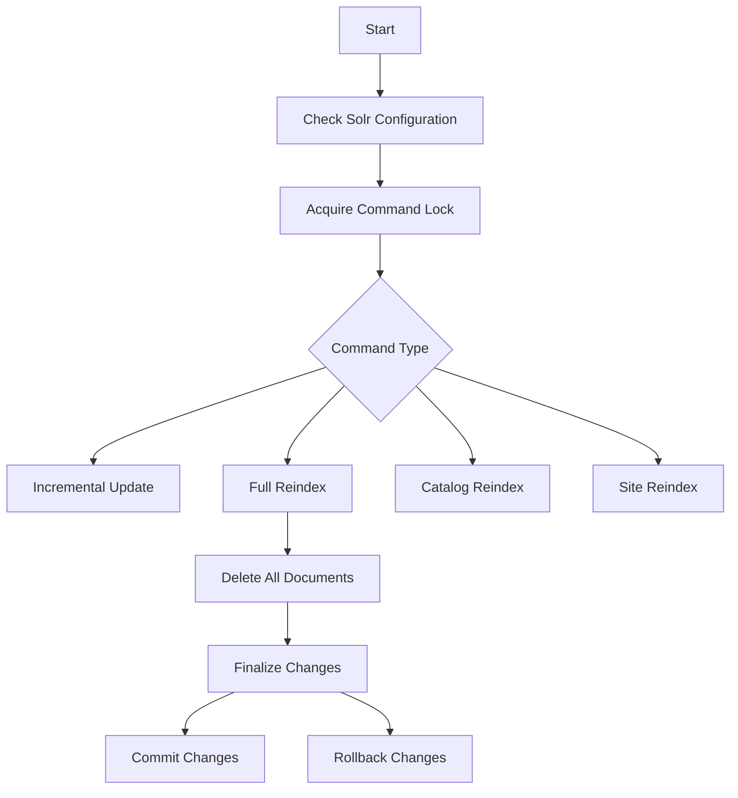

This document will cover the process of executing a command within the Solr indexing framework. We'll cover:

1. Checking Solr Configuration
2. Acquiring Command Lock
3. Handling Different Command Types
4. Executing a Full Reindex Command
5. Deleting All Documents
6. Finalizing Changes

Technical document: <SwmLink doc-title="Executing a Command">[Executing a Command](/.swm/executing-a-command.g52ip4sk.sw.md)</SwmLink>

# [Checking Solr Configuration](https://app.swimm.io/repos/Z2l0aHViJTNBJTNBQnJvYWRsZWFmQ29tbWVyY2UtZGVtby1uZXclM0ElM0FTd2ltbS1EZW1v/docs/g52ip4sk#checking-solr-configuration)

The process begins by ensuring that the Solr configuration is available. This is crucial because without a valid Solr configuration, the system cannot proceed with any indexing operations. If the configuration is missing, an error is raised to alert the user to correct the setup.

# [Acquiring Command Lock](https://app.swimm.io/repos/Z2l0aHViJTNBJTNBQnJvYWRsZWFmQ29tbWVyY2UtZGVtby1uZXclM0ElM0FTd2ltbS1EZW1v/docs/g52ip4sk#acquiring-command-lock)

To maintain data integrity and prevent concurrent modifications, the system attempts to acquire a command lock. This lock ensures that only one process can execute a command at any given time. If the lock cannot be acquired, the command execution is halted to avoid conflicts.

# [Handling Different Command Types](https://app.swimm.io/repos/Z2l0aHViJTNBJTNBQnJvYWRsZWFmQ29tbWVyY2UtZGVtby1uZXclM0ElM0FTd2ltbS1EZW1v/docs/g52ip4sk#handling-different-command-types)

Depending on the type of command received, the system delegates the task to the appropriate handler. The main command types include Incremental Update, Full Reindex, Catalog Reindex, and Site Reindex. Each command type triggers a specific set of operations tailored to its purpose.

# [Executing a Full Reindex Command](https://app.swimm.io/repos/Z2l0aHViJTNBJTNBQnJvYWRsZWFmQ29tbWVyY2UtZGVtby1uZXclM0ElM0FTd2ltbS1EZW1v/docs/g52ip4sk#executing-a-full-reindex-command)

When a Full Reindex command is received, the system initiates a comprehensive reindexing process. This involves creating a state holder to manage the reindexing state, deleting all existing documents in the background collection, and preparing the system for new data. This ensures that the index is completely refreshed and up-to-date.

# [Deleting All Documents](https://app.swimm.io/repos/Z2l0aHViJTNBJTNBQnJvYWRsZWFmQ29tbWVyY2UtZGVtby1uZXclM0ElM0FTd2ltbS1EZW1v/docs/g52ip4sk#deleting-all-documents)

Before reindexing, all documents in the specified Solr collection are deleted. This step is essential to ensure that the collection is empty and ready to receive new data. If the commit parameter is true, the changes are immediately committed to Solr, making the deletion permanent.

# [Finalizing Changes](https://app.swimm.io/repos/Z2l0aHViJTNBJTNBQnJvYWRsZWFmQ29tbWVyY2UtZGVtby1uZXclM0ElM0FTd2ltbS1EZW1v/docs/g52ip4sk#finalizing-changes)

After the reindexing process, the system finalizes the changes. If no errors occurred, the changes are committed, and the collections may be swapped if necessary. If an error is detected, a rollback is triggered to revert any changes made during the process. This step ensures that the indexing process is either fully completed or fully reverted, maintaining data integrity.

&nbsp;

*This is an auto-generated document by Swimm AI 🌊 and has not yet been verified by a human*

<SwmMeta version="3.0.0" repo-id="Z2l0aHViJTNBJTNBQnJvYWRsZWFmQ29tbWVyY2UtZGVtby1uZXclM0ElM0FTd2ltbS1EZW1v" repo-name="BroadleafCommerce-demo-new" doc-type="product-flows">Powered by [Swimm](/)</SwmMeta>
